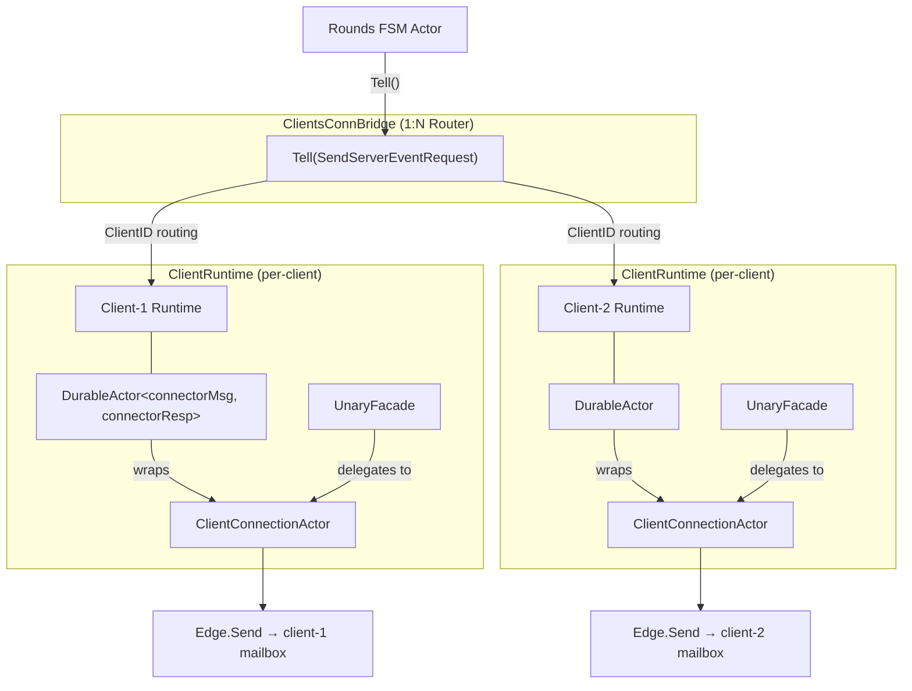
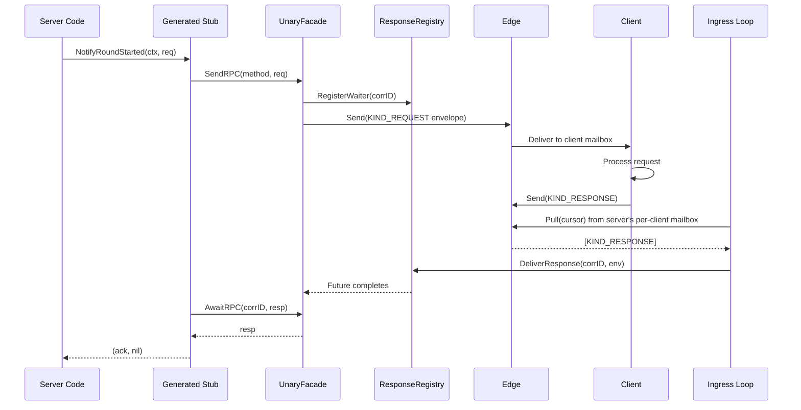
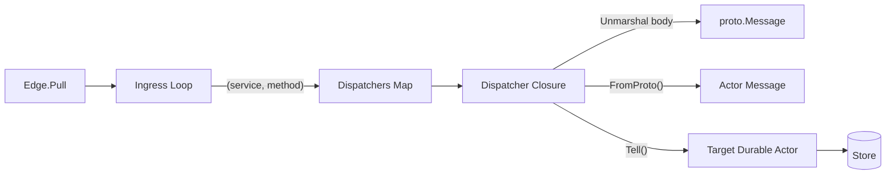
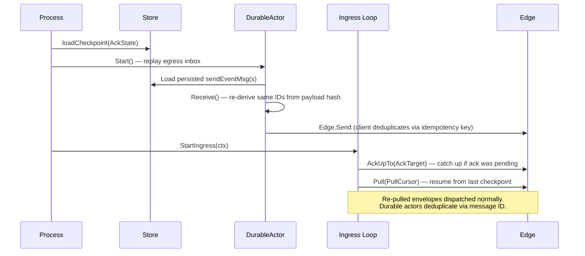

# Client Connection Bridge

The `clientconn` package provides the server-side bridge for communicating with
N clients via the durable actor runtime and mailbox system. It mirrors the
client-side `serverconn` package but with a key asymmetry: `serverconn` is 1:1
(one client talks to one server), while `clientconn` is 1:N (one server manages
many clients).

For the underlying mailbox primitives, see the `darepo-client` repository's
[`mailbox/README.md`](https://github.com/lightninglabs/darepo-client/blob/main/mailbox/README.md).
For the client-side counterpart, see
[`serverconn/README.md`](https://github.com/lightninglabs/darepo-client/blob/main/serverconn/README.md).

## Architecture

The bridge routes outbound server events to per-client `DurableActor` instances
based on `ClientID`. Each registered client gets its own `ClientRuntime`
containing all three mailbox components:



- **`ClientsConnBridge`**: Implements `actor.TellOnlyRef[ClientConnMsg]`. Routes
  by `ClientID` to the correct per-client `DurableActor`. Not an actor itself —
  a direct router that avoids a monolithic bottleneck for N clients.
- **`ClientConnectionActor`**: The per-client behavior. Handles egress messages
  in `Receive()` and runs the ingress loop as a background goroutine. Owns the
  in-memory `ResponseRegistry`.
- **`DurableActor`**: Wraps the actor for crash-safe egress. Persists outbound
  FSM events to a per-client durable mailbox before processing.
- **`UnaryFacade`**: Implements `mailboxrpc.RPCClient`. Sends server→client RPCs
  directly via the edge (low-latency, no durability) and awaits responses
  through the registry.

## Getting Started

### Registering a Client

```go
bridge := clientconn.NewClientsConnBridge(
    clientconn.WithMaxClients(1000),
)

cfg := clientconn.DefaultPerClientConfig()
cfg.Edge = mailboxClient                      // MailboxServiceClient (gRPC)
cfg.LocalMailboxID = "server-for-client-1"    // Server's per-client mailbox
cfg.RemoteMailboxID = "client-1"              // Client's mailbox
cfg.ProtocolVersion = 1                       // Protocol version for envelopes
cfg.Store = deliveryStore                     // actor.DeliveryStore
cfg.Dispatchers = eventRouter.AsDispatcherMap()  // Inbound routing

runtime, err := bridge.RegisterClient(ctx, "client-1", cfg)
if err != nil {
    return err
}
```

`RegisterClient` validates the config, creates a `ClientRuntime`, starts both
the `DurableActor` (egress processing) and the ingress loop (pulls from the
server's per-client mailbox), and adds the runtime to the bridge's routing table.

Validation enforces:
- Required fields: `Edge`, `Store`, `LocalMailboxID`, `RemoteMailboxID`
- `LocalMailboxID != RemoteMailboxID` (prevents self-loop)
- Non-empty `Dispatchers` map
- Non-zero `ProtocolVersion`
- Mailbox ID uniqueness across all registered clients

### Sending Events to Clients

The rounds FSM actor sends events to clients via the bridge:

```go
err := bridge.Tell(ctx, &clientconn.SendServerEventRequest{
    Message: &roundStartedServerMsg{
        targetClientID: "client-1",
        RoundID:        "round-42",
    },
})
```

The `ClientMessage` interface requires two methods:

```go
type ClientMessage interface {
    ClientID() ClientID
    ToProto() proto.Message
}
```

The durable egress path:

1. `Bridge.Tell` extracts the `ClientID` and routes to the per-client runtime.
2. `DurableActor.Tell` persists the `sendEventMsg` to the durable mailbox
   (TLV-encoded).
3. The actor runtime calls `Receive`, which:
   - Calls `Message.ToProto()` to get the proto payload.
   - Wraps it in `anypb.Any`.
   - Derives `msg_id` and `idempotency_key` from the payload SHA256 hash
     (via `StableEventMsgID` / `StableEventIdempotencyKey`).
   - Builds a `KIND_EVENT` envelope and calls `Edge.Send`.
4. On crash, the durable mailbox replays the persisted request. The same IDs are
   re-derived from the stored payload, so the client deduplicates the retry.

### Unary RPC: Server-to-Client

Server-initiated unary RPCs use the per-client `UnaryFacade`:

```go
unary, ok := bridge.GetUnary("client-1")
if !ok {
    return fmt.Errorf("client not registered")
}

client := roundtestpb.NewRoundNotifyServiceMailboxClient(unary)

ack, err := client.NotifyRoundStarted(ctx,
    &roundtestpb.RoundStartedNotification{
        RoundId: "round-42",
    },
)
```



The send path calls `Edge.Send` directly — no durable mailbox, no actor queue.
This provides low latency for unary RPCs. If the send fails, the caller retries.

Error handling: Client-side gRPC errors are encoded in envelope headers as
base64 `google.rpc.Status`. `AwaitRPC` decodes them before inspecting the body,
so callers receive standard `status.Error` values.

### Receiving Client Events: EventRouter

The ingress loop pulls envelopes from the server's per-client mailbox and
dispatches them to server-side actors via `(service, method)` routing:

```go
system := actor.NewActorSystem(store)
router := clientconn.NewEventRouter(system)

// Register a route: RoundStartedEvent → roundStartedMsg → rounds actor
clientconn.NewEventRoute(router, clientconn.InboundEventRouteConfig[
    *roundStartedMsg, roundResp,
]{
    Service:  "roundtest.v1.RoundEventService",
    Method:   "RoundStarted",
    NewEvent: func() proto.Message {
        return &roundtestpb.RoundStartedEvent{}
    },
    Key:    roundsActorKey,
    NewMsg: func() *roundStartedMsg {
        return &roundStartedMsg{}
    },
})

// Wire into per-client config:
cfg.Dispatchers = router.AsDispatcherMap()
```



Each dispatcher closure captures a `ServiceKey`, resolves the actor via the
Receptionist, and calls `Tell` to durably persist the message. A `nil` return
means the envelope is committed — the ingress loop can safely advance the ack
watermark.

## PerClientConfig Reference

| Field | Type | Default | Description |
|-------|------|---------|-------------|
| `Edge` | `MailboxServiceClient` | *required* | gRPC client for the mailbox edge. |
| `LocalMailboxID` | `string` | *required* | Server's per-client mailbox (ingress source, egress sender). |
| `RemoteMailboxID` | `string` | *required* | Client's mailbox (egress destination). |
| `ProtocolVersion` | `uint32` | *required* | Protocol version stamped on outbound envelopes. |
| `Dispatchers` | `DispatcherMap` | *required* | Inbound `(service, method)` → actor routing table. |
| `Store` | `actor.DeliveryStore` | *required* | Durability store for inbox, outbox, and checkpoints. |
| `Codec` | `*actor.MessageCodec` | `newClientConnCodec()` | TLV codec for connectorMsg serialization. |
| `PullMaxEnvelopes` | `uint32` | `50` | Max envelopes per Pull call. |
| `PullWaitTimeout` | `time.Duration` | `5s` | Long-poll timeout for Pull. |
| `RetryBaseDelay` | `time.Duration` | `200ms` | Exponential backoff base for transient failures. |
| `RetryMaxDelay` | `time.Duration` | `30s` | Backoff cap. |
| `ResponseWaiterTTL` | `time.Duration` | `10m` | TTL for response waiters and buffered responses. |

Source: `clientconn/types.go`

## Crash Recovery

Two independent recovery paths operate on startup:



**Egress recovery**: The DurableActor replays all unacknowledged `sendEventMsg`
and `sendRPCMsg` messages from its persistent inbox. For event messages, the
same `msg_id` and `idempotency_key` are reproduced from the stored TLV payload.
The client deduplicates.

**Ingress recovery**: `loadCheckpoint` restores the four-cursor `AckState`. The
loop resumes from `PullCursor`. If an ack was pending at crash time
(`AckTarget > AckCommittedTo`), it acks first. Re-pulled envelopes are
dispatched normally — the target durable actors deduplicate via message ID.

**Unary RPC recovery**: Response waiters are in-memory only. On crash, callers'
contexts are cancelled and they retry the RPC with new correlation IDs.

## Message Types and TLV Encoding

Two message types flow through the per-client durable actor mailbox:

| TLV Type | Message | Description |
|----------|---------|-------------|
| `3000` | `sendEventMsg` | FSM outbox event. TLV records: proto payload (Any), msg_id, idempotency_key, client_id. |
| `3001` | `sendRPCMsg` | Pre-built unary RPC envelope. TLV record: full Envelope via WrappedProto. |

Both implement `actor.TLVMessage` (`TLVType`, `Encode`, `Decode`).
`newClientConnCodec()` returns a `MessageCodec` with both types registered.
The 3000 range avoids collision with `serverconn`'s 2000 range.

## Lifecycle

```go
// Create bridge.
bridge := clientconn.NewClientsConnBridge()

// Register clients (each gets its own runtime).
_, err := bridge.RegisterClient(ctx, "client-1", cfg1)
_, err = bridge.RegisterClient(ctx, "client-2", cfg2)

// Use: send events, make RPCs...
bridge.Tell(ctx, &clientconn.SendServerEventRequest{...})

// Deregister a single client.
bridge.DeregisterClient("client-1")

// Shut down all remaining clients.
bridge.Stop()
```

`DeregisterClient` stops the client's ingress loop and DurableActor, then
removes it from the routing table. `Stop` shuts down all registered clients.

## Testing

The package has comprehensive test coverage across several test files:

| File | Focus |
|------|-------|
| `e2e_test.go` | Full round-trip: server→client events, client→server events, unary RPCs, multi-client isolation, bidirectional flows, registration lifecycle, TLV round-trip. |
| `integration_test.go` | Same flows but with real SQLite `actordelivery` store (production PRAGMA config). |
| `testutil_test.go` | In-memory mailbox, checkpoint store, test helpers, transcript recorder. |
| `roundtestpb/` | Test proto definitions and generated mailbox RPC stubs. |

Property-based tests (via `pgregory.net/rapid`):
- `dispatchBatch` cursor invariants across random batch compositions.
- `AckState` monotonicity across random step sequences.

Run tests:

```bash
# All clientconn tests:
make unit pkg=clientconn timeout=5m

# Specific test:
make unit pkg=clientconn case=TestE2EServerToClientEvent timeout=5m

# With debug logs:
make unit-debug log="stdlog trace" pkg=clientconn case=TestE2E timeout=5m

# With race detector:
go test ./clientconn/... -race -count=1 -timeout=60s
```

## Key Differences from serverconn

| Aspect | `serverconn` (client-side) | `clientconn` (server-side) |
|--------|---------------------------|---------------------------|
| Topology | 1:1 (one client → one server) | 1:N (one server → many clients) |
| Entry point | `Runtime` (single instance) | `ClientsConnBridge` (routes to N runtimes) |
| Message routing | Direct to single actor | By `ClientID` to per-client `DurableActor` |
| TLV type range | 2000–2001 | 3000–3001 |
| Config struct | `ConnectorConfig` | `PerClientConfig` |
| Codec | `NewServerConnCodec()` | `newClientConnCodec()` |

## See Also

- `darepo-client`
  [`serverconn/README.md`](https://github.com/lightninglabs/darepo-client/blob/main/serverconn/README.md)
  — Client-side counterpart with the same three-component architecture.
- `darepo-client`
  [`docs/mailbox_architecture.md`](https://github.com/lightninglabs/darepo-client/blob/main/docs/mailbox_architecture.md)
  — Three-layer mailbox architecture overview.
- `darepo-client`
  [`docs/RPC_MAILBOX_CONTRACT.md`](https://github.com/lightninglabs/darepo-client/blob/main/docs/RPC_MAILBOX_CONTRACT.md)
  — Protocol-level contract (ordering, idempotency, ack semantics).
