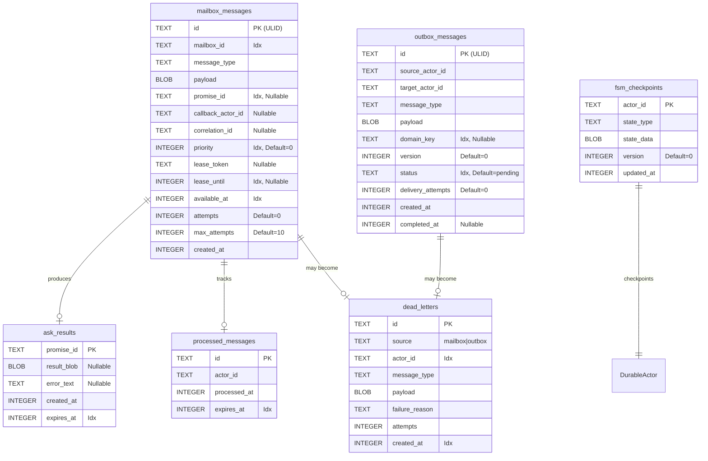
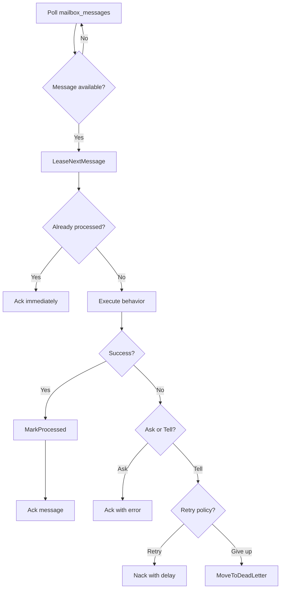
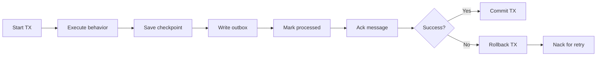
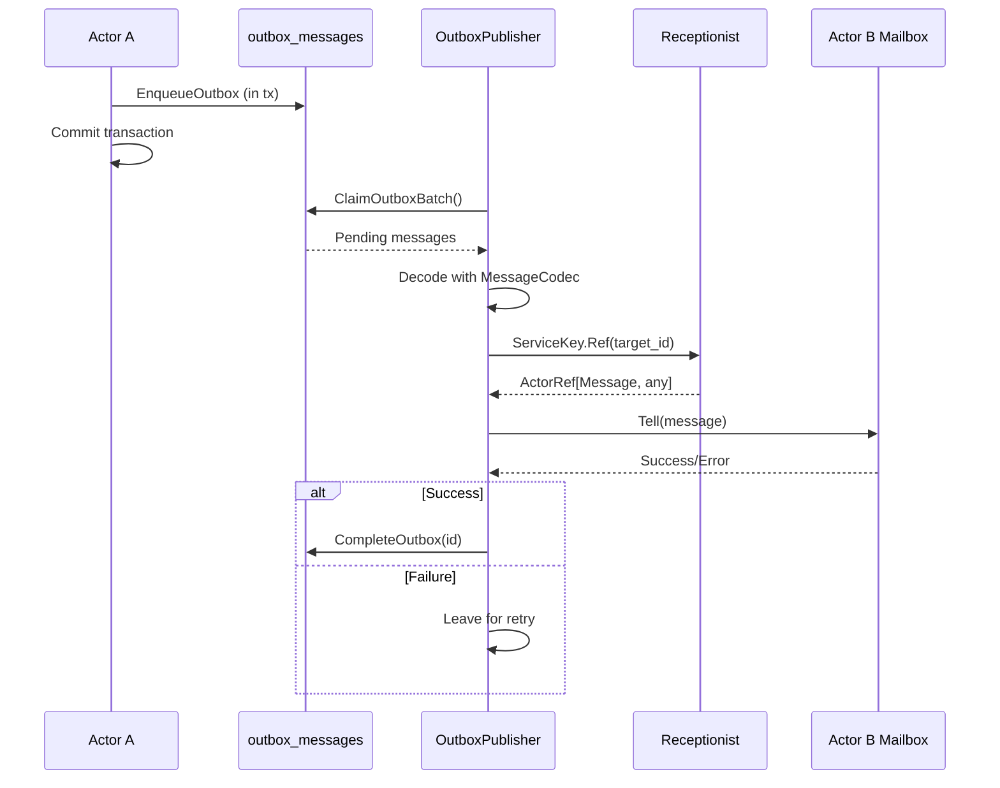
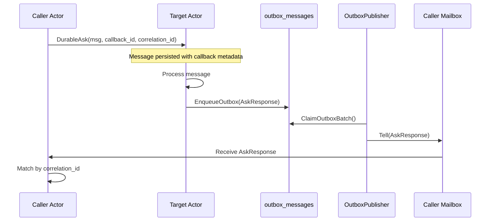

# Actor Delivery Store Database Schema

## Purpose

The actor delivery store persistence layer provides crash-resilient message
delivery for the durable actor system. It implements the CDC (Change Data
Capture) pattern with a transactional outbox, lease-based message delivery with
exactly-once processing semantics, and FSM state checkpointing for recovery.

This enables durable actors to:
- Persist incoming messages before processing (inbox durability)
- Write outgoing messages atomically with FSM state changes (outbox CDC)
- Recover message processing state after crashes
- Deduplicate redelivered messages for exactly-once effects
- Track failed messages for debugging and manual intervention

## Schema Overview

The durable mailbox schema consists of six tables:

1. **mailbox_messages**: Incoming message queue with lease-based delivery
   semantics. Messages are leased to consumers who must Ack/Nack before expiry.

2. **outbox_messages**: Transactional outbox for CDC pattern. Messages written
   here are delivered asynchronously by the OutboxPublisher.

3. **ask_results**: Persists results for Ask messages so callers can recover
   outcomes after crash.

4. **processed_messages**: Deduplication table tracking processed message IDs
   with TTL-based expiry.

5. **fsm_checkpoints**: FSM state snapshots for crash recovery. Actors restore
   from checkpoints on restart.

6. **dead_letters**: Failed messages after max attempts or unrecoverable errors.
   Supports debugging and manual intervention.

## Entity Relationship Diagram

## Table Details

### mailbox_messages

Stores incoming messages for each actor with lease-based delivery semantics.
Messages are leased to a consumer who must Ack/Nack before the lease expires,
otherwise the message becomes available for redelivery.

**Key fields**:
- `id`: ULID providing time-ordering and uniqueness. Used as the primary key and
  for deduplication tracking.

- `mailbox_id`: Identifies the target actor's mailbox. Each actor has a unique
  mailbox ID (typically the actor ID).

- `payload`: TLV-encoded message data. The `MessageCodec` handles
  serialization/deserialization with type dispatch via `message_type`.

- `promise_id`: Set for Ask messages to link requests to their responses. NULL
  for Tell (fire-and-forget) messages.

- `callback_actor_id`, `correlation_id`: Set for DurableAsk messages. The target
  actor uses these to route responses via the outbox.

- `priority`: Processing order (higher = more important). RestartMessages have
  priority=100 for front-of-queue processing on restart.

- `lease_token`: Opaque token preventing stale acks. When a consumer leases a
  message, it receives a unique token that must match for Ack/Nack to succeed.

- `lease_until`: Unix timestamp when the lease expires. After expiry, the
  message becomes available for redelivery to another consumer.

- `available_at`: Unix timestamp when the message becomes available. Used for
  scheduling initial delivery and retry delays after Nack.

- `attempts`, `max_attempts`: Delivery tracking for dead-letter policy.

**Indexes**:
- `idx_mailbox_messages_available`: Composite index on `(mailbox_id,
  available_at, priority DESC)` for efficient polling of available messages with
  priority ordering.

- `idx_mailbox_messages_lease`: Partial index on `lease_until` for lease expiry
  cleanup.

- `idx_mailbox_messages_promise`: Partial index on `promise_id` for Ask result
  lookups.

**Lease-based delivery semantics**: When a consumer calls `LeaseNextMessage`:
1. The query atomically finds the highest-priority available message
2. Sets `lease_token` and `lease_until`, increments `attempts`
3. Returns the message to the consumer

The consumer must call `Ack` (success) or `Nack` (retry) before `lease_until`.
If the lease expires, the message becomes available again with its existing
attempt count.

### outbox_messages

Transactional outbox for the CDC (Change Data Capture) pattern. Messages
destined for other actors are written here in the same transaction as FSM state
changes. The OutboxPublisher drains this table and delivers messages.

**Key fields**:
- `id`: ULID for ordering and uniqueness.

- `source_actor_id`, `target_actor_id`: Links the message to its origin and
  destination. The OutboxPublisher uses `target_actor_id` with ServiceKey lookup
  for delivery.

- `domain_key`: Optional natural idempotency key. For example:
  `"round:abc123:phase:nonces"` ensures the same round/phase combination is only
  processed once by the receiver.

- `version`: Monotonic counter for ordering within a domain. Higher versions
  supersede lower versions for the same `domain_key`.

- `status`: Delivery lifecycle state:
  - `pending`: Awaiting delivery (OutboxPublisher polls this)
  - `completed`: Successfully delivered to target mailbox
  - `dead_letter`: Failed after max attempts or poison pill

- `delivery_attempts`: Tracks delivery retry count.

**Indexes**:
- `idx_outbox_messages_pending`: Partial index on `(status, created_at)` for
  efficient polling of pending messages.

- `idx_outbox_messages_domain_key`: Partial index for idempotency checks.

**CDC flow**:
1. Actor writes to outbox within transaction (alongside FSM state changes)
2. Transaction commits (message + state atomically persisted)
3. OutboxPublisher polls `ClaimOutboxBatch()` for pending messages
4. Publisher decodes and delivers via `ServiceKey.Ref(target_actor_id).Tell()`
5. On success: `CompleteOutbox()` marks as completed
6. On failure: Message remains pending for retry or dead-lettered after max
   attempts

### ask_results

Persists results for Ask messages so callers can recover outcomes after crash.
Separating this from mailbox_messages allows the original message to be deleted
while the result remains available.

**Key fields**:
- `promise_id`: Links to the original Ask message.

- `result_blob`: TLV-encoded successful result (NULL if error).

- `error_text`: Error message if the request failed (NULL if success).

- `expires_at`: Unix timestamp for TTL-based garbage collection.

**Usage pattern**: When an actor processes an Ask message:
1. Result (success or error) is written to `ask_results`
2. Original message is deleted from `mailbox_messages`
3. In-memory Promise is completed
4. For DurableAsk: AskResponse is also written to outbox for callback delivery

### processed_messages

Deduplication table tracking message IDs that have been processed. This enables
exactly-once effects on top of at-least-once delivery.

**Key fields**:
- `id`: The message ID that was processed.

- `actor_id`: Which actor processed this message.

- `processed_at`, `expires_at`: Timestamps for tracking and TTL cleanup.

**Deduplication flow**:
1. Before processing, actor checks `IsProcessed(message_id)`
2. If already processed: skip processing, immediately Ack
3. After successful processing: `MarkProcessed(message_id, actor_id, ttl)`
4. Background cleanup removes entries past `expires_at`

**TTL considerations**: Default is 24 hours. Should exceed the maximum possible
redelivery window to prevent duplicate processing of long-delayed messages.

### fsm_checkpoints

Stores serialized FSM state for crash recovery. On restart, the actor loads the
checkpoint and sends a RestartMessage to resume from the saved state.

**Key fields**:
- `actor_id`: Primary key identifying the actor.

- `state_type`: Name of the current FSM state for quick filtering.

- `state_data`: TLV-encoded state snapshot including all state fields.

- `version`: Monotonic counter incremented on each checkpoint. Used for conflict
  detection and debugging.

**Checkpoint flow**:
1. Actor processes message, FSM transitions to new state
2. Within same transaction: `SaveCheckpoint(actor_id, state_type, state_data)`
3. On crash recovery: `LoadCheckpoint(actor_id)` restores state
4. Actor sends RestartMessage with checkpoint data for priority processing

### dead_letters

Failed messages after max_attempts or unrecoverable errors. Supports debugging
and manual intervention for operational recovery.

**Key fields**:
- `id`: Original message ID for correlation.

- `source`: Whether from `mailbox` (incoming) or `outbox` (outgoing).

- `actor_id`: Target actor (mailbox) or source actor (outbox).

- `failure_reason`: Human-readable description of why the message failed.

- `attempts`: Number of delivery attempts before dead-lettering.

**Indexes**:
- `idx_dead_letters_actor`: For querying dead letters by actor.
- `idx_dead_letters_source`: For querying by source type (mailbox vs outbox).

## Operational Logic

### Message Enqueue Flow

1. Sender calls `DurableMailbox.Send(ctx, envelope)`
2. Message is encoded using `MessageCodec.Encode()`
3. `EnqueueMessage` persists to `mailbox_messages` with:
   - Generated ULID for `id`
   - `available_at` set to current time (immediate delivery)
   - `max_attempts` from config (default: 10)
4. Wake signal sent to receiver goroutine

**Transaction support**: If `ctx` contains a transaction (via `WithTx`), the
enqueue happens within that transaction, enabling atomic outbox writes.

### Message Processing Flow (DurableActor)

1. `LeaseNextMessage()` atomically claims highest-priority available message
2. `IsProcessed()` checks deduplication table
3. If duplicate: `Ack()` immediately (idempotent)
4. Otherwise: Execute behavior with panic recovery
5. For Ask: Always `Ack()` (even with error result persisted)
6. For Tell: `Ack()` on success, `Nack()` for retry, dead-letter on exhaustion
7. `MarkProcessed()` records completion for deduplication

### Transaction-Wrapped Processing

When using `TxAwareActorDeliveryStore`, message processing is wrapped in a
database transaction:

All operations within the transaction succeed or fail atomically:
- FSM state checkpoint
- Outbox messages
- Deduplication record
- Message acknowledgment

### OutboxPublisher CDC Flow

1. OutboxPublisher polls every 100ms (configurable)
2. `ClaimOutboxBatch()` retrieves pending messages ordered by `created_at`
3. For each message:
   - Decode payload using `MessageCodec`
   - Look up target actor via `ServiceKey[Message, any]`
   - Deliver via `Tell()` (fire-and-forget)
   - On success: `CompleteOutbox()` marks as completed
   - On failure: Leave for next poll (retry) or dead-letter after max attempts

### DurableAsk Response Flow

DurableAsk provides crash-safe Ask semantics:
1. Caller sends message with `callback_actor_id` and `correlation_id`
2. Target processes message and writes AskResponse to outbox
3. OutboxPublisher delivers response to caller's durable mailbox
4. Caller matches response to request via `correlation_id`

Even if caller crashes before receiving the response, it will be delivered when
the caller restarts and resumes processing its mailbox.

## Constraints and Invariants

**Referential integrity**: Unlike foreign-key enforced schemas, the durable
mailbox uses logical references:
- `mailbox_id` is the actor ID (no FK)
- `target_actor_id` in outbox resolved at delivery time via ServiceKey

This design supports dynamic actor discovery without tight coupling.

**Lease invariants**:
- Only one consumer can hold a lease at a time (atomic lease acquisition)
- Lease token must match for Ack/Nack (prevents stale acknowledgments)
- Expired leases make messages available again (prevents message loss)

**Deduplication invariants**:
- Message ID checked before processing
- Processed record created after successful processing
- TTL exceeds maximum redelivery window

**Outbox invariants**:
- Messages written in same transaction as FSM state changes
- Delivery only attempted for `status='pending'`
- Completed messages retained for audit (can be pruned periodically)

## Performance Considerations

**Index strategy**:
- Composite index for mailbox polling covers common query patterns
- Partial indexes on nullable columns reduce index size
- `created_at` ordering in outbox ensures FIFO delivery within priority class

**Batch operations**:
- `ClaimOutboxBatch(limit)` processes multiple messages per poll
- `CleanupExpired()` removes dedup and ask results in single transaction

**Clock injection**: `ActorDeliveryStore` accepts a `clock.Clock` for:
- Consistent time across operations
- Testability with mock clocks
- Avoiding wall-clock drift issues in tests

**Read vs write transactions**:
- `ReadTxOption()` for queries that don't modify data
- `WriteTxOption()` for mutations
- Enables SQLite WAL mode optimization

## Future Enhancements

1. **Archival**: Completed outbox messages could be moved to an archive table
   after a configurable retention period.

2. **Metrics**: Add application-level metrics for:
   - Message throughput per mailbox
   - Lease expiry rate (indicator of slow processing)
   - Dead letter rate by actor and message type

3. **Backpressure**: Add `pending_count` tracking per mailbox for sender-side
   backpressure signals.

4. **Priority queues**: Extend priority support with configurable priority
   classes and fair scheduling.

5. **Message TTL**: Add `expires_at` to mailbox messages for automatic expiry of
   stale messages.
