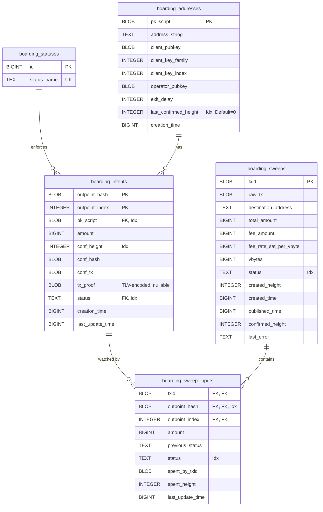

# Boarding Wallet Database Schema

## Purpose

The boarding wallet persistence layer stores boarding addresses and tracks the
lifecycle of boarding intents from address creation through VTXO conversion.
This enables the Boarding Wallet Actor to recover state after restarts,
deduplicate UTXO detections, and provide query interfaces for balance
calculations and address management.

## Schema Overview

The boarding wallet schema consists of five tables:

1. **boarding_statuses**: Enum-like table defining the six possible boarding
   intent lifecycle states.

2. **boarding_addresses**: Stores generated boarding addresses with their
   cryptographic material (keys) and monitoring metadata. The tapscript is
   reconstructed on read from the stored component fields.

3. **boarding_intents**: Tracks individual boarding attempts from on-chain
   confirmation through round completion.

4. **boarding_sweeps**: Tracks aggregate timeout-path sweep transactions that
   have been built for expired boarding outputs.

5. **boarding_sweep_inputs**: Tracks each boarding outpoint consumed by a
   pending or published aggregate sweep transaction.

## Entity Relationship Diagram

## Table Details

### boarding_statuses

An enumeration table enforcing valid boarding intent lifecycle states through a
foreign key constraint.

**Lifecycle states**:
- `confirmed` (0): Sufficient confirmations received, ready for round inclusion
- `adopted` (1): Included in a round that has been checkpointed
- `failed` (2): Boarding attempt failed (server rejection, timeout, etc.)
- `expired` (3): CSV timeout expired, funds recoverable via timeout path
- `swept` (4): Funds swept to a new address (either via round or timeout path)
- `sweep_pending` (5): Included in a published timeout-path sweep and waiting
for the chain backend to report the boarding outpoint as spent

This table is static after migration and enforces type safety at the database
level.

### boarding_addresses

Stores boarding addresses that have been created and imported into the LND
wallet. Each address represents a unique 2-of-2 taproot script between the
client and operator with a CSV timelock for client recovery.

**Key fields**:
- `pk_script`: The raw P2TR output script, serves as primary key since it
uniquely identifies an address

- `client_pubkey`, `client_key_family`, `client_key_index`: The client's key
and its BIP32 derivation path for later signing

- `operator_pubkey`: The operator's public key used in collaborative spends

- `exit_delay`: CSV delay in blocks for the client's unilateral timeout path

- `last_confirmed_height`: The most recent block height at which we detected a
UTXO at this address, used for restart recovery to resume monitoring from the
last known checkpoint

**Tapscript reconstruction**: The tapscript is not stored directly. Instead, it
is reconstructed on read using `scripts.VTXOTapScript(clientPubkey,
operatorPubkey, exitDelay)`. This avoids JSON serialization complexity and
ensures the tapscript is always consistent with the stored parameters.

**Indexes**:
- `idx_boarding_addresses_last_confirmed`: Enables efficient queries during
startup to identify addresses needing monitoring from specific heights

**Usage pattern**: Addresses are created once and reused. Multiple boarding
intents can reference the same address if a user sends funds to it multiple
times.

### boarding_intents

Tracks individual boarding attempts from on-chain confirmation through
completion. Each intent represents one boarding UTXO's journey through the
round coordination process.

**Key fields**:
- `outpoint_hash`, `outpoint_index`: Composite primary key uniquely identifying
the boarding UTXO

- `pk_script`: Foreign key to `boarding_addresses`, linking this intent to its
address

- `amount`: Value of the boarding UTXO in satoshis (stored as BIGINT for
precision)

- `conf_height`, `conf_hash`: Confirmation block height and hash

- `conf_tx`: Optional serialized confirmation transaction (for auditing)

- `tx_proof`: TLV-encoded `proof.TxProof` (same wire format as
`round_boarding_intents.tx_proof`, produced by
`lib/types.SerializeTxProof`). Carries the SPV merkle inclusion proof
that lets a server with no chain source verify the boarding UTXO
without re-fetching the block. Nullable: rows without a stored proof decode as `None`, and the
wallet's
`maybeRebuildBoardingProof` recovery path reconstructs the proof from
`conf_tx`/`conf_hash` via the chain backend on the next read (then
re-persists it via the same upsert). Decode failures on a non-NULL
blob are logged at `Warn` and treated like NULL so the rebuild path
still recovers — this intentionally diverges from
`round_boarding_intents.tx_proof`'s read path which fails hard.

- `status`: Current lifecycle state (foreign key to `boarding_statuses`)

- `creation_time`: Unix epoch timestamp when intent was first created

- `last_update_time`: Unix epoch timestamp of the last status change

**Indexes**:
- `idx_boarding_intents_pk_script`: Enables efficient lookup of all intents for
a given address

- `idx_boarding_intents_status`: Supports queries like "fetch all confirmed
intents"

- `idx_boarding_intents_conf_height`: Enables backlog delivery by height range

**Upsert semantics**: Intents are inserted with `ON CONFLICT` handling to
enable progressive updates. When an intent is re-inserted:

- `status` is always updated (allows progression through lifecycle)
- `amount` uses COALESCE to preserve non-zero values
- `conf_height`, `conf_hash`, `conf_tx` use COALESCE to preserve once set
- `tx_proof` uses plain `COALESCE(excluded.tx_proof, ...)` so a
  re-insert with NULL preserves the previously persisted SPV proof.
  The producer (`domainIntentToInsertParams`) normalises a
  zero-length proof slice to nil before the row is built, keeping
  the empty-blob defense in Go where it can be portable across
  SQLite and Postgres BYTEA (a SQL-level `NULLIF(..., x'')` guard
  works on SQLite but fails on Postgres because `x''` is parsed
  there as a bit-string)
- `last_update_time` is always updated to track modifications

## Operational Logic

### Address Creation Flow

1. Wallet actor derives a new key using `DeriveNextKey(family=42)`
2. Constructs 2-of-2 tapscript with operator key and CSV timelock using
   `scripts.VTXOTapScript`
3. Imports tapscript into LND via `ImportTaprootScript`
4. Persists to `boarding_addresses` with `last_confirmed_height=0`
5. Returns address to caller

**Restart recovery**: On startup, `ListAllBoardingAddresses()` retrieves all
addresses, reconstructs their tapscripts, and loads `last_confirmed_height`
values, enabling the actor to resume monitoring from known checkpoints.

### UTXO Detection Flow

1. On each new block, wallet actor calls LND's `ListUnspent`

2. Filters results to only UTXOs paying to boarding addresses (checks
   `pk_script` against `boarding_addresses`)

3. Deduplicates using in-memory `fn.Set[UtxoKey]` (loaded from existing intents
   at startup)

4. For new UTXOs, inserts `boarding_intent` with status=`confirmed` and full
   chain info

5. Notifies registered actors (e.g., round actor) via `BoardingUtxoConfirmedEvent`

6. Updates address's `last_confirmed_height` to the confirmation block height

**Deduplication**: The in-memory `seenUtxos` set prevents duplicate
notifications. On restart, this set is repopulated by loading all existing
intents.

### Intent Lifecycle Progression

Typical lifecycle: `confirmed → adopted → swept`

- **confirmed**: UTXO has sufficient confirmations, ready for round inclusion
(wallet actor creates intents in this state)

- **adopted**: Round actor has included this intent in a round and checkpointed
the FSM state

- **failed**: Error occurred (server rejection, timeout, etc.), may be
recoverable via CSV path

- **expired**: CSV timeout has passed, funds can be recovered unilaterally

- **sweep_pending**: A timeout-path sweep transaction has been published and
the daemon is watching the boarding outpoint for a confirmed spend

- **swept**: Funds have been moved (either via successful round or timeout
recovery)

### Timeout Sweep Recovery Flow

1. `SweepBoardingUTXOs` builds one signed aggregate transaction that spends
   every selected CSV-mature boarding output into one destination output.
   Callers may pass `sweep_address` to choose that destination explicitly;
   otherwise the daemon asks the wallet for a fresh address.

2. With `broadcast=false`, the RPC only previews the transaction, fee, and
   txid. No database state is changed.

3. With `broadcast=true`, the daemon persists `boarding_sweeps` and
   `boarding_sweep_inputs` rows before broadcast and moves the selected
   intents to `sweep_pending`.

4. After broadcast succeeds, the sweep and unresolved inputs move from
   `pending` to `published`.

5. The daemon-owned boarding sweep watcher starts after wallet unlock, reloads
   pending sweeps on startup, registers confirmed-spend watches for each input
   outpoint, and rebroadcasts the exact stored raw transaction best-effort.
   It does not rebuild, replace, or fee-bump the transaction. Already
   published sweeps are rate-limited between rebroadcast attempts.

6. When the chain backend reports an input as spent, the watcher records
   `spent_by_txid` and `spent_height`. Inputs spent by the stored sweep tx are
   marked `spent`; inputs spent by another transaction are marked
   `external_spent`.

7. Once every input for an aggregate sweep is resolved, the sweep is marked
   `confirmed` if at least one input was spent by the stored sweep tx. If all
   inputs were spent by other transactions, the aggregate is marked
   `external_resolved`. The corresponding boarding intents are marked `swept`
   because the original boarding outpoints are no longer recoverable by this
   daemon.

8. `ListBoardingSweeps` exposes the persisted aggregate sweeps and input
   states so operators can inspect whether a sweep is still `published`, has
   reached `confirmed`, was `external_resolved`, or failed before confirmation
   tracking completed.

## Constraints and Invariants

**Referential integrity**:
- Every `boarding_intent` must reference a valid `boarding_address` (foreign
key enforced)

- Every `boarding_intent.status` must be a valid status from
`boarding_statuses` (foreign key enforced)

- Every `boarding_sweep_input` references one persisted sweep transaction and
one persisted boarding intent

**Uniqueness**:
- Each `pk_script` identifies exactly one boarding address
- Each `(outpoint_hash, outpoint_index)` identifies exactly one boarding intent
- Each `(txid, outpoint_hash, outpoint_index)` identifies exactly one tracked
sweep input
- At most one active (`pending` or `published`) sweep input may exist for the
same boarding outpoint
- A boarding address can have multiple intents (user sends to same address
multiple times)

**Status transitions**: While not enforced at the database level, the
application logic ensures valid state machine transitions. The foreign key to
`boarding_statuses` prevents invalid status strings.

## Performance Considerations

**Index strategy**:
- `pk_script` indexed in `boarding_intents` for address-to-intents lookups
- `status` indexed for filtering by lifecycle stage
- `conf_height` indexed for range queries and backlog delivery
- `last_confirmed_height` indexed in `boarding_addresses` for startup recovery
- `boarding_sweeps.status` and `boarding_sweep_inputs.status` indexed for
watcher startup and periodic recovery scans
- `boarding_sweep_inputs(outpoint_hash, outpoint_index)` indexed so spend
notifications can resolve the owning pending sweep efficiently

**Upsert optimization**: Using `ON CONFLICT DO UPDATE` with COALESCE prevents
overwriting already-set fields, reducing transaction contention and preserving
partial updates.

**Read-heavy pattern**: Most operations are reads (balance queries, address
lookups). The `BatchedTx` pattern allows specifying read-only transactions for
optimal performance.

## Future Enhancements

1. **Archival**: Complete intents could be moved to an archive table after a
   configurable time to reduce active table size.

2. **Pruning**: Addresses with no pending intents and `last_confirmed_height`
   older than a threshold could be pruned.

3. **Metrics**: Add triggers or application-level metrics to track status
   transition rates and identify stuck intents.

4. **Address expiry**: Add an `expiry_height` field to `boarding_addresses` to
   automatically stop monitoring old addresses.
