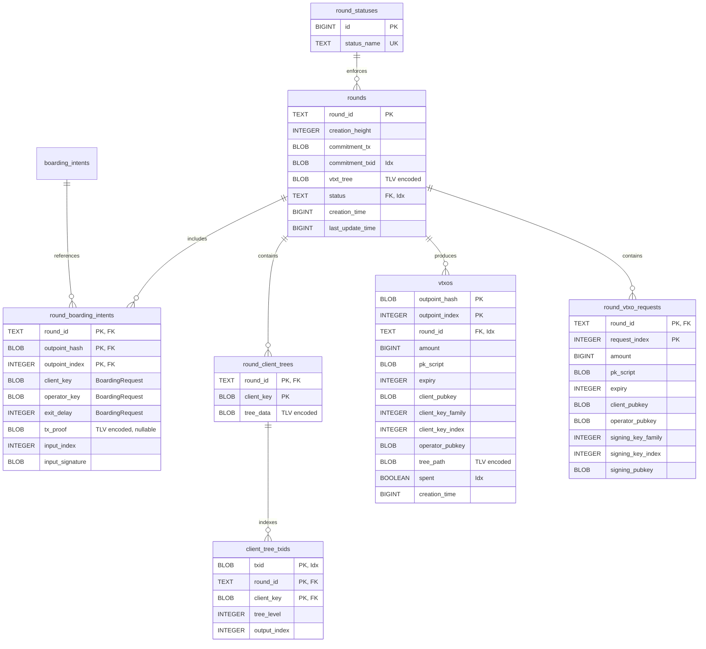

# Round Persistence Database Schema

## Purpose

The round persistence layer stores round state and VTXO ownership information for
the client-side round actor. This enables the Round Actor to recover state after
restarts, checkpoint FSM progress at critical "point of no return" moments, and
track virtual UTXOs owned by the client across round lifecycles.

The key insight is that we only persist state when the client has sent partial
signatures to the server and can no longer unilaterally abort. Before this point,
losing state simply means restarting round coordination. After this point, the
client must be able to recover and track commitment transaction confirmation.

## Schema Overview

The round persistence schema consists of seven tables:

1. **round_statuses**: Enum-like table defining round lifecycle states from the
   client's perspective.

2. **rounds**: Core round data including the commitment transaction, VTXT tree,
   and FSM checkpoint state.

3. **round_boarding_intents**: Links rounds to boarding intents being converted
   in that round, storing BoardingRequest fields relationally and input
   signatures.

4. **round_vtxo_requests**: Stores VTXO requests (VTXORequest) for the round,
   keyed by request index.

5. **round_client_trees**: Stores per-client extracted tree paths for
   reconstructing sweep transactions if needed.

6. **client_tree_txids**: Index table mapping transaction IDs to client trees
   for efficient lookup when chain events occur.

7. **vtxos**: Tracks virtual UTXOs owned by the client, with their tree paths
   for unilateral exit capability.

## Entity Relationship Diagram

## Table Details

### round_statuses

An enumeration table enforcing valid round lifecycle states through a foreign
key constraint.

**Lifecycle states** (combined with FSM state at point of no return):
- `input_sig_sent` (0): Client sent input signatures, awaiting confirmation
- `confirmed` (1): Commitment transaction confirmed on-chain
- `failed` (2): Round failed (server disappeared, invalid signatures, etc.)
- `archived` (3): Round complete and all VTXOs either spent or expired

This table is static after migration and enforces type safety at the database
level.

### rounds

Stores core round data and FSM checkpoint state. Each row represents a round
the client has participated in and reached the "point of no return" (sent
partial signatures).

**Key fields**:
- `round_id`: Server-assigned round identifier, serves as primary key

- `creation_height`: Block height when the client joined this round, used for
  timeout calculations

- `commitment_tx`: Binary-serialized commitment transaction (wire.MsgTx format).
  This is the transaction the server will broadcast.

- `commitment_txid`: The commitment transaction's txid, indexed for efficient
  lookup when detecting on-chain confirmations

- `vtxt_tree`: TLV-encoded virtual transaction tree (tree.Tree). Contains the
  full tree structure for reconstructing sweep transactions.

- `status`: Combined lifecycle and FSM state (foreign key to round_statuses).
  At persistence time, this is always `input_sig_sent` since we only persist
  at the "point of no return" after sending input signatures. Transitions to
  `confirmed`, `failed`, or `archived` as the round progresses.

**Serialization strategy**: The commitment transaction uses standard Bitcoin
wire serialization. The VTXT tree uses a custom TLV encoding that supports
forward/backward compatibility for future schema evolution.

**Indexes**:
- `idx_rounds_commitment_txid`: Enables efficient lookup when chain watcher
  detects a commitment transaction confirmation
- `idx_rounds_status`: Supports queries for active/pending rounds

### round_boarding_intents

Junction table linking rounds to the boarding intents being converted in that
round. This establishes the relationship between a round and the on-chain UTXOs
being swept into VTXOs.

**Key fields**:
- `round_id`, `outpoint_hash`, `outpoint_index`: Composite primary key linking
  to both the round and the boarding intent

- `input_index`: Position of this intent's input in the commitment transaction,
  needed for signature verification

- `input_signature`: Client's partial MuSig2 signature for this input. Stored
  here rather than in boarding_intents because it's round-specific.

**Foreign keys**:
- References `rounds(round_id)` with CASCADE delete
- References `boarding_intents(outpoint_hash, outpoint_index)` for data integrity

This table enables reconstructing the full InputSigSentState from relational
data rather than storing a monolithic blob.

### round_client_trees

Stores extracted tree paths for specific client keys within a round. When a
round completes, the server provides each client with their relevant subtree
for potential unilateral exit.

**Key fields**:
- `round_id`, `client_key`: Composite primary key

- `tree_data`: TLV-encoded tree.Tree representing the client's path from the
  batch transaction to their leaf output

**Usage pattern**: Populated when the server sends the client their extracted
tree after round commitment. Used for reconstructing sweep transactions if
the client needs to exit unilaterally.

### client_tree_txids

An associative index table that maps transaction IDs to their containing client
trees. This enables efficient lookup when the chain backend confirms a
transaction - we can immediately identify which client tree contains it without
deserializing all tree blobs.

**Key fields**:
- `txid`, `round_id`, `client_key`: Composite primary key. A txid can appear in
  multiple client trees (shared intermediate nodes in the VTXT tree).

- `tree_level`: The depth of this transaction in the tree (0 = root, increasing
  toward leaves). Used to determine sweep order.

- `output_index`: Which output of the parent transaction this node spends.
  Identifies the specific branch path taken.

**Usage patterns**:
- **Chain event handling**: When a txid confirms on-chain, query this table to
  find the corresponding client tree and determine the next sweep transaction.

- **Sweep progress tracking**: Query by (round_id, client_key) to get all txids
  in a client's sweep path, ordered by tree level.

**Population**: Populated atomically with `round_client_trees` during
`CommitState`. Uses the `Tree.ExtractTxids()` method to walk the tree BFS and
extract all transaction IDs with their levels.

**Indexes**:
- `idx_client_tree_txids_txid`: Primary lookup when chain confirms a txid
- `idx_client_tree_txids_tree`: Lookup all txids for a specific client tree

### vtxos

Tracks virtual UTXOs owned by the client. VTXOs are created when rounds
complete and represent the client's off-chain balance.

**Key fields**:
- `outpoint_hash`, `outpoint_index`: Virtual outpoint identifying this VTXO
  within the VTXT tree

- `round_id`: Foreign key to the round that created this VTXO

- `amount`: Value in satoshis

- `pk_script`: The output script for this VTXO

- `expiry`: Relative timelock (CSV blocks) for unilateral exit. After this
  many blocks from round confirmation, the client can sweep unilaterally.

- `client_pubkey`, `client_key_family`, `client_key_index`: Client's key and
  BIP32 derivation path for signing

- `operator_pubkey`: Operator's public key for collaborative spends

- `tree_path`: TLV-encoded tree.Tree containing the path from root to this
  VTXO's leaf. Essential for constructing sweep transactions.

- `spent`: Boolean tracking whether this VTXO has been consumed (either
  in a new round or via on-chain sweep)

**Indexes**:
- `idx_vtxos_round_id`: Enables lookup of all VTXOs from a specific round
- `idx_vtxos_spent`: Supports efficient balance queries (unspent VTXOs)

## Serialization Strategy

### TLV Encoding for Trees

The `tree.Tree` and `tree.Node` structures use LND's TLV (Type-Length-Value)
encoding system for serialization. This provides several benefits:

1. **Forward compatibility**: Unknown fields are skipped during decoding,
   allowing older clients to read data written by newer versions.

2. **Backward compatibility**: Missing fields use default values, allowing
   newer clients to read data written by older versions.

3. **Type safety**: Each field has an explicit type tag, preventing
   misinterpretation of data.

**TLV structure for Tree**:
- Type 0: BatchOutpoint (36 bytes - hash + index)
- Type 1: BatchOutput (value + script)
- Type 2: SweepTapscriptRoot (variable bytes)
- Type 3: RootNode (recursively encoded)

**TLV structure for Node**:
- Type 0: Input outpoint
- Type 1: Outputs array
- Type 2: CoSigners public keys
- Type 3: Signature (optional, 64 bytes)
- Type 4: FinalKey (optional, 33 bytes)
- Type 5: Children map (recursively encoded)

### Relational vs. Blob Storage

The schema deliberately uses relational columns for queryable/auditable fields
and TLV blobs only for complex tree structures:

**Relational columns** (queryable, indexable):
- Round status, creation height, timestamps
- VTXO amounts, expiry, spent status
- Key material for signing
- Commitment txid for chain watching

**TLV blobs** (complex structures):
- VTXT tree (recursive node structure)
- Client tree paths (subset of VTXT tree)
- VTXO tree paths (leaf paths for sweeping)

This hybrid approach enables efficient queries while preserving the full
structural data needed for transaction construction.

## Operational Logic

### Round Checkpoint Flow (Point of No Return)

1. Client receives round proposal from server with commitment transaction
2. Client validates the proposal and generates partial MuSig2 signatures
3. **Before sending signatures**: State can be lost safely, client just
   rejoins next round
4. Client calls `CommitState(round, fsmState)` to persist checkpoint
5. Client sends partial signatures to server
6. **After sending signatures**: Server may broadcast at any time, client
   must track confirmation

The `CommitState` operation is atomic and includes:
- Round metadata and commitment transaction
- VTXT tree for sweep reconstruction
- Boarding intents with their input signatures
- Client trees if provided

### Round Confirmation Detection

1. Chain watcher monitors for transactions matching known commitment txids
2. On match, calls `FinalizeRound(roundID, txid)` to update status
3. Round status transitions from `active` to `confirmed`
4. VTXOs become spendable (subject to expiry timeouts)

The `LookupRoundByCommitmentTx(txid)` method enables efficient chain watching
without loading all active rounds into memory.

### VTXO Lifecycle

**Creation**: VTXOs are created via `SaveVTXOs()` when:
- A round completes successfully and the client receives their VTXOs
- The client extracts their outputs from the finalized VTXT tree

**Spending**: VTXOs are marked spent via `MarkVTXOSpent()` when:
- Included in a new round (collaborative spend)
- Swept on-chain via unilateral exit
- Detected as spent via chain monitoring

**Balance calculation**: `ListVTXOs()` returns all unspent VTXOs, enabling
the client to calculate available balance by summing amounts.

### Restart Recovery

On startup, the Round Actor:

1. Calls `ListActiveRounds()` to find rounds in `active` status
2. For each active round, calls `FetchState()` to reconstruct FSM state
3. Resumes chain watching for commitment transaction confirmation
4. Loads unspent VTXOs for balance reporting

The FSM state is reconstructed from relational tables rather than a blob:
- `rounds` table provides commitment tx and VTXT tree
- `round_boarding_intents` provides intents and signatures
- `round_client_trees` provides extracted client paths

## Constraints and Invariants

**Referential integrity**:
- Every `round_boarding_intent` must reference a valid `round` (CASCADE delete)
- Every `round_boarding_intent` must reference a valid `boarding_intent`
- Every `round_client_tree` must reference a valid `round` (CASCADE delete)
- Every `vtxo` must reference a valid `round`
- Every `round.status` must be valid per `round_statuses`

**Uniqueness**:
- Each `round_id` identifies exactly one round
- Each `(outpoint_hash, outpoint_index)` in vtxos identifies exactly one VTXO
- A round can have multiple boarding intents (batching)
- A round can produce multiple VTXOs

**Data consistency**:
- Commitment txid must match the hash of commitment_tx
- VTXO outpoints must exist within the round's VTXT tree
- Tree paths must be valid subsets of the full VTXT tree

## Performance Considerations

**Index strategy**:
- `commitment_txid` indexed for chain watching lookups
- `status` indexed for filtering active rounds
- `round_id` indexed in vtxos for round-to-vtxo queries
- `spent` indexed for efficient balance queries

**Transaction boundaries**: All checkpoint operations use database transactions
to ensure atomicity. The `BatchedTx` pattern allows combining multiple
operations into a single transaction.

**Read patterns**:
- `ListActiveRounds`: Called on startup, expects few active rounds
- `ListVTXOs`: Called for balance queries, filters by `spent=false`
- `LookupRoundByCommitmentTx`: Called per confirmed transaction, indexed lookup

**Write patterns**:
- `CommitState`: Bulk insert of round + intents + trees in single transaction
- `SaveVTXOs`: Batch insert of multiple VTXOs
- `MarkVTXOSpent`: Single-row update

## Security Considerations

**Key material storage**: Client private keys are NOT stored in this schema.
Only public keys and key locators (family + index) are persisted, enabling
the client to derive signing keys from their HD wallet.

**Tree path validation**: When loading tree paths, the client should validate
that the path correctly derives their expected output before using it for
sweep transactions.

**Signature storage**: Partial MuSig2 signatures are stored for audit purposes
but should not be reused. Each round requires fresh nonces and signatures.

## Future Enhancements

1. **Expiry tracking**: Add computed column or index for VTXO expiry heights
   to enable proactive sweep scheduling.

2. **Round archival**: Move completed rounds to archive table after all VTXOs
   are spent to reduce active table size.

3. **VTXO pruning**: Remove tree paths for spent VTXOs after sufficient
   confirmations, keeping only audit metadata.

4. **Multi-operator support**: Extend schema for VTXOs involving multiple
   operators or federated setups.

5. **Backup/restore**: Add export functionality for critical recovery data
   (tree paths, key locators) independent of full database backup.
