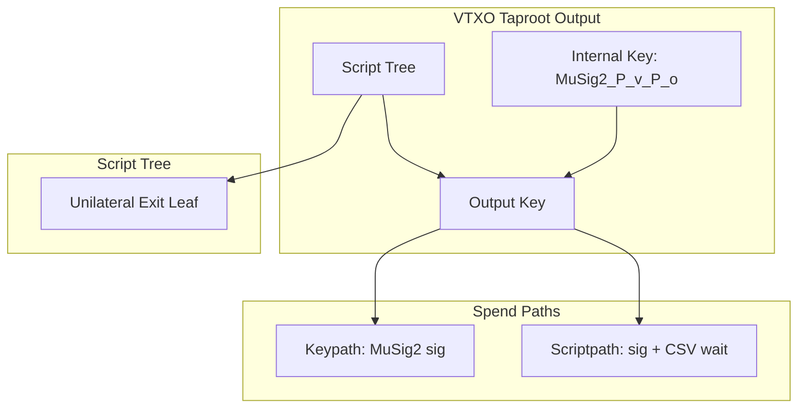
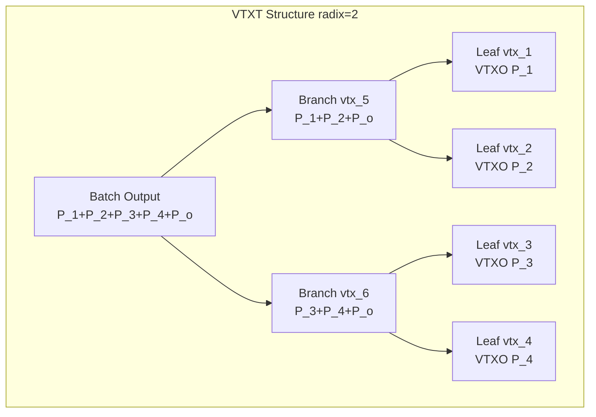
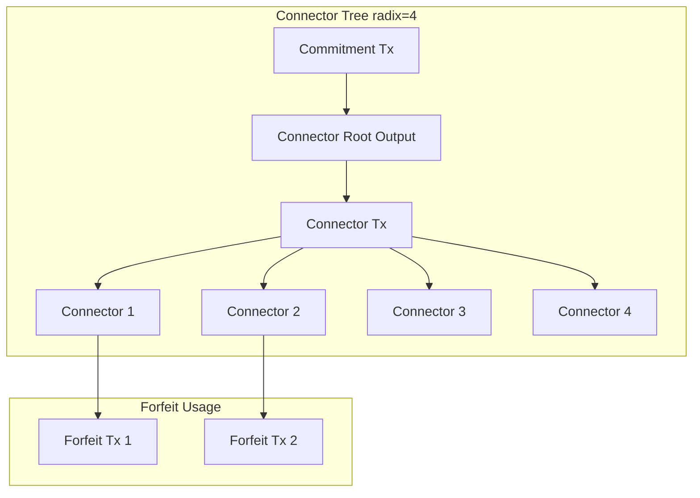
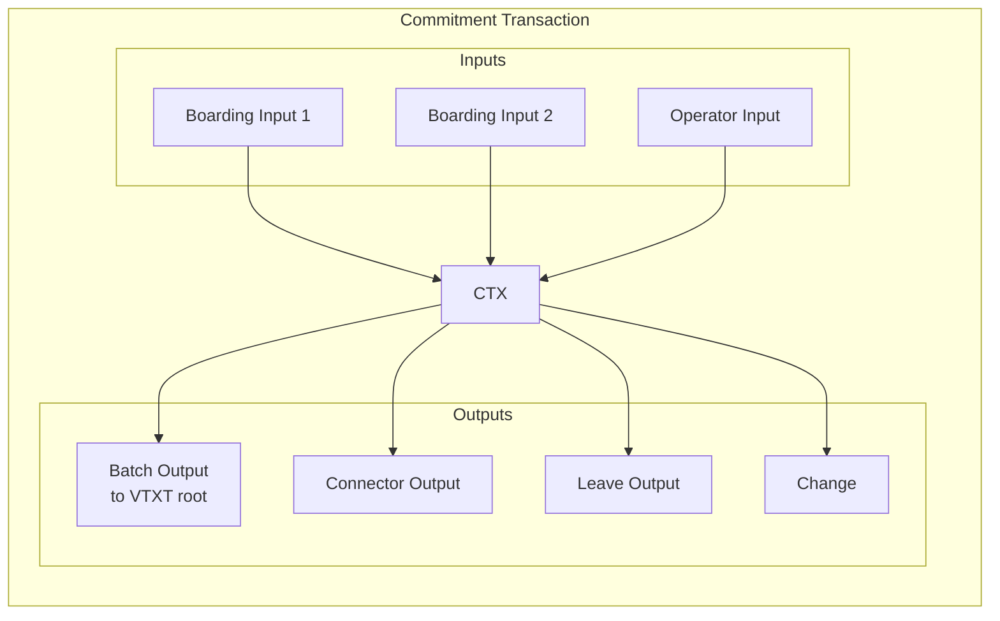
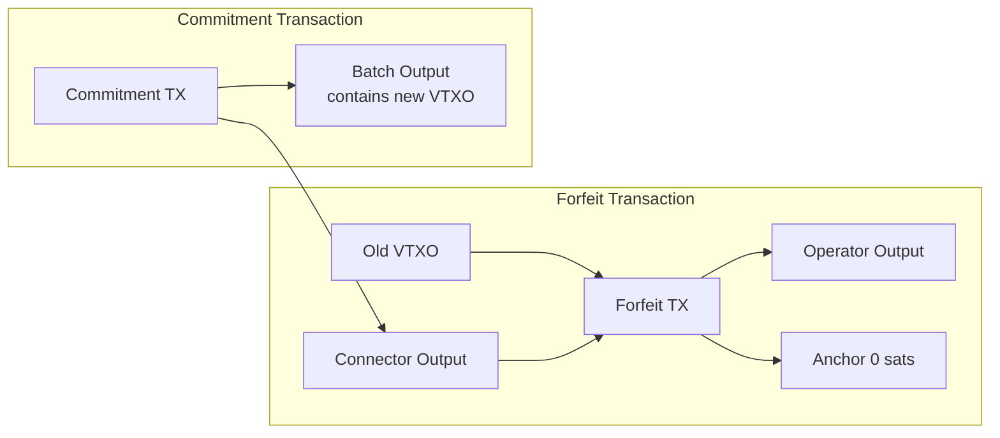

# ARK-01: Transaction Formats and Script Specifications

## Abstract

This document specifies the transaction formats and Bitcoin Script structures used in the Ark protocol. It defines the taproot-based output scripts for VTXOs, VTXT nodes, connector outputs, boarding outputs, and checkpoint outputs. It also specifies the structure of commitment transactions, forfeit transactions, and anchor outputs.

## Status

This specification is a working draft.

## Table of Contents

1. [Introduction](#introduction)
2. [General Requirements](#general-requirements)
3. [VTXO Output Script](#vtxo-output-script)
4. [VTXT Node Output Script](#vtxt-node-output-script)
5. [Connector Output Script](#connector-output-script)
6. [Boarding Output Script](#boarding-output-script)
7. [Checkpoint Output Script](#checkpoint-output-script)
8. [Commitment Transaction](#commitment-transaction)
9. [Forfeit Transaction](#forfeit-transaction)
10. [Anchor Outputs](#anchor-outputs)
11. [Transaction Validation Rules](#transaction-validation-rules)

## Introduction

All Ark protocol outputs use Taproot (BIP-341) [[1]](#references) with MuSig2 (BIP-327) [[2]](#references) for collaborative spend paths. This provides:

- Efficient on-chain footprint for collaborative spends (single signature)
- Privacy (collaborative spends are indistinguishable from single-sig)
- Flexibility for unilateral exit via script paths

### Design Rationale

The protocol uses MuSig2 keypaths for collaborative spends rather than script-based multisig because:

1. **Smaller witness**: Keypath spends require only a single 64-byte signature.
2. **Privacy**: Keypath spends reveal no script information.
3. **Forward compatibility**: The key aggregation approach is more flexible for future extensions.

The trade-off is that MuSig2 requires interactive nonce exchange, but this is acceptable since:
- Round participation already requires interaction for VTXT signing.
- OOR transactions already require operator interaction for validation.

## General Requirements

### Taproot Key Derivation

All taproot outputs in the Ark protocol MUST be constructed as follows:

1. Compute the internal key according to the specific output type.
2. Compute the taproot tweak from the script tree (if any).
3. Derive the output key as specified in BIP-341.

### MuSig2 Usage

For all MuSig2 aggregated keys:

1. Key aggregation MUST follow BIP-327 [[2]](#references).
2. Nonce generation MUST use fresh randomness for each signing session.
3. Implementations MUST NOT reuse nonces across signing sessions.

### Timelock Encoding

- Absolute timelocks (CLTV) MUST be encoded as block heights, not timestamps.
- Relative timelocks (CSV) MUST be encoded as block counts using the sequence number format specified in BIP-68 [[3]](#references).

## VTXO Output Script

### Purpose

A VTXO output represents value owned by a participant. It can be spent either collaboratively (with operator co-signature) or unilaterally (after a CSV delay).

### Script Structure

The VTXO output is a taproot output with the following structure:

```
Output Script: OP_1 <output_key>

Where:
  internal_key = MuSig2_KeyAgg(P_v, P_o)
  output_key = taproot_tweak(internal_key, script_tree_root)
```

#### Internal Key

The internal key is a MuSig2 aggregated key of:
- `P_v`: The VTXO owner's public key
- `P_o`: The operator's public key

This allows the collaborative spend path via keypath spending.

#### Script Tree

The script tree contains a single leaf for the unilateral exit path:

```
Unilateral Exit Script:
  <P_v> OP_CHECKSIGVERIFY
  <t_e> OP_CHECKSEQUENCEVERIFY
```

Where:
- `P_v`: The VTXO owner's public key
- `t_e`: The relative delay in blocks

### Spend Paths

#### Collaborative Spend (Keypath)

To spend via the collaborative path:

1. Owner and operator perform MuSig2 signing protocol.
2. Produce a single aggregated signature.
3. Witness: `<aggregated_signature>`

#### Unilateral Exit (Script Path)

To spend via the unilateral exit path:

1. Wait for at least `t_e` blocks after the VTXO appears on-chain.
2. Produce a signature with the owner's key.
3. Witness: `<signature> <unilateral_script> <control_block>`

### Validation Requirements

Operators validating VTXO requests MUST verify:

1. The output key is correctly derived from the claimed `P_v` and `P_o`.
2. The script tree contains only the expected unilateral exit script.
3. The CSV delay `t_e` meets the operator's minimum requirements.
4. The `P_o` in the script matches the operator's current signing key.

### Mermaid Diagram



## VTXT Node Output Script

### Purpose

VTXT node outputs (including the root Batch Output) represent intermediate values in the virtual transaction tree. They can be spent collaboratively by all downstream participants or swept by the operator after the absolute expiry.

### Script Structure

```
Output Script: OP_1 <output_key>

Where:
  internal_key = MuSig2_KeyAgg(P_1, P_2, ..., P_n, P_o)
  output_key = taproot_tweak(internal_key, script_tree_root)
```

#### Internal Key

The internal key is a MuSig2 aggregated key of:
- `P_1, P_2, ..., P_n`: Public keys of all downstream VTXO owners
- `P_o`: The operator's public key

For a binary tree with radix 2:
- Leaf level: Each branch aggregates keys of 1 VTXO owner + operator
- Level 1: Each branch aggregates keys of 2 VTXO owners + operator
- Level 2: Each branch aggregates keys of 4 VTXO owners + operator
- And so on up to the root

#### Script Tree

The script tree contains a single leaf for the operator sweep path:

```
Operator Sweep Script:
  <P_o> OP_CHECKSIGVERIFY
  <T_e> OP_CHECKLOCKTIMEVERIFY OP_DROP
```

Where:
- `P_o`: The operator's public key
- `T_e`: The absolute expiry block height

### Spend Paths

#### Collaborative Spend (Keypath)

Used when all downstream participants agree to spend (e.g., during VTXT construction):

1. All participants and operator perform MuSig2 signing protocol.
2. Produce a single aggregated signature.
3. Witness: `<aggregated_signature>`

#### Operator Sweep (Script Path)

Used by the operator to reclaim expired batch funds:

1. Wait until block height `T_e` is reached.
2. Produce a signature with the operator's key.
3. Witness: `<signature> <sweep_script> <control_block>`

### Tree Construction

The VTXT is constructed bottom-up:

1. **Leaf Level**: Create VTXO outputs for each participant.
2. **Branch Levels**: Group outputs by radix, create branch transactions.
3. **Root Level**: Final branch transaction output is the Batch Output.

For each branch transaction:
- Inputs: Outputs from child branch/leaf transactions
- Outputs: Single output paying to the aggregated key of all downstream participants

### Mermaid Diagram



## Connector Output Script

### Purpose

Connector outputs provide atomicity for forfeit transactions. They ensure that a forfeit is only valid if the corresponding commitment transaction is confirmed.

### Script Structure

Connector outputs use a simple single-key taproot output:

```
Output Script: OP_1 <P_oc>

Where:
  P_oc = operator's connector signing key
```

No script tree is required; the output is spendable only via keypath by the operator.

### Connector Tree

When multiple forfeits are included in a round, connectors are organized in a tree structure to minimize on-chain footprint:

1. **Connector Tree Root**: A single output in the commitment transaction.
2. **Connector Branches**: Intermediate transactions subdividing the root.
3. **Connector Leaves**: Individual connector outputs used by forfeit transactions.

The radix of the connector tree MAY differ from the VTXT radix. A higher radix reduces tree depth but increases individual transaction sizes.

### Mermaid Diagram



## Boarding Output Script

### Purpose

A boarding output allows a participant to enter the Ark by creating an on-chain UTXO that can be spent collaboratively into a commitment transaction, with a timeout fallback.

### Script Structure

```
Output Script: OP_1 <output_key>

Where:
  internal_key = MuSig2_KeyAgg(P_b, P_o)
  output_key = taproot_tweak(internal_key, script_tree_root)
```

#### Internal Key

The internal key is a MuSig2 aggregated key of:
- `P_b`: The boarding participant's public key
- `P_o`: The operator's public key

#### Script Tree

The script tree contains a single leaf for the timeout reclaim:

```
Timeout Reclaim Script:
  <P_b> OP_CHECKSIGVERIFY
  <t_b> OP_CHECKSEQUENCEVERIFY
```

Where:
- `P_b`: The boarding participant's public key
- `t_b`: The boarding timeout in blocks (relative)

### Spend Paths

#### Collaborative Spend (Keypath)

Used as input to the commitment transaction:

1. Participant and operator perform MuSig2 signing protocol.
2. Produce a single aggregated signature.
3. Witness: `<aggregated_signature>`

#### Timeout Reclaim (Script Path)

Used if boarding fails or times out:

1. Wait for at least `t_b` blocks after the boarding output is confirmed.
2. Produce a signature with the participant's key.
3. Witness: `<signature> <timeout_script> <control_block>`

### Validation Requirements

Operators validating boarding requests MUST verify:

1. The boarding UTXO exists and is confirmed.
2. The script structure is correct with expected `P_b` and `P_o`.
3. The timeout `t_b` provides sufficient time for round completion.
4. The participant can prove ownership of `P_b`.

## Checkpoint Output Script

### Purpose

Checkpoint outputs provide anti-griefing protection for OOR transactions. They prevent malicious participants from forcing the operator to broadcast expensive transaction chains.

### Script Structure

```
Output Script: OP_1 <output_key>

Where:
  internal_key = MuSig2_KeyAgg(P_c, P_o)
  output_key = taproot_tweak(internal_key, script_tree_root)
```

#### Internal Key

The internal key is a MuSig2 aggregated key of:
- `P_c`: The checkpoint participant's public key (same as VTXO owner being spent)
- `P_o`: The operator's public key

#### Script Tree

The script tree contains a single leaf for the operator timeout:

```
Operator Timeout Script:
  <P_o> OP_CHECKSIGVERIFY
  <t_c> OP_CHECKSEQUENCEVERIFY
```

Where:
- `P_o`: The operator's public key
- `t_c`: The checkpoint timeout in blocks (relative)

### Spend Paths

#### Collaborative Spend (Keypath)

Used to continue the Ark transaction chain:

1. Participant and operator perform MuSig2 signing protocol.
2. The Ark transaction spends from the checkpoint via this path.
3. Witness: `<aggregated_signature>`

#### Operator Timeout (Script Path)

Used if the participant abandons the checkpoint:

1. Wait for at least `t_c` blocks after the checkpoint appears on-chain.
2. Operator signs and sweeps the checkpoint.
3. Witness: `<signature> <timeout_script> <control_block>`

### Anti-Griefing Mechanism

The checkpoint mechanism works as follows:

1. When a participant spends a VTXO via OOR transaction, they first create a checkpoint transaction.
2. The checkpoint spends the VTXO and creates a checkpoint output.
3. The Ark transaction then spends from the checkpoint output.
4. If the participant later tries to unroll the original VTXO maliciously, the operator only needs to broadcast the checkpoint transaction.
5. If the participant doesn't continue the chain from the checkpoint, the operator can sweep via the timeout path.

This limits operator on-chain costs regardless of how long the OOR chain is.

## Commitment Transaction

### Purpose

The commitment transaction anchors one or more batches on-chain. It aggregates multiple participant requests into a single transaction.

### Transaction Structure

```
Commitment Transaction:
  Version: 2
  Locktime: 0

  Inputs:
    - Boarding inputs (0 or more)
    - Operator wallet inputs (0 or more)
    - Sweep inputs from expired batches (0 or more)

  Outputs:
    - Batch outputs (1 or more)
    - Connector output (0 or 1)
    - Leave outputs (0 or more)
    - Change output to operator (0 or 1)
```

### Input Types

#### Boarding Inputs

- Spend boarding UTXOs via collaborative keypath.
- Require MuSig2 signature from boarding participant and operator.
- Each boarding input corresponds to one or more VTXO requests.

#### Operator Wallet Inputs

- Standard P2TR or P2WPKH inputs from operator's wallet.
- Provide liquidity for the batch.

#### Sweep Inputs

- Spend from expired batch outputs via operator sweep path.
- Recycle operator liquidity from old batches.

### Output Types

#### Batch Outputs

- Pay to VTXT roots.
- Value equals sum of VTXO values in that tree.
- Multiple batch outputs MAY exist in a single commitment transaction.

#### Connector Output

- Pay to connector tree root.
- Present if any forfeit transactions are included in this round.
- Value is minimal (546 satoshis minimum for dust limit).

#### Leave Outputs

- Standard outputs paying to participant-specified scripts.
- One output per leave request.

#### Change Output

- Returns excess value to operator.
- Uses operator's standard receive script.

### Mermaid Diagram



## Forfeit Transaction

### Purpose

A forfeit transaction atomically transfers a VTXO to the operator in exchange for a new output (VTXO or UTXO) in the commitment transaction.

### Transaction Structure

```
Forfeit Transaction:
  Version: 2
  Locktime: 0

  Inputs:
    - VTXO input (spent via collaborative keypath)
    - Connector input (spent via operator keypath)

  Outputs:
    - Operator output (full VTXO value minus fees)
    - Anchor output (ephemeral, 0 sats)
```

### Input Requirements

#### VTXO Input

- Spends the VTXO being forfeited.
- Requires MuSig2 signature from VTXO owner and operator.
- Owner signs ONLY after verifying their new output in the commitment transaction.

#### Connector Input

- Spends a connector leaf from the new commitment transaction.
- Requires signature from operator.
- Provides atomicity: forfeit is only valid if commitment transaction confirms.

### Output Requirements

#### Operator Output

- Pays the forfeited value to an operator-controlled address.
- Value equals VTXO value minus transaction fees.

#### Anchor Output

- Ephemeral anchor for fee bumping (see [Anchor Outputs](#anchor-outputs)).
- Zero satoshi value.

### Validation Requirements

Participants MUST verify before signing a forfeit:

1. The commitment transaction contains their expected new output(s).
2. The connector input references the correct commitment transaction.
3. The forfeit outputs are as expected.

Operators MUST verify before signing a forfeit:

1. The VTXO being forfeited is valid and unspent.
2. The participant has proven ownership.
3. The connector tree path is correct.

### Mermaid Diagram



## Anchor Outputs

### Purpose

Anchor outputs enable fee bumping for pre-signed transactions. Since VTXT transactions and forfeit transactions are pre-signed, their fee rates are fixed at signing time. Anchor outputs allow adding fees at broadcast time via CPFP (Child-Pays-For-Parent).

### Ephemeral Anchor Specification

Ark uses ephemeral anchors as specified in BIP proposed for package relay:

```
Anchor Output:
  Value: 0 satoshis
  Script: OP_TRUE
```

This output:
- Has zero value (does not require dust relay rules exemption in modern nodes).
- Is immediately spendable by anyone with `OP_TRUE`.
- Can be spent by a fee-bumping child transaction.

### Usage in Ark

All off-chain transactions (VTXT transactions, Ark transactions, checkpoint transactions, forfeit transactions) SHOULD include an ephemeral anchor output.

When broadcasting these transactions:
1. Create a child transaction spending the anchor.
2. Set the child transaction fee to cover both transactions.
3. Broadcast both transactions as a package.

### Fee Calculation

The fee-bumping child transaction:
- MUST have at least one input from the broadcaster's wallet.
- MUST spend the anchor output.
- SHOULD set fees based on current mempool conditions.

## Transaction Validation Rules

### General Rules

All Ark protocol transactions:

1. MUST use transaction version 2.
2. MUST use witness serialization (SegWit).
3. MUST have valid signatures for all inputs.
4. MUST NOT have negative fee (output sum <= input sum).

### VTXT Transaction Rules

VTXT transactions:

1. MUST spend from either a batch output or another VTXT transaction.
2. MUST have outputs matching the expected VTXT structure.
3. MUST include an anchor output.
4. SHOULD use locktime 0.

### Forfeit Transaction Rules

Forfeit transactions:

1. MUST have exactly two inputs (VTXO and connector).
2. MUST have the connector input from the associated commitment transaction.
3. MUST pay the operator output correctly.
4. MUST include an anchor output.

### Commitment Transaction Rules

Commitment transactions:

1. MUST have at least one batch output.
2. MUST have connector output if any forfeits are processed.
3. MUST NOT exceed standard transaction size limits.
4. SHOULD target reasonable confirmation time fee rates.

## References

1. BIP 341: Taproot: SegWit version 1 spending rules - https://github.com/bitcoin/bips/blob/master/bip-0341.mediawiki
2. BIP 327: MuSig2 for BIP340-compatible Multi-Signatures - https://github.com/bitcoin/bips/blob/master/bip-0327.mediawiki
3. BIP 68: Relative lock-time using consensus-enforced sequence numbers - https://github.com/bitcoin/bips/blob/master/bip-0068.mediawiki
4. BIP 112: CHECKSEQUENCEVERIFY - https://github.com/bitcoin/bips/blob/master/bip-0112.mediawiki
5. BIP 65: OP_CHECKLOCKTIMEVERIFY - https://github.com/bitcoin/bips/blob/master/bip-0065.mediawiki

## Authors

This specification was authored by the Lightning Labs team.

## Copyright

This document is licensed under CC0.
