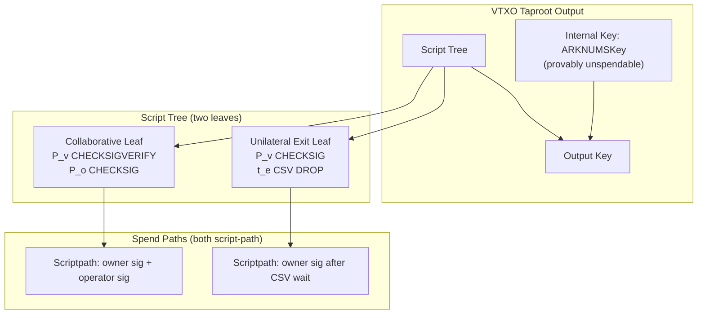
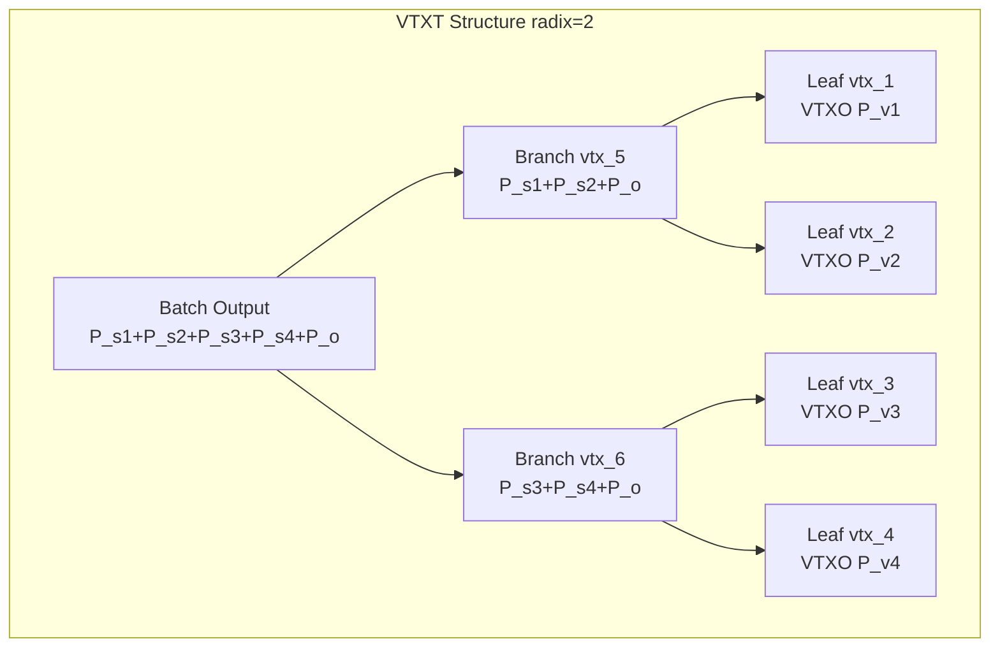
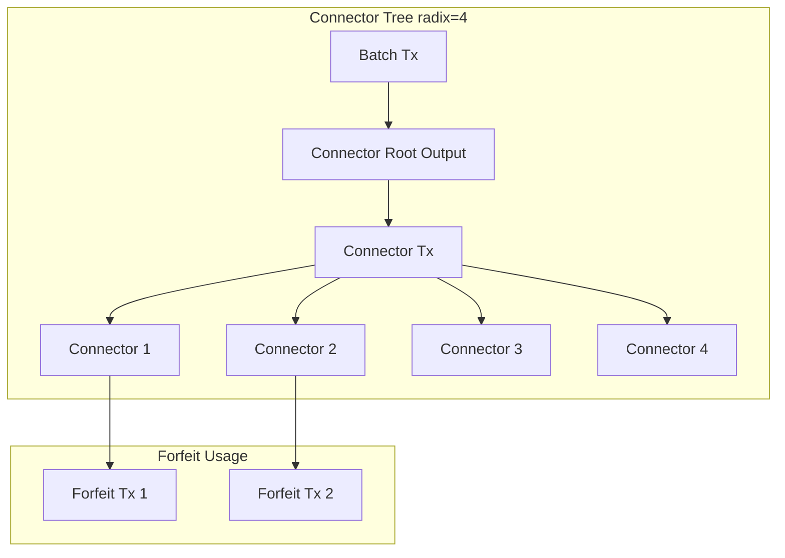
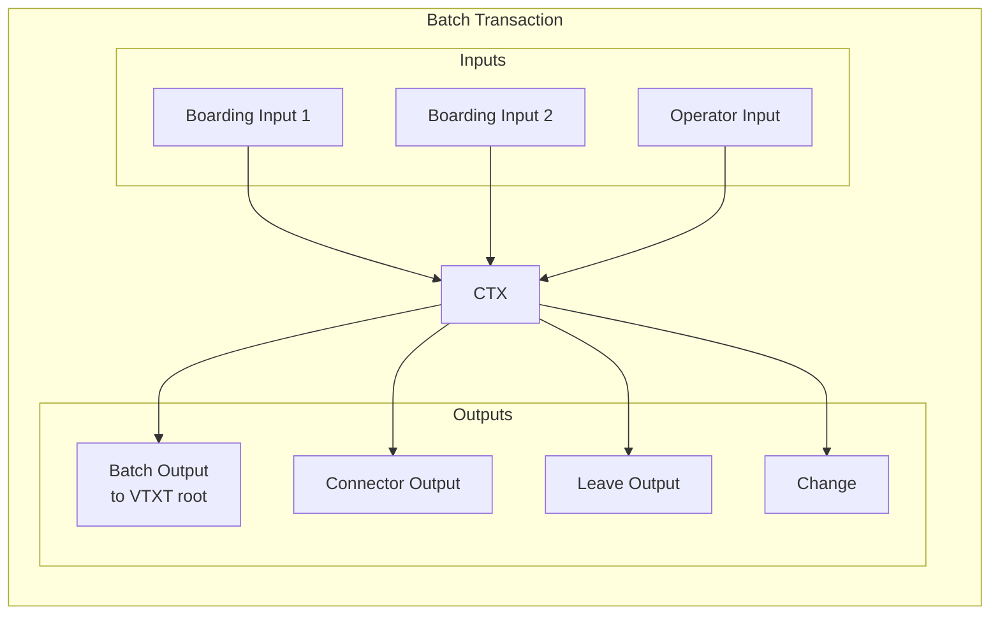
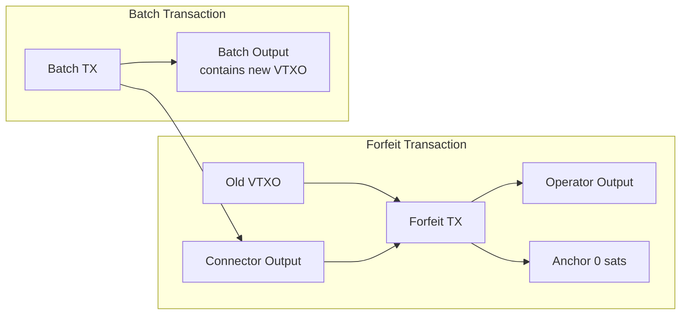
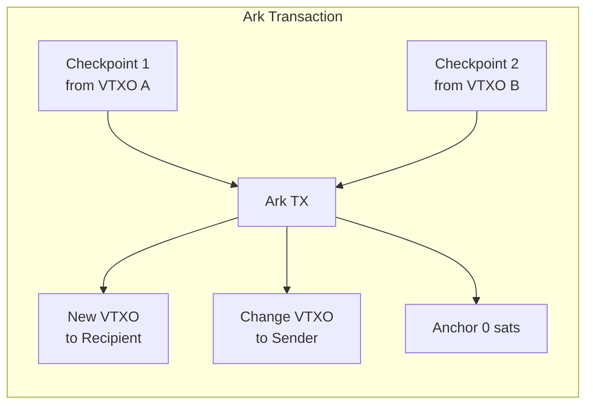

# ARK-01: Transaction Formats and Script Specifications

## Abstract

This document specifies the transaction formats and Bitcoin Script structures used in the Ark protocol. It defines the taproot-based output scripts for VTXOs, VTXT nodes, connector outputs, boarding outputs, and checkpoint outputs. It also specifies the structure of batch transactions, forfeit transactions, and anchor outputs.

## Status

This specification is version 0.1 (initial release).

## Table of Contents

1. [Introduction](#introduction)
2. [General Requirements](#general-requirements)
3. [Key Separation: Signing Keys vs VTXO Keys](#key-separation-signing-keys-vs-vtxo-keys)
4. [VTXO Output Script](#vtxo-output-script)
5. [VTXT Node Output Script](#vtxt-node-output-script)
6. [Connector Output Script](#connector-output-script)
7. [Boarding Output Script](#boarding-output-script)
8. [Checkpoint Output Script](#checkpoint-output-script)
9. [Batch Transaction](#batch-transaction)
10. [Forfeit Transaction](#forfeit-transaction)
11. [Ark Transaction (OOR Transaction)](#ark-transaction-oor-transaction)
12. [Anchor Outputs](#anchor-outputs)
13. [Transaction Validation Rules](#transaction-validation-rules)

## Introduction

All Ark protocol outputs use Taproot (BIP-341) [[1]](#references). The
collaborative spend mechanism varies by output type:

- **VTXT branch nodes**: Use MuSig2 (BIP-327) [[2]](#references) keypath spends
  for efficiency (single 64-byte signature) and privacy.
- **VTXO outputs, boarding outputs, checkpoint outputs**: Use script-path
  multi-sig (not MuSig2) with an unspendable internal key (ARKNUMSKey). This
  avoids interactive nonce exchange for these spends.
- **Connector outputs/leaves**: Use standard P2TR keypath spends to an operator
  address. Connector trees are signed by the operator only.

### Design Rationale

VTXT branch node transactions use MuSig2 keypaths because:
1. **Smaller witness**: Keypath spends require only a single 64-byte signature.
2. **Privacy**: Keypath spends reveal no script information.
3. **Efficiency for mass signing**: Branch nodes are signed during rounds where all participants are already interacting.

Leaf-level outputs (VTXOs, boarding, checkpoints) use script-path multi-sig
because:
1. **No interactive nonce exchange**: Signatures can be provided independently without coordination.
2. **Simpler key management**: Each party signs with their own key without MuSig2 session state.
3. **Operational flexibility**: The VTXO owner can sign their portion at any time.

## General Requirements

### Taproot Key Derivation

All taproot outputs in the Ark protocol MUST be constructed as follows:

1. Compute the internal key according to the specific output type.
2. Compute the taproot tweak from the script tree (if any).
3. Derive the output key as specified in BIP-341.

### ARKNUMSKey

The ARKNUMSKey is a fixed, unspendable internal key used for outputs that must
be script-path only (no keypath spend). Its compressed public key is:

```
ARKNUMSKey = 02372f225b3caee8213096de3229ee4335306b07c3c169438461b5d4749884ec65
```

This key is derived from the seed phrase `”Ark Protocol NUMS”` using the
`lightning-node-connect/mailbox/numsgen` tool and has no known private key.
Implementations MUST use this exact key for all VTXO, boarding, and checkpoint
outputs.

### MuSig2 Usage

For all MuSig2 aggregated keys:

1. Key aggregation MUST follow BIP-327 [[2]](#references).
2. Nonce generation MUST use fresh randomness for each signing session.
3. Implementations MUST NOT reuse nonces across signing sessions.

### Timelock Encoding

- Absolute timelocks (CLTV) MUST be encoded as block heights, not timestamps.
- Relative timelocks (CSV) MUST be encoded as block counts using the sequence number format specified in BIP-68 [[3]](#references).

## Key Separation: Signing Keys vs VTXO Keys

### Overview

The Ark protocol uses two distinct categories of keys for different purposes:

1. **VTXO Ownership Keys (P_v)**: Used in VTXO output scripts, control actual fund ownership.
2. **Signing Keys (P_s)**: Per‑VTXO keys used for MuSig2 signing of VTXT branch
   transactions.

This separation is a critical protocol design choice that provides privacy, security isolation, and operational flexibility.

### Rationale for Separation

**Privacy**: Using separate signing keys prevents linking a participant's VTXO
ownership across multiple batches or rounds. The VTXT branch signatures reveal
the signing key but not the VTXO ownership key.

**Within-round linkability caveat**: Within a single round, the same signing
key `P_s` is used in all VTXT branch nodes from the root down to the leaf
transaction for a given VTXO. This means an observer who sees the VTXT can
link a signing key to a specific VTXO within that round. However, since
signing keys are ephemeral and change each round, this does NOT enable
cross-round linkability. An observer cannot determine which VTXOs across
different rounds belong to the same participant.

**Signing Efficiency**: Signing keys can be generated fresh each round (per
VTXO request) without affecting long-term key management. MuSig2 nonces can be
pre-generated for signing keys since they are ephemeral.

**Key Isolation**: Compromise of a signing key affects only one round's branch
signing ability, not fund ownership. VTXO ownership keys can be kept in cold
storage or hardware security modules while signing keys are used for active
signing.

**Operational Flexibility**: Different security policies can apply to each
key type. Signing keys can be "hot" for automated signing, while VTXO keys
remain "cold" and are only used when spending.

### Usage by Key Type

| Context | Key Type | Purpose |
|---------|----------|---------|
| VTXO/boarding/checkpoint internal key | ARKNUMSKey | Forces script-path spends only |
| VTXO unilateral exit path | VTXO ownership key (P_v) | Signs exit transaction |
| VTXO collaborative spend (OOR/forfeit) | VTXO ownership key (P_v) | Signs spending transaction |
| VTXT branch node keypath | Signing key (P_s) | Signs branch transactions |
| Batch output keypath | Signing key (P_s) | Signs root transaction |
| VTXT sweep path | Operator sweep key (P_sw) | Sweeps after expiry |

### Key Derivation Requirements

1. VTXO ownership keys and signing keys SHOULD be derived from the same HD
   wallet master seed.
2. They MUST use different derivation paths to ensure separation (see ARK-05 for paths).
3. Signing keys SHOULD be freshly derived for each round.
4. Signing keys MUST NOT be reused across different rounds.

### Security Considerations

- Compromise of a signing key does NOT allow theft of funds (VTXO key required).
- Compromise of a VTXO key allows spending of that specific VTXO only.
- Loss of signing key after round completion has no impact (signatures already
  collected).
- Loss of VTXO key results in loss of funds (backup essential).

## VTXO Output Script

### Purpose

A VTXO output represents value owned by a participant. It can be spent either collaboratively (with operator co-signature) or unilaterally (after a CSV delay).

### Script Structure

The VTXO output is a taproot output with the following structure:

```
Output Script: OP_1 <output_key>

Where:
  internal_key = ARKNUMSKey (provably unspendable)
  output_key = taproot_tweak(internal_key, script_tree_root)
```

#### Internal Key

The internal key MUST be the ARKNUMSKey, a provably unspendable point. This ensures all spends go through script paths.

#### Script Tree

The script tree contains two leaves:

```
Collaborative Spend Script (multi-sig):
  <P_v> OP_CHECKSIGVERIFY
  <P_o> OP_CHECKSIG

Unilateral Exit Script:
  <P_v> OP_CHECKSIG
  <t_e> OP_CHECKSEQUENCEVERIFY OP_DROP
```

Where:
- `P_v`: The VTXO owner's public key
- `t_e`: The relative delay in blocks

### Spend Paths

#### Collaborative Spend (Script Path Multi-sig)

To spend via the collaborative path:

1. Owner produces a signature with `P_v`.
2. Operator produces a signature with `P_o`.
3. Witness: `<sig_operator> <sig_owner> <collab_script> <control_block>`

#### Unilateral Exit (Script Path)

To spend via the unilateral exit path:

1. Wait for at least `t_e` blocks after the VTXO appears on-chain.
2. Produce a signature with the owner's key.
3. Witness: `<signature> <unilateral_script> <control_block>`

### Validation Requirements

Operators validating VTXO requests MUST verify:

1. The output key is correctly derived from ARKNUMSKey and the script tree.
2. The script tree contains the expected collaborative and unilateral leaves.
3. The CSV delay `t_e` meets the operator's minimum requirements.
4. The `P_o` in the collaborative leaf matches the operator's current signing
   key.

### Witness Stack Order

The witness stacks for each spend path are:

**Collaborative Spend:**
```
<sig_operator> <sig_owner> <collab_script> <control_block>
```

**Unilateral Exit:**
```
<sig_owner> <unilateral_script> <control_block>
```

Note: In the collaborative path, the operator (cosigner) signature comes first,
followed by the owner signature. This matches the script execution order where
`OP_CHECKSIGVERIFY` consumes the owner signature first (top of stack), then
`OP_CHECKSIG` consumes the operator signature.

### Mermaid Diagram



## VTXT Node Output Script

### Purpose

VTXT node outputs (including the root Batch Output) represent intermediate
values in the virtual transaction tree. They can be spent collaboratively by
all downstream participants or swept by the operator after the sweep delay
(`T_e`) elapses.

### Script Structure

```
Output Script: OP_1 <output_key>

Where:
  internal_key = MuSig2_KeyAgg(P_s1, P_s2, ..., P_sn, P_o)
  output_key = taproot_tweak(internal_key, script_tree_root)
```

#### Internal Key

The internal key is a MuSig2 aggregated key of:
- `P_s1, P_s2, ..., P_sn`: **Signing public keys** of all downstream VTXO
  participants (not VTXO ownership keys)
- `P_o`: The operator's public key

Using signing keys (rather than VTXO ownership keys) prevents linking a
participant's VTXOs across different rounds, as the signing keys are
ephemeral and change each round.

For a binary tree with radix 2:
- Leaf level: Each branch aggregates signing keys of 1 participant + operator
- Level 1: Each branch aggregates signing keys of 2 participants + operator
- Level 2: Each branch aggregates signing keys of 4 participants + operator
- And so on up to the root

#### Script Tree

The script tree contains a single leaf for the operator sweep path:

```
Operator Sweep Script:
  <P_sw> OP_CHECKSIG
  <T_e> OP_CHECKSEQUENCEVERIFY OP_DROP
```

Where:
- `P_sw`: The operator's sweep public key (may be distinct from `P_o`)
- `T_e`: The sweep delay (relative CSV, starts counting from when the branch
  transaction is confirmed on-chain)

### Spend Paths

#### Collaborative Spend (Keypath)

Used when all downstream participants agree to spend (e.g., during VTXT construction):

1. All participants and operator perform MuSig2 signing protocol.
2. Produce a single aggregated signature.
3. Witness: `<aggregated_signature>`

#### Operator Sweep (Script Path)

Used by the operator to reclaim funds after the sweep delay:

1. Wait for at least `T_e` blocks after the branch transaction is confirmed on-chain.
2. Produce a signature with the operator's sweep key (`P_sw`).
3. Witness: `<signature> <sweep_script> <control_block>`

### Tree Construction (Fan-out)

The VTXT is constructed as a fan-out tree where each node transaction spends a
single parent output and creates multiple child outputs:

1. **Root Level**: The root transaction spends the Batch Output.
2. **Branch Levels**: Each node spends its parent output and creates outputs
   for its children (radix determines the fan-out).
3. **Leaf Level**: Leaf node transactions create the VTXO outputs.

For each node transaction:
- Inputs: Exactly one input spending the parent output (fan-out: 1→N).
- Outputs: One output per child plus a trailing ephemeral P2A anchor output.

**Construction vs Unrolling:** The tree structure is *constructed* bottom-up
(leaves first, then branches, then root) to compute aggregate keys and values.
However, the transaction spending direction is top-down: the root spends the
batch output, branches spend parent outputs, and leaves create VTXO outputs.

Leaf assignment MUST use deterministic LPT ordering:
1. Sort VTXO outputs by value (descending), then by pkScript bytes.
2. Assign in order to leaves to keep the fan-out tree balanced.

### Mermaid Diagram



## Connector Output Script

### Purpose

Connector outputs provide atomicity for forfeit transactions. They ensure that a
forfeit is only valid if the corresponding batch transaction is confirmed.

### Script Structure

Connector outputs are standard P2TR keypath outputs to an operator-specified
connector address. There is no script tree:

```
Output Script: OP_1 <output_key>

Where:
  output_key = operator connector key (P2TR)
```

Connector leaves are spendable only by the operator via keypath. Connector tree
nodes are also keypath spends signed by the operator only.

### Connector Tree

When multiple forfeits are included in a round, connectors are organized in a
tree structure to minimize on-chain footprint:

1. **Connector Tree Root**: One or more outputs in the batch transaction.
2. **Connector Branches**: Intermediate fan-out transactions subdividing the
   root output.
3. **Connector Leaves**: Individual connector outputs used by forfeit
   transactions.

The radix of the connector tree MAY differ from the VTXT radix. A higher radix
reduces tree depth but increases individual transaction sizes.

### Mermaid Diagram



## Boarding Output Script

### Purpose

A boarding output allows a participant to enter the Ark by creating an on-chain UTXO that can be spent collaboratively into a batch transaction, with a timeout fallback.

### Script Structure

```
Output Script: OP_1 <output_key>

Where:
  internal_key = ARKNUMSKey (provably unspendable)
  output_key = taproot_tweak(internal_key, script_tree_root)
```

#### Internal Key

The internal key MUST be the ARKNUMSKey, a provably unspendable point. This ensures all spends go through script paths.

#### Script Tree

The script tree contains two leaves:

```
Collaborative Spend Script (multi-sig):
  <P_b> OP_CHECKSIGVERIFY
  <P_o> OP_CHECKSIG

Timeout Reclaim Script:
  <P_b> OP_CHECKSIG
  <t_b> OP_CHECKSEQUENCEVERIFY OP_DROP
```

Where:
- `P_b`: The boarding participant's public key
- `P_o`: The operator's public key
- `t_b`: The boarding timeout in blocks (relative)

### Spend Paths

#### Collaborative Spend (Script Path Multi-sig)

Used as input to the batch transaction:

1. Participant produces a signature with `P_b`.
2. Operator produces a signature with `P_o`.
3. Witness: `<sig_operator> <sig_participant> <collab_script> <control_block>`

Note: A participant could technically board and leave in the same batch transaction. This should be discouraged via fee policy, as it could be used for free UTXO consolidation.

#### Timeout Reclaim (Script Path)

Used if boarding fails or times out:

1. Wait for at least `t_b` blocks after the boarding output is confirmed.
2. Produce a signature with the participant's key.
3. Witness: `<signature> <timeout_script> <control_block>`

### Validation Requirements

Operators validating boarding requests MUST verify:

1. The boarding UTXO exists and is confirmed.
2. The script structure is correct with expected `P_b` and `P_o`.
3. The timeout `t_b` provides sufficient time for round completion.
4. The participant can prove ownership of `P_b`.

## Checkpoint Output Script

### Purpose

Checkpoint outputs provide anti-griefing protection for OOR transactions. They prevent malicious participants from forcing the operator to broadcast expensive transaction chains.

### Script Structure

```
Output Script: OP_1 <output_key>

Where:
  internal_key = ARKNUMSKey (provably unspendable)
  output_key = taproot_tweak(internal_key, script_tree_root)
```

#### Internal Key

The internal key MUST be the ARKNUMSKey, a provably unspendable point. This ensures all spends go through script paths.

#### Script Tree

The checkpoint output uses a two-leaf tapscript tree:

```
Operator Unroll Script (CSV):
  <P_sw> OP_CHECKSIG
  <t_c> OP_CHECKSEQUENCEVERIFY OP_DROP

Owner Leaf Script (v0, closure-provided):
  <closure_script>

Default collaborative closure (RECOMMENDED):
  <P_c> OP_CHECKSIGVERIFY
  <P_o> OP_CHECKSIG
```

Where:
- `P_c`: The checkpoint participant's public key (same as VTXO owner being
  spent)
- `P_o`: The operator's collaborative signing key
- `P_sw`: The operator's sweep/unroll key (may be distinct from `P_o`)
- `t_c`: The checkpoint timeout in blocks (relative). In v0, `t_c` is set
  equal to the VTXO exit delay `t_e` from the operator's terms. This ensures
  the operator has the same response window for checkpoint claims as for
  forfeit responses. Clients MUST use at least the operator's advertised
  `checkpoint_timeout`. A RECOMMENDED minimum safety floor is 10 blocks.

**Closure System (v0):** The owner leaf is a closure-provided script committed
in the tap tree. This design allows the checkpoint system to support arbitrary
spending conditions beyond the default collaborative multi-sig:

- The **default closure** (`<P_c> OP_CHECKSIGVERIFY <P_o> OP_CHECKSIG`) is
  RECOMMENDED for standard OOR transfers.
- Operators MUST validate the owner leaf script against their policy before
  co-signing. Operators MAY reject closures that do not match their accepted
  policy set.
- The closure script is provided by the client during OOR transaction
  construction and is encoded in the PSBT taptree metadata (see ARK-03).
- Future closure types (e.g., hash-locked closures for vHTLCs) can be
  introduced without changing the checkpoint transaction structure.

### Spend Paths

#### Owner Leaf Spend (Script Path)

Used to continue the Ark transaction chain via the owner leaf:

1. The witness satisfies the closure-provided script.
2. The Ark transaction spends from the checkpoint via this path.
3. Witness: `<closure_witness> <closure_script> <control_block>`

If the default collaborative closure is used, the witness contains both the
participant and operator signatures.

#### Operator Timeout (Script Path)

Used if the participant abandons the checkpoint:

1. Wait for at least `t_c` blocks after the checkpoint appears on-chain.
2. Operator signs and sweeps the checkpoint.
3. Witness: `<signature> <timeout_script> <control_block>`

### Anti-Griefing Mechanism

The checkpoint mechanism works as follows:

1. When a participant spends VTXOs via OOR transaction, they first create checkpoint transaction(s) for each VTXO being spent.
2. Each checkpoint spends one VTXO and creates a checkpoint output.
3. The Ark transaction then spends from one or more checkpoint outputs (one per input VTXO).
4. If the participant later tries to unroll the original VTXO maliciously, the operator only needs to broadcast the checkpoint transaction for that VTXO.
5. If the participant doesn't continue the chain from the checkpoint, the operator can sweep via the timeout path, forcing the participant to broadcast the Ark transaction and complete the OOR chain.

This limits operator on-chain costs regardless of how long the OOR chain is.

## Batch Transaction

### Purpose

The batch transaction anchors one or more batches on-chain. It aggregates multiple participant requests into a single transaction.

### Transaction Structure

```
Batch Transaction:
  Version: 2
  Locktime: 0

  Inputs:
    - Boarding inputs (0 or more)
    - Operator wallet inputs (0 or more)
    - Sweep inputs from expired batches (0 or more)

  Outputs:
    - Batch outputs (1 or more)
    - Connector outputs (0 or more)
    - Leave outputs (0 or more)
    - Change output to operator (0 or 1)
```

### Input Types

#### Boarding Inputs

- Spend boarding UTXOs via collaborative script-path multi-sig.
- Require individual signatures from boarding participant and operator.
- Each boarding input corresponds to one or more VTXO requests.

#### Operator Wallet Inputs

- Standard P2TR or P2WPKH inputs from operator's wallet.
- Provide liquidity for the batch.

#### Sweep Inputs

- Spend from expired batch outputs via operator sweep path.
- Recycle operator liquidity from old batches.

### Output Types

#### Batch Outputs

- Pay to VTXT roots.
- Value equals sum of VTXO values in that tree.
- Multiple batch outputs MAY exist in a single batch transaction.

#### Connector Outputs

- Pay to connector tree root(s) using the operator-provided P2TR connector
  address.
- Present if any forfeit transactions are included in this round.
- One or more outputs MAY be used if the connector tree is split by policy.
- Each output value is `num_connectors * connector_dust_amount`, where each
  leaf receives the dust amount configured in operator terms.

#### Leave Outputs

- Standard outputs paying to participant-specified scripts.
- One output per leave request.

#### Change Output

- Returns excess value to operator.
- Uses operator's standard receive script.

### Mermaid Diagram



## Forfeit Transaction

### Purpose

A forfeit transaction atomically transfers a VTXO to the operator in exchange for a new output (VTXO or UTXO) in the batch transaction.

### Transaction Structure

```
Forfeit Transaction:
  Version: 3 (required for P2A anchors)
  Locktime: 0

  Inputs:
    - VTXO input (spent via collaborative script-path multi-sig)
    - Connector input (operator keypath spend)

  Outputs:
    - Operator output (full VTXO value)
    - Anchor output (ephemeral, 0 sats)
```

### Input Requirements

#### VTXO Input

- Spends the VTXO being forfeited via the collaborative script-path multi-sig.
- Requires individual signatures from both the VTXO owner and operator.
- Owner signs ONLY after verifying their new output in the batch transaction.

#### Connector Input

- Spends a connector leaf from the new batch transaction.
- Requires operator keypath signature.
- Provides atomicity: forfeit is only valid if batch transaction confirms.

### Output Requirements

#### Operator Output

- Pays the forfeited value to an operator-controlled address.
- Value equals the full VTXO value. Fees are paid via CPFP on the ephemeral
  anchor output, not deducted from the forfeit amount.

#### Anchor Output

- Ephemeral anchor for fee bumping (see [Anchor Outputs](#anchor-outputs)).
- Zero satoshi value.

### Validation Requirements

Participants MUST verify before signing a forfeit:

1. The batch transaction contains their expected new output(s).
2. The connector input references the correct batch transaction.
3. The forfeit outputs are as expected.

Operators MUST verify before signing a forfeit:

1. The VTXO being forfeited is valid and unspent.
2. The participant has proven ownership.
3. The connector tree path is correct.

### Mermaid Diagram



## Ark Transaction (OOR Transaction)

### Purpose

An Ark Transaction (also called Out-of-Round Transaction or OOR Transaction)
spends one or more VTXOs and creates new VTXOs without requiring a new Batch
Transaction. Ark transactions enable instant off-chain transfers between Ark
participants.

### Transaction Structure (v0 draft)

```
Ark Transaction:
  Version: 3 (required for P2A anchors)
  Locktime: 0

  Inputs:
    - Checkpoint output(s) (one per input VTXO, vout=0)

  Outputs:
    - New VTXO output(s) for recipient(s)
    - Change VTXO output (if any) for sender
    - Anchor output (ephemeral P2A, 0 sats, must be last)
```

**Fees:** The v0 draft does not include a dedicated fee output. Fee policy for
OOR is TBD and expected to be handled at the round level.

### Input Requirements

Each input spends from a checkpoint output:
- The checkpoint was created by a checkpoint transaction that spent the original VTXO.
- Requires individual signatures from both the sender and operator.
- Ark transactions can spend from multiple checkpoint outputs (one per input VTXO being spent).

### Output Requirements

#### New VTXO Outputs

- Use the standard VTXO script structure (see [VTXO Output Script](#vtxo-output-script)).
- Can pay to any valid VTXO script (potentially different owners for each output).

#### Anchor Output

- Ephemeral anchor for fee bumping.
- Zero satoshi value (P2A).

### Canonical Ordering (v0 draft)

Ark transactions MUST be canonicalized:

1. Inputs are ordered by previous outpoint (txid, then vout), per BIP-69 style.
2. Non-anchor outputs are ordered by value (ascending), then lexicographically
   by raw pkScript bytes (BIP-69 output ordering).
3. Exactly one anchor output exists and it MUST be the final output.

### PSBT Profile (v0 draft)

Ark transactions are exchanged as PSBTs with the following requirements:

- Each Ark input MUST include `WitnessUtxo` matching the checkpoint output
  (script + value).
- Each Ark input MUST include a `taptree` metadata blob in a PSBT unknown field.
  This blob is a TLV-encoded tapleaf list used by the corresponding checkpoint
  output. See ARK-03 for the encoding.

### Validation Requirements

Operators validating Ark transactions MUST verify:

1. All input checkpoint outputs are valid and unspent.
2. Input values equal output values (v0 has no implicit fee).
3. All new VTXO outputs have valid script structures.
4. The transaction is canonical (ordering + single anchor last).
5. The transaction version is 3 (for P2A anchors).

### Mermaid Diagram



## Anchor Outputs

### Purpose

Anchor outputs enable fee bumping for pre-signed transactions. Since VTXT transactions and forfeit transactions are pre-signed, their fee rates are fixed at signing time. Anchor outputs allow adding fees at broadcast time via CPFP (Child-Pays-For-Parent).

### Ephemeral Anchor Specification

Ark uses ephemeral anchors (P2A) as specified in BIP-431:

```
Anchor Output:
  Value: 0 satoshis
  Script: OP_1 0x4e 0x73   # P2A (bc1pfeessrawgf)
```

This output:
- Has zero value.
- Is immediately spendable by anyone with a child transaction.
- Can be used for package CPFP fee bumping.

### Usage in Ark

All off-chain transactions that may need CPFP fee bumping (VTXT transactions,
connector tree transactions, Ark transactions, forfeit transactions) MUST
include an ephemeral anchor output as the **final** output. These transactions
MUST use version 3 to support P2A anchors.

**Checkpoint transactions** are a v0 exception: they use version 3 for package
relay compatibility but do NOT include a P2A anchor output. The checkpoint
output is the sole output (vout=0) of a checkpoint transaction.

When broadcasting these transactions:
1. Create a child transaction spending the anchor.
2. Set the child transaction fee to cover both transactions.
3. Broadcast both transactions as a package.

### Fee Calculation

The fee-bumping child transaction:
- MUST have at least one input from the broadcaster's wallet.
- MUST spend the anchor output.
- SHOULD set fees based on current mempool conditions.

## Transaction Validation Rules

### General Rules

All Ark protocol transactions:

1. Off-chain transactions (VTXT, connector trees, Ark, checkpoint, forfeit)
   MUST use transaction version 3 (P2A anchors or package relay
   compatibility).
2. On-chain transactions (batch transaction) MUST use transaction version 2.
3. MUST use witness serialization (SegWit).
4. MUST have valid signatures for all inputs.
5. MUST NOT have negative fee (output sum <= input sum).

### VTXT Transaction Rules

VTXT transactions:

1. MUST spend from either a batch output or another VTXT transaction.
2. MUST have outputs matching the expected VTXT structure.
3. MUST include a trailing anchor output.
4. SHOULD use locktime 0.

### Forfeit Transaction Rules

Forfeit transactions:

1. MUST have exactly two inputs (VTXO and connector).
2. MUST have the connector input from the associated batch transaction.
3. MUST pay the operator output correctly.
4. MUST include a trailing anchor output.

### Batch Transaction Rules

Batch transactions:

1. MUST have at least one batch output.
2. MUST have connector output if any forfeits are processed.
3. MUST NOT exceed standard transaction size limits.
4. SHOULD target reasonable confirmation time fee rates.
5. Connector outputs MUST pay to the operator's connector address and have
   value equal to the number of connector leaves times the connector dust
   amount.

## References

1. BIP 341: Taproot: SegWit version 1 spending rules - https://github.com/bitcoin/bips/blob/master/bip-0341.mediawiki
2. BIP 327: MuSig2 for BIP340-compatible Multi-Signatures - https://github.com/bitcoin/bips/blob/master/bip-0327.mediawiki
3. BIP 68: Relative lock-time using consensus-enforced sequence numbers - https://github.com/bitcoin/bips/blob/master/bip-0068.mediawiki
4. BIP 112: CHECKSEQUENCEVERIFY - https://github.com/bitcoin/bips/blob/master/bip-0112.mediawiki
5. BIP 65: OP_CHECKLOCKTIMEVERIFY - https://github.com/bitcoin/bips/blob/master/bip-0065.mediawiki
6. BIP 431: Package relay and ephemeral anchors - https://github.com/bitcoin/bips/blob/master/bip-0431.mediawiki

## Authors

This specification was authored by the Lightning Labs team.

## Copyright

This document is licensed under CC0.
