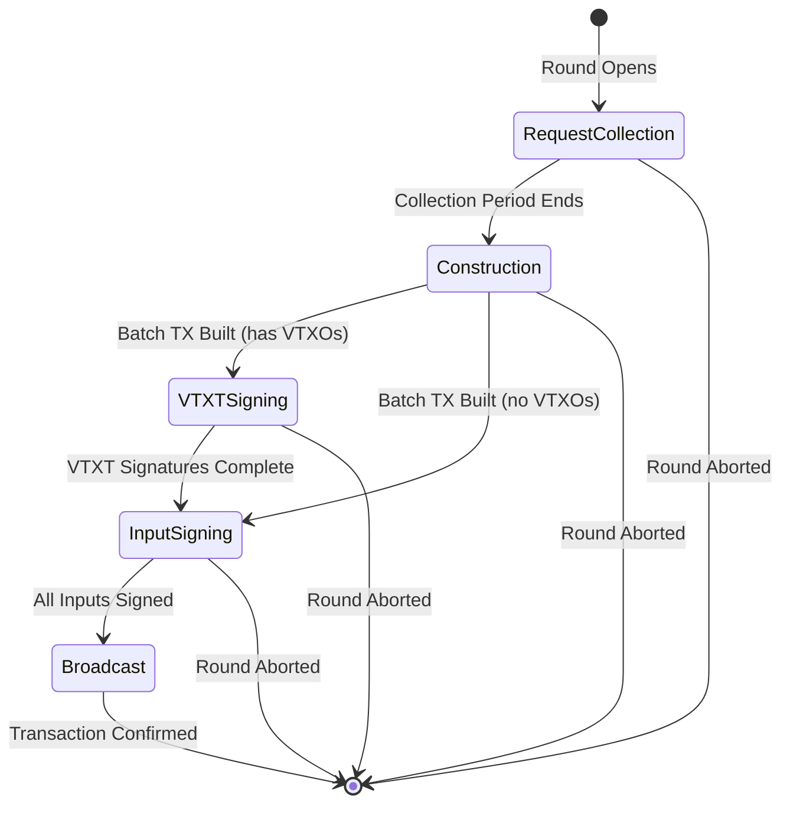
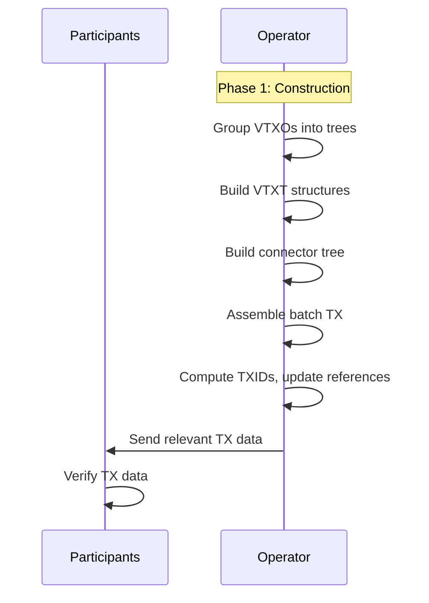
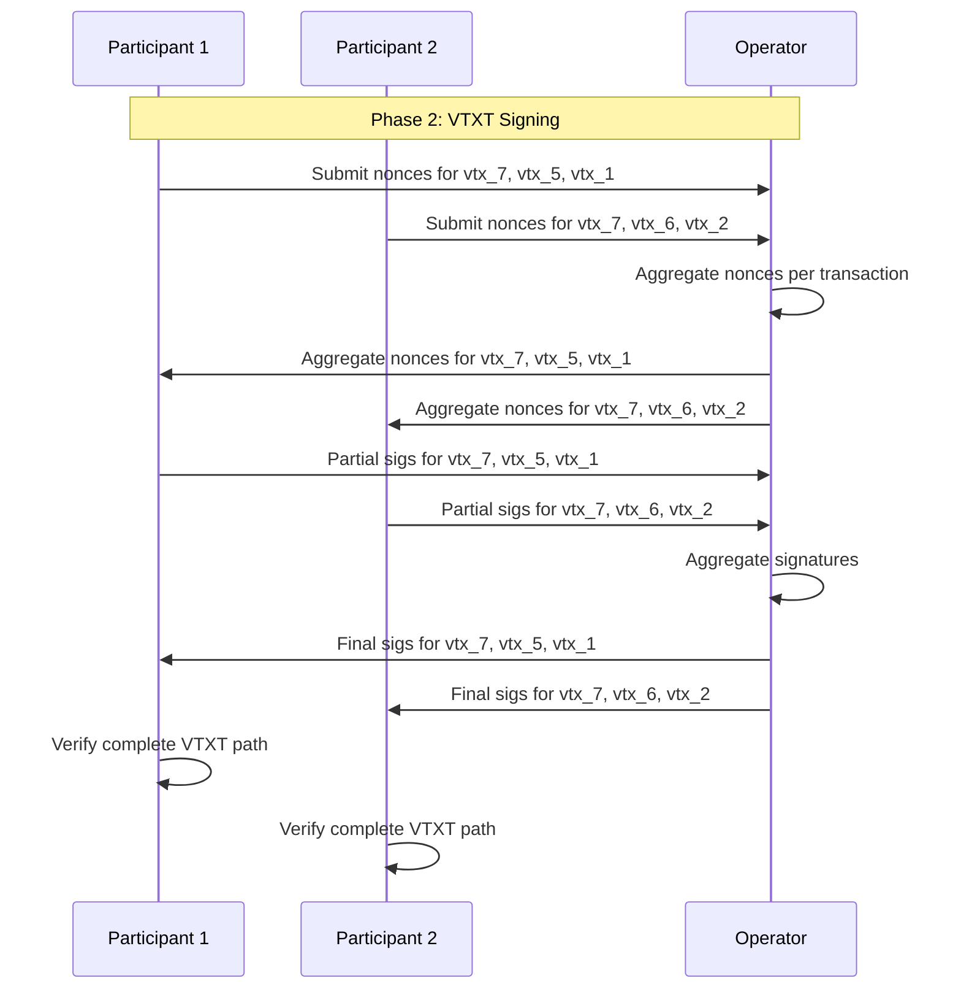
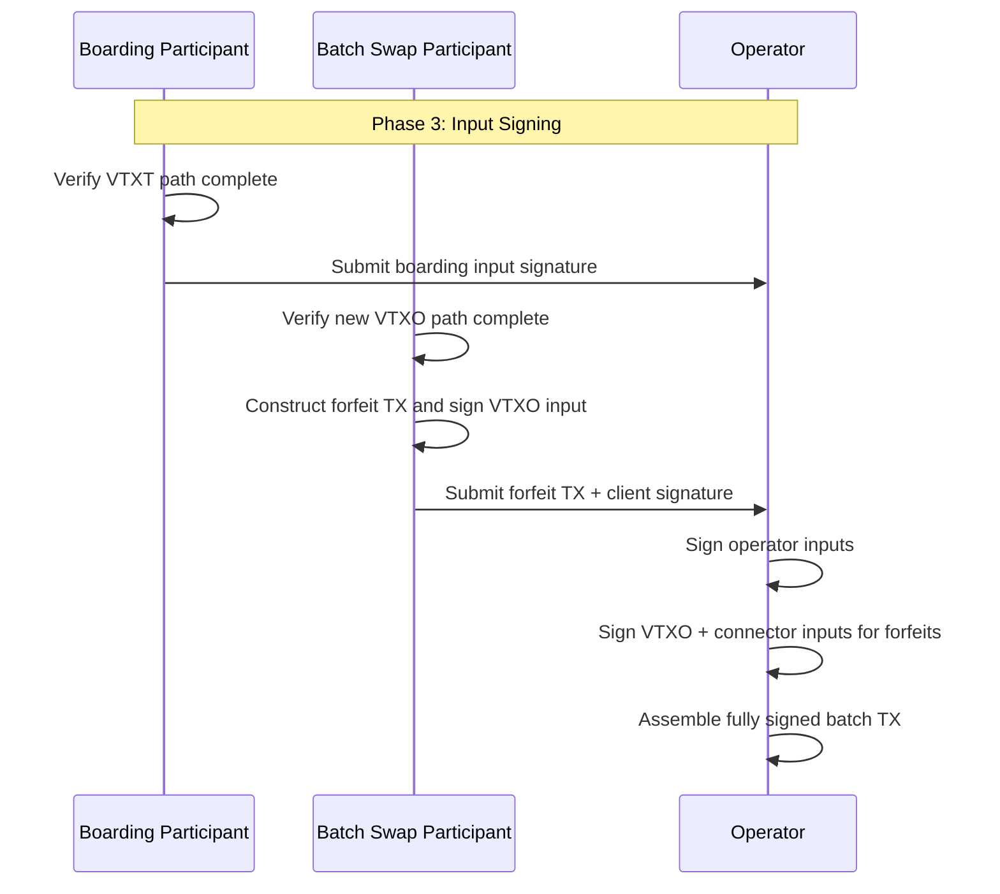
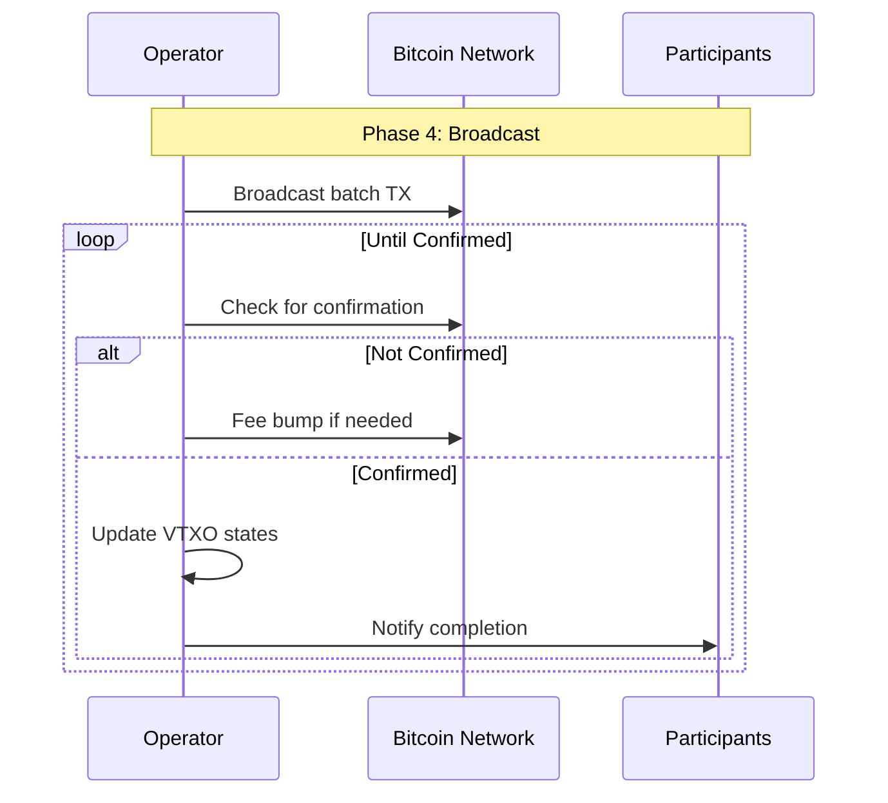
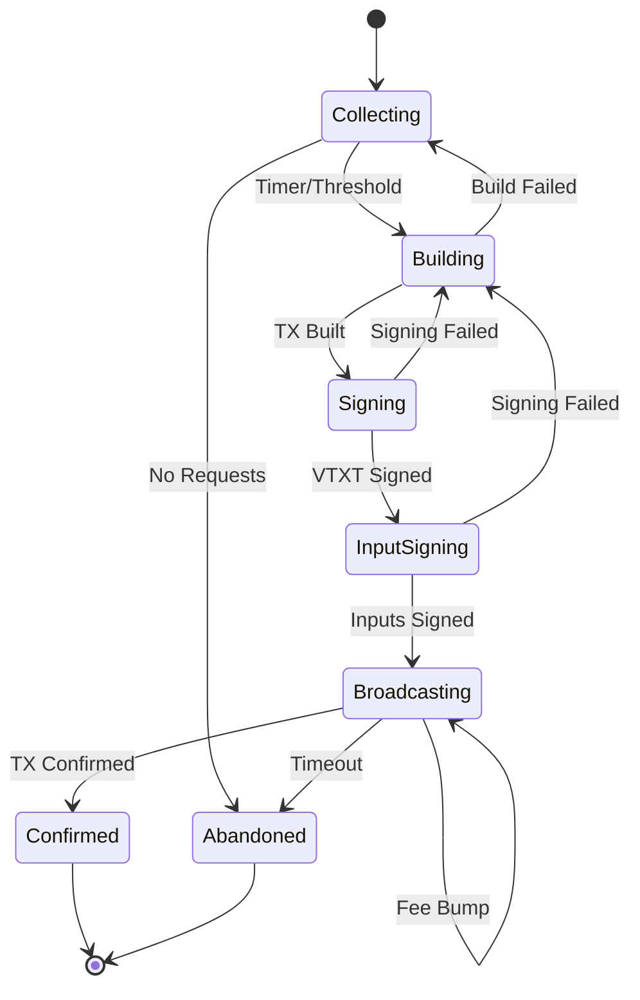
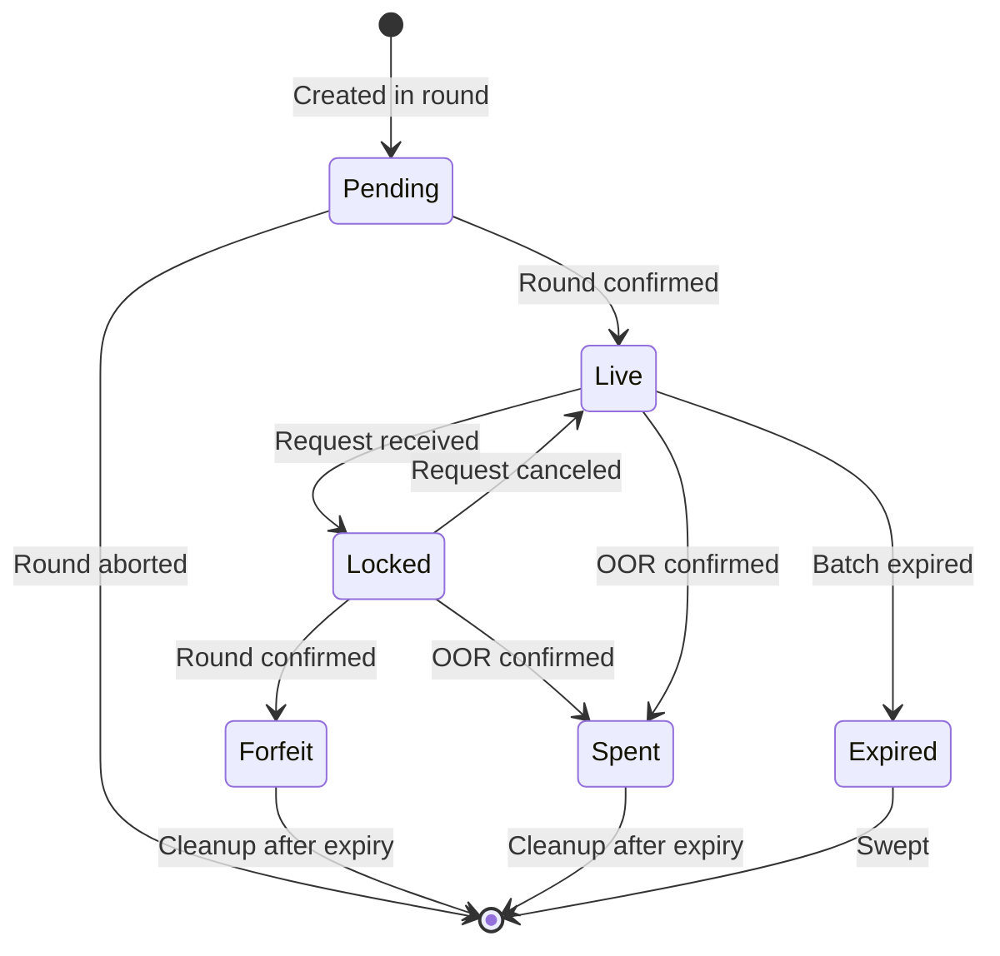

# ARK-02: Round Lifecycle Protocol

## Abstract

This document specifies the round lifecycle protocol for constructing, signing, and broadcasting Ark batch transactions. A round aggregates multiple participant requests (boarding, VTXO creation, leaving, batch swaps) into a single batch transaction with associated VTXT structures.

## Status

This specification is version 1 (v1). Legacy v0 paragraphs (boarding
admission fee, shared exclusion lock) have been retired in favor of the
seal-time fee handshake and server-authoritative locking protocols
defined below.

## Table of Contents

1. [Introduction](#introduction)
2. [Round Overview](#round-overview)
3. [Phase 0: Request Collection](#phase-0-request-collection)
4. [Phase 1: Construction](#phase-1-construction)
5. [Phase 2: VTXT Signing](#phase-2-vtxt-signing)
6. [Phase 3: Input Signing](#phase-3-input-signing)
7. [Phase 4: Broadcast](#phase-4-broadcast)
8. [Error Handling](#error-handling)
9. [State Transitions](#state-transitions)
10. [Restart Safety](#restart-safety)

## Introduction

The round lifecycle is the core protocol for creating new VTXOs. The operator coordinates multiple participants through a multi-phase process that ensures atomicity and allows participants to verify their outputs before committing.

### Round Frequency

Operators MUST run a periodic round tick at a configurable cadence so
that rounds advance regardless of client arrival pattern.

1. The operator MUST schedule a recurring `TickEvent` at
   `RoundTickInterval` (default: 1 minute) starting at round creation
   and continuing until the round reaches a terminal phase
   (Broadcast or Aborted).
2. On each tick fired against a Created-state round with **no admitted
   clients**, the operator MUST record a `skipped_empty` outcome and
   MUST NOT advance the FSM. Empty rounds remain Created until either
   a join admits the round or the round is closed by operator policy.
3. On each tick fired against a Created-state round with **one or
   more admitted clients**, the operator MUST evaluate whether the
   collection-period deadline has elapsed and, if so, advance to
   Construction.
4. The administrative `TriggerBatch` request MUST fail fast (return
   an error rather than a round identifier) when invoked against a
   Created-state round with zero admitted clients, since such a round
   cannot process the resulting `SealEvent` and the caller would
   otherwise wait indefinitely.

The cadence affects:
- User experience (latency to obtain new VTXOs)
- On-chain footprint (fewer rounds = fewer batch transactions)
- Operator liquidity requirements (longer rounds may accumulate more value)
- Liveness of administrative operations (`TriggerBatch`, manual seal)
  against an idle daemon

## Round Overview

A round proceeds through five phases:



**Note:** A round MAY skip the VTXTSigning phase if the batch has no VTXO outputs (e.g., only forfeit requests with leave outputs). In this case, Construction transitions directly to InputSigning.

| Phase | Purpose | Participants |
|-------|---------|--------------|
| Request Collection | Gather participant requests | All |
| Construction | Build batch TX and VTXT | Operator |
| VTXT Signing | Sign virtual transaction tree | All with VTXOs |
| Input Signing | Sign batch TX inputs | Boarding participants |
| Broadcast | Publish and confirm | Operator |

## Phase 0: Request Collection

### Overview

During request collection, the operator accepts requests from participants. Each request type results in specific inputs or outputs in the batch transaction.

### VTXT Signing Keys (Per VTXO)

Participants MUST provide a **signing key per requested VTXO**. These signing
keys are used exclusively for MuSig2 aggregation in VTXT branch nodes and are
separate from VTXO ownership keys.

**Requirements:**
1. Each VTXO request MUST include a signing key for VTXT signing.
2. Signing keys SHOULD be freshly derived and MUST be unique within the batch.
3. Signing keys MUST NOT be reused across different rounds.
4. Signing keys MUST be different from VTXO ownership keys.

**Rationale:** Separating signing keys from VTXO keys provides:
- **Privacy**: Prevents cross-round linkability of participant VTXOs.
- **Security isolation**: Signing key compromise doesn't affect fund ownership.
- **Operational flexibility**: Signing keys can be "hot" while VTXO keys remain
  "cold".

See ARK-01 Section "Key Separation: Signing Keys vs VTXO Keys" for detailed
rationale and usage guidelines.

### Request Types

Request types are **disjoint** - input requests (sources of funds) and output requests (destinations of funds) are specified independently. This allows flexible combinations like consolidation (multiple inputs → one output), splitting (one input → multiple outputs), and mixed operations.

#### Input Request Types

##### Boarding Request

A boarding request provides funds by spending an on-chain UTXO.

**Request Contents:**
- `boarding_outpoint`: The TXID and output index of the boarding UTXO
- `boarding_script`: The full script of the boarding output
- `proof_of_ownership`: Signature proving control of the boarding key
- `tx_proof` (conditional): A TxProof for SPV-style validation (see below)

**Operator Validation:**
1. The boarding UTXO MUST exist and be unspent.
2. The boarding UTXO MUST have sufficient confirmations (operator-defined minimum).
3. The boarding script MUST match the expected format (see ARK-01). The
   operator reconstructs the expected script from the client's key, the
   operator's own key, and the boarding timeout, then verifies it matches.
4. The operator key in the script MUST match the operator's current key.
5. The proof of ownership MUST be a valid BIP-340 Schnorr signature.
6. The boarding UTXO MUST NOT be too close to its timeout expiry.

**TxProof Validation (SPV Mode):**

When the operator does not have direct chain source access (e.g., operating
in SPV or light client mode), the boarding request MUST include a `tx_proof`
containing:

- `raw_tx`: The full serialized boarding transaction.
- `merkle_proof`: A merkle inclusion proof linking the transaction to a block
  header.
- `block_header`: The block header containing the transaction.

The operator validates the TxProof as follows:
1. Verify the merkle inclusion proof against the block header's merkle root.
2. Verify the block header is part of the best chain (using a header verifier).
3. Verify the claimed outpoint matches the TxProof's transaction.
4. If no chain source is available AND no TxProof is provided, the operator
   MUST reject the boarding request.

##### Forfeit Request

A forfeit request provides funds by forfeiting one or more existing VTXOs.

**Request Contents:**
- `vtxo_references`: List of VTXOs being forfeited
- `vtxo_proofs`: Proofs of ownership for each VTXO

**Operator Validation:**
1. All VTXO references MUST point to valid, unspent VTXOs.
2. No VTXO MUST be locked by another pending operation.
3. No VTXO MUST be too close to its batch's sweep delay expiry.
4. All proofs MUST demonstrate ownership.

#### Output Request Types

##### VTXO Request

A VTXO request creates new VTXOs in the batch.

**Request Contents:**
- `vtxo_specs`: List of VTXO specifications, each containing:
  - `owner_pubkey` (`P_v`): The VTXO ownership public key.
  - `value`: The VTXO amount in satoshis.
  - `signing_pubkey` (`P_s`): Per-VTXO ephemeral signing key for VTXT MuSig2.
  - `pk_script`: The full P2TR pkScript for the VTXO output.

Each VTXO MUST include its own signing key for VTXT branch signing.

**Note:** Each VTXO SHOULD have a unique owner pubkey to prevent linking VTXOs
to the same owner. Participants may send to themselves or to other recipients.

**pkScript Verification:** The operator MUST recompute the expected pkScript
from `(owner_pubkey, operator_key, exit_delay)` using the standard VTXO
tapscript construction (see ARK-01) and MUST reject the request if the
computed pkScript does not match the submitted `pk_script`. This prevents
clients from submitting VTXO outputs with non-standard or malicious scripts.

##### Leave Request

A leave request creates an on-chain output (exits the Ark).

**Request Contents:**
- `destination_script`: The script to pay the leave output to
- `destination_amount`: The amount for the leave output

###### Cooperative Leave (`LeaveVTXOs`)

A client MAY exit one or more VTXOs cooperatively in the next round
via the `LeaveVTXOs` RPC (see ARK-05 for the client surface and
ARK-06 for the wire format). The cooperative leave path is the
RECOMMENDED exit when the operator is online; it avoids the CSV
delays and on-chain fee burden of a unilateral exit.

The operator MUST:

1. Validate that every requested outpoint is a Live VTXO owned by
   the requester (owner proof per
   [Owner Proof for Lock Mutation](#owner-proof-for-lock-mutation)).
2. Acquire a `round:<round_id>` lock on each VTXO atomically; reject
   the entire request if any VTXO is already locked.
3. Accept per-outpoint `destination_script` overrides. A client MAY
   specify a single sweep destination shared across all outpoints,
   or a distinct destination per outpoint, at its discretion.
4. Include the resulting Leave Outputs in the next round the client
   is admitted to.
5. On round commit, signed forfeit transactions MUST be persisted
   for each forfeited VTXO before any output is released to the
   client (atomicity per ARK-00 Property 4).

The RPC SHOULD be idempotent on retry with identical contents: a
second call with the same outpoints and destinations MUST either
return the in-flight lock or succeed without double-admitting the
request.

#### Request Balancing

A participant's combined requests MUST balance:

```
sum(boarding_values) + sum(forfeit_values) ==
    sum(vtxo_values) + sum(leave_values) + sum(change_outputs) + operator_fee
```

The operator fee is **not** computed at submit time. It is computed at
seal time, communicated to each client via a binding quote, and stamped
onto a designated change output (see
[Seal-Time Fee Handshake](#seal-time-fee-handshake)). Submit-time
validation MUST verify only that the request is internally consistent
(input value sufficient to cover the requested outputs plus a designated
change output for the operator quote); it MUST NOT enforce a minimum
fee.

#### Seal-Time Fee Handshake

The operator MUST set the per-client operator fee at seal time, after
the round's input/output set is final, using a binding quote handshake.
The handshake replaces the legacy submit-time implicit-fee validation.

##### Quote Computation

For each client in the seal cohort the operator MUST compute a quote
that captures:

1. **Live chain fee rate**: the operator's current mempool target.
2. **Real batch size**: the actual vbyte cost of the batch transaction
   given the final round membership.
3. **Treasury utilization**: the operator's current liquidity exposure
   on outstanding VTXOs in this batch and across active batches.
4. **Per-input expiry**: how close each forfeit input is to its sweep
   expiry, since shorter remaining lifetime reduces operator carry
   cost.

The resulting quote is a per-client integer satoshi amount.

##### Quote Distribution

The operator MUST send a `JoinRoundQuote` message to each client in
the seal cohort containing at least:

- The quoted fee amount.
- The designated change output the client MUST attach (script + value)
  so the quote sums into the operator's claimable balance.
- A round-scoped quote identifier and validity window.

Quote distribution is a fan-out: all cohort members receive their
quote in the same seal pass.

##### Client Response

A client MUST respond with one of:

- `JoinRoundAccept` — the client agrees to the quote, attaches the
  designated change output to its requested output set, and signs the
  resulting balance.
- `JoinRoundReject` — the client refuses the quote.

A non-response within the per-round seal deadline MUST be treated as
`JoinRoundReject`.

##### Reseal Loop

If any cohort member rejects (explicitly or by timeout), the operator
MUST drop the rejecting members from the cohort and reseal over the
survivors with a fresh quote computation. The operator MUST NOT
attempt more than `MaxSealPasses` reseal iterations (operator-policy
constant); after the limit, the round MUST abort.

##### Designated Change Output

The change output that carries the operator quote MUST be designated
deterministically per the v1 contract so that:

1. Both client and operator agree on which output position holds the
   fee.
2. The operator can recover the quoted fee even when the client's
   request set already produces other change.
3. Designation is signature-binding: a client that signs over a
   request set with a designated change output cannot later argue the
   output was for some other purpose.

Forfeit-only requests (refresh/leave without boarding) MAY receive a
zero-fee quote at operator policy; they impose no on-chain UTXO cost
and are already protected by a stored forfeit transaction.

### VTXO Locking

When a request is accepted, the affected VTXOs MUST be locked:

- **Lock scope**: The VTXO cannot be used for OOR transactions or other round requests.
- **Lock duration**: Until the round completes (success or failure).
- **Lock storage**: MAY be in-memory during early phases; MUST be persisted after signing begins.

#### Server-Authoritative Locking

VTXO locks are **server-authoritative** across rounds and OOR sessions.
Mailbox / mTLS authentication identifies the calling client at the
transport boundary, but the VTXO lock boundary remains independently
authoritative: the operator MUST require cryptographic owner proof
before mutating lock state on a VTXO, and MUST require matching lock
ownership before releasing a lock.

The shared lock space MUST satisfy:

1. A VTXO locked by a round MUST be rejected by any concurrent OOR
   submit request, and vice versa.
2. A VTXO locked by one OOR session MUST be rejected by another OOR
   session.
3. Lock acquisition is atomic: if any VTXO in a multi-input request is
   already locked, the entire request MUST be rejected.
4. Rejected requests due to locking MUST fail immediately with error
   code `VTXO_LOCKED` (3001). Clients MAY retry after the lock is
   released.
5. Each lock MUST be identified by an owner of the form
   `round:<round_id>` or `oor:<session_id>` so a release can be
   matched against the originating session.

#### Owner Proof for Lock Mutation

Any client request that asks the operator to acquire, transfer, or
release a VTXO lock MUST carry a fresh owner proof:

1. **Acquire** (round join, OOR submit): the request MUST include a
   BIP-322 signature over the canonical request payload (see
   [Join Authorization](#join-authorization) for the round-side
   signature; ARK-03 specifies the OOR-side signature).
2. **Release** (OOR cancel, round abort acknowledgement): the
   request MUST present the same lock-owner identifier the original
   acquisition produced. The operator MUST verify the lock owner
   matches before releasing.
3. **Transfer** (e.g. round abort returning VTXOs to live, OOR
   completion releasing reservation): the operator MUST drive the
   transfer itself; clients MUST NOT rely on a release-then-acquire
   race window.

Authentication at the transport layer is **necessary but not
sufficient**: even an authenticated caller MUST present owner proof
to mutate a lock they did not previously acquire.

### Request Pre-Validation

Operators MUST validate requests before accepting them into a round:

1. **Signature validity**: All required signatures are valid.
2. **VTXO existence**: Referenced VTXOs exist and are not already spent/forfeited.
3. **Expiry validity**: VTXOs are not too close to sweep expiry.
4. **Value validity**: Amounts are positive and within bounds.
5. **Script validity**: Output scripts are valid Ark scripts.

Invalid requests MUST be rejected immediately with appropriate error codes.
Requests that pass validation but cannot be included (e.g., due to capacity)
SHOULD be queued for the next round.

**Important:** Invalid requests do not abort rounds. They are rejected at submission
time before being included in round construction.

### Join Authorization

Each join request MUST include a BIP-322 authorization proof binding the
participant to their specific request. This prevents DoS attacks where a
malicious client submits join requests for VTXOs they do not own.

#### Authorization Payload

The authorization is a BIP-322 signed message constructed from a canonical
TLV-encoded representation of the join request. The message includes:

1. **Request contents**: Ordered list of boarding outpoints, VTXO request
   details, forfeit VTXO references, and leave request details.
2. **Participant identifier**: A fresh public key derived for this request,
   binding the proof to the requesting client.
3. **Validity window**: `valid_from` and `valid_until` block heights bounding
   the authorization's lifetime (RECOMMENDED: 144 blocks / ~24 hours).

#### Proof-of-Funds Inputs

The BIP-322 proof MUST demonstrate control of at least one input:

- For **boarding requests**: The proof includes a script-path witness for the
  boarding UTXO's timeout leaf, demonstrating the client controls the boarding
  key.
- For **forfeit requests**: The proof includes a script-path witness for the
  forfeited VTXO's timeout leaf, demonstrating the client controls the VTXO
  ownership key.

Input ordering in the proof MUST be deterministic (derived canonically from
the request contents).

#### Operator Validation

The operator MUST verify:

1. The authorization message is correctly bound to the submitted request.
2. At least one proof-of-funds input is valid.
3. The current block height falls within `[valid_from, valid_until]`.
4. The participant identifier is a valid public key.

Invalid authorization MUST be rejected with an appropriate error code.

### Request Aggregation

The operator aggregates valid requests based on operational constraints:

- Maximum participants per round
- Maximum VTXT tree depth
- Maximum transaction size
- Liquidity availability

Requests that cannot be included in the current round MUST be rejected with appropriate
error codes, or queued for the next round if the operator supports request queuing.

### Request Window

The request collection phase ends when:

- The configured collection period expires, OR
- The operator decides to proceed with current requests

The operator MUST NOT accept new requests after the collection phase ends.

### Concurrent Rounds

When requests arrive after the collection phase has ended, the operator MAY:

1. **Reject**: Return an error indicating the request should be resubmitted next round.
2. **Queue**: Accept and queue the request for the next scheduled round.
3. **Spawn concurrent round**: Trigger a new concurrent round to process late requests.

Operators supporting concurrent rounds MUST ensure proper isolation:
- Each concurrent round has independent state (construction, signing, broadcast).
- VTXOs locked for one round MUST NOT be used in concurrent rounds.
- Connector trees from different concurrent rounds are independent.

## Phase 1: Construction

### Overview

The operator constructs the unsigned batch transaction and VTXT structures based on collected requests.

### Step 1: VTXO Grouping

Group all VTXO requests (from boarding and batch swap) into trees:

1. Assign each VTXO request to a batch.
2. For each batch, organize VTXOs into a balanced tree structure.
3. The tree radix SHOULD be configurable (default: 2).

**Algorithm:**
```
function GroupVTXOs(vtxos, radix):
    // Sort VTXOs for determinism (LPT):
    // - descending by amount
    // - tie-breaker by pkScript bytes (lexicographic)
    sorted_vtxos = SortByAmountDescThenPkScript(vtxos)

    // Build balanced tree bottom-up
    current_level = sorted_vtxos
    while len(current_level) > 1:
        next_level = []
        for i = 0; i < len(current_level); i += radix:
            group = current_level[i:i+radix]
            next_level.append(CreateBranch(group))
        current_level = next_level

    return current_level[0]  // Root
```

### Multiple Batch Outputs

A single batch transaction MAY contain multiple batch outputs, each paying to a separate VTXT root. This section specifies when and how to use multiple batches.

#### Single Sweep Delay per Batch (Recommended)

All VTXOs within a single batch SHOULD share the same sweep delay (`T_e`).
This simplifies sweeper logic and reduces implementation complexity. The
operator defines the sweep delay for each batch based on operational policy.

**Rationale:** Different sweep delays per VTXO within a batch would require
tracking multiple sweep deadlines and complicate the sweeper implementation
significantly.

#### Scenarios for Multiple Batches

1. **Liquidity Partitioning**: Separate high-value VTXOs from low-value ones to reduce tree depth for high-value participants, minimizing their unilateral exit costs.

3. **Participant Grouping**: Group participants by trust level or operational requirements (e.g., known vs anonymous participants, different fee tiers).

4. **Tree Depth Management**: Split large participant sets to maintain reasonable VTXT depth (e.g., max depth of 10 levels). With radix 2 and 1000 participants, depth would be ~10 levels; splitting into 4 batches reduces to ~8 levels each.

#### Trade-offs

| Factor | Single Batch | Multiple Batches |
|--------|--------------|------------------|
| Simplicity | Simpler implementation | More complex grouping logic |
| On-chain size | One batch output | Multiple outputs (larger tx) |
| Signing complexity | One aggregated key | Multiple aggregated keys |
| Monitoring | One tree to track | Multiple trees to track |

#### Input/Output Matching Across Batches

When multiple batches exist in a single batch transaction:

1. Boarding inputs MAY fund VTXOs in any batch within the same batch transaction. A single boarding input can even fund VTXOs across multiple batches if the values sum correctly.

2. Forfeit transactions MAY spend connector outputs regardless of which batch the new VTXO is in. The connector tree is shared across all batches.

3. Leave outputs are independent of batch structure—they are direct outputs of the batch transaction.

4. The batch transaction fee is shared across all batches proportionally to their total value.

#### Operator Policy

Operators SHOULD document their batching policy in the `GetInfo` response, including:
- Maximum VTXT depth allowed
- Maximum participants per batch
- Whether multiple sweep delays are supported
- Grouping criteria used (if any)
- Any premium fees for specific batch types
- Connector policy (max connectors per tree, connector dust amount, connector
  address)

### Step 2: VTXT Construction

For each batch, construct the VTXT as a fan-out tree:

1. **Root Level**: Create the root transaction that spends the batch output.
2. **Branch Levels**: Each node spends its parent output and creates outputs
   for its children (radix fan-out).
3. **Leaf Level**: Leaf node transactions create the VTXO outputs.

**For each VTXT node:**
1. Compute the aggregated public key (all downstream signing keys + operator).
2. Compute the script tree (operator sweep path).
3. Derive the taproot output key.
4. Create a transaction with a single input (parent output) and multiple child
   outputs plus a trailing anchor output.

**Note:** TXIDs can only be computed once all output scripts are known. Output scripts depend on the public keys of downstream participants, which must be collected first. Since all transactions use SegWit, the TXID is independent of witness data and can be computed before signing.

### Step 3: Connector Tree Construction

If any forfeits (leave or batch swap) are included:

1. Count the number of forfeit transactions needed.
2. Build connector tree(s) with that many total leaves.
3. The connector tree radix MAY differ from the VTXT radix.

**Connector tree structure:**
- Root: Output(s) in batch transaction
- Branches: Intermediate transactions (if needed)
- Leaves: Individual connector outputs for forfeit transactions

**Multiple trees:** A batch MAY have multiple connector trees if the number of forfeits
would result in trees exceeding the desired depth. Similarly, the radix can be increased
to reduce tree depth. The tradeoff is between tree depth (affecting unroll cost) and
individual transaction sizes.

### Step 4: Batch Transaction Assembly

Assemble the batch transaction template:

**Inputs:**
1. Boarding inputs (from boarding requests)
2. Operator wallet inputs (for liquidity)
3. Expired batch sweep inputs (if any)

**Outputs:**
1. Batch outputs (one or more per VTXT root - multiple trees MAY be used for large batches)
2. Connector outputs (one or more if forfeits exist)
3. Leave outputs (one per leave request)
4. Change output (if needed)

### Step 5: TXID Propagation

Once the batch transaction template is complete:

1. Compute the batch transaction TXID.
2. Update VTXT root transactions to reference this TXID.
3. Traverse the VTXT top-down, updating each transaction's inputs.
4. Update connector tree transactions similarly.

After this step, all transactions have valid input references (but no signatures).

### Step 6: Distribution to Participants

Send each participant their relevant transaction data:

**For boarding participants:**
- Full batch transaction
- VTXT path from root to their VTXO(s)
- Connector tree path (if doing batch swap in same request)

**For leave request participants:**
- Full batch transaction
- Connector leaf assignment for each forfeited VTXO
- Forfeit transaction template per forfeited VTXO

**For batch swap participants:**
- Full batch transaction
- VTXT path to their new VTXO(s)
- Connector leaf assignment for each forfeited VTXO
- Forfeit transaction template(s) (one per forfeited VTXO)

### Mermaid Diagram: Construction Flow



## Phase 2: VTXT Signing

### Overview

Participants and operator collaboratively sign the VTXT transactions using MuSig2. This phase ensures all participants have valid, signed paths to their VTXOs before committing inputs.

### MuSig2 Signing Protocol

For each VTXT transaction, signing proceeds as follows:

1. **Nonce Generation**: Each signer generates fresh nonces.
2. **Nonce Exchange**: Signers exchange public nonces.
3. **Nonce Aggregation**: Aggregate all public nonces.
4. **Partial Signing**: Each signer produces a partial signature.
5. **Signature Aggregation**: Combine partial signatures into final signature.

### Step 1: Client Nonce Submission

Each participant generates and submits nonces for their VTXT path using the
per‑VTXO signing keys they provided during request collection:

**For each transaction in participant's VTXT path:**
1. Generate fresh random nonce pair (R1, R2) per BIP-327.
2. Compute public nonce (pubnonce).
3. Submit pubnonce to operator.

**Requirements:**
- Nonces MUST be generated with fresh randomness.
- Nonces MUST NOT be reused across signing sessions.
- Participants MUST store secret nonces securely until signing completes.

### Step 2: Operator Nonce Aggregation

The operator collects all nonces and aggregates:

**For each VTXT transaction:**
1. Collect pubnonces from all required signers.
2. Include operator's own pubnonce.
3. Compute aggregate pubnonce per BIP-327.
4. Distribute aggregate pubnonces to participants.

### Step 3: Partial Signature Generation

Each participant produces partial signatures:

**For each transaction in participant's VTXT path:**
1. Receive aggregate pubnonce from operator.
2. Verify aggregate pubnonce is correctly formed.
3. Compute partial signature using secret nonce and signing key.
4. Submit partial signature to operator.

### Step 4: Signature Aggregation and Distribution

The operator aggregates and distributes final signatures:

**For each VTXT transaction:**
1. Collect partial signatures from all required signers.
2. Add operator's partial signature.
3. Aggregate into final Schnorr signature per BIP-327.
4. Verify the final signature is valid.
5. Distribute final signatures to relevant participants.

### Step 5: Client Verification

Each participant verifies their complete VTXT path:

1. Verify each transaction in the path has a valid signature.
2. Verify the transaction chain from batch TX to VTXO is complete.
3. Verify the VTXO output matches requested parameters.

**If verification fails:**
- Participant MUST NOT proceed to input signing.
- Participant SHOULD report the failure to operator.
- Participant MAY retry in a future round.

### Mermaid Diagram: VTXT Signing Flow



## Phase 3: Input Signing

### Overview

After VTXT signing, participants sign their inputs to the batch transaction. This phase commits participants to the round.

### Boarding Input Signing

Participants with boarding requests sign the batch transaction inputs:

1. Verify the complete VTXT path is signed (from Phase 2).
2. Verify the batch transaction includes expected outputs.
3. Generate a Schnorr signature for the boarding input's collaborative
   script‑path leaf.
4. Submit signature to operator.

**The participant MUST verify before signing:**
- All requested VTXOs are present with correct values.
- The VTXO scripts match expected format.
- The VTXT path is complete and valid.

### Forfeit Transaction Signing

Participants with leave or batch swap requests sign forfeit transactions:

1. Verify the batch transaction includes expected outputs.
   - For leave: verify leave output with correct script and value.
   - For batch swap: verify new VTXOs (via VTXT path from Phase 2).
2. Verify the connector path is valid.
3. Construct the unsigned forfeit transaction.
4. Generate a Schnorr signature for the VTXO input of the forfeit (collab
   script‑path leaf).
5. Submit the unsigned forfeit transaction plus the client VTXO signature to
   the operator.

**The forfeit transaction:**
- Spends the forfeited VTXO via collaborative script‑path.
- Spends a connector output from the new batch transaction.
- Pays the operator.

### Operator Signature Completion

The operator completes signatures:

1. Collect all boarding input signatures.
2. Collect all forfeit transaction templates and client VTXO signatures.
3. Sign operator's wallet inputs.
4. Sign VTXO inputs and connector inputs for each forfeit transaction.
5. Assemble the fully signed batch transaction.

### Mermaid Diagram: Input Signing Flow



## Phase 4: Broadcast

### Overview

The operator broadcasts the batch transaction and monitors for confirmation.

### Transaction Broadcast

1. Verify the batch transaction is fully signed.
2. Broadcast to the Bitcoin network.
3. Monitor for inclusion in a block.

### Confirmation Requirements

The operator SHOULD wait for a minimum confirmation depth before marking VTXOs as live:

- **Minimum confirmations**: Operator-defined (RECOMMENDED: 1-6 blocks)
- **Deep confirmations**: For high-value batches, consider more confirmations

### VTXO Activation

Once the batch transaction reaches minimum confirmations:

1. Mark all new VTXOs from this batch as "Live".
2. Remove locks on forfeited VTXOs (they are now spent).
3. Notify participants of successful round completion.

### Failure Handling

If the batch transaction fails to confirm within a timeout:

1. Attempt fee bumping via CPFP on anchor outputs.
2. Continue retrying until confirmed or explicitly abandoned.
3. If abandoned, release VTXO locks and notify participants.

### Mermaid Diagram: Broadcast Flow



## Error Handling

### Round Abort Conditions

A round MAY be aborted during:

| Phase | Abort Condition | Resolution |
|-------|-----------------|------------|
| Request Collection | No valid requests | Normal termination |
| Construction | Invalid requests detected | Exclude invalid, retry |
| VTXT Signing | Participant timeout | Exclude participant, retry |
| VTXT Signing | Invalid nonce/signature | Exclude participant, retry |
| Input Signing | Participant refuses to sign | Exclude participant, retry |
| Broadcast | Persistent confirmation failure | Fee bump or abandon |

### Participant Exclusion

When a participant fails to sign or is otherwise excluded, the round continues without them
rather than aborting:

1. Remove their requests from the round.
2. Release any VTXO locks for their VTXOs.
3. Rebuild the batch transaction without them.
4. Restart from Construction phase with remaining participants.
5. Notify the excluded participant they must rejoin a future round.

**Rationale:** This approach prevents a single malicious or unresponsive participant from
blocking the entire round. The cost is that remaining participants must wait for the round
to be reconstructed, but this is preferable to complete round failure.

### Retry Limits

Operators SHOULD implement retry limits:

- Maximum retries per round
- Maximum participants to exclude before abandoning
- Timeout for entire round

## State Transitions

### Round States



### VTXO State Transitions



## Restart Safety

### Critical Persistence Points

The operator MUST persist state at these points:

1. **After operator has signed**: Once the operator contributes their signature to the batch
   transaction, the round state MUST be persisted. Prior to operator signing, persistence
   is OPTIONAL (allows for simpler implementation and reduces storage requirements).
2. **After batch transaction is fully signed**: The complete signed transaction.
3. **After broadcast**: Transaction broadcast status.

**Rationale:** Before the operator signs, a crash simply means the round is lost and
participants must rejoin a new round. After the operator signs, the batch transaction
could potentially be broadcast by any party holding a copy, so the operator must track
it to avoid conflicting double-spends.

### Recovery Procedures

#### Restart During Request Collection

- Resume collecting requests.
- Requests are idempotent; participants may resubmit.

#### Restart During Construction

- Restart construction from collected requests.
- Previously computed structures may be discarded.

#### Restart During Signing

- If nonces were distributed, MUST NOT restart signing with same nonces.
- Either complete signing with stored state or abort round.

#### Restart After Signing Complete

- The signed transaction MUST be broadcast.
- Continue monitoring for confirmation.
- Never abandon a fully signed transaction without explicit double-spend.

### Double-Spend Protection

If a fully signed batch transaction exists:

1. The operator MUST assume it may have been broadcast.
2. The operator MUST continue trying to confirm it.
3. The operator MUST NOT sign conflicting transactions.
4. Only after explicitly double-spending an input may the operator abandon.

## References

1. BIP 327: MuSig2 for BIP340-compatible Multi-Signatures - https://github.com/bitcoin/bips/blob/master/bip-0327.mediawiki

## Authors

This specification was authored by the Lightning Labs team.

## Copyright

This document is licensed under CC0.
