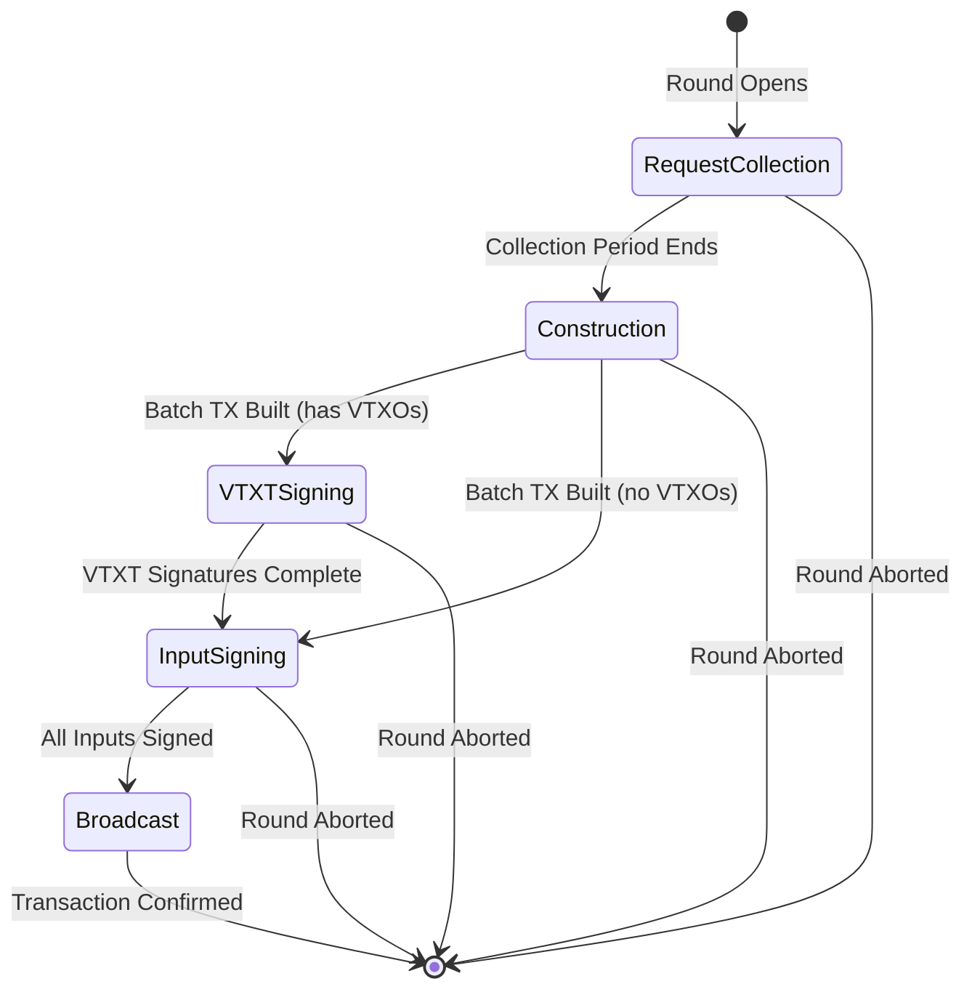
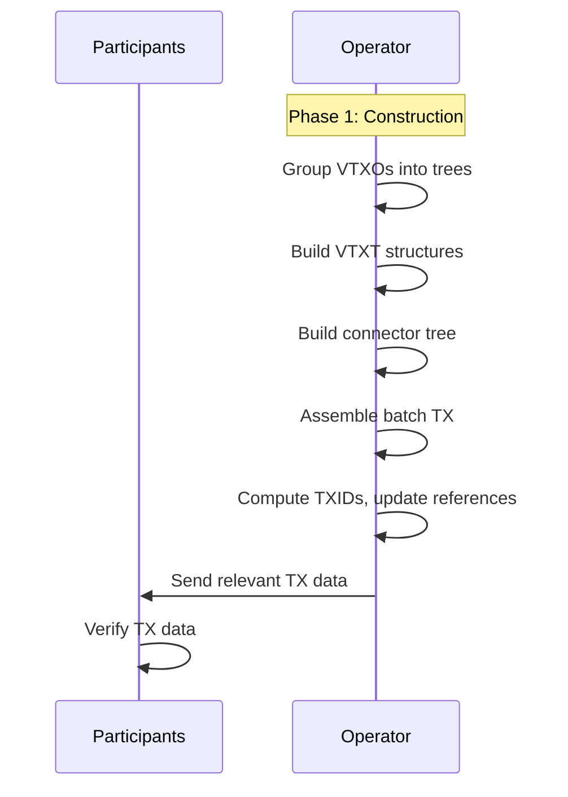
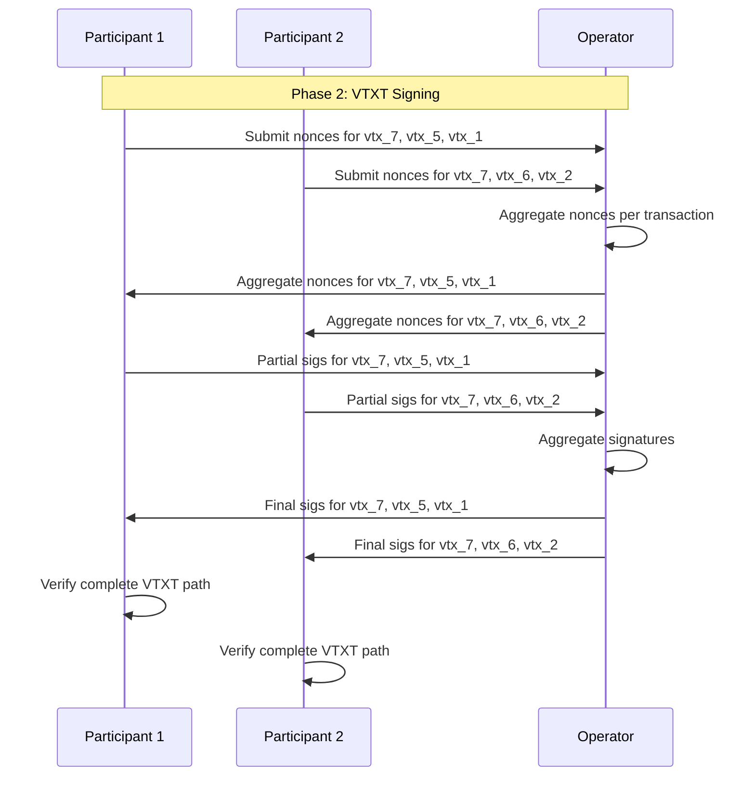
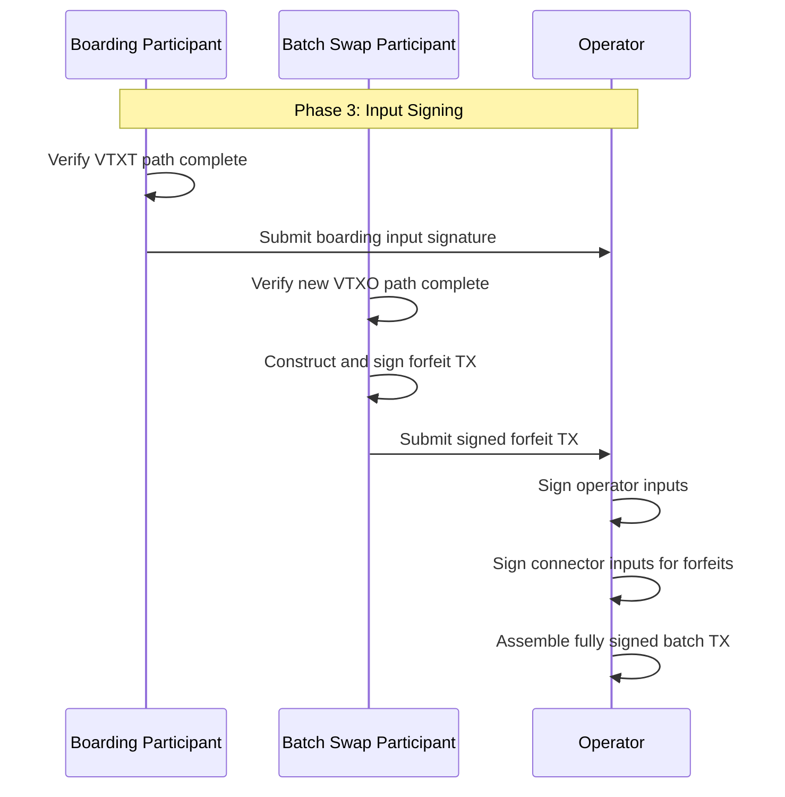
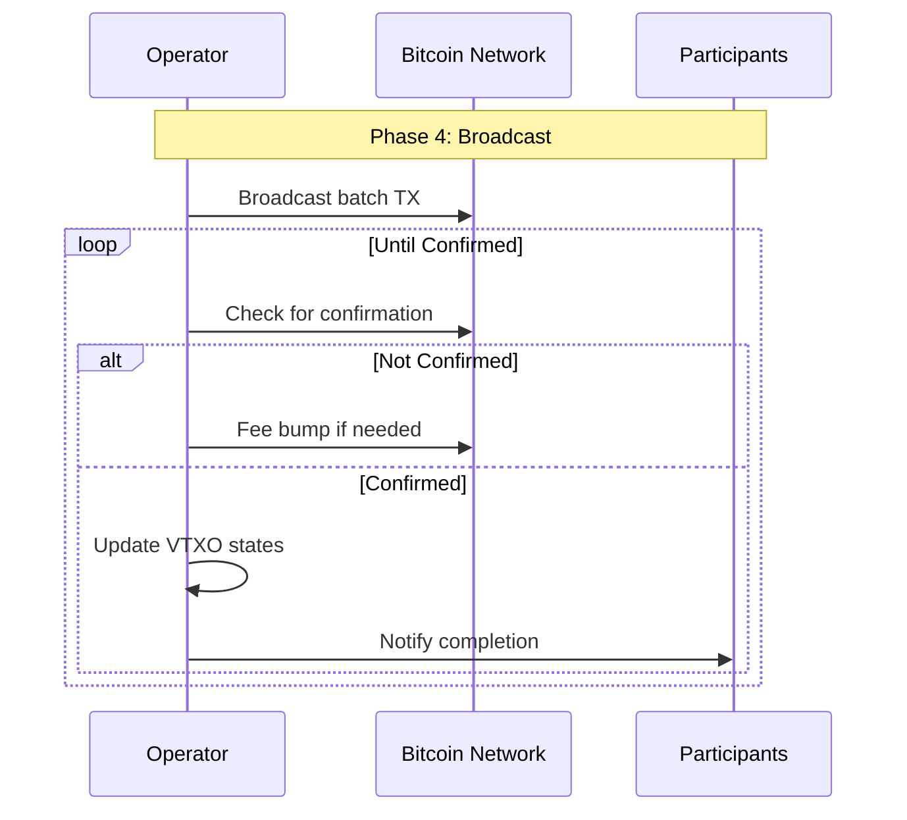
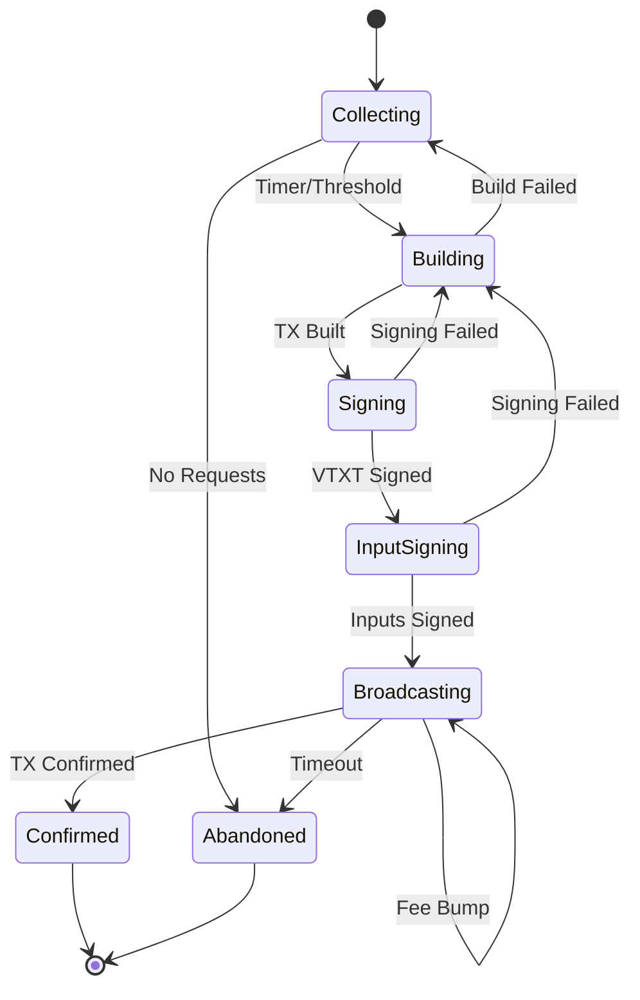
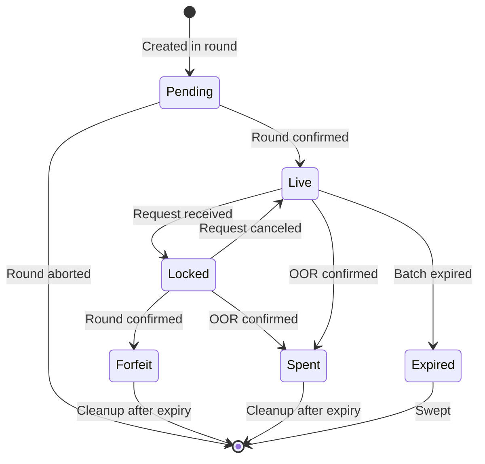

# ARK-02: Round Lifecycle Protocol

## Abstract

This document specifies the round lifecycle protocol for constructing, signing, and broadcasting Ark batch transactions. A round aggregates multiple participant requests (boarding, VTXO creation, leaving, batch swaps) into a single batch transaction with associated VTXT structures.

## Status

This specification is a working draft.

## Table of Contents

1. [Introduction](#introduction)
2. [Round Overview](#round-overview)
3. [Phase 0: Request Collection](#phase-0-request-collection)
4. [Phase 1: Construction](#phase-1-construction)
5. [Phase 2: VTXT Signing](#phase-2-vtxt-signing)
6. [Phase 3: Input Signing](#phase-3-input-signing)
7. [Phase 4: Broadcast](#phase-4-broadcast)
8. [Error Handling](#error-handling)
9. [State Transitions](#state-transitions)
10. [Restart Safety](#restart-safety)

## Introduction

The round lifecycle is the core protocol for creating new VTXOs. The operator coordinates multiple participants through a multi-phase process that ensures atomicity and allows participants to verify their outputs before committing.

### Round Frequency

Operators MAY configure round frequency based on their operational requirements. Common approaches include:

- **Time-based**: Start a new round every N minutes.
- **Request-based**: Start a new round when sufficient requests accumulate.
- **Hybrid**: Start when either condition is met.

The round frequency affects:
- User experience (latency to obtain new VTXOs)
- On-chain footprint (fewer rounds = fewer batch transactions)
- Operator liquidity requirements (longer rounds may accumulate more value)

## Round Overview

A round proceeds through five phases:



**Note:** A round MAY skip the VTXTSigning phase if the batch has no VTXO outputs (e.g., only forfeit requests with leave outputs). In this case, Construction transitions directly to InputSigning.

| Phase | Purpose | Participants |
|-------|---------|--------------|
| Request Collection | Gather participant requests | All |
| Construction | Build batch TX and VTXT | Operator |
| VTXT Signing | Sign virtual transaction tree | All with VTXOs |
| Input Signing | Sign batch TX inputs | Boarding participants |
| Broadcast | Publish and confirm | Operator |

## Phase 0: Request Collection

### Overview

During request collection, the operator accepts requests from participants. Each request type results in specific inputs or outputs in the batch transaction.

### Session Key Submission

As part of registration, participants MUST provide a **session key** (`session_pubkey`) that is separate from their VTXO ownership keys. This separation is a critical security and privacy feature.

**Requirements:**
1. Session keys are used exclusively for MuSig2 aggregation in VTXT branch nodes.
2. Session keys SHOULD be freshly derived for each round.
3. Session keys MUST NOT be reused across different rounds.
4. Session keys MUST be different from VTXO ownership keys.

**Rationale:** Separating session keys from VTXO keys provides:
- **Privacy**: Prevents cross-round linkability of participant VTXOs
- **Security isolation**: Session key compromise doesn't affect fund ownership
- **Operational flexibility**: Session keys can be "hot" while VTXO keys remain "cold"

See ARK-01 Section "Key Separation: Session Keys vs VTXO Keys" for detailed rationale and usage guidelines.

### Request Types

Request types are **disjoint** - input requests (sources of funds) and output requests (destinations of funds) are specified independently. This allows flexible combinations like consolidation (multiple inputs → one output), splitting (one input → multiple outputs), and mixed operations.

#### Input Request Types

##### Boarding Request

A boarding request provides funds by spending an on-chain UTXO.

**Request Contents:**
- `boarding_outpoint`: The TXID and output index of the boarding UTXO
- `boarding_script`: The full script of the boarding output
- `proof_of_ownership`: Signature proving control of the boarding key

**Operator Validation:**
1. The boarding UTXO MUST exist and be unspent.
2. The boarding UTXO MUST have sufficient confirmations (operator-defined minimum).
3. The boarding script MUST match the expected format (see ARK-01).
4. The operator key in the script MUST match the operator's current key.
5. The proof of ownership MUST be a valid signature.
6. The boarding UTXO MUST NOT be too close to its timeout expiry.

##### Forfeit Request

A forfeit request provides funds by forfeiting one or more existing VTXOs.

**Request Contents:**
- `vtxo_references`: List of VTXOs being forfeited
- `vtxo_proofs`: Proofs of ownership for each VTXO

**Operator Validation:**
1. All VTXO references MUST point to valid, unspent VTXOs.
2. No VTXO MUST be locked by another pending operation.
3. No VTXO MUST be too close to batch expiry (sweep expiry).
4. All proofs MUST demonstrate ownership.

#### Output Request Types

##### VTXO Request

A VTXO request creates new VTXOs in the batch.

**Request Contents:**
- `vtxo_specs`: List of VTXO specifications (owner pubkey, value) - one signing key per VTXO for unlinkability
- `session_pubkey`: Ephemeral key for VTXT signing sessions

**Note:** Each VTXO SHOULD have a unique owner pubkey to prevent linking VTXOs to the same owner. Participants may send to themselves or to other recipients.

##### Leave Request

A leave request creates an on-chain output (exits the Ark).

**Request Contents:**
- `destination_script`: The script to pay the leave output to
- `destination_amount`: The amount for the leave output

#### Request Balancing

A participant's combined requests MUST balance:

```
sum(boarding_values) + sum(forfeit_values) >= sum(vtxo_values) + sum(leave_values) + fees
```

The operator validates this balance when processing a participant's complete request set. Excess value (if any) goes to the operator as fees.

### VTXO Locking

When a request is accepted, the affected VTXOs MUST be locked:

- **Lock scope**: The VTXO cannot be used for OOR transactions or other round requests.
- **Lock duration**: Until the round completes (success or failure).
- **Lock storage**: MAY be in-memory during early phases; MUST be persisted after signing begins.

### Request Pre-Validation

Operators MUST validate requests before accepting them into a round:

1. **Signature validity**: All required signatures are valid.
2. **VTXO existence**: Referenced VTXOs exist and are not already spent/forfeited.
3. **Expiry validity**: VTXOs are not too close to sweep expiry.
4. **Value validity**: Amounts are positive and within bounds.
5. **Script validity**: Output scripts are valid Ark scripts.

Invalid requests MUST be rejected immediately with appropriate error codes.
Requests that pass validation but cannot be included (e.g., due to capacity)
SHOULD be queued for the next round.

**Important:** Invalid requests do not abort rounds. They are rejected at submission
time before being included in round construction.

### Request Aggregation

The operator aggregates valid requests based on operational constraints:

- Maximum participants per round
- Maximum VTXT tree depth
- Maximum transaction size
- Liquidity availability

Requests that cannot be included in the current round MUST be rejected with appropriate
error codes, or queued for the next round if the operator supports request queuing.

### Request Window

The request collection phase ends when:

- The configured collection period expires, OR
- The operator decides to proceed with current requests

The operator MUST NOT accept new requests after the collection phase ends.

### Concurrent Rounds

When requests arrive after the collection phase has ended, the operator MAY:

1. **Reject**: Return an error indicating the request should be resubmitted next round.
2. **Queue**: Accept and queue the request for the next scheduled round.
3. **Spawn concurrent round**: Trigger a new concurrent round to process late requests.

Operators supporting concurrent rounds MUST ensure proper isolation:
- Each concurrent round has independent state (construction, signing, broadcast).
- VTXOs locked for one round MUST NOT be used in concurrent rounds.
- Connector trees from different concurrent rounds are independent.

## Phase 1: Construction

### Overview

The operator constructs the unsigned batch transaction and VTXT structures based on collected requests.

### Step 1: VTXO Grouping

Group all VTXO requests (from boarding and batch swap) into trees:

1. Assign each VTXO request to a batch.
2. For each batch, organize VTXOs into a balanced tree structure.
3. The tree radix SHOULD be configurable (default: 2).

**Algorithm:**
```
function GroupVTXOs(vtxos, radix):
    // Sort VTXOs (optional, for determinism)
    sorted_vtxos = Sort(vtxos)

    // Build balanced tree bottom-up
    current_level = sorted_vtxos
    while len(current_level) > 1:
        next_level = []
        for i = 0; i < len(current_level); i += radix:
            group = current_level[i:i+radix]
            next_level.append(CreateBranch(group))
        current_level = next_level

    return current_level[0]  // Root
```

### Multiple Batch Outputs

A single batch transaction MAY contain multiple batch outputs, each paying to a separate VTXT root. This section specifies when and how to use multiple batches.

#### Single Expiry per Batch (Recommended)

All VTXOs within a single batch SHOULD share the same expiry time. This simplifies sweeper logic and reduces implementation complexity. The operator defines the expiry time for each batch based on operational policy.

**Rationale:** Different expiries per VTXO within a batch would require tracking multiple sweep deadlines and complicate the sweeper implementation significantly.

#### Scenarios for Multiple Batches

1. **Liquidity Partitioning**: Separate high-value VTXOs from low-value ones to reduce tree depth for high-value participants, minimizing their unilateral exit costs.

3. **Participant Grouping**: Group participants by trust level or operational requirements (e.g., known vs anonymous participants, different fee tiers).

4. **Tree Depth Management**: Split large participant sets to maintain reasonable VTXT depth (e.g., max depth of 10 levels). With radix 2 and 1000 participants, depth would be ~10 levels; splitting into 4 batches reduces to ~8 levels each.

#### Trade-offs

| Factor | Single Batch | Multiple Batches |
|--------|--------------|------------------|
| Simplicity | Simpler implementation | More complex grouping logic |
| On-chain size | One batch output | Multiple outputs (larger tx) |
| Signing complexity | One aggregated key | Multiple aggregated keys |
| Monitoring | One tree to track | Multiple trees to track |

#### Input/Output Matching Across Batches

When multiple batches exist in a single batch transaction:

1. Boarding inputs MAY fund VTXOs in any batch within the same batch transaction. A single boarding input can even fund VTXOs across multiple batches if the values sum correctly.

2. Forfeit transactions MAY spend connector outputs regardless of which batch the new VTXO is in. The connector tree is shared across all batches.

3. Leave outputs are independent of batch structure—they are direct outputs of the batch transaction.

4. The batch transaction fee is shared across all batches proportionally to their total value.

#### Operator Policy

Operators SHOULD document their batching policy in the `GetInfo` response, including:
- Maximum VTXT depth allowed
- Maximum participants per batch
- Whether multiple expiries are supported
- Grouping criteria used (if any)
- Any premium fees for specific batch types

### Step 2: VTXT Construction

For each batch, construct the VTXT bottom-up:

1. **Leaf Level**: Create leaf transactions with VTXO outputs.
2. **Branch Levels**: Create branch transactions aggregating child outputs.
3. **Root Level**: The final output becomes the batch output.

**For each VTXT node:**
1. Compute the aggregated public key (all downstream owners + operator).
2. Compute the script tree (operator sweep path).
3. Derive the taproot output key.
4. Create the transaction spending from child outputs and producing the aggregated output.

**Note:** TXIDs can only be computed once all output scripts are known. Output scripts depend on the public keys of downstream participants, which must be collected first. Since all transactions use SegWit, the TXID is independent of witness data and can be computed before signing.

### Step 3: Connector Tree Construction

If any forfeits (leave or batch swap) are included:

1. Count the number of forfeit transactions needed.
2. Build connector tree(s) with that many total leaves.
3. The connector tree radix MAY differ from the VTXT radix.

**Connector tree structure:**
- Root: Output(s) in batch transaction
- Branches: Intermediate transactions (if needed)
- Leaves: Individual connector outputs for forfeit transactions

**Multiple trees:** A batch MAY have multiple connector trees if the number of forfeits
would result in trees exceeding the desired depth. Similarly, the radix can be increased
to reduce tree depth. The tradeoff is between tree depth (affecting unroll cost) and
individual transaction sizes.

### Step 4: Batch Transaction Assembly

Assemble the batch transaction template:

**Inputs:**
1. Boarding inputs (from boarding requests)
2. Operator wallet inputs (for liquidity)
3. Expired batch sweep inputs (if any)

**Outputs:**
1. Batch outputs (one or more per VTXT root - multiple trees MAY be used for large batches)
2. Connector outputs (one or more if forfeits exist)
3. Leave outputs (one per leave request)
4. Change output (if needed)

### Step 5: TXID Propagation

Once the batch transaction template is complete:

1. Compute the batch transaction TXID.
2. Update VTXT root transactions to reference this TXID.
3. Traverse the VTXT top-down, updating each transaction's inputs.
4. Update connector tree transactions similarly.

After this step, all transactions have valid input references (but no signatures).

### Step 6: Distribution to Participants

Send each participant their relevant transaction data:

**For boarding participants:**
- Full batch transaction
- VTXT path from root to their VTXO(s)
- Connector tree path (if doing batch swap in same request)

**For leave request participants:**
- Full batch transaction
- Connector tree path to their connector leaf
- Forfeit transaction template

**For batch swap participants:**
- Full batch transaction
- VTXT path to their new VTXO(s)
- Connector tree path to their connector leaf
- Forfeit transaction template(s)

### Mermaid Diagram: Construction Flow



## Phase 2: VTXT Signing

### Overview

Participants and operator collaboratively sign the VTXT transactions using MuSig2. This phase ensures all participants have valid, signed paths to their VTXOs before committing inputs.

### MuSig2 Signing Protocol

For each VTXT transaction, signing proceeds as follows:

1. **Nonce Generation**: Each signer generates fresh nonces.
2. **Nonce Exchange**: Signers exchange public nonces.
3. **Nonce Aggregation**: Aggregate all public nonces.
4. **Partial Signing**: Each signer produces a partial signature.
5. **Signature Aggregation**: Combine partial signatures into final signature.

### Step 1: Client Nonce Submission

Each participant generates and submits nonces for their VTXT path:

**For each transaction in participant's VTXT path:**
1. Generate fresh random nonce pair (R1, R2) per BIP-327.
2. Compute public nonce (pubnonce).
3. Submit pubnonce to operator.

**Requirements:**
- Nonces MUST be generated with fresh randomness.
- Nonces MUST NOT be reused across signing sessions.
- Participants MUST store secret nonces securely until signing completes.

### Step 2: Operator Nonce Aggregation

The operator collects all nonces and aggregates:

**For each VTXT transaction:**
1. Collect pubnonces from all required signers.
2. Include operator's own pubnonce.
3. Compute aggregate pubnonce per BIP-327.
4. Distribute aggregate pubnonces to participants.

### Step 3: Partial Signature Generation

Each participant produces partial signatures:

**For each transaction in participant's VTXT path:**
1. Receive aggregate pubnonce from operator.
2. Verify aggregate pubnonce is correctly formed.
3. Compute partial signature using secret nonce and signing key.
4. Submit partial signature to operator.

### Step 4: Signature Aggregation and Distribution

The operator aggregates and distributes final signatures:

**For each VTXT transaction:**
1. Collect partial signatures from all required signers.
2. Add operator's partial signature.
3. Aggregate into final Schnorr signature per BIP-327.
4. Verify the final signature is valid.
5. Distribute final signatures to relevant participants.

### Step 5: Client Verification

Each participant verifies their complete VTXT path:

1. Verify each transaction in the path has a valid signature.
2. Verify the transaction chain from batch TX to VTXO is complete.
3. Verify the VTXO output matches requested parameters.

**If verification fails:**
- Participant MUST NOT proceed to input signing.
- Participant SHOULD report the failure to operator.
- Participant MAY retry in a future round.

### Mermaid Diagram: VTXT Signing Flow



## Phase 3: Input Signing

### Overview

After VTXT signing, participants sign their inputs to the batch transaction. This phase commits participants to the round.

### Boarding Input Signing

Participants with boarding requests sign the batch transaction inputs:

1. Verify the complete VTXT path is signed (from Phase 2).
2. Verify the batch transaction includes expected outputs.
3. Generate MuSig2 signature for the boarding input.
4. Submit signature to operator.

**The participant MUST verify before signing:**
- All requested VTXOs are present with correct values.
- The VTXO scripts match expected format.
- The VTXT path is complete and valid.

### Forfeit Transaction Signing

Participants with leave or batch swap requests sign forfeit transactions:

1. Verify the batch transaction includes expected outputs.
   - For leave: verify leave output with correct script and value.
   - For batch swap: verify new VTXOs (via VTXT path from Phase 2).
2. Verify the connector path is valid.
3. Construct the forfeit transaction.
4. Generate MuSig2 signature for the VTXO input of the forfeit.
5. Submit the complete signed forfeit transaction to operator.

**The forfeit transaction:**
- Spends the forfeited VTXO via collaborative keypath.
- Spends a connector output from the new batch transaction.
- Pays the operator.

### Operator Signature Completion

The operator completes signatures:

1. Collect all boarding input signatures.
2. Collect all forfeit transactions.
3. Sign operator's wallet inputs.
4. Sign connector inputs for each forfeit transaction.
5. Assemble the fully signed batch transaction.

### Mermaid Diagram: Input Signing Flow



## Phase 4: Broadcast

### Overview

The operator broadcasts the batch transaction and monitors for confirmation.

### Transaction Broadcast

1. Verify the batch transaction is fully signed.
2. Broadcast to the Bitcoin network.
3. Monitor for inclusion in a block.

### Confirmation Requirements

The operator SHOULD wait for a minimum confirmation depth before marking VTXOs as live:

- **Minimum confirmations**: Operator-defined (RECOMMENDED: 1-6 blocks)
- **Deep confirmations**: For high-value batches, consider more confirmations

### VTXO Activation

Once the batch transaction reaches minimum confirmations:

1. Mark all new VTXOs from this batch as "Live".
2. Remove locks on forfeited VTXOs (they are now spent).
3. Notify participants of successful round completion.

### Failure Handling

If the batch transaction fails to confirm within a timeout:

1. Attempt fee bumping via CPFP on anchor outputs.
2. Continue retrying until confirmed or explicitly abandoned.
3. If abandoned, release VTXO locks and notify participants.

### Mermaid Diagram: Broadcast Flow



## Error Handling

### Round Abort Conditions

A round MAY be aborted during:

| Phase | Abort Condition | Resolution |
|-------|-----------------|------------|
| Request Collection | No valid requests | Normal termination |
| Construction | Invalid requests detected | Exclude invalid, retry |
| VTXT Signing | Participant timeout | Exclude participant, retry |
| VTXT Signing | Invalid nonce/signature | Exclude participant, retry |
| Input Signing | Participant refuses to sign | Exclude participant, retry |
| Broadcast | Persistent confirmation failure | Fee bump or abandon |

### Participant Exclusion

When a participant fails to sign or is otherwise excluded, the round continues without them
rather than aborting:

1. Remove their requests from the round.
2. Release any VTXO locks for their VTXOs.
3. Rebuild the batch transaction without them.
4. Restart from Construction phase with remaining participants.
5. Notify the excluded participant they must rejoin a future round.

**Rationale:** This approach prevents a single malicious or unresponsive participant from
blocking the entire round. The cost is that remaining participants must wait for the round
to be reconstructed, but this is preferable to complete round failure.

### Retry Limits

Operators SHOULD implement retry limits:

- Maximum retries per round
- Maximum participants to exclude before abandoning
- Timeout for entire round

## State Transitions

### Round States



### VTXO State Transitions



## Restart Safety

### Critical Persistence Points

The operator MUST persist state at these points:

1. **After operator has signed**: Once the operator contributes their signature to the batch
   transaction, the round state MUST be persisted. Prior to operator signing, persistence
   is OPTIONAL (allows for simpler implementation and reduces storage requirements).
2. **After batch transaction is fully signed**: The complete signed transaction.
3. **After broadcast**: Transaction broadcast status.

**Rationale:** Before the operator signs, a crash simply means the round is lost and
participants must rejoin a new round. After the operator signs, the batch transaction
could potentially be broadcast by any party holding a copy, so the operator must track
it to avoid conflicting double-spends.

### Recovery Procedures

#### Restart During Request Collection

- Resume collecting requests.
- Requests are idempotent; participants may resubmit.

#### Restart During Construction

- Restart construction from collected requests.
- Previously computed structures may be discarded.

#### Restart During Signing

- If nonces were distributed, MUST NOT restart signing with same nonces.
- Either complete signing with stored state or abort round.

#### Restart After Signing Complete

- The signed transaction MUST be broadcast.
- Continue monitoring for confirmation.
- Never abandon a fully signed transaction without explicit double-spend.

### Double-Spend Protection

If a fully signed batch transaction exists:

1. The operator MUST assume it may have been broadcast.
2. The operator MUST continue trying to confirm it.
3. The operator MUST NOT sign conflicting transactions.
4. Only after explicitly double-spending an input may the operator abandon.

## References

1. BIP 327: MuSig2 for BIP340-compatible Multi-Signatures - https://github.com/bitcoin/bips/blob/master/bip-0327.mediawiki

## Authors

This specification was authored by the Lightning Labs team.

## Copyright

This document is licensed under CC0.
