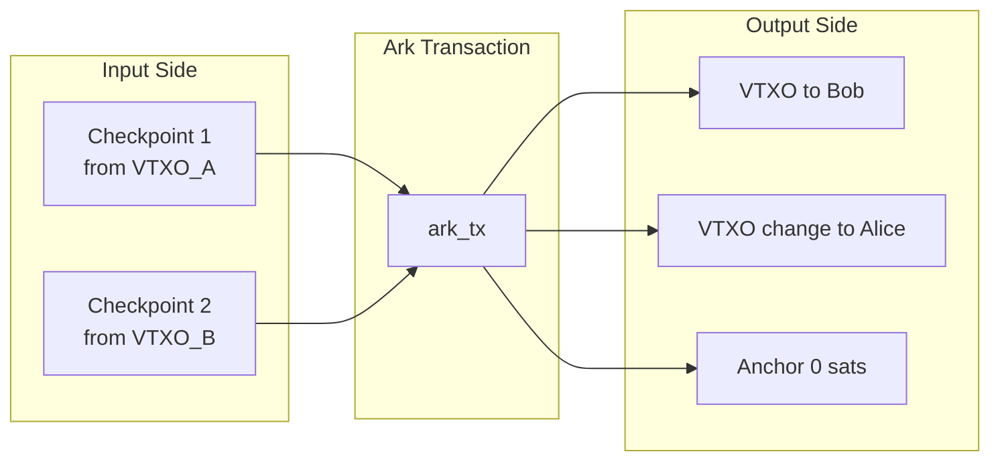
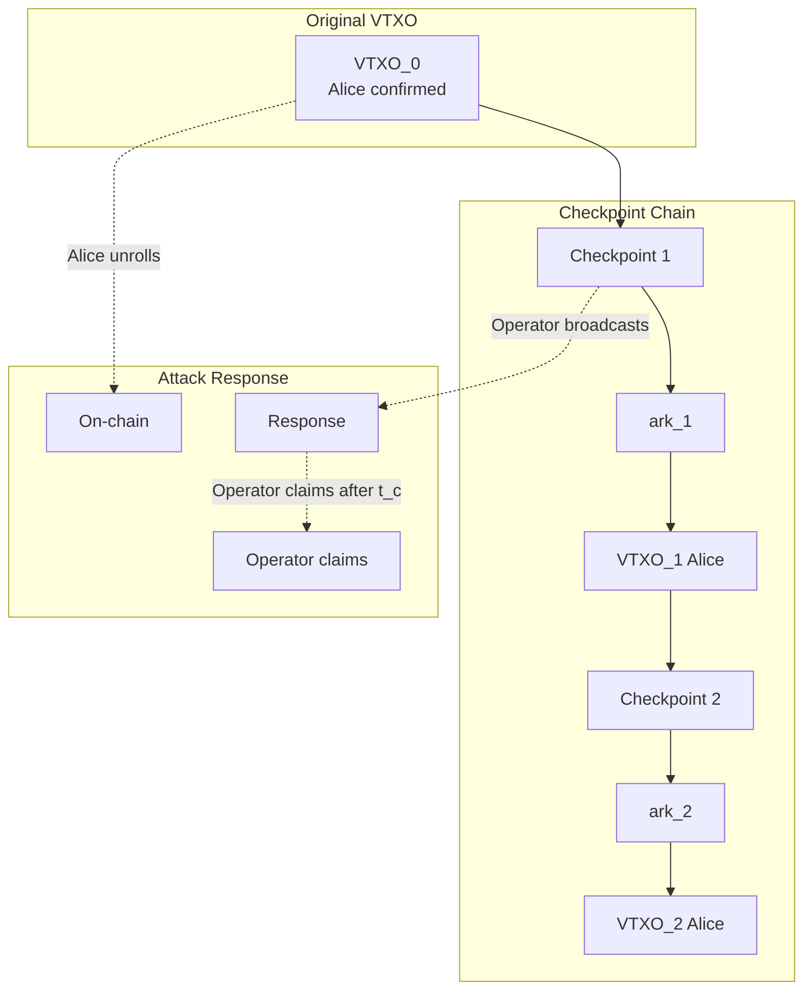
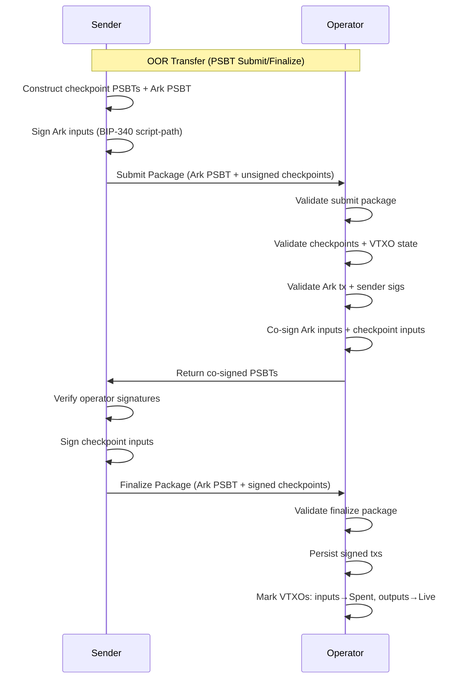
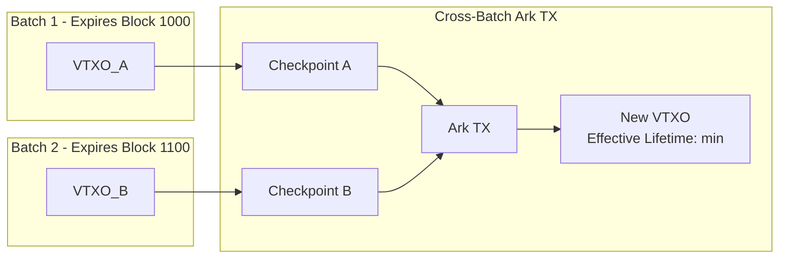
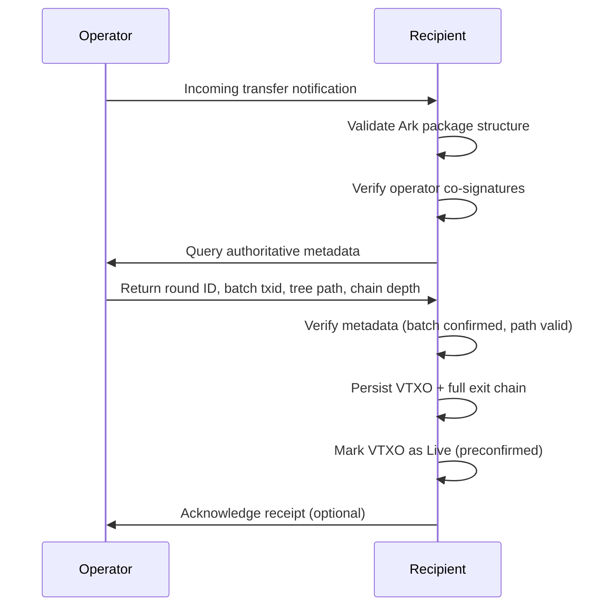

# ARK-03: Out-of-Round Transactions

## Abstract

This document specifies the Out-of-Round (OOR) transaction protocol, also known as Ark Transactions. OOR transactions allow participants to transfer VTXOs without waiting for a new round. The document also specifies the checkpoint transaction mechanism that provides anti-griefing protection for OOR transactions.

## Status

This specification is version 1 (v1). The OOR PSBT flow, lineage cap,
typed submit rejections, multi-input cross-round consolidation, and
optional change outputs are normative and align with the current
implementation. Legacy v0 paragraphs have been retired.

## Table of Contents

1. [Introduction](#introduction)
2. [Ark Transaction Format](#ark-transaction-format)
3. [Checkpoint Transaction Mechanism](#checkpoint-transaction-mechanism)
4. [OOR Transaction Flow](#oor-transaction-flow)
5. [Cross-Batch Transactions](#cross-batch-transactions)
6. [Preconfirmed VTXO Trust Model](#preconfirmed-vtxo-trust-model)
7. [Operator Obligations](#operator-obligations)
8. [Validation Requirements](#validation-requirements)

## Introduction

### Purpose

Out-of-Round transactions enable instant, off-chain transfers between participants without requiring a new on-chain batch transaction. This provides:

- **Instant settlement**: Transfers complete in seconds, not waiting for rounds.
- **Reduced on-chain footprint**: Most transfers remain off-chain.
- **Flexible payments**: Support for arbitrary payment amounts and multiple recipients.

### Trade-offs

OOR transactions introduce additional considerations:

- **Preconfirmed VTXOs**: Recipients receive "preconfirmed" VTXOs that depend on the sender not double-spending.
- **Monitoring requirement**: Recipients should monitor the chain or batch-swap promptly.
- **Chain depth**: Long chains of OOR transactions increase unilateral exit complexity.

### Checkpoint Solution

The checkpoint mechanism addresses the griefing attack where a malicious sender could force the operator to broadcast expensive transaction chains. Checkpoints ensure the operator's on-chain costs are bounded regardless of OOR chain length.

## Ark Transaction Format

### Transaction Structure

An Ark transaction spends one or more checkpoints and creates new VTXOs:

```
Ark Transaction:
  Version: 3 (TRUC; required for P2A anchor relay)
  Locktime: 0

  Inputs:
    - Checkpoint output(s) (vout=0 of each checkpoint tx)

  Outputs:
    - New VTXO output(s)
    - Optional sender change VTXO
    - Anchor output (ephemeral P2A, 0 sats, MUST be last)
```

**Note:** Ark transactions spend from checkpoint outputs, not directly from
VTXOs. Each VTXO input requires a corresponding checkpoint transaction.

**Fees:** Ark transactions are zero-fee templates. The operator's
service fee is collected at the round level via the seal-time fee
handshake (see ARK-02). Mempool fees for the package (Ark + checkpoints
+ optional CPFP child) are paid at broadcast time via the P2A anchor.

### Input Requirements

#### Checkpoint Inputs

Each Ark transaction input:

1. MUST spend from a checkpoint output (vout=0).
2. MUST be spent via the collaborative script‑path (Schnorr signatures).
3. The checkpoint MUST spend from a valid, unspent VTXO.

#### Cross-Batch Inputs

Ark transactions MAY have inputs from VTXOs in different batches:

- Each input still requires its own checkpoint transaction.
- The checkpoint chain for each input traces back to its origin batch.

#### Multi-Input Cross-Round OOR

An Ark transaction MAY consume VTXOs that originate in **different
commitment rounds** (cross-round consolidation). This includes both
confirmed VTXOs from different batches and preconfirmed VTXOs whose
ancestry traces back to different rounds.

The recipient's produced VTXO MUST carry a complete cross-commitment
ancestry that supports unilateral exit. Specifically:

1. The operator's indexer MUST combine the per-input lineage of every
   spent VTXO into a single recipient lineage that contains every
   ancestor required to walk back to each origin batch.
2. The operator MUST NOT silently drop ancestry when inputs span
   rounds. Earlier "graceful degradation" behavior that produced a
   single-lineage view at the cost of dropping cross-commitment
   parents is non-conforming and MUST be rejected.
3. Recipients MUST be able to query the resulting lineage and walk it
   to perform a unilateral exit even when the originating batches
   confirmed at different heights.

### Output Requirements

Each Ark transaction MUST produce, in this order after canonicalization:

1. One or more **recipient VTXO outputs** following the VTXO script
   structure (see ARK-01), each with a positive value and a valid
   recipient public key.
2. An OPTIONAL **sender change VTXO** carrying the residual value
   when the sender is making a partial OOR send. The change VTXO is
   indistinguishable in script structure from a recipient VTXO.
3. Exactly one ephemeral **P2A anchor output** as the final output.

The operator MUST accept partial OOR sends: a sender that submits an
Ark transaction whose recipient outputs sum to less than the
checkpoint input total MUST receive the residual as a new live change
VTXO under their own VTXO key. Receive-script materialization MUST
filter mixed-recipient sets so that each recipient sees only the
outputs addressed to them (see ARK-05).

### Canonical Ordering

Ark transactions MUST be canonicalized (BIP-69 style):

1. Inputs are ordered by previous outpoint (txid, then vout).
2. Non‑anchor outputs are ordered by value (ascending), then lexicographically
   by raw pkScript bytes (BIP-69 output ordering).
3. Exactly one P2A anchor output exists and it MUST be last.

### Value Conservation

The sum of output values MUST equal the sum of input values:

```
sum(recipient_vtxo_outputs) + change_vtxo + anchor = sum(checkpoint_values)
```

Where the anchor has zero value and the change VTXO is omitted when
the sender's recipient outputs already consume the full input total.

### Ark Transaction Diagram



## Checkpoint Transaction Mechanism

### Purpose

Checkpoint transactions serve two purposes:

1. **Anti-griefing**: Limit operator's on-chain costs if a malicious participant unrolls.
2. **Atomicity marker**: Provide a clear point where the operator can claim funds.

### Checkpoint Transaction Structure

```
Checkpoint Transaction:
  Version: 3 (TRUC; required for package relay)
  Locktime: 0

  Inputs:
    - VTXO input (spent via collaborative script-path multi-sig)

  Outputs:
    - Checkpoint output (vout=0, sole non-anchor output)
    - P2A anchor (ephemeral, 0 sats, MUST be last)
```

The checkpoint transaction is broadcast as part of the OOR package
(checkpoint + Ark transaction + CPFP child) via package relay; see
ARK-04 for operator-side fraud-response broadcast requirements.

### Checkpoint Output Script

The checkpoint output uses a taproot structure (see ARK-01):

- **Internal key**: ARKNUMSKey (provably unspendable, script‑path only)
- **Script tree**: Two leaves - operator unroll (CSV) and owner leaf

```
Operator Unroll Script (CSV):
  <P_sw> OP_CHECKSIG
  <t_c> OP_CHECKSEQUENCEVERIFY OP_DROP

Owner Leaf Script (closure-provided):
  <closure_script>

Default collaborative closure (RECOMMENDED):
  <P_sender> OP_CHECKSIGVERIFY
  <P_o> OP_CHECKSIG
```

### Checkpoint Properties

1. **Owner-leaf spend**: The Ark transaction spends via the owner leaf.
   The exact closure is policy-defined; the default collaborative closure
   requires individual signatures from both sender and operator.
2. **Operator fallback**: If the sender abandons the chain, the operator can claim after `t_c` blocks.
3. **Bounded chain cost**: Each checkpoint can be independently claimed, limiting operator exposure.

### Anti-Griefing Analysis

**Attack scenario without checkpoints:**

1. Alice creates a chain of 100 self-spend Ark transactions.
2. Alice batch-swaps the final VTXO for a new confirmed VTXO.
3. Alice unrolls the original VTXO on-chain.
4. Operator must broadcast all 100 Ark transactions to reach the forfeit.
5. Operator pays fees for 100+ transactions.

**With checkpoints:**

1. Alice creates a chain of 100 Ark transactions, each with a checkpoint.
2. Alice batch-swaps the final VTXO.
3. Alice unrolls the original VTXO on-chain.
4. Operator broadcasts only the first checkpoint transaction.
5. After `t_c` blocks, operator claims the checkpoint via timeout.
6. Operator pays fees for only 2 transactions (VTXO unroll response + checkpoint).

### Checkpoint Chain Diagram



## OOR Transaction Flow

### Overview (PSBT submit/finalize)

The OOR flow uses PSBT packages:

1. Sender constructs checkpoint PSBTs and an Ark PSBT.
2. Sender signs Ark inputs and submits a **submit package**.
3. Operator validates and co-signs Ark + checkpoint inputs.
4. Sender verifies operator signatures and signs checkpoint PSBTs.
5. Sender submits a **finalize package**.
6. Operator validates, persists, and marks new VTXOs as preconfirmed.

The submit/finalize package shapes are normative.

### Step 1: Transaction Construction

The sender constructs two sets of PSBTs:

**Checkpoint PSBTs (one per input VTXO):**
- Input (index 0): The VTXO being spent via the collaborative script-path.
- Output (index 0): Checkpoint output with the closure owner leaf committed
  to the tap tree (script defined in ARK-01).
- Output (last): Ephemeral P2A anchor (0 sats).
- Transaction version MUST be 3 (TRUC; required for package relay).

The checkpoint output value equals the full VTXO value being spent.

**Ark PSBT:**
- Inputs: Each spends a checkpoint outpoint `(txid, vout=0)`.
- Outputs: New VTXO output(s) + optional change VTXO + P2A anchor (MUST be last).
- Canonical ordering enforced (see Ark Transaction Format above).
- Transaction version MUST be 3.

**PSBT metadata requirements (per Ark input):**
- `WitnessUtxo`: MUST be present, matching the referenced checkpoint output
  (script + value). This allows the operator to verify the checkpoint output
  without having the full checkpoint transaction.
- `taptree`: MUST be present as a PSBT unknown field. Contains the TLV-encoded
  tapleaf list for the corresponding checkpoint output (see Tap Tree Encoding
  below). This allows the operator to reconstruct the checkpoint tap tree and
  derive the correct signing parameters.

### Step 2: Sender Signs Ark PSBT

The sender:

1. Signs each Ark input with a BIP-340 Schnorr signature via the checkpoint
   output's owner closure leaf (script-path spend).
2. Does NOT sign checkpoint inputs yet.

**Rationale:** The sender commits to the transfer by signing the Ark PSBT, but
retains control over the checkpoint transactions until the operator co-signs.
This ensures the sender can abort if the operator misbehaves.

### Step 3: Submit Package (Client → Operator)

The sender submits to the operator:

- **Ark PSBT** (with sender Ark input signatures attached).
- **Checkpoint PSBTs** (unsigned — no signatures yet).

### Step 4: Operator Validation and Co-Signing

The operator:

1. **Acquires exclusive locks** on all input VTXOs via the
   server-authoritative locking authority (see ARK-02
   [Server-Authoritative Locking](ARK-02-rounds.md#server-authoritative-locking)).
   The submit MUST carry an OOR owner proof binding the requesting
   client to every input VTXO; the operator MUST verify the proof
   before mutating lock state. If any VTXO is already locked by a
   round or another OOR session, the submit MUST be rejected
   immediately with `VTXO_LOCKED`.
2. **Validates the submit package:**
   - Ark PSBT is canonical (BIP-69 ordering, single anchor last).
   - Each Ark input has a corresponding checkpoint PSBT.
   - Each Ark input's `WitnessUtxo` matches the checkpoint output.
   - Each Ark input's `taptree` metadata is present and well-formed.
3. **Validates checkpoints:**
   - Each checkpoint spends a valid, unspent VTXO (status: Live).
   - The checkpoint output script matches the expected structure given the
     operator's key, CSV delay, and the owner closure leaf from the taptree.
   - The owner closure leaf is acceptable under operator policy.
4. **Validates the Ark transaction:**
   - Value conservation: output sum == input sum (zero-fee).
   - All VTXO outputs (including any sender change VTXO) have valid
     script structures.
   - Sender Ark input signatures are valid.
   - When a selected spend path's tapleaf carries transaction-level
     context (locktime / per-leaf sequence — vHTLC pattern), the
     rebuilt checkpoint and Ark transaction MUST mirror that context
     before the operator compares txids.
5. **Enforces the lineage cap** (see
   [Lineage Cap](#lineage-cap)). The operator MUST compute the
   cumulative on-chain vbyte cost of the submitted Ark + checkpoint
   set plus every ancestor checkpoint and recursive Ark transaction
   in the inputs' lineage, and MUST reject the submit with
   `LINEAGE_TOO_LARGE` if the sum exceeds the operator's cap.
6. **Co-signs:**
   - Produces operator BIP-340 signatures for each Ark input (owner closure
     leaf script-path).
   - Produces operator BIP-340 signatures for each checkpoint input
     (collaborative VTXO script-path).
7. **Returns** updated PSBTs to the sender with operator signatures attached.

If validation fails at any step after lock acquisition, the operator MUST
release the acquired VTXO locks before returning the error.

### Step 5: Sender Verifies and Signs Checkpoints

The sender:

1. Verifies all operator signatures (Ark inputs + checkpoint inputs).
2. Signs each checkpoint input with the sender's BIP-340 signature
   (completing the 2-of-2 collaborative VTXO script-path).
3. Constructs the finalize package.

### Step 6: Finalize Package (Client → Operator)

The sender submits:

- **Ark PSBT** (canonical, used for deterministic input-to-checkpoint mapping).
- **Checkpoint PSBTs** with final signature material (sender checkpoint sigs).

The operator:

1. **Validates finalize package:**
   - Ark PSBT matches the previously submitted canonical Ark PSBT (same txid).
   - Checkpoint PSBTs match the expected set.
   - Sender checkpoint signatures are valid.
2. **Persists** fully signed checkpoint PSBTs and the Ark transaction.
3. **Marks input VTXOs as Spent** and new VTXOs as Live (preconfirmed).
4. **Notifies** registered recipients of new incoming VTXOs.

### OOR Flow Diagram



### Tap Tree Encoding

The `taptree` PSBT input metadata (stored under a PSBT unknown key with key
data `taptree`) encodes the checkpoint tapleaf scripts using the same TLV
format as `waddrmgr.Tapscript`:

**Top-level TLV stream:**
- `type=1`: Tapscript type (uint8). Set to `0`, indicating a full tree with
  explicit leaves.
- `type=3`: Tapscript leaves. The value is a concatenation of length-prefixed
  leaf TLV streams.

**Each leaf TLV stream (length-prefixed):**
- `type=1`: Leaf version (uint8). Set to the base tapscript leaf version
  (`0xC0`).
- `type=2`: Leaf script (raw script bytes).

**Leaf ordering:** The checkpoint tap tree has exactly two leaves:
1. Operator unroll leaf (`<P_sw> OP_CHECKSIG <t_c> OP_CSV OP_DROP`)
2. Owner closure leaf (closure-provided script)

Decoders MUST ignore the leaf version field and use the raw script bytes.
The leaf ordering in the TLV encoding MUST match the tap tree construction
order used for computing the taproot output key.

### Lineage Cap

To bound the operator's worst-case fraud-response cost, the operator
MUST enforce a per-submit cumulative lineage vbyte cap. The cap covers
the **full multi-input ancestry** of an OOR submit: the submitted Ark
+ checkpoint set, plus every ancestor checkpoint and recursive Ark
transaction reachable from any input VTXO's lineage, summed across
the cross-round consolidation set if applicable.

Requirements:

1. The operator MUST advertise the active cap in `OperatorTerms` (see
   ARK-06) so clients can pre-check before submitting. The default cap
   is 25,000 vbytes.
2. Submit-time enforcement: if the cumulative lineage vbyte estimate
   exceeds the cap, the operator MUST reject the submit with the
   typed reject code `LINEAGE_TOO_LARGE` (see
   [Typed Submit Rejections](#typed-submit-rejections)).
3. The cap MUST be evaluated using a deterministic, well-specified
   vbyte estimator so client and operator agree on whether a candidate
   submit will pass.
4. The lineage walk MUST traverse the full cross-commitment ancestry
   even when inputs span rounds (per
   [Multi-Input Cross-Round OOR](#multi-input-cross-round-oor)).
5. If the operator's lineage estimator fails internally (e.g. missing
   ancestor metadata), the operator MUST fail closed and reject the
   submit with a generic / fallback rejection code rather than
   admitting an unbounded request.

Clients SHOULD batch-swap to refresh long lineage chains before they
approach the cap, to avoid stalling at the boundary.

### Typed Submit Rejections

Submit rejections MUST carry a typed reject code so clients can
discriminate between protocol-level failures and operator-policy
failures without parsing free-form error text.

The wire response (`SubmitOORResponse`, see ARK-06) MUST include an
optional `Rejection` branch when the submit is rejected. The branch
carries:

- `Code`: an enum value from `OORRejectCode`.
- `Detail`: an OPTIONAL human-readable string for diagnostics.

Defined codes:

| Code | Meaning |
|------|---------|
| `OOR_REJECT_UNSPECIFIED` | Generic / fallback. Internal error, lock failure, or any reject the operator has not yet typed. |
| `OOR_REJECT_LINEAGE_TOO_LARGE` | Submit's cumulative lineage exceeds the operator's lineage cap. Client SHOULD batch-swap and retry with a shorter chain. |

Operators MAY add new codes in subsequent revisions; clients MUST
treat unknown codes as `OOR_REJECT_UNSPECIFIED`.

### OOR Idempotency Keys

A client MAY tag a `SubmitOOR` request with a client-chosen
idempotency key. When present:

1. The operator MUST persist the key alongside the resulting OOR
   session record (or rejection) at submit time.
2. On any retry that presents the same idempotency key, the operator
   MUST return the existing session's response (the in-flight or
   completed result, including any typed rejection) and MUST NOT
   forward a second submit package to the round coordinator — even
   if the retry presents a different candidate input set.
3. Idempotency keys are scoped per client; collisions across clients
   MUST be rejected as protocol errors.
4. Operators MAY expire idempotency-key bindings after the OOR
   session reaches a terminal state and a reasonable retention
   window has elapsed.

This contract lets clients safely retry on transport failure without
risking a double-submit or producing a second checkpoint set against
the same inputs.

## Cross-Batch Transactions

### Overview

Ark transactions MAY spend VTXOs from different batches. This provides flexibility but introduces additional complexity.

### Requirements

For cross-batch Ark transactions:

1. Each input VTXO MUST have its own checkpoint transaction.
2. All checkpoints MUST be from batches whose sweep delay has not elapsed.
3. The Ark transaction spends all checkpoint outputs together.

### Effective Lifetime

The effective lifetime of a cross-batch Ark transaction is bounded by the
**minimum** sweep delay across all input batches:

```
effective_lifetime = min(batch_lifetime_1, batch_lifetime_2, ..., batch_lifetime_n)
```

**Rationale:** If any input batch's sweep delay elapses and the operator sweeps
that batch's outputs, the VTXT path for that input becomes invalid, which
invalidates the entire Ark transaction chain.

### Unilateral Exit Considerations

To unilaterally exit a VTXO from a cross-batch Ark transaction, the owner must:

1. Broadcast the VTXT path for **each** input VTXO's origin batch.
2. Broadcast all intermediate checkpoint and Ark transactions.
3. Finally spend the output VTXO via unilateral exit.

This increases on-chain cost proportionally to the number of origin batches.

### Cross-Batch Diagram



## Recipient-Side OOR Flow

### Overview

When an OOR transfer is finalized, the operator notifies the recipient(s) of
incoming VTXOs. The recipient must validate and materialize the incoming VTXO
before treating it as spendable.

### Step 1: Notification

The operator pushes an incoming transfer event to the recipient via the
subscription channel (see ARK-06 `SubscribeVTXOs`). The notification includes
the Ark transaction and checkpoint data for the recipient's output(s).

### Step 2: Structural Validation

The recipient validates the incoming Ark package:

1. The Ark transaction is well-formed and canonical.
2. The operator's co-signatures are valid on all inputs.
3. The checkpoint transactions are valid and correctly chain to the Ark inputs.
4. The recipient's output VTXO has the correct script structure and value.

### Step 3: Authoritative Metadata Query

The recipient queries the operator for authoritative metadata about the
transfer's origin:

- **Round ID**: Identifies the batch containing the origin confirmed VTXO(s).
- **Batch transaction ID**: The on-chain commitment transaction.
- **Batch lifetime**: The sweep delay for the origin batch.
- **Tree path**: The VTXT path from batch output to the origin VTXO.
- **OOR chain depth**: How many OOR transactions deep this VTXO is.

The recipient MUST NOT treat the incoming VTXO as live until this metadata is
verified. This metadata is necessary for unilateral exit if needed.

### Step 4: Local Materialization

Once metadata is verified, the recipient persists the incoming VTXO locally:

1. Store the VTXO record with all data needed for unilateral exit.
2. Store the full chain: batch transaction, VTXT path, checkpoint transactions,
   and Ark transactions from the origin confirmed VTXO to this output.
3. Mark the VTXO as Live (preconfirmed).

### Step 5: Acknowledgment

The recipient MAY acknowledge receipt to the operator. The operator MAY use
this acknowledgment to finalize internal bookkeeping (e.g., marking the
notification as delivered).

### Recipient Flow Diagram



## Preconfirmed VTXO Trust Model

### Definition

A **preconfirmed VTXO** is one that results from an OOR transaction rather than directly from a VTXT leaf. The "preconfirmed" status indicates:

1. The VTXO chain is valid and co-signed by the operator.
2. The VTXO is NOT yet backed by an on-chain transaction.
3. The sender could theoretically attempt a double-spend.

### Trust Assumptions

Recipients of preconfirmed VTXOs trust:

1. **Operator honesty**: The operator will not sign conflicting transactions.
2. **Operator availability**: The operator will broadcast checkpoints if the sender attempts double-spend.
3. **Sender reputation**: The sender is not attempting fraud.

### Double-Spend Scenarios

**Scenario 1: Sender unilateral exit**

1. Sender has VTXO_A (confirmed).
2. Sender creates Ark TX, sending to Bob (VTXO_B preconfirmed).
3. Sender broadcasts VTXO_A on-chain via unilateral exit.

**Protection:**
- Operator detects the broadcast.
- Operator broadcasts the checkpoint transaction.
- Checkpoint claims funds before sender's CSV delay expires.
- Bob's VTXO_B is honored: the operator creates a new VTXO for Bob in a future batch. The operator can afford to do this because they reclaimed the original funds via the checkpoint. This makes the operator economically whole (they didn't lose anything) and Bob whole (he receives his expected value).

Note: Bob must trust the operator to include his VTXO in a future batch. If the operator refuses, Bob can use the checkpoint transaction chain to prove his claim. The economic incentive aligns: the operator benefits from maintaining reputation and Bob's continued participation.

**Scenario 2: Operator collusion**

1. Sender and operator collude.
2. Sender creates Ark TX to Bob.
3. Operator signs but also signs a conflicting transaction.

**Detection:**
- If both transactions appear on-chain, cryptographic evidence of double-signing exists.
- This proves operator misbehavior (two valid signatures on conflicting transactions).
- Reputation damage to operator; potential legal consequences.

### Risk Mitigation for Recipients

Recipients SHOULD:

1. **Batch swap promptly**: Convert preconfirmed VTXOs to confirmed VTXOs.
2. **Monitor the chain**: Watch for unilateral exits of input VTXOs.
3. **Limit preconfirmed exposure**: Cap total value held in preconfirmed VTXOs.

Recipients MAY:

1. Require sender reputation or identity.
2. Wait for sender's batch to reach deep confirmations.
3. Request a batch swap as part of the payment flow.

### Preconfirmed Chain Depth

As preconfirmed VTXOs are spent in subsequent Ark transactions, chains grow deeper:

```
VTXO_0 (confirmed)
  └─> ark_1 -> VTXO_1 (preconfirmed, depth 1)
       └─> ark_2 -> VTXO_2 (preconfirmed, depth 2)
            └─> ark_3 -> VTXO_3 (preconfirmed, depth 3)
```

Deeper chains:
- Require more transactions for unilateral exit.
- Increase potential on-chain fees.
- MAY be limited by operator policy.

## Operator Obligations

### Immediate Obligations

After finalizing an OOR transaction (receiving valid checkpoint signatures), the
operator MUST:

1. **Persist state**: Store the fully signed checkpoint and Ark transactions.
2. **Update VTXO states**: Mark input VTXOs as Spent, output VTXOs as Live
   (preconfirmed).
3. **Notify recipients**: Inform registered watchers of new VTXOs.

### Ongoing Obligations

The operator MUST:

1. **Monitor inputs**: Watch for unilateral exits of VTXOs spent in OOR transactions.
2. **Respond to attacks**: Broadcast checkpoints when double-spend attempts are detected.
3. **Maintain availability**: Be available to co-sign future transactions.

### Response Timing

When a spent VTXO is broadcast on-chain:

1. The operator MUST detect this within a reasonable time (RECOMMENDED: < 1 hour).
2. The operator MUST broadcast the checkpoint before the VTXO's CSV delay expires.
3. The operator SHOULD use fee bumping to ensure timely confirmation.

### State Cleanup

The operator MAY delete OOR state after:

1. The origin batch has been swept (sweep delay elapsed and operator claimed).
2. All VTXOs in the chain have been batch-swapped to new confirmed VTXOs.
3. Sufficient time has passed with no activity.

**Warning:** The operator MUST NOT delete checkpoint transactions for spent
VTXOs while the origin batch is still active. These checkpoints are needed
for fraud response if the original VTXO is unrolled on-chain.

## Validation Requirements

### Checkpoint Transaction Validation

The operator MUST validate:

1. **Input VTXO validity**: The VTXO exists and is unspent in operator's records.
2. **Input VTXO ownership**: The sender proves ownership via valid signature.
3. **VTXO not locked**: The VTXO is not locked by a pending round or other operation.
4. **VTXO not expired**: The VTXO's batch has not expired.
5. **Script correctness**: The checkpoint output script matches expected format.
6. **Operator key**: The operator key in the checkpoint matches current signing key.
7. **Owner closure policy**: The owner leaf script is acceptable under
   operator policy and matches the taptree metadata attached to the Ark PSBT.

### Submit Package Validation

The operator MUST validate:

1. **Canonical Ark tx**: Inputs/outputs ordered per the canonical
   ordering rules (BIP-69 style); single P2A anchor output last;
   transaction version 3.
2. **Checkpoint mapping**: Each Ark input spends a checkpoint outpoint
   `(txid, vout=0)`; the set of checkpoint PSBTs matches Ark inputs exactly
   (one-to-one mapping).
3. **Witness UTXO**: Each Ark PSBT input includes `WitnessUtxo` matching the
   corresponding checkpoint output (script + value).
4. **Tap tree metadata**: Each Ark PSBT input includes the `taptree` TLV
   blob (see Tap Tree Encoding). The operator reconstructs the checkpoint tap
   tree from this metadata and verifies the checkpoint output script matches.
5. **VTXO state**: Each checkpoint spends a VTXO that is Live (not locked,
   spent, or forfeited).
6. **Closure policy**: Each checkpoint's owner closure leaf is acceptable under
   the operator's policy.
7. **Sender signatures**: Sender BIP-340 signatures on Ark inputs are valid.

### Finalize Package Validation

The operator MUST validate:

1. **Canonical Ark tx**: Finalize package MUST include the Ark PSBT, and it
   MUST match the previously submitted Ark PSBT (same txid).
2. **Checkpoint set**: Final checkpoint PSBTs match the Ark input set.
3. **Signature completeness**: Each checkpoint PSBT contains the sender's
   BIP-340 signature for the collaborative VTXO script-path input.

### Ark Transaction Validation (semantic)

The operator MUST validate:

1. **Input validity**: All checkpoint inputs are valid.
2. **Value conservation**: Output sum == input sum (zero-fee template;
   the operator's session fee is collected at the round level via the
   seal-time fee handshake — see ARK-02).
3. **VTXO format**: All output VTXOs follow correct script format.
4. **Signature validity**: Sender and operator signatures are valid.
5. **Chain depth**: (Optional) The resulting chain depth is within policy
   limits.

### Policy Limits

Operators MAY enforce policy limits:

| Policy | Description | Example |
|--------|-------------|---------|
| Max chain depth | Limit OOR chain length | 10 transactions |
| Max cross-batch inputs | Limit inputs from different batches | 3 batches |
| Min fee rate | Minimum fee for OOR processing | TBD |
| Max VTXO count | Limit outputs per Ark transaction | 10 VTXOs |

Policy violations SHOULD be rejected with appropriate error codes.

## References

1. ARK-00: Protocol Overview and Terminology
2. ARK-01: Transaction Formats and Script Specifications
3. BIP 174: PSBT - https://github.com/bitcoin/bips/blob/master/bip-0174.mediawiki
4. BIP 371: PSBTv2 - https://github.com/bitcoin/bips/blob/master/bip-0371.mediawiki
5. BIP 69: Lexicographic transaction ordering - https://github.com/bitcoin/bips/blob/master/bip-0069.mediawiki

## Authors

This specification was authored by the Lightning Labs team.

## Copyright

This document is licensed under CC0.
