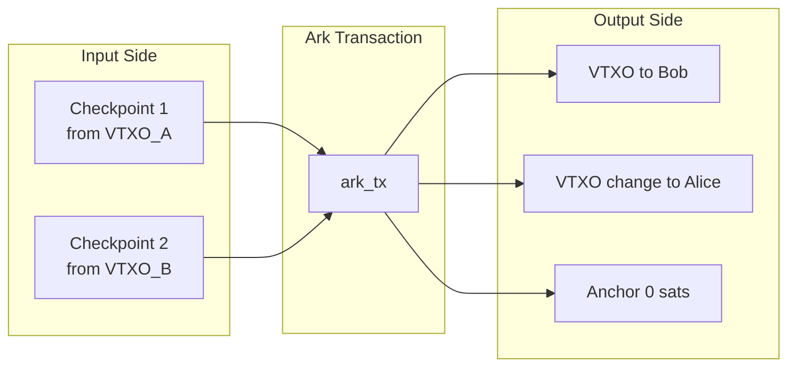
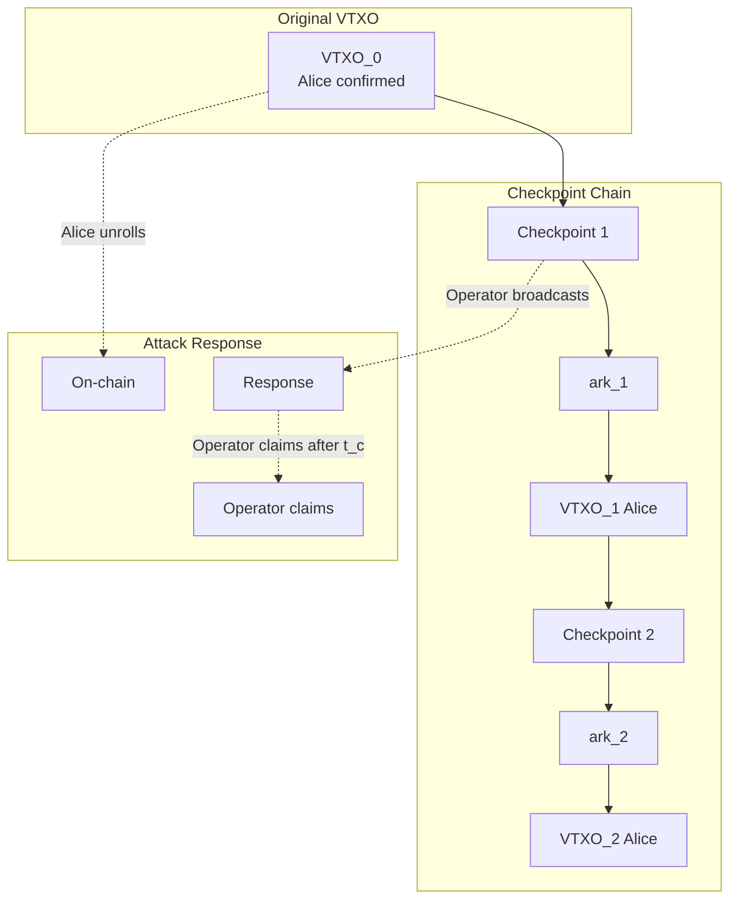
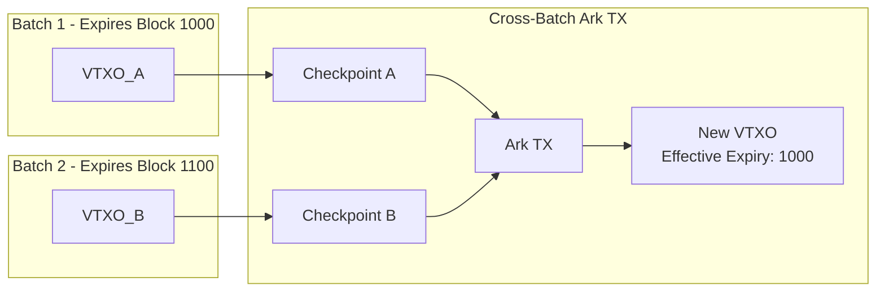

# ARK-03: Out-of-Round Transactions

## Abstract

This document specifies the Out-of-Round (OOR) transaction protocol, also known as Ark Transactions. OOR transactions allow participants to transfer VTXOs without waiting for a new round. The document also specifies the checkpoint transaction mechanism that provides anti-griefing protection for OOR transactions.

## Status

This specification is a working draft. The v0 OOR PSBT flow described here is
draft and aligns with the current implementation work in progress.

## Table of Contents

1. [Introduction](#introduction)
2. [Ark Transaction Format](#ark-transaction-format)
3. [Checkpoint Transaction Mechanism](#checkpoint-transaction-mechanism)
4. [OOR Transaction Flow](#oor-transaction-flow)
5. [Cross-Batch Transactions](#cross-batch-transactions)
6. [Preconfirmed VTXO Trust Model](#preconfirmed-vtxo-trust-model)
7. [Operator Obligations](#operator-obligations)
8. [Validation Requirements](#validation-requirements)

## Introduction

### Purpose

Out-of-Round transactions enable instant, off-chain transfers between participants without requiring a new on-chain batch transaction. This provides:

- **Instant settlement**: Transfers complete in seconds, not waiting for rounds.
- **Reduced on-chain footprint**: Most transfers remain off-chain.
- **Flexible payments**: Support for arbitrary payment amounts and multiple recipients.

### Trade-offs

OOR transactions introduce additional considerations:

- **Preconfirmed VTXOs**: Recipients receive "preconfirmed" VTXOs that depend on the sender not double-spending.
- **Monitoring requirement**: Recipients should monitor the chain or batch-swap promptly.
- **Chain depth**: Long chains of OOR transactions increase unilateral exit complexity.

### Checkpoint Solution

The checkpoint mechanism addresses the griefing attack where a malicious sender could force the operator to broadcast expensive transaction chains. Checkpoints ensure the operator's on-chain costs are bounded regardless of OOR chain length.

## Ark Transaction Format (v0 draft)

### Transaction Structure

An Ark transaction spends one or more checkpoints and creates new VTXOs:

```
Ark Transaction:
  Version: 3 (required for P2A anchors)
  Locktime: 0

  Inputs:
    - Checkpoint output(s) (vout=0 of each checkpoint tx)

  Outputs:
    - New VTXO output(s)
    - Change VTXO output (if any)
    - Anchor output (ephemeral P2A, 0 sats, must be last)
```

**Note:** Ark transactions spend from checkpoint outputs, not directly from
VTXOs. Each VTXO input requires a corresponding checkpoint transaction.

**Fees:** The v0 draft does not include a dedicated fee output. Fee policy for
OOR is TBD and expected to be handled at the round level.

### Input Requirements

#### Checkpoint Inputs

Each Ark transaction input:

1. MUST spend from a checkpoint output (vout=0).
2. MUST be spent via the collaborative script‑path (Schnorr signatures).
3. The checkpoint MUST spend from a valid, unspent VTXO.

#### Cross-Batch Inputs

Ark transactions MAY have inputs from VTXOs in different batches:

- Each input still requires its own checkpoint transaction.
- The checkpoint chain for each input traces back to its origin batch.

### Output Requirements

#### VTXO Outputs

Each output creating a new VTXO:

1. MUST follow the VTXO script structure (see ARK-01).
2. MUST have a valid recipient public key.
3. MUST have positive value.

#### Anchor Output

All Ark transactions:

1. MUST include an ephemeral P2A anchor output.
2. The anchor MUST be the final output.

### Canonical Ordering (v0 draft)

Ark transactions MUST be canonicalized (BIP-69 style):

1. Inputs are ordered by previous outpoint (txid, then vout).
2. Non‑anchor outputs are ordered by value (ascending), then lexicographically
   by raw pkScript bytes (BIP-69 output ordering).
3. Exactly one anchor output exists and it MUST be last.

### Value Conservation

The sum of output values MUST equal the sum of input values in v0:

```
sum(vtxo_outputs) + anchor = sum(checkpoint_values)
```

Where the anchor has zero value.

### Ark Transaction Diagram



## Checkpoint Transaction Mechanism

### Purpose

Checkpoint transactions serve two purposes:

1. **Anti-griefing**: Limit operator's on-chain costs if a malicious participant unrolls.
2. **Atomicity marker**: Provide a clear point where the operator can claim funds.

### Checkpoint Transaction Structure

```
Checkpoint Transaction:
  Version: 3 (required for package relay compatibility)
  Locktime: 0

  Inputs:
    - VTXO input (spent via owner-leaf script path)

  Outputs:
    - Checkpoint output
```

**Note (v0):** Checkpoint transactions omit a P2A anchor output; version 3 is
used for package relay compatibility.

### Checkpoint Output Script

The checkpoint output uses a taproot structure (see ARK-01):

- **Internal key**: ARKNUMSKey (provably unspendable, script‑path only)
- **Script tree**: Two leaves - operator unroll (CSV) and owner leaf

```
Operator Unroll Script (CSV):
  <P_sw> OP_CHECKSIG
  <t_c> OP_CHECKSEQUENCEVERIFY OP_DROP

Owner Leaf Script (v0, closure-provided):
  <closure_script>

Default collaborative closure (RECOMMENDED):
  <P_sender> OP_CHECKSIGVERIFY
  <P_o> OP_CHECKSIG
```

### Checkpoint Properties

1. **Owner-leaf spend**: The Ark transaction spends via the owner leaf.
   The exact closure is policy-defined; the default collaborative closure
   requires individual signatures from both sender and operator.
2. **Operator fallback**: If the sender abandons the chain, the operator can claim after `t_c` blocks.
3. **Bounded chain cost**: Each checkpoint can be independently claimed, limiting operator exposure.

### Anti-Griefing Analysis

**Attack scenario without checkpoints:**

1. Alice creates a chain of 100 self-spend Ark transactions.
2. Alice batch-swaps the final VTXO for a new confirmed VTXO.
3. Alice unrolls the original VTXO on-chain.
4. Operator must broadcast all 100 Ark transactions to reach the forfeit.
5. Operator pays fees for 100+ transactions.

**With checkpoints:**

1. Alice creates a chain of 100 Ark transactions, each with a checkpoint.
2. Alice batch-swaps the final VTXO.
3. Alice unrolls the original VTXO on-chain.
4. Operator broadcasts only the first checkpoint transaction.
5. After `t_c` blocks, operator claims the checkpoint via timeout.
6. Operator pays fees for only 2 transactions (VTXO unroll response + checkpoint).

### Checkpoint Chain Diagram



## OOR Transaction Flow

### Overview (PSBT submit/finalize)

The v0 OOR flow uses PSBT packages:

1. Sender constructs checkpoint PSBTs and an Ark PSBT.
2. Sender signs Ark inputs and submits a **submit package**.
3. Operator validates and co-signs Ark + checkpoint inputs.
4. Sender verifies operator signatures and signs checkpoint PSBTs.
5. Sender submits a **finalize package**.
6. Operator validates, persists, and marks new VTXOs as preconfirmed.

These submit/finalize packages are normative for v0.

### Step 1: Transaction Construction

The sender constructs:

**Checkpoint PSBTs (one per input VTXO):**
- Input: The VTXO being spent.
- Output 0: Checkpoint output (script defined in ARK-01).
- Owner leaf: Closure-provided script committed to the checkpoint tap tree.

**Ark PSBT:**
- Inputs: Each spends checkpoint outpoint `(txid, vout=0)`.
- Outputs: New VTXOs + optional change + P2A anchor (last).
- Canonical ordering enforced (see Ark Transaction Format).
- Each Ark input includes `WitnessUtxo` matching the checkpoint output.
- Each Ark input includes `taptree` metadata (see Tap Tree Encoding below).

### Step 2: Sender Signs Ark PSBT

The sender:

1. Signs each Ark input (script‑path Schnorr signatures).
2. Does NOT sign checkpoint inputs yet.

**Rationale:** The sender commits to the transfer by signing the Ark PSBT, but
retains control until the operator co‑signs.

### Step 3: Submit Package

The sender submits to the operator:

- Ark PSBT (with sender Ark signatures).
- Checkpoint PSBTs (unsigned).

### Step 4: Operator Validation and Signing

The operator:

1. Validates the submit package (canonical ordering, mappings, metadata).
2. Validates checkpoints against policy and VTXO state.
3. Signs Ark inputs and checkpoint inputs.
4. Returns updated PSBTs to the sender.

### Step 5: Sender Finalizes Checkpoints

The sender:

1. Verifies operator signatures.
2. Signs checkpoint inputs.
3. Produces finalize package.

### Step 6: Finalize Package

The sender submits:

- Ark PSBT (canonical, used to map inputs and tap tree metadata).
- Checkpoint PSBTs with final signature material.

The operator:

1. Validates finalize package structure.
2. Persists fully signed checkpoint PSBTs.
3. Marks input VTXOs as Spent and new VTXOs as Live (preconfirmed).
4. Notifies registered recipients.

### Tap Tree Encoding (v0)

The `taptree` PSBT input metadata (stored under the PSBT unknown key
`taptree`) encodes the checkpoint tapleaf scripts using the same TLV format as
`waddrmgr.Tapscript`:

- Top-level TLV stream includes:
  - `type=1` tapscript type (uint8, set to 0 in v0).
  - `type=3` tapscript leaves (a sequence of leaf TLVs).
- Each leaf is length-prefixed and encoded as a TLV stream containing:
  - `type=1` leaf version (uint8, base tapscript leaf version in v0).
  - `type=2` leaf script (raw script bytes).

Decoders MUST ignore the leaf version in v0 and return the raw script bytes.

## Cross-Batch Transactions

### Overview

Ark transactions MAY spend VTXOs from different batches. This provides flexibility but introduces additional complexity.

### Requirements

For cross-batch Ark transactions:

1. Each input VTXO MUST have its own checkpoint transaction.
2. All checkpoints MUST be from batches that have not expired.
3. The Ark transaction spends all checkpoint outputs together.

### Effective Expiry

The effective expiry of a cross-batch Ark transaction is the **minimum** of all input batch expiries:

```
effective_expiry = min(batch_expiry_1, batch_expiry_2, ..., batch_expiry_n)
```

**Rationale:** If any input batch expires, the operator can sweep that input, invalidating the entire Ark transaction chain.

### Unilateral Exit Considerations

To unilaterally exit a VTXO from a cross-batch Ark transaction, the owner must:

1. Broadcast the VTXT path for **each** input VTXO's origin batch.
2. Broadcast all intermediate checkpoint and Ark transactions.
3. Finally spend the output VTXO via unilateral exit.

This increases on-chain cost proportionally to the number of origin batches.

### Cross-Batch Diagram



## Preconfirmed VTXO Trust Model

### Definition

A **preconfirmed VTXO** is one that results from an OOR transaction rather than directly from a VTXT leaf. The "preconfirmed" status indicates:

1. The VTXO chain is valid and co-signed by the operator.
2. The VTXO is NOT yet backed by an on-chain transaction.
3. The sender could theoretically attempt a double-spend.

### Trust Assumptions

Recipients of preconfirmed VTXOs trust:

1. **Operator honesty**: The operator will not sign conflicting transactions.
2. **Operator availability**: The operator will broadcast checkpoints if the sender attempts double-spend.
3. **Sender reputation**: The sender is not attempting fraud.

### Double-Spend Scenarios

**Scenario 1: Sender unilateral exit**

1. Sender has VTXO_A (confirmed).
2. Sender creates Ark TX, sending to Bob (VTXO_B preconfirmed).
3. Sender broadcasts VTXO_A on-chain via unilateral exit.

**Protection:**
- Operator detects the broadcast.
- Operator broadcasts the checkpoint transaction.
- Checkpoint claims funds before sender's CSV delay expires.
- Bob's VTXO_B is honored: the operator creates a new VTXO for Bob in a future batch. The operator can afford to do this because they reclaimed the original funds via the checkpoint. This makes the operator economically whole (they didn't lose anything) and Bob whole (he receives his expected value).

Note: Bob must trust the operator to include his VTXO in a future batch. If the operator refuses, Bob can use the checkpoint transaction chain to prove his claim. The economic incentive aligns: the operator benefits from maintaining reputation and Bob's continued participation.

**Scenario 2: Operator collusion**

1. Sender and operator collude.
2. Sender creates Ark TX to Bob.
3. Operator signs but also signs a conflicting transaction.

**Detection:**
- If both transactions appear on-chain, cryptographic evidence of double-signing exists.
- This proves operator misbehavior (two valid signatures on conflicting transactions).
- Reputation damage to operator; potential legal consequences.

### Risk Mitigation for Recipients

Recipients SHOULD:

1. **Batch swap promptly**: Convert preconfirmed VTXOs to confirmed VTXOs.
2. **Monitor the chain**: Watch for unilateral exits of input VTXOs.
3. **Limit preconfirmed exposure**: Cap total value held in preconfirmed VTXOs.

Recipients MAY:

1. Require sender reputation or identity.
2. Wait for sender's batch to reach deep confirmations.
3. Request a batch swap as part of the payment flow.

### Preconfirmed Chain Depth

As preconfirmed VTXOs are spent in subsequent Ark transactions, chains grow deeper:

```
VTXO_0 (confirmed)
  └─> ark_1 -> VTXO_1 (preconfirmed, depth 1)
       └─> ark_2 -> VTXO_2 (preconfirmed, depth 2)
            └─> ark_3 -> VTXO_3 (preconfirmed, depth 3)
```

Deeper chains:
- Require more transactions for unilateral exit.
- Increase potential on-chain fees.
- MAY be limited by operator policy.

## Operator Obligations

### Immediate Obligations

After signing an OOR transaction, the operator MUST:

1. **Persist state**: Store the signed checkpoint transaction.
2. **Update VTXO states**: Mark input VTXOs as Spent, outputs as Live.
3. **Notify recipients**: Inform registered watchers of new VTXOs.

### Ongoing Obligations

The operator MUST:

1. **Monitor inputs**: Watch for unilateral exits of VTXOs spent in OOR transactions.
2. **Respond to attacks**: Broadcast checkpoints when double-spend attempts are detected.
3. **Maintain availability**: Be available to co-sign future transactions.

### Response Timing

When a spent VTXO is broadcast on-chain:

1. The operator MUST detect this within a reasonable time (RECOMMENDED: < 1 hour).
2. The operator MUST broadcast the checkpoint before the VTXO's CSV delay expires.
3. The operator SHOULD use fee bumping to ensure timely confirmation.

### State Cleanup

The operator MAY delete OOR state after:

1. The origin batch has been swept (expired and operator claimed).
2. All VTXOs in the chain have been batch-swapped to new confirmed VTXOs.
3. Sufficient time has passed with no activity.

## Validation Requirements

### Checkpoint Transaction Validation

The operator MUST validate:

1. **Input VTXO validity**: The VTXO exists and is unspent in operator's records.
2. **Input VTXO ownership**: The sender proves ownership via valid signature.
3. **VTXO not locked**: The VTXO is not locked by a pending round or other operation.
4. **VTXO not expired**: The VTXO's batch has not expired.
5. **Script correctness**: The checkpoint output script matches expected format.
6. **Operator key**: The operator key in the checkpoint matches current signing key.
7. **Owner closure policy**: The owner leaf script is acceptable under
   operator policy and matches the taptree metadata attached to the Ark PSBT.

### Submit Package Validation (v0)

The operator MUST validate:

1. **Canonical Ark tx**: Inputs/outputs ordered per v0 rules; single anchor
   output last.
2. **Checkpoint mapping**: Each Ark input spends checkpoint outpoint
   `(txid, vout=0)`; checkpoint set matches Ark inputs exactly.
3. **Witness UTXO**: Each Ark PSBT input includes `WitnessUtxo` matching the
   corresponding checkpoint output (script + value).
4. **Tap tree metadata**: Each Ark PSBT input includes the `taptree` TLV
   blob (see Tap Tree Encoding).

### Finalize Package Validation (v0)

The operator MUST validate:

1. **Canonical Ark tx**: Finalize package MUST include the Ark PSBT, and it
   must be canonical for deterministic mapping.
2. **Checkpoint set**: Final checkpoint PSBTs match the Ark input set.
3. **Signature material**: Each checkpoint PSBT contains some finalized
   signature material (final witness or taproot sig fields).

### Ark Transaction Validation (semantic)

The operator MUST validate:

1. **Input validity**: All checkpoint inputs are valid.
2. **Value conservation**: Output sum == input sum (v0 has no implicit fee).
3. **VTXO format**: All output VTXOs follow correct script format.
4. **Signature validity**: Sender and operator signatures are valid.
5. **Chain depth**: (Optional) The resulting chain depth is within policy
   limits.

### Policy Limits

Operators MAY enforce policy limits:

| Policy | Description | Example |
|--------|-------------|---------|
| Max chain depth | Limit OOR chain length | 10 transactions |
| Max cross-batch inputs | Limit inputs from different batches | 3 batches |
| Min fee rate | Minimum fee for OOR processing | TBD |
| Max VTXO count | Limit outputs per Ark transaction | 10 VTXOs |

Policy violations SHOULD be rejected with appropriate error codes.

## References

1. ARK-00: Protocol Overview and Terminology
2. ARK-01: Transaction Formats and Script Specifications
3. BIP 174: PSBT - https://github.com/bitcoin/bips/blob/master/bip-0174.mediawiki
4. BIP 371: PSBTv2 - https://github.com/bitcoin/bips/blob/master/bip-0371.mediawiki
5. BIP 69: Lexicographic transaction ordering - https://github.com/bitcoin/bips/blob/master/bip-0069.mediawiki

## Authors

This specification was authored by the Lightning Labs team.

## Copyright

This document is licensed under CC0.
