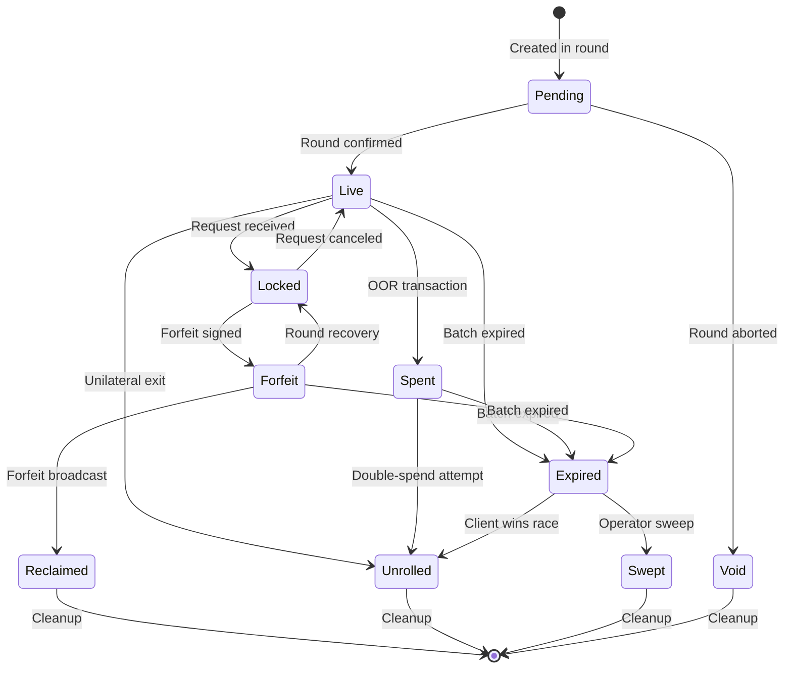
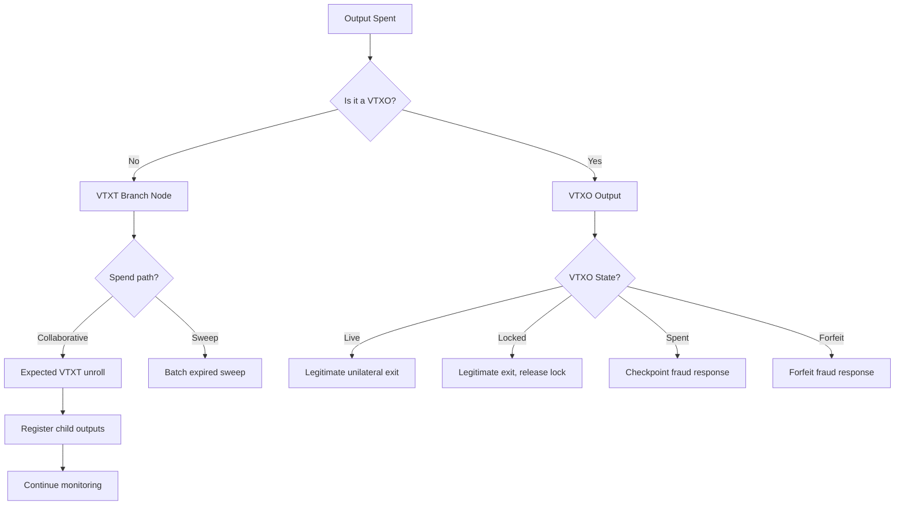
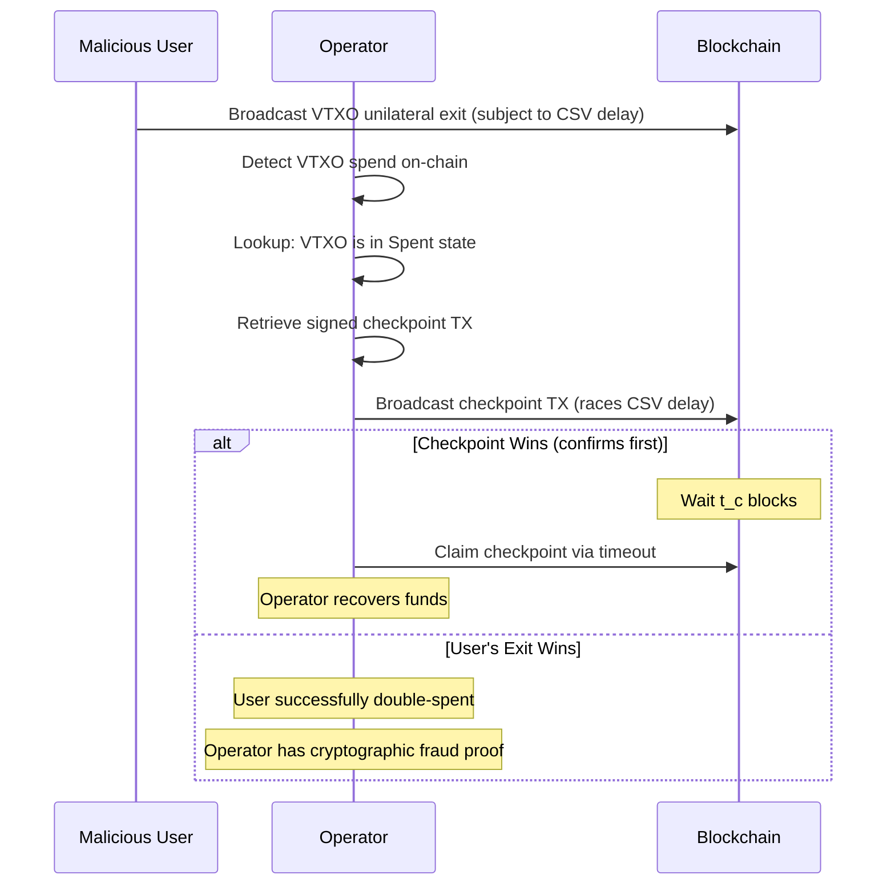
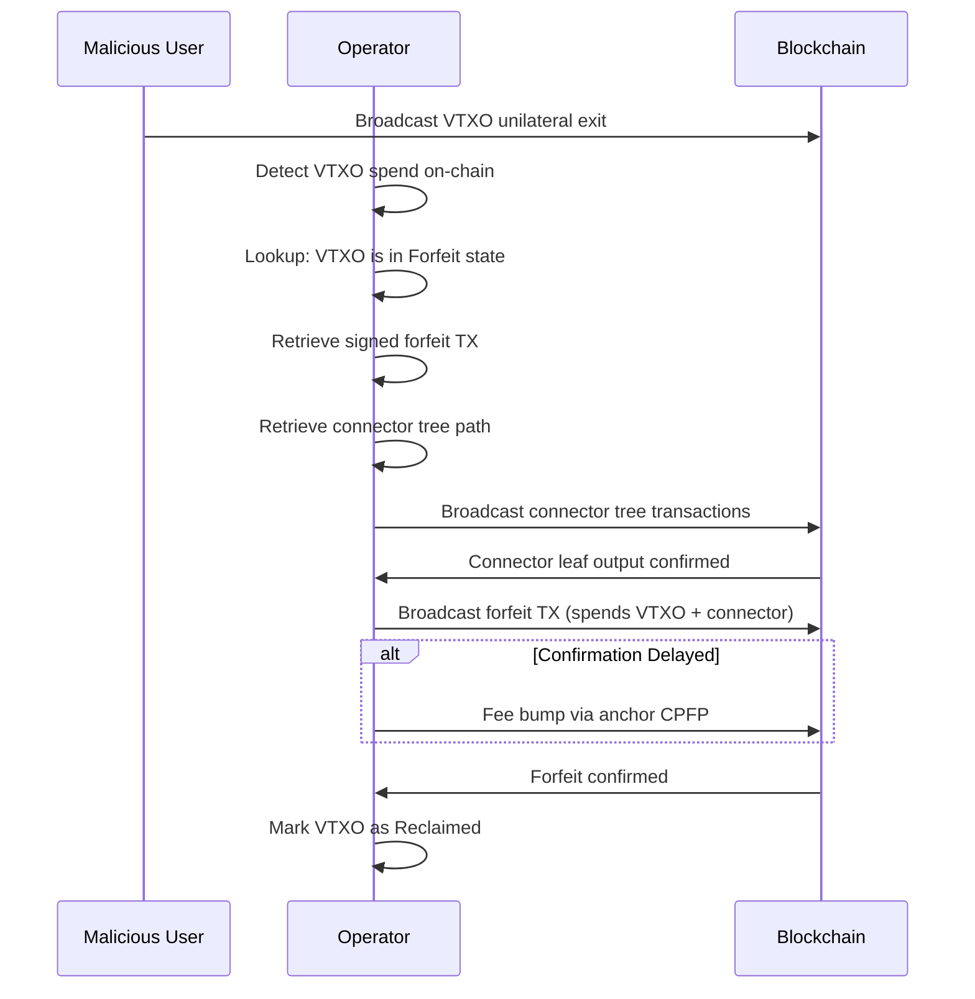
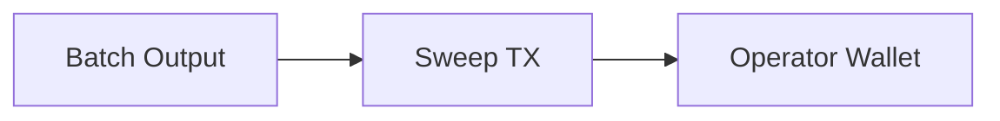
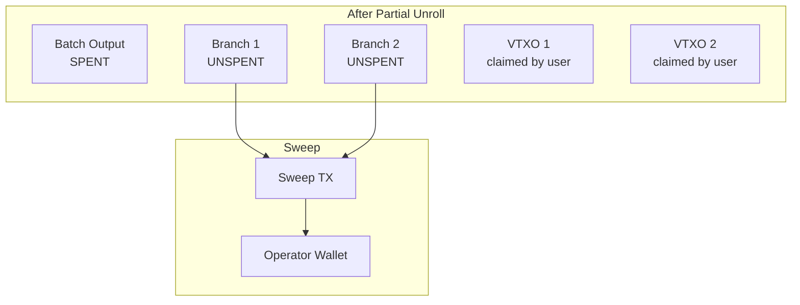

# ARK-04: Monitoring and Fraud Response

## Abstract

This document specifies the operator's monitoring and fraud response requirements. It defines the VTXO state machine, describes batch output monitoring procedures, specifies fraud response protocols, and covers batch expiry handling.

## Status

This specification is version 0.1 (initial release).

## Table of Contents

1. [Introduction](#introduction)
2. [VTXO State Machine](#vtxo-state-machine)
3. [Batch Output Monitoring](#batch-output-monitoring)
4. [Fraud Response Protocol](#fraud-response-protocol)
5. [Batch Expiry and Sweeping](#batch-expiry-and-sweeping)
6. [Timing Requirements](#timing-requirements)
7. [Implementation Considerations](#implementation-considerations)

## Introduction

### Operator Responsibilities

The operator is responsible for:

1. **Monitoring**: Detecting when participants broadcast transactions on-chain.
2. **Fraud Response**: Broadcasting appropriate transactions when fraud is detected.
3. **Sweeping**: Reclaiming funds from expired batches.

Failure to perform these duties may result in:
- Loss of funds if forfeited/spent VTXOs are not reclaimed.
- Reduced liquidity if expired batches are not swept.
- Protocol security degradation.

### Timing Criticality

Many operator responses are time-sensitive:

- **Forfeit response**: Must broadcast before the VTXO's CSV delay expires.
- **Checkpoint response**: Must broadcast before the checkpoint's CSV delay expires.
- **Sweep**: Can only occur after batch expiry is reached.

Operators MUST maintain sufficient monitoring and response infrastructure to meet these timing requirements.

## VTXO State Machine

### States



### State Descriptions

| State | Description | Operator Action Required |
|-------|-------------|-------------------------|
| **Pending** | Created in unsigned/unconfirmed round | Wait for confirmation |
| **Void** | Round was aborted before confirmation | Cleanup |
| **Live** | Active, can be spent via OOR or forfeit | Monitor |
| **Locked** | Reserved for pending round operation | Complete operation |
| **Spent** | Spent via OOR transaction | Store checkpoint, monitor |
| **Forfeit** | Forfeit transaction signed | Store forfeit, monitor |
| **Unrolled** | Broadcast on-chain by owner | None (legitimate exit) |
| **Reclaimed** | Forfeit transaction broadcast | Await confirmation |
| **Expired** | Batch sweep delay (`T_e`) elapsed (tracks prior state: was_live, was_spent, was_forfeit) | Sweep |
| **Swept** | Funds recovered via sweep | Cleanup |

### Transition Rules

#### Pending → Live

**Trigger:** The batch transaction containing the VTXO is confirmed to minimum depth.

**Actions:**
1. Mark VTXO as Live.
2. Index VTXO for monitoring.
3. Notify registered watchers.

#### Pending → Void

**Trigger:** The round is aborted before broadcast.

**Actions:**
1. Mark VTXO as Void.
2. Remove from pending index.
3. No cleanup required.

#### Live → Locked

**Trigger:** VTXO is included in a round request (leave or batch swap).

**Actions:**
1. Mark VTXO as Locked.
2. Reject OOR requests for this VTXO.
3. Store lock reference to pending round.

#### Locked → Live

**Trigger:** The pending round is aborted.

**Actions:**
1. Mark VTXO as Live.
2. Resume accepting OOR requests.
3. Clear lock reference.

#### Live → Spent

**Trigger:** OOR transaction is completed (checkpoint signatures received).
In v0, the VTXO MUST be in Live state (not Locked) for OOR to proceed — the
shared exclusion lock prevents OOR on locked VTXOs (see ARK-02).

**Actions:**
1. Mark VTXO as Spent.
2. Store signed checkpoint transaction.
3. Continue monitoring for double-spend.

#### Locked → Forfeit

**Trigger:** Forfeit transaction is signed and round completes.

**Actions:**
1. Mark VTXO as Forfeit.
2. Store signed forfeit transaction.
3. Continue monitoring for unilateral exit.

#### Spent/Forfeit → Unrolled (Fraud Detection)

**Trigger:** The VTXO output appears on-chain.

**Actions:**
1. Detect the spend type (VTXO unilateral exit).
2. Initiate fraud response (see [Fraud Response Protocol](#fraud-response-protocol)).
3. Mark as Unrolled after response complete.

#### Live → Unrolled

**Trigger:** The VTXO output appears on-chain (legitimate exit).

**Actions:**
1. Mark VTXO as Unrolled.
2. No fraud response needed.
3. Continue monitoring upstream tree nodes.

#### Forfeit → Reclaimed

**Trigger:** Forfeit transaction is broadcast and confirming.

**Actions:**
1. Mark VTXO as Reclaimed.
2. Track forfeit transaction confirmation.
3. Cleanup after sufficient confirmations.

#### Forfeit → Locked (Recovery)

**Trigger:** The operator explicitly double-spends one of their inputs from the batch
transaction, making the original batch transaction permanently unconfirmable.

This is an exceptional transition used when a round must be abandoned after forfeit
transactions were signed but before the batch transaction was successfully broadcast.
The VTXO transitions to Locked first, then can proceed to Live via the normal
Locked → Live transition.

**Requirements:**
1. The operator MUST have broadcast a conflicting transaction spending one of their inputs.
2. The conflicting transaction MUST be confirmed to sufficient depth (RECOMMENDED: 6 blocks).
3. The original batch transaction MUST NOT have been broadcast successfully.
4. The operator MUST have certainty that no copy of the batch transaction exists
   that could be replayed.

**Actions:**
1. Verify the double-spend is confirmed to sufficient depth.
2. Mark the associated VTXOs as Locked (intermediate state).
3. Delete the now-invalid forfeit transactions.
4. Proceed to Locked → Live transition once recovery is confirmed.
5. Notify affected participants that their forfeits have been reversed.

**Warning:** This transition carries replay risk. If the original batch transaction
was ever broadcast (even if not confirmed), it could theoretically be replayed later
by any party that retained a copy. The operator SHOULD only perform this transition
when absolutely certain the original batch transaction was never broadcast.

**Operator Liability:** If an operator performs this transition incorrectly and the
original batch transaction is later confirmed, the operator may suffer financial
loss (the forfeit transactions become valid while VTXOs are also marked Live).

#### Any → Expired

**Trigger:** The batch sweep delay is reached.

**Actions:**
1. Mark all remaining Live/Spent/Forfeit VTXOs as Expired.
2. Add to sweep candidate list.
3. Disable OOR transactions for this batch.

#### Expired → Swept

**Trigger:** Sweep transaction is broadcast and confirmed.

**Actions:**
1. Mark as Swept.
2. Cleanup state.
3. Return liquidity to operator wallet.

#### Expired → Unrolled

**Trigger:** The client successfully unrolls a VTXO after the batch has reached expiry
but before the operator's sweep transaction confirms.

This can occur when:
1. The client began the unilateral exit before expiry.
2. The client's VTXT path transactions confirm before the operator's sweep.

**Actions:**
1. Mark VTXO as Unrolled.
2. Remove from sweep candidate list.
3. The client has legitimately claimed their funds.

**Note:** This is a valid outcome, not fraud. If the client started unrolling before
expiry, they may win the race against the operator's sweep transaction.

## Batch Output Monitoring

### Monitoring Scope

The operator MUST monitor:

1. **Batch outputs**: Top-level outputs of batch transactions.
2. **VTXT node outputs**: Any VTXT branch that makes it on-chain.
3. **Checkpoint outputs**: Outputs from checkpoint transactions.

### Detection Methods

#### Blockchain Subscription

Operators SHOULD subscribe to relevant address/output notifications:

1. Register batch transaction outpoints.
2. Monitor for spends of those outpoints.
3. When spent, register child outpoints and repeat.

#### Polling

As fallback, operators MAY poll:

1. Query UTXOs for known outputs periodically.
2. Detect spent outputs by absence.
3. Query transaction history to find spending transaction.

### Spend Classification

When a monitored output is spent, classify the spend:



### Monitoring State

For each active batch, maintain:

```
BatchMonitorState:
  batch_id: bytes
  commitment_txid: bytes
  expiry_height: uint32

  batch_outputs: [
    {
      outpoint: (txid, index)
      status: (unspent | spent_collaborative | spent_sweep)
      child_outpoints: [(txid, index), ...]
    }
  ]

  vtxt_nodes: [
    {
      outpoint: (txid, index)
      level: uint8
      participant_keys: [pubkey, ...]
      status: (unspent | spent_collaborative | spent_sweep)
    }
  ]

  vtxos: [
    {
      outpoint: (txid, index)
      owner_key: pubkey
      state: vtxo_state
      checkpoint_tx: bytes (if spent)
      forfeit_tx: bytes (if forfeit)
    }
  ]
```

## Fraud Response Protocol

### Fraud Types

| Type | Description | Response |
|------|-------------|----------|
| **Spent VTXO unrolled** | Owner broadcasts VTXO that was spent via OOR | Broadcast checkpoint |
| **Forfeit VTXO unrolled** | Owner broadcasts VTXO that was forfeited | Broadcast forfeit |

### Response to Spent VTXO Unroll

When a Spent VTXO appears on-chain (meaning the user is attempting to
unilaterally exit a VTXO they already spent via OOR transaction):

1. **Retrieve checkpoint transaction**: Get the first checkpoint transaction
   that spends this VTXO via the collaborative script-path.
2. **Race the CSV delay**: The user's unilateral exit is subject to a CSV
   delay (`t_e` blocks). The operator MUST broadcast the checkpoint before
   this delay expires.
3. **Broadcast checkpoint**: Submit the checkpoint transaction that spends
   the same VTXO output via the collaborative path. Since the VTXO can only
   be spent once, the checkpoint and the user's unilateral exit compete for
   the same UTXO.
4. **Monitor confirmation**: Only one transaction can confirm (the checkpoint
   or the user's unilateral exit after CSV delay).
5. **Claim timeout**: If the checkpoint confirms, wait `t_c` blocks and claim
   the checkpoint output via the operator timeout path.

**Key insight**: The operator only needs to broadcast one checkpoint
transaction — the one that directly spends the contested VTXO. The rest of
the OOR chain is irrelevant because the checkpoint claims the full VTXO
value. The operator is then economically whole and can reimburse the
recipient(s) from the claimed funds in a future batch.

**Important**: The checkpoint spends the VTXO via the collaborative
script-path (2-of-2 multi-sig with individual BIP-340 signatures), which
does not require a CSV delay. This gives the operator a timing advantage
over the user's unilateral exit path, which requires waiting `t_e` blocks.



### Response to Forfeit VTXO Unroll

When a Forfeit VTXO appears on-chain:

1. **Retrieve forfeit transaction**: Get the signed forfeit.
2. **Unroll connector tree**: The forfeit transaction requires a connector input. First, broadcast the connector tree path (from the batch transaction's connector root output down to the specific connector leaf needed for this forfeit).
3. **Verify connector**: Ensure the connector leaf output exists on-chain.
4. **Broadcast forfeit**: Submit the forfeit transaction spending both the VTXO and connector.
5. **Monitor confirmation**: Track forfeit confirmation.
6. **Fee bump if needed**: Use anchor output for CPFP.



### Response Timing

The operator MUST broadcast response transactions before the CSV delay expires:

```
time_remaining = csv_delay - (current_height - vtxo_broadcast_height)

if time_remaining < safety_margin:
    // CRITICAL: Broadcast immediately with aggressive fee
```

**Safety margin**: RECOMMENDED minimum 6 blocks before CSV expiry.

### Fee Bumping

When response transactions are not confirming:

1. **Initial fee**: Use current mempool-appropriate fee rate.
2. **Bump threshold**: If unconfirmed after N blocks, bump fee.
3. **Bump strategy**: Increase fee by percentage or match next block target.
4. **Maximum fee**: Cap at reasonable percentage of output value.

## Batch Sweep Eligibility and Sweeping

### Sweep Eligibility Detection

Monitor for batches becoming sweep-eligible (sweep delay `T_e` elapsed):

```
for each active_batch:
    if current_height >= batch.expiry_height:
        mark_batch_expired(batch)
        add_to_sweep_candidates(batch)
```

Note: `expiry_height` is an estimate based on the batch transaction's
confirmation height plus the sweep delay `T_e`. Since `T_e` is CSV, the
actual sweep eligibility depends on when each branch output was confirmed.

### Pre-Sweep Actions

Before the sweep delay elapses, the operator SHOULD:

1. **Notify participants**: Warn of upcoming expiry.
2. **Encourage batch swaps**: Promote VTXO refresh.
3. **Prepare sweep**: Pre-compute sweep transaction structure.

### Sweep Transaction Construction

The sweep transaction claims all operator-recoverable funds:

```
Sweep Transaction:
  Version: 2
  Locktime: 0

  Inputs:
    - Unspent batch outputs (via sweep path, after T_e CSV)
    - Unspent VTXT nodes (via sweep path, after T_e CSV)
    - Confirmed forfeit outputs (immediately spendable)
    - Confirmed checkpoint outputs (via timeout, after t_c CSV)

  Outputs:
    - Operator wallet output
    - (Optional) Anchor for fee bumping
```

**Maturity note:** Checkpoint outputs are only spendable after `t_c` blocks
from their confirmation. If a checkpoint was broadcast near the batch sweep
time, the `t_c` delay may not have elapsed yet. The operator SHOULD split
sweeps into separate transactions: one for CSV-mature outputs and a later
one for outputs that are not yet mature.

### Sweep Scenarios

#### Clean Sweep

No unilateral exits occurred:

1. Single input: The batch output.
2. Operator signs via sweep script path.
3. One transaction sweeps entire batch.



#### Partial Unroll Sweep

Some VTXT branches were broadcast:

1. Multiple inputs: Unspent branch outputs.
2. Each input requires sweep path signature.
3. One transaction sweeps all unspent outputs.



#### Sweep with Forfeit Outputs

Forfeits were broadcast during batch lifetime:

1. Include forfeit transaction outputs.
2. These are already operator-owned.
3. Can be swept immediately (no timelock).

### Sweep Batching

Operators MAY batch sweeps across multiple expired batches:

- Reduces total on-chain footprint.
- May need to wait for all batches to expire.
- Balance between efficiency and liquidity return.

## Timing Requirements

### Critical Deadlines

| Event | Deadline | Consequence of Miss |
|-------|----------|---------------------|
| Forfeit broadcast | VTXO exit delay (`t_e`) | Loss of forfeited funds |
| Checkpoint broadcast | VTXO exit delay (`t_e`) | Loss of spent funds |
| Checkpoint claim | Checkpoint timeout (`t_c`) | User can reclaim via Ark tx |
| Sweep | None (after sweep delay `T_e`) | Delayed liquidity return |

### Recommended Timing Parameters

| Parameter | Recommended Value | Notes |
|-----------|------------------|-------|
| Monitoring poll interval | 1 block | Real-time detection |
| Response safety margin | 6 blocks | Buffer before CSV expiry |
| Fee bump trigger | 2 blocks unconfirmed | Ensure timely confirmation |
| Sweep delay after expiry | 1 block | Ensure expiry is final |

### Timing Diagram

```mermaid
gantt
    title VTXO Fraud Response Timeline
    dateFormat X
    axisFormat %s

    section Detection
    VTXO broadcast on-chain :a1, 0, 1

    section Response Window
    CSV delay period :a2, 1, 144

    section Critical Actions
    Detect broadcast :crit, a3, 1, 6
    Broadcast response :crit, a4, 6, 12
    Fee bump if needed :a5, 60, 90
    Response confirmed :milestone, 90, 90

    section Danger Zone
    Safety margin :crit, a6, 138, 144
```



## Implementation Considerations

### Database Requirements

Operators MUST persist:

1. **VTXO states**: Current state of all tracked VTXOs.
2. **Checkpoint transactions**: All signed checkpoints for spent VTXOs.
3. **Forfeit transactions**: All signed forfeits for forfeited VTXOs.
4. **Batch metadata**: Expiry heights, tree structures.

### High Availability

For production deployments:

1. **Redundant monitoring**: Multiple nodes watching the chain.
2. **Alert systems**: Immediate notification of detected events.
3. **Automated response**: Scripted fraud response for speed.
4. **Manual override**: Ability to intervene in edge cases.

### Recovery Procedures

After operator downtime:

1. **Scan for events**: Check all monitored outputs since last known state.
2. **Process pending responses**: Handle any fraud that occurred during downtime.
3. **Verify no losses**: Confirm all CSVs were respected.
4. **Resume normal operation**: Continue monitoring.

### Resource Considerations

Monitoring costs scale with:

- Number of active batches
- Number of VTXOs per batch
- OOR transaction volume
- Blockchain event rate

Operators SHOULD provision resources accordingly.

## References

1. ARK-00: Protocol Overview and Terminology
2. ARK-01: Transaction Formats and Script Specifications
3. ARK-03: Out-of-Round Transactions

## Authors

This specification was authored by the Lightning Labs team.

## Copyright

This document is licensed under CC0.
