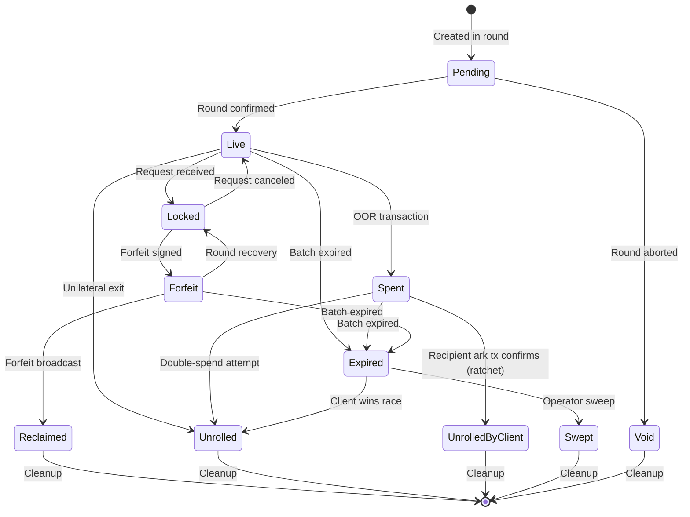
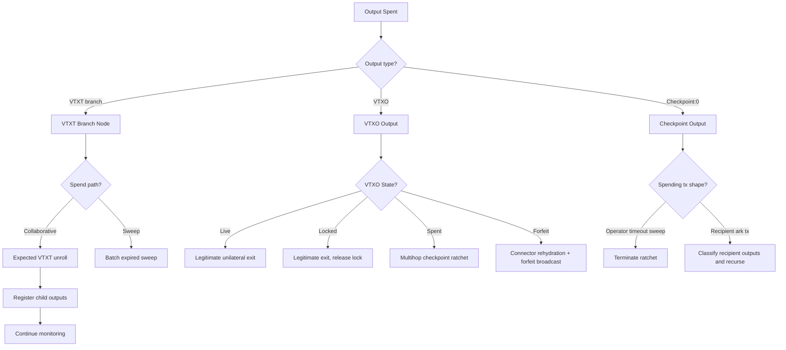
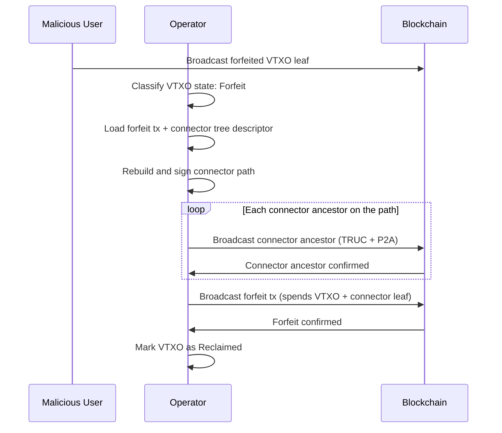
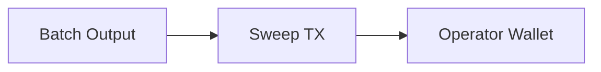
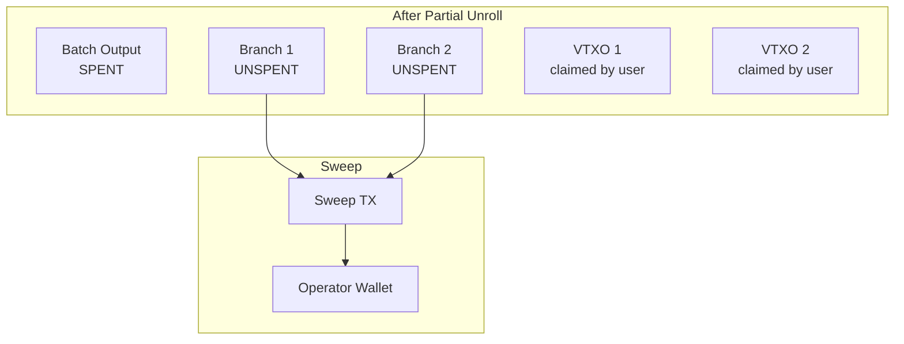

# ARK-04: Monitoring and Fraud Response

## Abstract

This document specifies the operator's monitoring and fraud response requirements. It defines the VTXO state machine, describes batch output monitoring procedures, specifies fraud response protocols, and covers batch expiry handling.

## Status

This specification is version 1 (v1). The fraud-response protocol now
covers the multihop checkpoint ratchet through OOR transfer chains and
the operator-driven connector-tree rehydration for stored forfeit
broadcast. Legacy v0 paragraphs have been retired.

## Table of Contents

1. [Introduction](#introduction)
2. [VTXO State Machine](#vtxo-state-machine)
3. [Batch Output Monitoring](#batch-output-monitoring)
4. [Fraud Response Protocol](#fraud-response-protocol)
5. [Batch Expiry and Sweeping](#batch-expiry-and-sweeping)
6. [Timing Requirements](#timing-requirements)
7. [Implementation Considerations](#implementation-considerations)

## Introduction

### Operator Responsibilities

The operator is responsible for:

1. **Monitoring**: Detecting when participants broadcast transactions on-chain.
2. **Fraud Response**: Broadcasting appropriate transactions when fraud is detected.
3. **Sweeping**: Reclaiming funds from expired batches.

Failure to perform these duties may result in:
- Loss of funds if forfeited/spent VTXOs are not reclaimed.
- Reduced liquidity if expired batches are not swept.
- Protocol security degradation.

### Timing Criticality

Many operator responses are time-sensitive:

- **Forfeit response**: Must broadcast before the VTXO's CSV delay expires.
- **Checkpoint response**: Must broadcast before the checkpoint's CSV delay expires.
- **Sweep**: Can only occur after batch expiry is reached.

Operators MUST maintain sufficient monitoring and response infrastructure to meet these timing requirements.

## VTXO State Machine

### States



### State Descriptions

| State | Description | Operator Action Required |
|-------|-------------|-------------------------|
| **Pending** | Created in unsigned/unconfirmed round | Wait for confirmation |
| **Void** | Round was aborted before confirmation | Cleanup |
| **Live** | Active, can be spent via OOR or forfeit | Monitor |
| **Locked** | Reserved for pending round operation | Complete operation |
| **Spent** | Spent via OOR transaction | Store checkpoint, monitor |
| **Forfeit** | Forfeit transaction signed | Store forfeit, monitor |
| **Unrolled** | Broadcast on-chain by owner | None (legitimate exit) |
| **UnrolledByClient** | Recipient ark tx at the end of an OOR transfer chain confirmed on-chain after the operator ratcheted through the chain | None (terminal multihop fraud-response success) |
| **Reclaimed** | Forfeit transaction broadcast | Await confirmation |
| **Expired** | Batch sweep delay (`T_e`) elapsed (tracks prior state: was_live, was_spent, was_forfeit) | Sweep |
| **Swept** | Funds recovered via sweep | Cleanup |

### Transition Rules

#### Pending → Live

**Trigger:** The batch transaction containing the VTXO is confirmed to minimum depth.

**Actions:**
1. Mark VTXO as Live.
2. Index VTXO for monitoring.
3. Notify registered watchers.

#### Pending → Void

**Trigger:** The round is aborted before broadcast.

**Actions:**
1. Mark VTXO as Void.
2. Remove from pending index.
3. No cleanup required.

#### Live → Locked

**Trigger:** VTXO is included in a round request (leave or batch swap).

**Actions:**
1. Mark VTXO as Locked.
2. Reject OOR requests for this VTXO.
3. Store lock reference to pending round.

#### Locked → Live

**Trigger:** The pending round is aborted.

**Actions:**
1. Mark VTXO as Live.
2. Resume accepting OOR requests.
3. Clear lock reference.

#### Live → Spent

**Trigger:** OOR transaction is completed (checkpoint signatures received).
The VTXO MUST be in Live state (not Locked) for OOR to proceed — the
server-authoritative locking authority prevents OOR on locked VTXOs
(see ARK-02 [Server-Authoritative Locking](ARK-02-rounds.md#server-authoritative-locking)).

**Actions:**
1. Mark VTXO as Spent.
2. Store signed checkpoint transaction (and the recipient ark tx) for
   later fraud-response use.
3. Continue monitoring for unilateral exit attempts on the spent leaf.

#### Locked → Forfeit

**Trigger:** Forfeit transaction is signed and round completes.

**Actions:**
1. Mark VTXO as Forfeit.
2. Store signed forfeit transaction.
3. Continue monitoring for unilateral exit.

#### Spent/Forfeit → Unrolled (Fraud Detection)

**Trigger:** The VTXO output appears on-chain (sender attempts to
unilaterally exit a VTXO they already spent or forfeited).

**Actions:**
1. Detect the spend type (VTXO unilateral exit).
2. Initiate fraud response (see [Fraud Response Protocol](#fraud-response-protocol)).
3. Mark as Unrolled after the fraud-response chain terminates in an
   operator-side outcome (timeout sweep on a checkpoint output, or
   forfeit confirmation).

#### Spent → UnrolledByClient (Multihop Ratchet Terminal)

**Trigger:** The recipient ark transaction at the end of an OOR
transfer chain confirms on-chain after the operator broadcast the
persisted checkpoint and ratcheted through the chain.

**Actions:**
1. Mark the originating Spent VTXO (and any intermediate Spent VTXOs
   walked during the ratchet) as UnrolledByClient.
2. Note: this is a successful fraud-response outcome — the recipient's
   funds are now on-chain through the legitimate ark-tx path. The
   operator does NOT need to broadcast a timeout sweep on the
   intermediate checkpoint outputs.

See [Multihop Checkpoint Ratchet](#multihop-checkpoint-ratchet) for
the operator-driven flow that produces this transition.

#### Live → Unrolled

**Trigger:** The VTXO output appears on-chain (legitimate exit).

**Actions:**
1. Mark VTXO as Unrolled.
2. No fraud response needed.
3. Continue monitoring upstream tree nodes.

#### Forfeit → Reclaimed

**Trigger:** Forfeit transaction is broadcast and confirming.

**Actions:**
1. Mark VTXO as Reclaimed.
2. Track forfeit transaction confirmation.
3. Cleanup after sufficient confirmations.

#### Forfeit → Locked (Recovery)

**Trigger:** The operator explicitly double-spends one of their inputs from the batch
transaction, making the original batch transaction permanently unconfirmable.

This is an exceptional transition used when a round must be abandoned after forfeit
transactions were signed but before the batch transaction was successfully broadcast.
The VTXO transitions to Locked first, then can proceed to Live via the normal
Locked → Live transition.

**Requirements:**
1. The operator MUST have broadcast a conflicting transaction spending one of their inputs.
2. The conflicting transaction MUST be confirmed to sufficient depth (RECOMMENDED: 6 blocks).
3. The original batch transaction MUST NOT have been broadcast successfully.
4. The operator MUST have certainty that no copy of the batch transaction exists
   that could be replayed.

**Actions:**
1. Verify the double-spend is confirmed to sufficient depth.
2. Mark the associated VTXOs as Locked (intermediate state).
3. Delete the now-invalid forfeit transactions.
4. Proceed to Locked → Live transition once recovery is confirmed.
5. Notify affected participants that their forfeits have been reversed.

**Warning:** This transition carries replay risk. If the original batch transaction
was ever broadcast (even if not confirmed), it could theoretically be replayed later
by any party that retained a copy. The operator SHOULD only perform this transition
when absolutely certain the original batch transaction was never broadcast.

**Operator Liability:** If an operator performs this transition incorrectly and the
original batch transaction is later confirmed, the operator may suffer financial
loss (the forfeit transactions become valid while VTXOs are also marked Live).

#### Any → Expired

**Trigger:** The batch sweep delay is reached.

**Actions:**
1. Mark all remaining Live/Spent/Forfeit VTXOs as Expired.
2. Add to sweep candidate list.
3. Disable OOR transactions for this batch.

#### Expired → Swept

**Trigger:** Sweep transaction is broadcast and confirmed.

**Actions:**
1. Mark as Swept.
2. Cleanup state.
3. Return liquidity to operator wallet.

#### Expired → Unrolled

**Trigger:** The client successfully unrolls a VTXO after the batch has reached expiry
but before the operator's sweep transaction confirms.

This can occur when:
1. The client began the unilateral exit before expiry.
2. The client's VTXT path transactions confirm before the operator's sweep.

**Actions:**
1. Mark VTXO as Unrolled.
2. Remove from sweep candidate list.
3. The client has legitimately claimed their funds.

**Note:** This is a valid outcome, not fraud. If the client started unrolling before
expiry, they may win the race against the operator's sweep transaction.

## Batch Output Monitoring

### Monitoring Scope

The operator MUST monitor:

1. **Batch outputs**: Top-level outputs of batch transactions.
2. **VTXT node outputs**: Any VTXT branch that makes it on-chain.
3. **Checkpoint outputs**: Outputs from checkpoint transactions.

### Detection Methods

#### Blockchain Subscription

Operators SHOULD subscribe to relevant address/output notifications:

1. Register batch transaction outpoints.
2. Monitor for spends of those outpoints.
3. When spent, register child outpoints and repeat.

#### Polling

As fallback, operators MAY poll:

1. Query UTXOs for known outputs periodically.
2. Detect spent outputs by absence.
3. Query transaction history to find spending transaction.

### Spend Classification

When a monitored output is spent, classify the spend:



The watched frontier MUST include not only batch outputs and VTXT
branches, but also any **checkpoint output** the operator has
broadcast as part of an active fraud response. See
[Multihop Checkpoint Ratchet](#multihop-checkpoint-ratchet).

### Monitoring State

For each active batch, maintain:

```
BatchMonitorState:
  batch_id: bytes
  commitment_txid: bytes
  expiry_height: uint32

  batch_outputs: [
    {
      outpoint: (txid, index)
      status: (unspent | spent_collaborative | spent_sweep)
      child_outpoints: [(txid, index), ...]
    }
  ]

  vtxt_nodes: [
    {
      outpoint: (txid, index)
      level: uint8
      participant_keys: [pubkey, ...]
      status: (unspent | spent_collaborative | spent_sweep)
    }
  ]

  vtxos: [
    {
      outpoint: (txid, index)
      owner_key: pubkey
      state: vtxo_state
      checkpoint_tx: bytes (if spent)
      forfeit_tx: bytes (if forfeit)
    }
  ]

  active_checkpoint_outputs: [
    {
      outpoint: (txid, 0)
      origin_vtxo: (txid, index)
      ratchet_depth: uint8
      maturity_height: uint32
      sweep_request_height: uint32 (height-keyed; 0 == not yet
                                    requested)
    }
  ]
```

The `active_checkpoint_outputs` set is the watched frontier the
operator ratchets through during a multihop checkpoint response. It
MUST be persisted so the ratchet survives operator restart.

## Fraud Response Protocol

### Fraud Types

| Type | Description | Response |
|------|-------------|----------|
| **Spent VTXO unrolled** | Owner broadcasts a VTXO that was already spent via OOR | Broadcast checkpoint, ratchet through ark-tx hops, sweep at CSV maturity if no recipient ark tx confirms |
| **Forfeit VTXO unrolled** | Owner broadcasts a VTXO that was forfeited | Rebuild and sign the connector path, then broadcast forfeit |

### Package Relay Requirement

All fraud-response transactions broadcast by the operator (checkpoint
packages, recipient ark txs the operator force-broadcasts during a
ratchet, connector ancestors, forfeit transactions, and operator
timeout sweeps) MUST be submitted as TRUC + P2A packages via the
operator's configured package submitter (production: a bitcoind v3
`submitpackage` client). See ARK-01
[TRUC + P2A Anchor Relay](ARK-01-transactions.md#truc--p2a-anchor-relay).

The operator MUST:

1. Configure a TRUC-capable package submitter at startup; refusal to
   start MUST be the failure mode if it is not configured.
2. Fund the CPFP child of every fraud-response package from a wallet
   UTXO above the dust threshold; UTXOs at or below dust MUST be
   filtered out of the fee-input candidate set before they reach the
   CPFP fee selector.
3. Normalize CPFP child witnesses per ARK-01 (taproot
   `SIGHASH_DEFAULT` keyspends MUST be 64 bytes; bare DER ECDSA
   signatures MUST carry an explicit `SIGHASH_ALL` byte).

### Multihop Checkpoint Ratchet

When a Spent VTXO appears on-chain (the sender is attempting to
unilaterally exit a VTXO they already spent via OOR), the operator
MUST run a multihop ratchet that follows the recipient's OOR transfer
chain through to a still-live recipient. The ratchet replaces the
single-hop checkpoint race used by older designs and is necessary
because the recipient's preconfirmed VTXO is only protected if the
recipient's own ark transaction reaches the chain before the
operator's timeout sweep claims the checkpoint output.

#### Step 1: Broadcast the Persisted Checkpoint

1. The operator MUST load the persisted checkpoint transaction
   (`cp_n`) that spends the unrolled VTXO via the collaborative
   script-path.
2. The operator MUST submit `cp_n` plus its CPFP child as a TRUC + P2A
   package via package relay before the user's unilateral exit clears
   the VTXO exit delay (`t_e`). Because the checkpoint spends via the
   collaborative path (no CSV delay), the operator wins this race when
   it broadcasts before `t_e` expires.

#### Step 2: Ratchet the Watched Frontier to Checkpoint:0

3. On confirmation of `cp_n`, the operator MUST move the watched
   frontier from the spent VTXO leaf to the checkpoint output
   (`cp_n:0`). Frontier ratcheting is required so the next-hop
   classification can run at all.
4. The operator MUST run a per-block CSV maturity countdown on
   `cp_n:0` (current height vs. the checkpoint timeout `t_c`). The
   countdown drives the timeout-sweep path described in
   [Checkpoint Timeout Sweep](#checkpoint-timeout-sweep).

#### Step 3: Classify the Spending Transaction

When `cp_n:0` is later spent, the operator MUST classify the
spending transaction by walking its outputs:

| Output shape | Meaning | Action |
|--------------|---------|--------|
| Operator timeout sweep | Operator's own timeout-leaf claim | Terminate the ratchet on this branch |
| Recipient ark tx (output maps to a known VTXO record in `Spent` state) | Mid-chain hop — recipient has further OORed it onward | Enrol the recipient outpoint in the watched frontier and recurse: when the next-hop checkpoint confirms, restart from Step 2 against `cp_{n+1}:0` |
| Recipient ark tx (output maps to a known VTXO record in `Live` state) | Terminal — the chain ends at a still-live recipient | Mark every Spent VTXO walked during the ratchet as `UnrolledByClient`; do not initiate a timeout sweep |

5. The classification MUST drive each known recipient output
   independently. A single ark transaction MAY produce both
   live-recipient outputs (terminal branches) and spent-recipient
   outputs (recursive branches); the operator MUST handle them
   together in a single classification pass.
6. The ratchet MUST iterate to arbitrary depth across multihop
   transfer chains (A → B → C → ...). It terminates when every
   branch reaches either a still-live recipient or an operator
   timeout sweep.

```mermaid
sequenceDiagram
    participant M as Malicious Sender
    participant O as Operator
    participant BC as Blockchain

    M->>BC: Broadcast spent VTXO leaf (CSV delay starts)
    O->>O: Classify VTXO state: Spent
    O->>BC: Broadcast cp_n + CPFP (TRUC package)
    Note over BC: cp_n confirms before t_e
    O->>O: Frontier := cp_n:0; CSV countdown begins

    alt Recipient ark tx confirms before t_c
        BC->>O: cp_n:0 spent by ark_tx
        O->>O: Classify ark_tx outputs
        Note over O: Recurse for any Spent recipient,<br/>terminate on Live recipient
        O->>O: Mark walked VTXOs as UnrolledByClient
    else No recipient ark tx confirms
        Note over BC: t_c blocks elapse
        O->>BC: Broadcast operator timeout sweep<br/>(retry every 6 blocks if needed)
        Note over O: Funds recovered to operator wallet
    end
```

### Checkpoint Timeout Sweep

If no recipient ark tx confirms within `t_c` blocks of the checkpoint
output appearing on chain, the operator MUST sweep the checkpoint
output via the operator timeout leaf. Requirements:

1. **CSV-maturity gate**: The sweep MUST NOT be broadcast before
   `t_c` blocks have elapsed since the checkpoint confirmed.
2. **Height-keyed retry tracking**: The operator MUST track the
   sweep request by the height at which it was first attempted, not
   as a one-shot boolean. A transient broadcast or fee-confirmation
   failure MUST NOT strand the mature output until daemon restart.
3. **Retry window**: The operator MUST re-attempt the sweep at a
   block-paced cadence with at least a 6-block retry window after
   the initial maturity height.
4. **Failure clearance**: When a sweep broadcast fails synchronously,
   the operator MUST clear any per-stage dedup index entry so that
   the next observed trigger event for the same checkpoint output
   re-enters the sweep pipeline. Sweep retries MUST NOT depend on a
   second on-chain spend observation.
5. **Package construction**: The sweep transaction MUST be a TRUC
   tx with a P2A anchor; the CPFP child funds the package per the
   [Package Relay Requirement](#package-relay-requirement).

A successful sweep transitions the spent VTXO and any walked Spent
VTXOs along the abandoned ratchet branch to `Unrolled` (operator
recovered funds). A successful recipient-ark-tx ratchet (Step 3
terminal branch) transitions them to `UnrolledByClient` (recipient
recovered funds).

### Response to Forfeit VTXO Unroll

When a Forfeit VTXO appears on-chain (the sender is attempting to
unilaterally exit a VTXO they previously forfeited as part of a
Leave Request or Batch Swap), the operator MUST broadcast the
persisted forfeit transaction. The forfeit consumes both the VTXO
and a connector leaf from the round's connector tree, so the
operator MUST first put the connector path on chain.

#### Step 1: Load Persisted Material

1. The operator MUST load the persisted forfeit transaction for the
   unrolled VTXO from the per-VTXO forfeit store.
2. The operator MUST load the round's connector tree descriptor and
   identify the connector leaf path that the forfeit's connector
   input references.

#### Step 2: Rebuild and Sign the Connector Path

3. The operator MUST rebuild the connector path from the descriptor.
   Connector ancestors are operator-only signed (the connector tree
   is a single-party tree).
4. The operator MUST sign every connector ancestor on the path with
   the operator key. Every signed ancestor MUST be a TRUC + P2A
   template.

#### Step 3: Sequential Package Submission

5. The operator MUST submit the connector ancestors and the stored
   forfeit transaction sequentially via package relay. Each tx in
   the chain MUST wait for the previous tx to confirm before the
   next is broadcast, since each spends an output the previous tx
   produces.
6. The operator MUST broadcast every link of the chain before the
   user's unilateral exit clears the VTXO exit delay (`t_e`); see
   [Response Timing](#response-timing).
7. On confirmation of the forfeit tx, the operator MUST mark the
   VTXO as `Reclaimed`.



### Response Timing

Both fraud-response paths share the same timing constraint: the
operator's response chain MUST land on chain before the user's
unilateral exit clears the VTXO exit delay (`t_e`).

```
time_remaining = t_e - (current_height - vtxo_broadcast_height)

if time_remaining < safety_margin:
    // CRITICAL: broadcast immediately with aggressive fee
```

**Safety margin**: RECOMMENDED minimum 6 blocks before CSV expiry.

For the multihop checkpoint ratchet, the per-hop timing constraint
also applies recursively: at each hop, the operator's checkpoint MUST
land before the next-hop sender's exit delay clears. In practice this
is satisfied because the recipient's ark tx (which the operator is
ratcheting toward) is itself a TRUC package the recipient has already
broadcast.

### Fee Bumping

When fraud-response packages are not confirming:

1. **Initial fee**: Use a current mempool-appropriate fee rate when
   constructing the CPFP child.
2. **Bump threshold**: If unconfirmed after N blocks, replace the
   CPFP child with one carrying a higher fee.
3. **Bump strategy**: Increase fee by percentage or match next-block
   target.
4. **Maximum fee**: Cap at a reasonable percentage of the output
   value being protected.

## Batch Sweep Eligibility and Sweeping

### Sweep Eligibility Detection

Monitor for batches becoming sweep-eligible (sweep delay `T_e` elapsed):

```
for each active_batch:
    if current_height >= batch.expiry_height:
        mark_batch_expired(batch)
        add_to_sweep_candidates(batch)
```

Note: `expiry_height` is an estimate based on the batch transaction's
confirmation height plus the sweep delay `T_e`. Since `T_e` is CSV, the
actual sweep eligibility depends on when each branch output was confirmed.

### Pre-Sweep Actions

Before the sweep delay elapses, the operator SHOULD:

1. **Notify participants**: Warn of upcoming expiry.
2. **Encourage batch swaps**: Promote VTXO refresh.
3. **Prepare sweep**: Pre-compute sweep transaction structure.

### Sweep Transaction Construction

The sweep transaction claims all operator-recoverable funds:

```
Sweep Transaction:
  Version: 2
  Locktime: 0

  Inputs:
    - Unspent batch outputs (via sweep path, after T_e CSV)
    - Unspent VTXT nodes (via sweep path, after T_e CSV)
    - Confirmed forfeit outputs (immediately spendable)
    - Confirmed checkpoint outputs (via timeout, after t_c CSV)

  Outputs:
    - Operator wallet output
    - (Optional) Anchor for fee bumping
```

**Maturity note:** Checkpoint outputs are only spendable after `t_c` blocks
from their confirmation. If a checkpoint was broadcast near the batch sweep
time, the `t_c` delay may not have elapsed yet. The operator SHOULD split
sweeps into separate transactions: one for CSV-mature outputs and a later
one for outputs that are not yet mature.

### Sweep Scenarios

#### Clean Sweep

No unilateral exits occurred:

1. Single input: The batch output.
2. Operator signs via sweep script path.
3. One transaction sweeps entire batch.



#### Partial Unroll Sweep

Some VTXT branches were broadcast:

1. Multiple inputs: Unspent branch outputs.
2. Each input requires sweep path signature.
3. One transaction sweeps all unspent outputs.



#### Sweep with Forfeit Outputs

Forfeits were broadcast during batch lifetime:

1. Include forfeit transaction outputs.
2. These are already operator-owned.
3. Can be swept immediately (no timelock).

### Sweep Batching

Operators MAY batch sweeps across multiple expired batches:

- Reduces total on-chain footprint.
- May need to wait for all batches to expire.
- Balance between efficiency and liquidity return.

## Timing Requirements

### Critical Deadlines

| Event | Deadline | Consequence of Miss |
|-------|----------|---------------------|
| Forfeit broadcast | VTXO exit delay (`t_e`) | Loss of forfeited funds |
| Checkpoint broadcast | VTXO exit delay (`t_e`) | Loss of spent funds |
| Checkpoint claim | Checkpoint timeout (`t_c`) | User can reclaim via Ark tx |
| Sweep | None (after sweep delay `T_e`) | Delayed liquidity return |

### Recommended Timing Parameters

| Parameter | Recommended Value | Notes |
|-----------|------------------|-------|
| Monitoring poll interval | 1 block | Real-time detection |
| Response safety margin | 6 blocks | Buffer before CSV expiry |
| Fee bump trigger | 2 blocks unconfirmed | Ensure timely confirmation |
| Sweep delay after expiry | 1 block | Ensure expiry is final |

### Timing Diagram

```mermaid
gantt
    title VTXO Fraud Response Timeline
    dateFormat X
    axisFormat %s

    section Detection
    VTXO broadcast on-chain :a1, 0, 1

    section Response Window
    CSV delay period :a2, 1, 144

    section Critical Actions
    Detect broadcast :crit, a3, 1, 6
    Broadcast response :crit, a4, 6, 12
    Fee bump if needed :a5, 60, 90
    Response confirmed :milestone, 90, 90

    section Danger Zone
    Safety margin :crit, a6, 138, 144
```



## Implementation Considerations

### Database Requirements

Operators MUST persist:

1. **VTXO states**: Current state of all tracked VTXOs.
2. **Checkpoint transactions**: All signed checkpoints for spent VTXOs.
3. **Forfeit transactions**: All signed forfeits for forfeited VTXOs.
4. **Batch metadata**: Expiry heights, tree structures.

### High Availability

For production deployments:

1. **Redundant monitoring**: Multiple nodes watching the chain.
2. **Alert systems**: Immediate notification of detected events.
3. **Automated response**: Scripted fraud response for speed.
4. **Manual override**: Ability to intervene in edge cases.

### Recovery Procedures

After operator downtime:

1. **Scan for events**: Check all monitored outputs since last known state.
2. **Process pending responses**: Handle any fraud that occurred during downtime.
3. **Verify no losses**: Confirm all CSVs were respected.
4. **Resume normal operation**: Continue monitoring.

### Resource Considerations

Monitoring costs scale with:

- Number of active batches
- Number of VTXOs per batch
- OOR transaction volume
- Blockchain event rate

Operators SHOULD provision resources accordingly.

## References

1. ARK-00: Protocol Overview and Terminology
2. ARK-01: Transaction Formats and Script Specifications
3. ARK-03: Out-of-Round Transactions

## Authors

This specification was authored by the Lightning Labs team.

## Copyright

This document is licensed under CC0.
