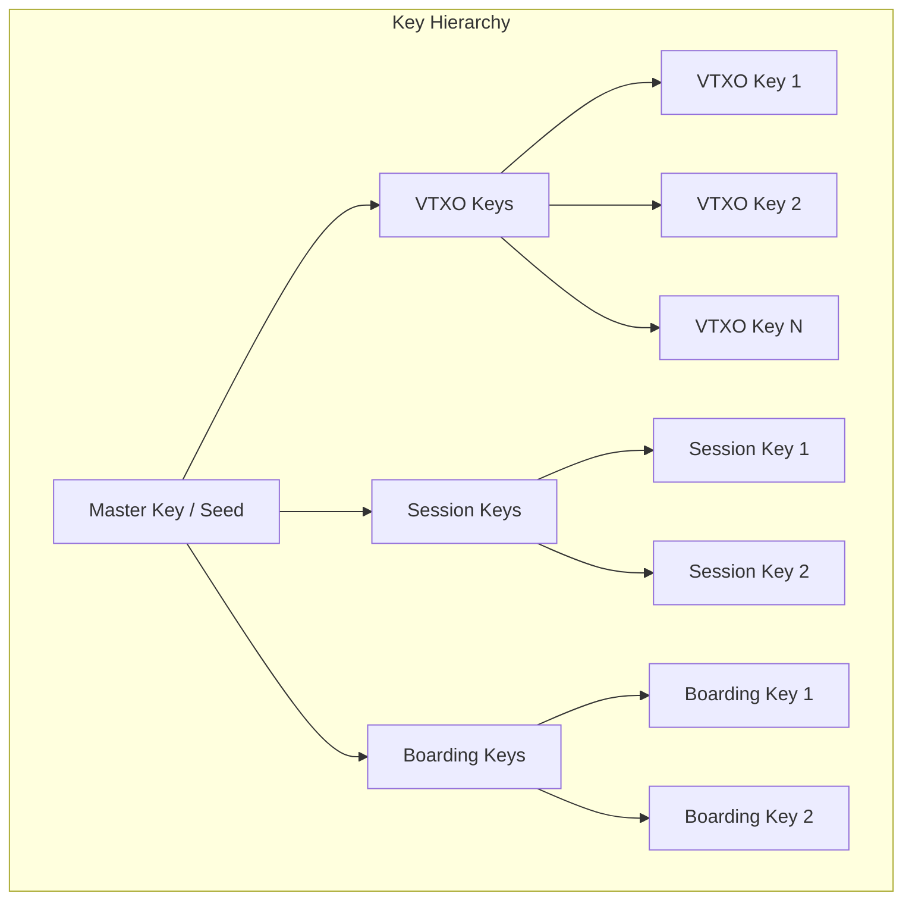
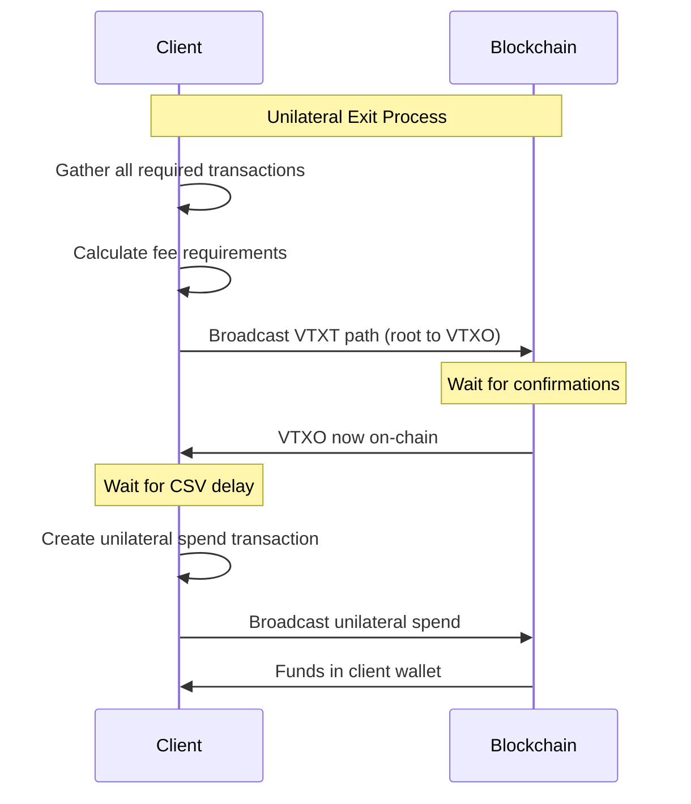

# ARK-05: Client Wallet Requirements

## Abstract

This document specifies the requirements for Ark client wallet implementations. It covers key management, state storage, verification procedures, and unilateral exit processes. Clients implementing this specification will be able to safely participate in the Ark protocol.

## Status

This specification is a working draft.

## Table of Contents

1. [Introduction](#introduction)
2. [Key Management](#key-management)
3. [State Storage Requirements](#state-storage-requirements)
4. [Verification Requirements](#verification-requirements)
5. [Unilateral Exit Procedure](#unilateral-exit-procedure)
6. [Operational Procedures](#operational-procedures)
7. [Security Considerations](#security-considerations)

## Introduction

### Client Responsibilities

An Ark client wallet is responsible for:

1. **Key management**: Generating, storing, and using cryptographic keys.
2. **State storage**: Maintaining data necessary for VTXO ownership and exit.
3. **Verification**: Validating all data received from the operator.
4. **Unilateral exit**: Broadcasting transactions to claim funds without operator cooperation.

### Trust Model

Clients MUST NOT trust the operator for:
- Custody of funds (clients can always exit unilaterally)
- Correctness of data (all data must be verified)

Clients MAY trust the operator for:
- Availability (operator being online to process transactions)
- Honest behavior (not signing conflicting transactions)

## Key Management

### Key Types



### VTXO Ownership Keys

VTXO ownership keys are used in VTXO output scripts for both collaborative and unilateral spending.

**Requirements:**
1. Keys MUST be derived from a BIP-32 HD wallet.
2. Each VTXO SHOULD use a unique key (for privacy).
3. Keys MUST be stored securely and backed up.

**Derivation Path (RECOMMENDED):**
```
m/ark'/<coin_type>'/<account>'/<change>/<index>

Where:
  ark' = hardened purpose for Ark (number TBD)
  coin_type' = 0' for mainnet, 1' for testnet
  account' = account number
  change = 0 for receiving, 1 for change
  index = sequential key index
```

### Session Keys

Session keys are ephemeral keys used for MuSig2 signing sessions during rounds.

**Requirements:**
1. MAY be derived or randomly generated.
2. MUST be unique per signing session.
3. SHOULD be stored temporarily during the round.
4. MAY be discarded after round completion.

**Usage:**
- Used in VTXT branch node aggregated keys.
- Allows round participation without exposing VTXO keys.

### Boarding Keys

Boarding keys are used in boarding UTXOs for entering the Ark.

**Requirements:**
1. MUST be derived from the HD wallet.
2. Each boarding UTXO SHOULD use a unique key.
3. Must be retained until boarding completes or times out.

**Derivation Path (RECOMMENDED):**
```
m/ark'/<coin_type>'/<account>'/2/<index>

Where change=2 indicates boarding keys
```

### Key Backup

Clients MUST ensure:

1. **Seed backup**: The master seed is securely backed up.
2. **Derivation reproducibility**: All keys can be regenerated from seed.
3. **Recovery process**: A documented process for wallet recovery.

**Warning:** Loss of keys results in permanent loss of funds.

## State Storage Requirements

### Minimum Required State

Clients MUST store sufficient state to:

1. Prove VTXO ownership.
2. Execute unilateral exit if needed.
3. Verify incoming VTXOs.

### VTXO Record

For each owned VTXO, store:

```
VTXORecord:
  // Identity
  vtxo_id: bytes32 (hash of outpoint)
  outpoint: (txid, vout)
  value: uint64 (satoshis)
  owner_pubkey: pubkey

  // Ownership proof
  vtxt_path: [SignedTransaction, ...]  // Path from batch output to VTXO
  commitment_tx: SignedTransaction
  batch_id: bytes32

  // Metadata
  batch_expiry: uint32 (block height)
  creation_height: uint32
  is_confirmed: bool  // Confirmed (VTXT leaf) vs preconfirmed (OOR)

  // For preconfirmed VTXOs
  oor_chain: [
    {
      checkpoint_tx: SignedTransaction
      ark_tx: SignedTransaction
    }, ...
  ]
```

### Storage Requirements by VTXO Type

#### Confirmed VTXO (Direct VTXT Leaf)

```
Required:
  - Commitment transaction (signed)
  - VTXT path transactions (signed)
  - VTXO output details
  - Owner key reference
```

#### Preconfirmed VTXO (From OOR)

```
Required (in addition to confirmed requirements):
  - All checkpoint transactions in chain
  - All Ark transactions in chain
  - Origin VTXO's confirmed data (recursive)
```

### Proof of Inclusion

For verification purposes, clients SHOULD store:

```
ProofOfInclusion:
  // For each VTXT transaction
  tx_proof: {
    txid: bytes32
    merkle_proof: [bytes32, ...]  // If commitment tx is deep in chain
  }

  // Alternative: Full blockchain headers
  // (Needed for SPV verification)
```

### Data Retention Policy

Clients MUST retain VTXO data until:

1. The VTXO is spent via OOR transaction AND the batch expires, OR
2. The VTXO is batch-swapped for a new confirmed VTXO AND the old batch expires, OR
3. The VTXO is unilaterally exited and confirmed.

**Warning:** Premature data deletion may result in inability to exit.

## Verification Requirements

### Commitment Transaction Verification

When receiving a commitment transaction, verify:

1. **Transaction validity**: Valid Bitcoin transaction structure.
2. **Inputs signed**: All inputs have valid signatures (or will after round completes).
3. **Expected outputs**: Contains expected batch outputs, leave outputs, etc.
4. **Value conservation**: Input sum >= output sum.

### VTXT Path Verification

When receiving VTXT path transactions, verify:

1. **Chain validity**: Each transaction spends from the correct parent.
2. **Root anchor**: The root spends from the commitment transaction batch output.
3. **Leaf validity**: The leaf transaction has the expected VTXO output.
4. **Script verification**: All output scripts match expected format.
5. **Signatures valid**: All transactions are properly signed.

**Verification Algorithm:**
```
function VerifyVTXTPath(commitment_tx, vtxt_path, expected_vtxo):
    // Start from root
    current_outpoint = (commitment_tx.txid, batch_output_index)

    for tx in vtxt_path:
        // Verify tx spends from expected outpoint
        assert tx.inputs[0].prev_outpoint == current_outpoint

        // Verify tx signature
        assert VerifySignature(tx)

        // Verify output script (for non-leaf)
        if not tx.is_leaf:
            assert VerifyBranchScript(tx.outputs[0])

        // Move to next level
        current_outpoint = (tx.txid, 0)

    // Verify final VTXO
    leaf_tx = vtxt_path[-1]
    vtxo_output = leaf_tx.outputs[expected_vtxo.output_index]

    assert vtxo_output.script == ExpectedVTXOScript(expected_vtxo)
    assert vtxo_output.value == expected_vtxo.value

    return true
```

### OOR Transaction Verification

When receiving or constructing OOR transactions:

1. **Input verification**: Each checkpoint input is valid.
2. **Signature verification**: All required signatures are present and valid.
3. **Output verification**: New VTXOs have correct script format.
4. **Value verification**: Output sum <= input sum.

### Incoming VTXO Verification

When receiving a VTXO from another party:

1. **Full chain verification**: Verify the entire chain back to the confirmed commitment transaction.
2. **Batch confirmation**: Verify the commitment transaction is confirmed on-chain.
3. **Operator signature**: Verify operator co-signed all transactions.
4. **Expiry check**: Verify sufficient time remains before batch expiry.

**Minimum Data Required from Sender:**
- Commitment transaction
- VTXT path to origin VTXO
- All checkpoint/Ark transactions to the received VTXO

### Verification Failures

If verification fails:

1. **Reject the transaction**: Do not sign or proceed.
2. **Log the failure**: Record details for debugging.
3. **Notify user**: Alert about the failed verification.
4. **Consider operator reputation**: Track operator failures.

## Unilateral Exit Procedure

### Overview

Unilateral exit allows claiming VTXO funds on-chain without operator cooperation.



### Step 1: Gather Required Transactions

Collect all transactions needed for exit:

**For Confirmed VTXO:**
- Commitment transaction (if not already on-chain)
- VTXT path transactions from root to VTXO leaf

**For Preconfirmed VTXO:**
- All of the above for origin VTXO
- All checkpoint transactions
- All Ark transactions
- Repeat for any cross-batch inputs

### Step 2: Calculate Fees

Estimate fees for all transactions:

```
total_fee = sum(tx_size * fee_rate for tx in transaction_chain)
             + final_spend_tx_size * fee_rate
             + safety_margin
```

**Fee considerations:**
- Each transaction in chain needs fees.
- Use current mempool fee rate.
- Include buffer for fee volatility.
- May need to use anchor outputs for fee bumping.

### Step 3: Broadcast Transaction Chain

Broadcast transactions in order:

1. Commitment transaction (if not confirmed).
2. VTXT branch transactions (root to leaf).
3. Checkpoint transactions (if preconfirmed VTXO).
4. Ark transactions (if preconfirmed VTXO).

**For each transaction:**
```
function BroadcastChain(transactions):
    for tx in transactions:
        // Check if already on-chain
        if IsConfirmed(tx.txid):
            continue

        // Broadcast
        BroadcastTransaction(tx)

        // Wait for confirmation (optional, or batch broadcast)
        WaitForConfirmation(tx.txid)
```

### Step 4: Wait for CSV Delay

After the VTXO appears on-chain:

1. Record the block height of VTXO confirmation.
2. Wait for `csv_delay` blocks.
3. Only then can the unilateral spend be broadcast.

```
spend_eligible_height = vtxo_confirmation_height + csv_delay
```

### Step 5: Create and Broadcast Unilateral Spend

Create the final transaction claiming funds:

```
Unilateral Spend Transaction:
  Version: 2
  Locktime: 0

  Inputs:
    - VTXO outpoint
      sequence: csv_delay (enables CSV check)
      witness: <signature> <unilateral_script> <control_block>

  Outputs:
    - Destination output (client wallet)
```

**Witness construction:**
1. Sign with VTXO owner key.
2. Include the unilateral exit script.
3. Include the taproot control block.

### Fee Bumping During Exit

If transactions are not confirming:

1. **Use anchor outputs**: Create child transaction spending anchor with higher fee.
2. **RBF if supported**: Replace with higher fee version.
3. **Monitor mempool**: Watch for confirmation.

### Exit Timing Requirements

**CRITICAL:** Unilateral exit MUST complete before batch expiry.

```
required_time = chain_length * avg_confirmation_time
              + csv_delay * avg_block_time
              + safety_margin

assert current_height + required_time < batch_expiry
```

If insufficient time remains:
- **Alert user immediately**
- **Use aggressive fees**
- **Consider partial exit** (if multiple VTXOs)

## Operational Procedures

### Batch Swap Timing

Clients SHOULD batch swap well before expiry:

```
recommended_swap_time = batch_expiry - (csv_delay * 2) - safety_margin
```

### Monitoring

Clients SHOULD monitor:

1. **Batch expiry**: Track expiry of all owned VTXOs.
2. **Operator status**: Verify operator remains responsive.
3. **Blockchain**: For SPV clients, track relevant transactions.

### Preconfirmed VTXO Handling

When receiving preconfirmed VTXOs:

1. **Verify immediately**: Don't accept without full verification.
2. **Batch swap soon**: Convert to confirmed VTXO when possible.
3. **Limit exposure**: Cap total value in preconfirmed state.

### Backup Procedures

Clients SHOULD:

1. **Regular backups**: Back up wallet state periodically.
2. **After each operation**: Backup after receiving new VTXOs.
3. **Multiple locations**: Store backups in multiple secure locations.

## Security Considerations

### Key Security

1. **Key isolation**: Keep signing keys separate from hot wallet.
2. **Hardware security**: Use hardware security modules where possible.
3. **Signature verification**: Verify all signatures before broadcasting.

### Operator Trust

1. **Verify everything**: Never trust operator data without verification.
2. **Track reputation**: Monitor operator behavior over time.
3. **Diversify**: Consider using multiple operators for large holdings.

### Exit Capability

1. **Always maintain exit capability**: Never lose ability to exit unilaterally.
2. **Test exits**: Periodically verify exit procedures work.
3. **Fee reserves**: Maintain on-chain funds for exit fees.

### Privacy Considerations

1. **Key reuse**: Avoid reusing keys across VTXOs.
2. **Transaction linking**: Be aware of linkability through on-chain transactions.
3. **Operator knowledge**: Operator knows all VTXO ownership.

### Attack Awareness

Be aware of potential attacks:

1. **Fee exhaustion**: Attacker tries to drain your on-chain funds via repeated unroll attempts.
2. **Timing attacks**: Attacks timed near batch expiry when exit is difficult.
3. **Collusion**: Operator collusion with malicious parties.

## References

1. BIP-32: Hierarchical Deterministic Wallets - https://github.com/bitcoin/bips/blob/master/bip-0032.mediawiki
2. ARK-00: Protocol Overview and Terminology
3. ARK-01: Transaction Formats and Script Specifications
4. ARK-03: Out-of-Round Transactions

## Authors

This specification was authored by the Lightning Labs team.

## Copyright

This document is licensed under CC0.
