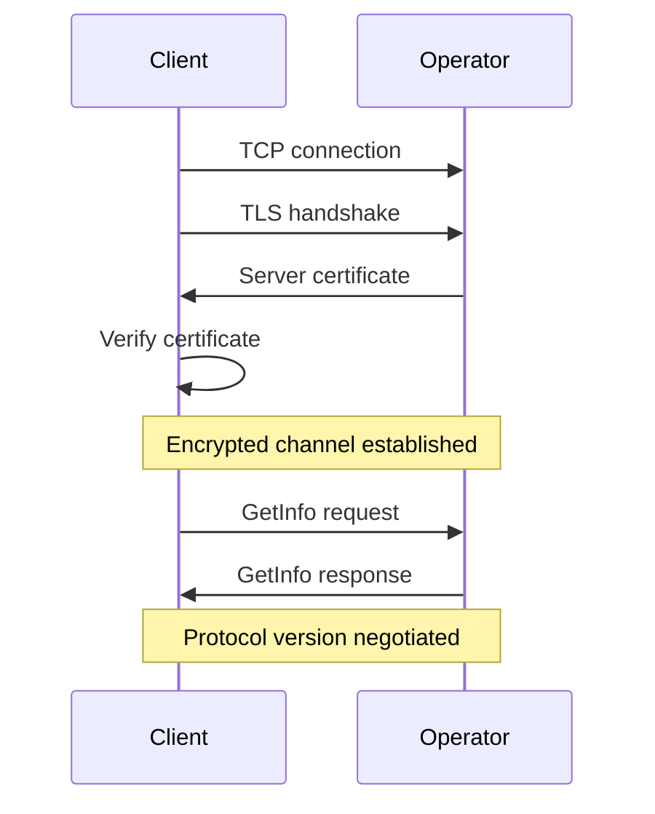
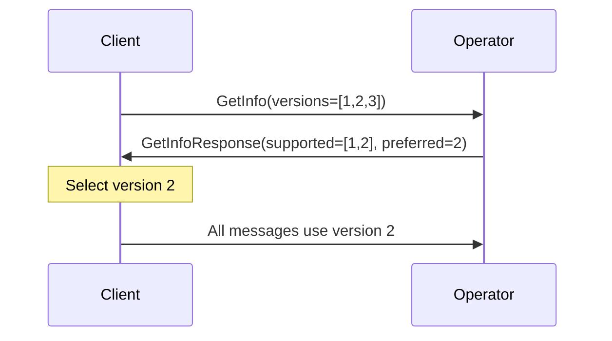

# ARK-06: Wire Protocol and Message Formats

## Abstract

This document specifies the wire protocol for client-operator communication in the Ark protocol. It defines the transport layer, message framing, all request/response message formats, and error handling.

## Status

This specification is version 1 (v1). The OOR submit response now
carries a typed rejection branch, the round flow includes the
seal-time fee handshake messages, and a cooperative `LeaveVTXOs` RPC
is normative. Legacy v0 paragraphs have been retired.

## Table of Contents

1. [Introduction](#introduction)
2. [Transport Layer](#transport-layer)
3. [Message Framing](#message-framing)
4. [Message Types](#message-types)
5. [Operator Information Messages](#operator-information-messages)
6. [Round Participation Messages](#round-participation-messages)
7. [OOR Transaction Messages](#oor-transaction-messages)
8. [Subscription Messages](#subscription-messages)
9. [Error Handling](#error-handling)
10. [Protocol Negotiation](#protocol-negotiation)

## Introduction

### Purpose

The wire protocol enables communication between Ark clients and operators. It supports:

- Querying operator capabilities and terms
- Participating in rounds
- Executing OOR transactions
- Subscribing to events

### Design Principles

1. **Simplicity**: Clear message structures with minimal ambiguity.
2. **Efficiency**: Compact encoding for bandwidth efficiency.
3. **Extensibility**: Version negotiation and optional fields for future growth.
4. **Security**: Authentication and encryption at transport layer.

## Transport Layer

### Connection Requirements

1. **TLS**: All connections MUST use TLS 1.3 or later.
2. **Certificate verification**: Clients SHOULD verify operator certificates.
3. **Persistent connections**: Connections SHOULD be long-lived for subscriptions.

### Connection Establishment



### Authentication

#### Operator Authentication

- Operators MUST present a valid TLS certificate.
- Clients SHOULD verify the certificate against known operator identity.
- Operators MAY use domain-validated or extended-validation certificates.

#### Client Authentication (Optional)

- Operators MAY require client authentication.
- Client authentication MAY use:
  - TLS client certificates
  - Challenge-response with client pubkey
  - External authentication tokens

### Recommended Transport

This specification RECOMMENDS gRPC over TLS as the transport layer:

- Well-defined service/method model
- Built-in streaming support for subscriptions
- Automatic code generation for multiple languages
- Established security practices

Alternative transports MAY be used if they satisfy the security requirements.

## Message Framing

### Encoding

Messages SHOULD be encoded using Protocol Buffers (protobuf) for:

- Compact binary representation
- Strong typing
- Cross-language support
- Schema evolution

### Message Structure

**Note:** The `GetInfo` request is special-cased: it MUST be accepted
regardless of the `version` field value, since the client does not yet know
the negotiated version. The operator SHOULD accept version `0` or any
supported version in `GetInfo` requests.

All messages follow this general structure:

```protobuf
message ArkMessage {
    // Message type identifier
    uint32 type = 1;

    // Protocol version
    uint32 version = 2;

    // Request ID for correlation
    bytes request_id = 3;

    // Payload (one of the message types)
    oneof payload {
        GetInfoRequest get_info_request = 10;
        GetInfoResponse get_info_response = 11;
        // ... other message types
    }
}
```

### Request/Response Pattern

Most interactions follow request/response:

1. Client sends request with unique `request_id`.
2. Operator processes request.
3. Operator returns response with matching `request_id`.

### Streaming Pattern

Subscriptions use server-side streaming:

1. Client sends subscription request.
2. Operator sends stream of events.
3. Client cancels subscription when done.

## Message Types

### Message Type Registry

| Type ID | Name | Direction | Description |
|---------|------|-----------|-------------|
| 1 | GetInfo | C→O | Query operator information |
| 2 | GetInfoResponse | O→C | Operator information |
| 10 | RegisterRound | C→O | Register for round participation |
| 11 | RegisterRoundResponse | O→C | Registration acknowledgment |
| 12 | GetRoundState | C→O | Query current round state |
| 13 | RoundState | O→C | Current round state |
| 20 | SubmitBoardingRequest | C→O | Submit boarding request |
| 21 | SubmitLeaveRequest | C→O | Submit leave request |
| 22 | SubmitBatchSwapRequest | C→O | Submit batch swap request |
| 23 | RequestResponse | O→C | Generic request acknowledgment |
| 24 | LeaveVTXOs | C→O | Cooperative leave (per-outpoint destinations) |
| 25 | LeaveVTXOsResponse | O→C | Per-outpoint admission result |
| 30 | RoundProposal | O→C | Batch TX and VTXT path |
| 31 | SubmitNonces | C→O | Submit MuSig2 nonces |
| 32 | AggregateNonces | O→C | Aggregated nonces |
| 33 | SubmitPartialSigs | C→O | Submit partial signatures |
| 34 | FinalSignatures | O→C | Final VTXT signatures |
| 35 | SubmitInputSigs | C→O | Submit input signatures |
| 36 | JoinRoundQuote | O→C | Per-client seal-time fee quote |
| 37 | JoinRoundAccept | C→O | Accept quote and bind designated change output |
| 38 | JoinRoundReject | C→O | Reject quote (or timeout) |
| 40 | SubmitArkTx | C→O | Submit OOR submit package (PSBT) |
| 41 | ArkTxResponse | O→C | OOR co-signed response (PSBT, with typed reject branch) |
| 42 | SubmitCheckpointSig | C→O | Submit OOR finalize package (PSBT) |
| 43 | NewReceiveScript | C→O | Allocate fresh receive script (OOR / directed-send) |
| 44 | NewReceiveScriptResponse | O→C | Fresh script + owner pubkey |
| 50 | SubscribeRounds | C→O | Subscribe to round events |
| 51 | RoundEvent | O→C | Round event notification |
| 52 | SubscribeVTXOs | C→O | Subscribe to VTXO events |
| 53 | VTXOEvent | O→C | VTXO event notification |
| 255 | Error | O→C | Error response |

## Operator Information Messages

### GetInfo

Query operator capabilities and current terms.

**Request:**
```protobuf
message GetInfoRequest {
    // Client's supported protocol versions
    repeated uint32 supported_versions = 1;
}
```

**Response:**
```protobuf
message GetInfoResponse {
    // Operator identity
    bytes operator_pubkey = 1;

    // Protocol versions
    repeated uint32 supported_versions = 2;
    uint32 preferred_version = 3;

    // Current operator terms
    OperatorTerms terms = 4;

    // Operator status
    OperatorStatus status = 5;

    // Optional feature flags
    OperatorFeatures features = 6;
}

message OperatorTerms {
    // Timelock parameters
    uint32 vtxo_csv_delay = 1;        // Blocks (CSV)
    uint32 boarding_timeout = 2;       // Blocks (CSV)
    uint32 checkpoint_timeout = 3;     // Blocks (CSV); equals vtxo_csv_delay
    uint32 sweep_delay = 4;             // Blocks (CSV sweep delay T_e)

    // Fee parameters
    uint64 min_relay_fee_rate = 5;     // sats/vbyte
    uint64 round_fee_rate = 6;         // sats/vbyte
    // Per-OOR submit fee is no longer carried here; the operator's
    // session fee is computed at round seal time by the seal-time
    // fee handshake (see RoundProposal / JoinRoundQuote below).

    // Limits
    uint32 max_vtxos_per_round = 8;
    uint32 max_vtxt_depth = 9;
    uint32 vtxt_radix = 10;
    uint32 connector_radix = 11;
    uint32 max_oor_chain_depth = 12;

    // OOR lineage cap (cumulative on-chain vbytes across the full
    // multi-input ancestry of an OOR submit). Default: 25,000.
    // See ARK-03 [Lineage Cap].
    uint32 max_oor_lineage_vbytes = 13;

    // Connector policy
    uint32 max_connectors_per_tree = 14; // Max connector leaves per tree
    uint64 connector_dust_amount = 15;   // Sats per connector leaf output
    bytes connector_address = 16;        // Operator P2TR connector address

    // Round schedule
    uint32 round_interval_seconds = 17;
    uint32 round_timeout_seconds = 18;

    // Maximum reseal iterations before round abort. See
    // ARK-02 [Seal-Time Fee Handshake].
    uint32 max_seal_passes = 19;
}

message OperatorStatus {
    // Current activity
    bool accepting_requests = 1;
    bytes current_round_id = 2;
    uint32 current_round_phase = 3;

    // Statistics
    uint32 active_batches = 4;
    uint64 total_vtxo_value = 5;
}
```

## Round Participation Messages

### RegisterRound

Register intent to participate in the next round.

**Request:**
```protobuf
message RegisterRoundRequest {
    // Types of requests the client intends to submit
    repeated RequestType intended_requests = 1;
}

enum RequestType {
    REQUEST_TYPE_BOARDING = 0;
    REQUEST_TYPE_LEAVE = 1;
    REQUEST_TYPE_BATCH_SWAP = 2;
}
```

**Response:**
```protobuf
message RegisterRoundResponse {
    // Round identifier
    bytes round_id = 1;

    // Expected timeline
    uint64 collection_deadline = 2;    // Unix timestamp
    uint32 expected_sweep_delay = 3;   // Sweep delay T_e (CSV blocks)
}
```

### SubmitBoardingRequest

Submit a boarding request to the current round.

**Request:**
```protobuf
message SubmitBoardingRequest {
    // Round identifier
    bytes round_id = 1;

    // Boarding UTXO details
    bytes boarding_txid = 2;
    uint32 boarding_vout = 3;
    uint64 boarding_value = 4;
    bytes boarding_script = 5;

    // Boarding proof
    bytes boarding_pubkey = 6;
    bytes ownership_proof = 7;  // Signature proving ownership

    // Requested VTXOs
    repeated VTXORequest vtxo_requests = 8;
}

message VTXORequest {
    bytes owner_pubkey = 1;       // VTXO ownership key (P_v)
    uint64 value = 2;             // Amount in satoshis
    uint32 expiry = 3;            // CSV delay for unilateral exit path (t_e)
    bytes pk_script = 4;          // Full P2TR pkScript (server verifies)
    bytes signing_pubkey = 5;     // Per-VTXO ephemeral VTXT signing key (P_s)
                                  // Used for MuSig2 branch node aggregation.
                                  // MUST be unique within the batch.
                                  // MUST differ from owner_pubkey.
}
```

### SubmitLeaveRequest

Submit a leave (exit) request.

**Request:**
```protobuf
message SubmitLeaveRequest {
    bytes round_id = 1;

    // VTXO being forfeited
    VTXOReference vtxo_ref = 2;
    bytes ownership_proof = 3;

    // Destination
    bytes destination_script = 4;
    uint64 destination_amount = 5;
}

message VTXOReference {
    bytes vtxo_id = 1;  // Hash identifier
    bytes outpoint_txid = 2;
    uint32 outpoint_vout = 3;
    bytes owner_pubkey = 4;
}
```

### SubmitBatchSwapRequest

Submit a batch swap request.

**Request:**
```protobuf
message SubmitBatchSwapRequest {
    bytes round_id = 1;

    // VTXOs being forfeited
    repeated VTXOReference vtxo_refs = 2;
    repeated bytes ownership_proofs = 3;

    // New VTXOs requested
    repeated VTXORequest vtxo_requests = 4;
}
```

### RoundProposal

Operator sends the constructed round to participants.

**Message:**
```protobuf
message RoundProposal {
    bytes round_id = 1;

    // Unsigned batch transaction
    bytes batch_tx = 2;

    // VTXT path for this participant
    repeated bytes vtxt_transactions = 3;

    // Connector transactions (REQUIRED for leave/batch-swap participants
    // who must verify the connector path before signing forfeits)
    repeated bytes connector_transactions = 4;

    // Connector leaf assignments (per forfeited VTXO)
    repeated ConnectorLeafAssignment connector_assignments = 5;

    // Forfeit transaction templates (one per forfeited VTXO)
    repeated ForfeitTxTemplate forfeit_tx_templates = 6;

    // Signing instructions
    repeated SigningInstruction signing_instructions = 7;
}

message ConnectorLeafAssignment {
    VTXOReference vtxo_ref = 1;
    bytes leaf_txid = 2;
    uint32 leaf_vout = 3;
    bytes leaf_output = 4; // serialized TxOut
}

message ForfeitTxTemplate {
    VTXOReference vtxo_ref = 1;
    bytes unsigned_tx = 2;      // unsigned forfeit tx
}

message SigningInstruction {
    bytes txid = 1;
    uint32 input_index = 2;
    bytes sighash = 3;
    repeated bytes cosigner_pubkeys = 4;
}
```

### Seal-Time Fee Handshake

After Phase 0 (Request Collection) closes, the operator computes a
per-client operator fee quote and runs a binding handshake with each
seal-cohort member before VTXT signing begins. See ARK-02
[Seal-Time Fee Handshake](ARK-02-rounds.md#seal-time-fee-handshake).

#### JoinRoundQuote

Operator → Client. One quote per cohort member per seal pass.

```protobuf
message JoinRoundQuote {
    bytes round_id = 1;
    bytes quote_id = 2;          // Round-scoped quote identifier

    // Operator-quoted fee for this client in this round.
    uint64 operator_fee = 3;

    // The change output the client MUST attach to its request set
    // so the operator's quote sums into a claimable balance.
    bytes designated_change_pk_script = 4;
    uint64 designated_change_value = 5;

    // Validity window. Clients MUST respond within this window or
    // the operator MUST treat the quote as rejected.
    uint32 valid_until_height = 6;

    // Seal pass index, monotonically increasing per round. Used by
    // the client to discard quotes from prior passes.
    uint32 seal_pass = 7;
}
```

#### JoinRoundAccept

Client → Operator. Accepts the quote and binds the client to the
designated change output.

```protobuf
message JoinRoundAccept {
    // UUID string identifying the round (matches the operator's
    // round-id wire encoding everywhere else in this protocol).
    string round_id = 1;

    // Per-pass quote identifier returned by the matching
    // JoinRoundQuote. The operator routes the accept on this field.
    bytes quote_id = 2;

    // Seal pass this accept is responding to. Operators MUST reject
    // an accept whose seal_pass does not match the current pass.
    uint32 seal_pass = 3;

    // OPTIONAL signature reserved for future enforcement. When
    // implemented, this MUST cover the canonical encoding of
    // {round_id, quote_id, seal_pass, request set, designated change
    // output} so the same payload cannot be replayed across passes
    // or quotes. v1 deployments MAY leave this field unset; clients
    // MUST NOT depend on operator-side verification of accept_sig
    // until a successor revision lifts this to a MUST.
    bytes accept_sig = 4;
}
```

#### JoinRoundReject

Client → Operator. Refuses the quote. A non-response within the
quote's validity window MUST be treated equivalently.

```protobuf
message JoinRoundReject {
    bytes round_id = 1;
    bytes quote_id = 2;
    uint32 seal_pass = 3;
    string reason = 4;          // Optional, informational
}
```

On any reject (explicit or by timeout) the operator MUST drop the
rejecting cohort member, recompute quotes over the survivors, and
send a fresh `JoinRoundQuote` round (`seal_pass + 1`). The operator
MUST NOT exceed `OperatorTerms.max_seal_passes` reseal iterations
before aborting the round.

### SubmitNonces

Submit MuSig2 nonces for VTXT signing.

**Request:**
```protobuf
message SubmitNoncesRequest {
    bytes round_id = 1;

    // Nonces for each transaction that needs signing
    repeated TransactionNonces tx_nonces = 2;
}

message TransactionNonces {
    bytes txid = 1;
    uint32 input_index = 2;
    bytes pubnonce = 3;  // BIP-327 public nonce
}
```

### AggregateNonces

Operator returns aggregated nonces.

**Response:**
```protobuf
message AggregateNoncesResponse {
    bytes round_id = 1;

    repeated AggregatedNonce agg_nonces = 2;
}

message AggregatedNonce {
    bytes txid = 1;
    uint32 input_index = 2;
    bytes aggregate_pubnonce = 3;
}
```

### SubmitPartialSigs

Submit partial signatures for VTXT.

**Request:**
```protobuf
message SubmitPartialSigsRequest {
    bytes round_id = 1;

    repeated TransactionPartialSig partial_sigs = 2;
}

message TransactionPartialSig {
    bytes txid = 1;
    uint32 input_index = 2;
    bytes partial_sig = 3;  // BIP-327 partial signature
}
```

### FinalSignatures

Operator returns final aggregated signatures.

**Response:**
```protobuf
message FinalSignaturesResponse {
    bytes round_id = 1;

    // Fully signed transactions
    repeated SignedTransaction signed_txs = 2;
}

message SignedTransaction {
    bytes txid = 1;
    bytes signed_tx = 2;  // Complete signed transaction
}
```

### SubmitInputSigs

Submit signatures for batch transaction inputs.

**Request:**
```protobuf
message SubmitInputSigsRequest {
    bytes round_id = 1;

    // For boarding inputs: client signature
    repeated BoardingInputSig boarding_sigs = 2;

    // For forfeits: unsigned forfeit tx + client VTXO signature
    repeated ForfeitTxSig forfeit_txs = 3;
}

message BoardingInputSig {
    bytes boarding_outpoint_txid = 1;
    uint32 boarding_outpoint_vout = 2;
    bytes client_sig = 3;
}

message ForfeitTxSig {
    bytes unsigned_tx = 1;
    bytes client_vtxo_sig = 2;
}
```

## OOR Transaction Messages

The OOR flow is defined in terms of PSBT submit/finalize packages
using BIP-340 script-path Schnorr signatures (NOT MuSig2). See ARK-03
for the full OOR flow description, including the lineage cap and
typed submit rejections.

### SubmitArkTx

Submit an OOR/Ark **submit package**.

**PSBT Profile Notes:**
- Ark PSBT MUST be canonicalized (BIP-69 style ordering: inputs by outpoint,
  non-anchor outputs by value then pkScript; single P2A anchor last).
- Ark PSBT transaction version MUST be 3 (TRUC).
- Each Ark PSBT input MUST include `WitnessUtxo` matching the referenced
  checkpoint output (script + value).
- Each Ark PSBT input MUST include an unknown field with key `taptree`
  containing the TLV-encoded tapleaf list for the checkpoint tap tree
  (see ARK-03 Tap Tree Encoding).
- Sender BIP-340 signatures for Ark inputs are attached to the PSBT.

**Request:**
```protobuf
message SubmitArkTxRequest {
    // Ark PSBT (unsigned or partially signed by sender)
    bytes ark_psbt = 1;

    // Checkpoint PSBTs (unsigned)
    repeated bytes checkpoint_psbts = 2;

    // Owner proof binding the requesting client to every input VTXO,
    // required by the server-authoritative lock authority before the
    // operator mutates lock state. See ARK-02
    // [Owner Proof for Lock Mutation].
    bytes owner_proof = 3;
}
```

**Response:**
```protobuf
message SubmitArkTxResponse {
    bool accepted = 1;

    // When accepted == false, this branch carries the typed reject
    // code. When accepted == true, this field MUST be unset.
    SubmitOORRejection rejection = 2;

    // Ark PSBT with operator signatures attached (only set when
    // accepted == true).
    bytes ark_psbt = 3;

    // Checkpoint PSBTs with operator signatures attached (only set
    // when accepted == true).
    repeated bytes checkpoint_psbts = 4;

    // New VTXO details (preconfirmed; only set when accepted == true).
    repeated VTXOInfo new_vtxos = 5;
}

message SubmitOORRejection {
    OORRejectCode code = 1;
    // Optional human-readable diagnostic detail. Clients MUST NOT
    // parse this field for protocol decisions; it is informational.
    string detail = 2;
}

enum OORRejectCode {
    OOR_REJECT_UNSPECIFIED       = 0; // Generic / fallback reject
    OOR_REJECT_LINEAGE_TOO_LARGE = 1; // Cumulative lineage exceeds cap
    // Additional codes may be defined in subsequent revisions;
    // clients MUST treat unknown codes as OOR_REJECT_UNSPECIFIED.
}

message VTXOInfo {
    bytes vtxo_id = 1;
    bytes outpoint_txid = 2;
    uint32 outpoint_vout = 3;
    uint64 value = 4;
    bytes owner_pubkey = 5;
    uint32 effective_expiry = 6;
}
```

### SubmitCheckpointSig

Submit the **finalize package**. This completes the OOR transfer by
providing the sender's checkpoint signatures.

The Ark PSBT MUST match the canonical Ark PSBT previously submitted (same
txid). It is included for deterministic input-to-checkpoint mapping.

**Request:**
```protobuf
message SubmitCheckpointSigRequest {
    // Ark PSBT (canonical, used to map inputs and tap tree metadata)
    bytes ark_psbt = 1;

    // Finalized checkpoint PSBTs (with client signatures)
    repeated bytes final_checkpoint_psbts = 2;
}
```

**Response:**
```protobuf
message SubmitCheckpointSigResponse {
    bool success = 1;

    // Final VTXO status
    repeated VTXOInfo finalized_vtxos = 2;
}
```

### NewReceiveScript

Allocate a fresh receive script for incoming OOR or directed-send
material. The same RPC backs both flows; a name change from the
earlier OOR-only name is reflected here.

**Request:**
```protobuf
message NewReceiveScriptRequest {
    // Optional label / wallet account hint. Operator policy decides
    // how to interpret it.
    string label = 1;
}
```

**Response:**
```protobuf
message NewReceiveScriptResponse {
    // Fresh P2TR pkScript the client controls. Used by senders as
    // the destination for OOR transfers and directed sends.
    bytes pk_script = 1;

    // Owner pubkey associated with the script (P_v).
    bytes owner_pubkey = 2;
}
```

### LeaveVTXOs

Cooperative leave RPC: exit one or more VTXOs to on-chain destinations
in the next round the requesting client is admitted to. See ARK-02
[Cooperative Leave](ARK-02-rounds.md#cooperative-leave-leavevtxos).

**Request:**
```protobuf
message LeaveVTXOsRequest {
    // VTXOs to forfeit and the destination for each.
    repeated LeaveVTXODestination leaves = 1;

    // Owner proof binding the requesting client to every outpoint.
    // Required for lock acquisition.
    bytes owner_proof = 2;
}

message LeaveVTXODestination {
    VTXOReference vtxo_ref = 1;
    // Destination script for the on-chain leave output. A client MAY
    // share one destination across multiple outpoints by repeating
    // it; per-outpoint uniqueness is permitted but not required.
    bytes destination_script = 2;
}
```

**Response:**
```protobuf
message LeaveVTXOsResponse {
    // Round id the leaves are admitted to.
    bytes round_id = 1;

    // Per-VTXO admission result. The operator MUST report a stable
    // outcome per outpoint so a client can reconcile partial
    // failures.
    repeated LeaveAdmission admissions = 2;
}

message LeaveAdmission {
    VTXOReference vtxo_ref = 1;
    bool admitted = 2;
    // Set when admitted == false. Maps onto VTXO_LOCKED (3001) and
    // related error codes from the Error Codes table.
    uint32 error_code = 3;
}
```

## Subscription Messages

### SubscribeRounds

Subscribe to round lifecycle events.

**Request:**
```protobuf
message SubscribeRoundsRequest {
    // Filter by round (empty = all rounds)
    bytes round_id = 1;

    // Event types to receive
    repeated RoundEventType event_types = 2;
}

enum RoundEventType {
    ROUND_STARTED = 0;
    ROUND_COLLECTION_ENDED = 1;
    ROUND_CONSTRUCTION_COMPLETE = 2;
    ROUND_SIGNING_STARTED = 3;
    ROUND_SIGNED = 4;
    ROUND_BROADCAST = 5;
    ROUND_CONFIRMED = 6;
    ROUND_ABORTED = 7;
}
```

**Event Stream:**
```protobuf
message RoundEvent {
    bytes round_id = 1;
    RoundEventType event_type = 2;
    uint64 timestamp = 3;

    // Event-specific data
    oneof event_data {
        RoundStartedData round_started = 10;
        RoundConfirmedData round_confirmed = 11;
        RoundAbortedData round_aborted = 12;
    }
}

message RoundStartedData {
    uint64 collection_deadline = 1;
}

message RoundConfirmedData {
    bytes batch_txid = 1;
    uint32 confirmation_height = 2;
}

message RoundAbortedData {
    string reason = 1;
}
```

### SubscribeVTXOs

Subscribe to VTXO state changes.

**Request:**
```protobuf
message SubscribeVTXOsRequest {
    // Filter by VTXO IDs (empty = all)
    repeated bytes vtxo_ids = 1;

    // Filter by owner pubkey
    bytes owner_pubkey = 2;

    // Event types
    repeated VTXOEventType event_types = 3;
}

enum VTXOEventType {
    VTXO_CREATED            = 0;
    VTXO_LIVE               = 1;
    VTXO_SPENT              = 2;
    VTXO_FORFEIT            = 3;
    VTXO_UNROLLED           = 4;
    VTXO_EXPIRED            = 5;

    // Terminal after the operator's multihop checkpoint ratchet
    // resolved on a still-live recipient: walked Spent VTXOs are
    // reported under this event instead of VTXO_UNROLLED. See ARK-04
    // [Spent → UnrolledByClient (Multihop Ratchet Terminal)].
    VTXO_UNROLLED_BY_CLIENT = 6;

    // Terminal after a forfeit transaction confirms (operator
    // reclaimed funds through the connector + forfeit chain). See
    // ARK-04 [Response to Forfeit VTXO Unroll].
    VTXO_RECLAIMED          = 7;
}
```

**Event Stream:**
```protobuf
message VTXOEvent {
    bytes vtxo_id = 1;
    VTXOEventType event_type = 2;
    uint64 timestamp = 3;

    // VTXO details
    VTXOInfo vtxo_info = 4;

    // Event-specific data
    oneof event_data {
        VTXOCreatedData created = 10;
        VTXOSpentData spent = 11;
    }
}

message VTXOCreatedData {
    bytes round_id = 1;
    bool is_confirmed = 2;  // True if from VTXT, false if from OOR

    // For preconfirmed VTXOs (is_confirmed=false), include the OOR
    // package data so the recipient can validate and materialize:
    bytes ark_psbt = 3;                    // The Ark transaction PSBT
    repeated bytes checkpoint_psbts = 4;   // Checkpoint PSBTs in chain
}

message VTXOSpentData {
    bytes spending_tx_id = 1;  // Ark TX ID or forfeit
}
```

## Error Handling

### Error Response

**Message:**
```protobuf
message ErrorResponse {
    // Request that caused the error
    bytes request_id = 1;

    // Error code
    uint32 error_code = 2;

    // Human-readable message
    string message = 3;

    // Additional details
    map<string, string> details = 4;
}
```

### Error Codes

| Code | Name | Description |
|------|------|-------------|
| 1000 | UNKNOWN | Unknown error |
| 1001 | INVALID_REQUEST | Malformed request |
| 1002 | UNAUTHORIZED | Authentication required |
| 1003 | FORBIDDEN | Operation not permitted |
| 1004 | NOT_FOUND | Resource not found |
| 1005 | TIMEOUT | Operation timed out |
| 1006 | INTERNAL_ERROR | Server internal error |
| 2000 | ROUND_NOT_ACTIVE | No active round |
| 2001 | ROUND_PHASE_INVALID | Wrong phase for operation |
| 2002 | ROUND_FULL | Round capacity reached |
| 2003 | ROUND_ABORTED | Round was aborted |
| 3000 | VTXO_NOT_FOUND | VTXO doesn't exist |
| 3001 | VTXO_LOCKED | VTXO is locked |
| 3002 | VTXO_SPENT | VTXO already spent |
| 3003 | VTXO_EXPIRED | VTXO batch expired |
| 3004 | VTXO_INVALID_PROOF | Invalid ownership proof |
| 4000 | BOARDING_NOT_FOUND | Boarding UTXO not found |
| 4001 | BOARDING_UNCONFIRMED | Insufficient confirmations |
| 4002 | BOARDING_INVALID_SCRIPT | Invalid boarding script |
| 5000 | SIGNATURE_INVALID | Invalid signature |
| 5001 | NONCE_INVALID | Invalid nonce |
| 5002 | VALUE_MISMATCH | Value doesn't match |
| 6000 | POLICY_VIOLATION | Policy limit exceeded |
| 6001 | FEE_INSUFFICIENT | Insufficient fee |

### Error Handling Recommendations

Clients SHOULD:

1. **Retry transient errors**: Network timeouts, internal errors.
2. **Don't retry permanent errors**: Invalid requests, not found.
3. **Backoff on rate limits**: Exponential backoff for 429-style errors.
4. **Log errors**: Maintain logs for debugging.

## Protocol Negotiation

### Version Negotiation

On connection:

1. Client sends `GetInfo` with supported versions.
2. Operator returns supported and preferred versions.
3. Client selects highest common version.
4. All subsequent messages use negotiated version.



### Feature Negotiation

Operators MAY advertise optional features:

```protobuf
message OperatorFeatures {
    bool supports_cross_batch_oor = 1;  // OOR txs can spend VTXOs from different batches
    bool supports_client_auth = 2;       // Operator requires client authentication
    bool supports_oor_transactions = 3;  // Operator supports OOR/Ark transactions
    // Future extensions
}
```

**Note:** `supports_oor_transactions` indicates whether the operator supports Out-of-Round (OOR/Ark) transactions for instant off-chain transfers. Operators that set this to false only support batch operations (boarding, leaving, batch swaps), requiring users to wait for rounds. This may be useful for operators with limited liquidity or simplified implementations.

Clients MUST NOT use features not advertised by the operator.

## References

1. Protocol Buffers - https://developers.google.com/protocol-buffers
2. gRPC - https://grpc.io/
3. BIP-327: MuSig2 - https://github.com/bitcoin/bips/blob/master/bip-0327.mediawiki
4. ARK-00: Protocol Overview and Terminology
5. ARK-02: Round Lifecycle Protocol
6. ARK-03: Out-of-Round Transactions

## Authors

This specification was authored by the Lightning Labs team.

## Copyright

This document is licensed under CC0.
