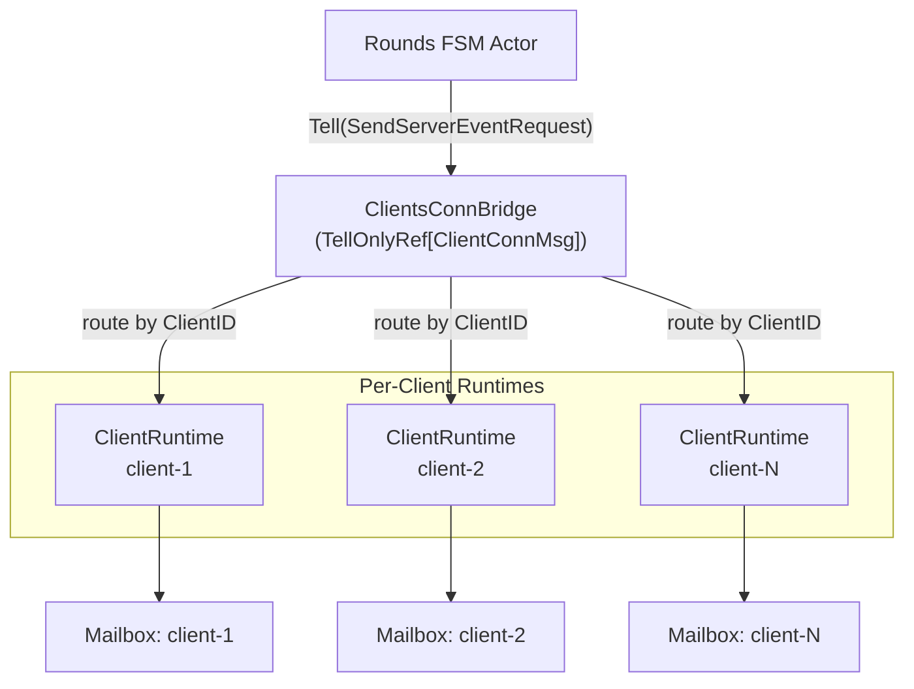
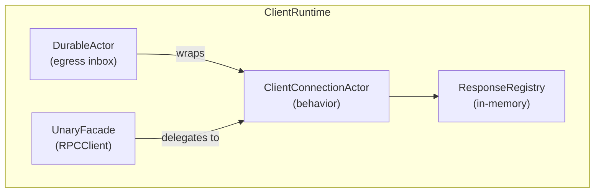
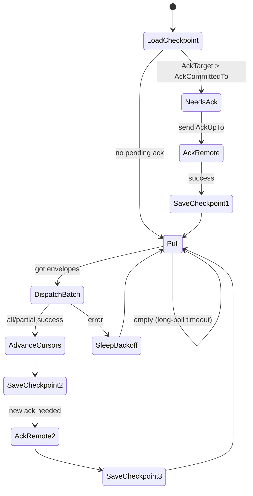
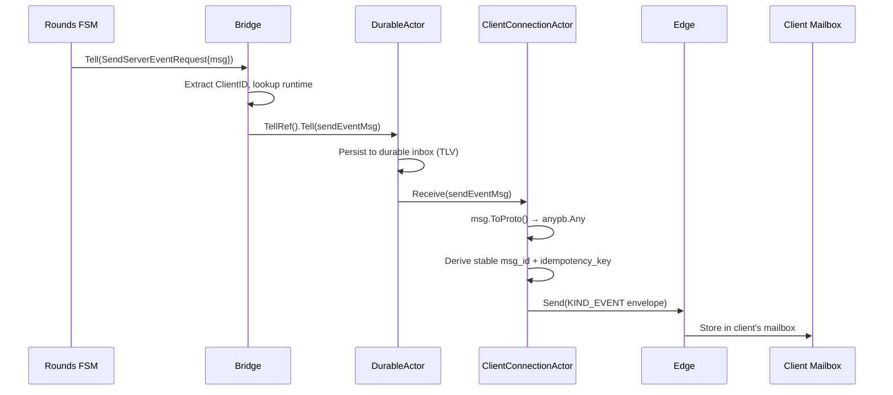
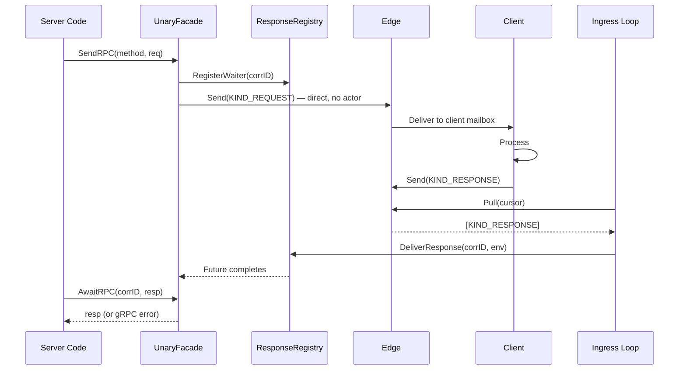
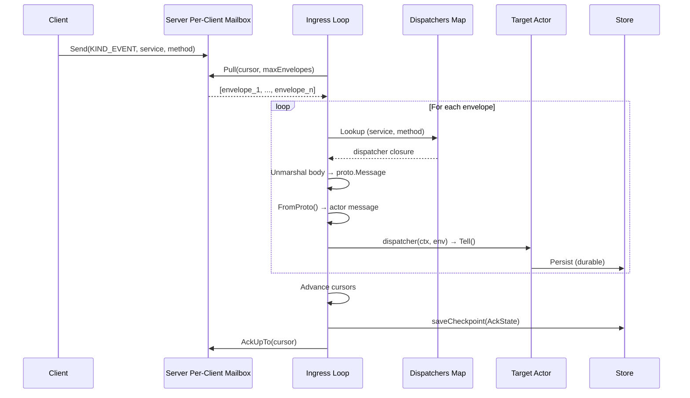
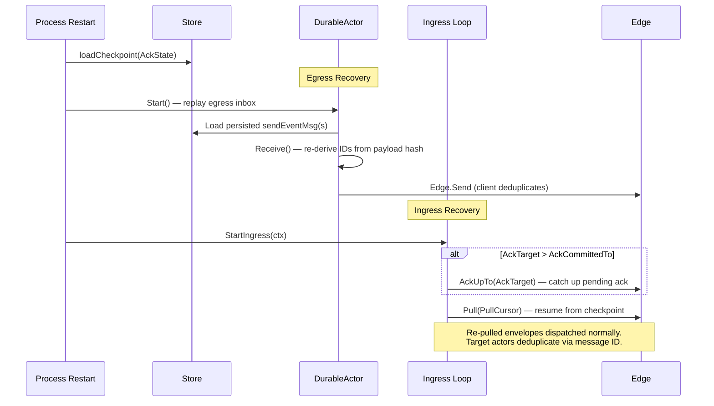

# Client Connection Architecture

This document explains the architecture of the `clientconn` package — the
server-side bridge for communicating with N clients via the durable actor runtime
and mailbox system. It serves as a reference for agents and developers working on
the server-side connector, round FSM integration, or the mailbox transport
layer.

For the client-side counterpart (1:1 topology), see the `darepo-client`
repository's
[`docs/mailbox_architecture.md`](https://github.com/lightninglabs/darepo-client/blob/main/docs/mailbox_architecture.md)
and
[`serverconn/README.md`](https://github.com/lightninglabs/darepo-client/blob/main/serverconn/README.md).
For the protocol-level contract, see
[`docs/RPC_MAILBOX_CONTRACT.md`](https://github.com/lightninglabs/darepo-client/blob/main/docs/RPC_MAILBOX_CONTRACT.md).

## Table of Contents

1. [Overview](#overview)
2. [1:N Topology](#1n-topology)
3. [Component Architecture](#component-architecture)
   - [ClientsConnBridge](#clientsconnbridge)
   - [ClientRuntime](#clientruntime)
   - [ClientConnectionActor](#clientconnectionactor)
   - [UnaryFacade](#unaryfacade)
   - [EventRouter](#eventrouter)
   - [Ingress Loop](#ingress-loop)
4. [Key Data Flows](#key-data-flows)
   - [Server-to-Client Event Egress](#server-to-client-event-egress)
   - [Server-to-Client Unary RPC](#server-to-client-unary-rpc)
   - [Client-to-Server Event Ingress](#client-to-server-event-ingress)
5. [TLV Message Types](#tlv-message-types)
6. [Ack Watermark State Machine](#ack-watermark-state-machine)
7. [Crash Recovery](#crash-recovery)
8. [Client Lifecycle](#client-lifecycle)
9. [Configuration and Defaults](#configuration-and-defaults)
10. [Relationship to serverconn](#relationship-to-serverconn)
11. [Extension Points](#extension-points)

---

## Overview

The mailbox transport replaces direct gRPC streaming with a store-and-forward
model. The server sends events to a client's mailbox regardless of whether the
client is currently connected. Messages accumulate and are delivered when the
client next polls. This async-first model means the server never needs to know if
a client is online — `Edge.Send()` writes to the mailbox service, and delivery
happens asynchronously.

The key asymmetry from the client-side `serverconn` package: `serverconn` is 1:1
(one client talks to one server), while `clientconn` is 1:N (one server manages
many clients). Each registered client gets its own:

- **DurableActor** for crash-safe egress
- **Ingress loop** pulling from the server's per-client mailbox
- **ResponseRegistry** for unary RPC correlation
- **UnaryFacade** implementing `mailboxrpc.RPCClient`

## 1:N Topology



The bridge is not an actor — it implements `TellOnlyRef[ClientConnMsg]` directly.
When the rounds FSM calls `Tell()`, the bridge extracts the target `ClientID`,
looks up the per-client runtime, and forwards to that client's DurableActor.
This avoids a monolithic actor bottleneck for N clients.

## Component Architecture

### ClientsConnBridge

The top-level router. Manages the lifecycle of all per-client runtimes.

```go
type ClientsConnBridge struct {
    mu         sync.RWMutex
    clients    map[ClientID]*ClientRuntime
    maxClients int  // 0 = unlimited
}
```

Key operations:
- `Tell(ctx, msg)` — Routes `SendServerEventRequest` to the correct per-client
  `DurableActor`. Holds `RLock` across the entire routing + Tell to prevent
  TOCTOU races with concurrent `DeregisterClient`.
- `RegisterClient(ctx, id, cfg)` — Creates and starts a `ClientRuntime`.
  Validates config, enforces mailbox ID uniqueness, and respects `MaxClients`.
- `DeregisterClient(id)` — Stops the runtime and removes it from the map.
- `GetClient(id)` / `GetUnary(id)` — Returns `(value, bool)` for safe lookup.
- `Stop()` — Shuts down all clients.

### ClientRuntime

Composes the three per-client components into a single lifecycle unit:



- `Start(ctx)` spins up the DurableActor (begins processing egress inbox) and
  the ingress goroutine (loads checkpoint, starts pulling).
- `Stop()` cancels the ingress loop, waits for it to exit, then stops the
  DurableActor.
- `TellRef()` returns a `TellOnlyRef` for durable egress (promoted from the
  embedded DurableActor).
- `Unary()` returns the per-client `UnaryFacade`.

### ClientConnectionActor

The per-client behavior implementing
`actor.ActorBehavior[connectorMsg, connectorResp]`. It serves dual roles:

**Egress (via Receive)**: Processes `sendEventMsg` and `sendRPCMsg` from the
durable inbox. Converts proto payloads to envelopes and sends via `Edge.Send`.

**Ingress (via StartIngress)**: Runs a background goroutine that long-polls the
server's per-client mailbox for inbound envelopes (client → server messages).

Lifecycle state machine:
```
     ┌─────────┐
     │  idle   │
     └────┬────┘
          │ StartIngress()
     ┌────▼────┐
     │ started │──── StopIngress() ───┐
     └─────────┘                      │
                                 ┌────▼────┐
                                 │ stopped │
                                 └─────────┘
```

- `StartIngress` must be called exactly once (returns error on double-call).
- `StopIngress` is safe to call multiple times and before `StartIngress`.
- The ingress goroutine uses `context.Background()` so its lifetime is tied only
  to `StopIngress`, not to the caller's (potentially request-scoped) context.

### UnaryFacade

Implements `mailboxrpc.RPCClient` for server-initiated unary RPCs to a specific
client. The two-phase send+await pattern:

1. **SendRPC**: Pre-registers a response waiter (so fast responses between Send
   and AwaitRPC are buffered, not dropped), builds the `KIND_REQUEST` envelope
   with correlation ID and idempotency key, sends via `Edge.Send` directly (no
   durable mailbox — callers retry on failure).

2. **AwaitRPC**: Blocks on the response future. When the ingress loop delivers a
   `KIND_RESPONSE` envelope with a matching correlation ID, the future completes.
   Decodes gRPC error headers before inspecting the body.

Correlation IDs are 128-bit crypto-random hex strings (`crypto/rand`), making
prediction attacks infeasible.

### EventRouter

Maps inbound `(service, method)` pairs to typed actor dispatch closures. Used to
route `KIND_REQUEST` and `KIND_EVENT` envelopes from clients to server-side
actors.

```go
router := clientconn.NewEventRouter(system)

clientconn.NewEventRoute(router, clientconn.InboundEventRouteConfig[
    *roundStartedMsg, roundResp,
]{
    Service:  "roundtest.v1.RoundEventService",
    Method:   "RoundStarted",
    NewEvent: func() proto.Message {
        return &roundtestpb.RoundStartedEvent{}
    },
    Key:    roundsActorKey,
    NewMsg: func() *roundStartedMsg {
        return &roundStartedMsg{}
    },
})
```

`InboundEventRouteConfig` auto-generates the adapt closure from `FromProto`, so
wiring a new client→server event type is a one-liner at registration time.

Route properties:
- Thread-safe (mutex-protected).
- Re-registration replaces the previous route (idempotent).
- `AsDispatcherMap()` returns a `DispatcherMap` for the config.
- Panics on invalid config (empty service/method) — these are programming errors
  at wiring time, not runtime conditions.

### Ingress Loop

The background goroutine that pulls envelopes from the server's per-client
mailbox and dispatches them to local actors. Implements the same
pull-dispatch-ack cycle as `serverconn/ingress.go`:



Key properties:
- **At-least-once delivery**: Envelopes are acked only after successful dispatch
  to a durable actor (i.e., `Tell` returned nil, confirming persistence).
- **Partial batch progress**: If envelope 3 of 5 fails dispatch, the cursor
  advances to envelope 2 (the last safe point). The failed envelope is retried
  on the next pull.
- **Exponential backoff with jitter**: Transient failures (pull, ack, dispatch)
  trigger exponential backoff with 50–100% jitter to prevent thundering herd.
- **Three envelope kinds**:
  - `KIND_RESPONSE` → delivered to `ResponseRegistry` (unary RPC correlation)
  - `KIND_REQUEST` / `KIND_EVENT` → routed via `Dispatchers` map to local actors

## Key Data Flows

### Server-to-Client Event Egress



The durable path guarantees: when `Bridge.Tell` returns nil, the message is
crash-safe in the per-client durable mailbox. On replay after crash, the same
`msg_id` and `idempotency_key` are re-derived from the persisted TLV payload,
so the client deduplicates.

### Server-to-Client Unary RPC



### Client-to-Server Event Ingress



## TLV Message Types

Two message types flow through the per-client durable actor mailbox. These use
the 3000 range to avoid collision with `serverconn`'s 2000 range.

| TLV Type | Go Type | Records | Description |
|----------|---------|---------|-------------|
| `3000` | `sendEventMsg` | proto payload (Any), msg_id, idempotency_key, client_id | FSM outbox event for durable egress. |
| `3001` | `sendRPCMsg` | envelope (WrappedProto) | Pre-built unary RPC envelope (retained for future crash-safe RPC path). |

Both implement `actor.TLVMessage` (`TLVType`, `Encode`, `Decode`).

The `sendEventMsg` stores the `client_id` in TLV for replay fidelity — so
`rawClientMessage.ClientID()` returns the correct value after deserialization.
The `msg_id` and `idempotency_key` are derived from the payload SHA256 hash
(via `StableEventMsgID` / `StableEventIdempotencyKey`) for deterministic
identity across replays.

## Ack Watermark State Machine

The ingress loop maintains a four-cursor `AckState` checkpoint:

| Cursor | Meaning |
|--------|---------|
| `PullCursor` | Next `EventSeq` to request from `Edge.Pull`. |
| `DispatchTarget` | Highest `EventSeq` that has been dispatched to a local actor. |
| `DispatchCommittedTo` | Highest `EventSeq` persisted in the checkpoint. |
| `AckTarget` | Highest `EventSeq` for which an ack should be sent to the remote edge. |
| `AckCommittedTo` | Highest `EventSeq` for which the ack has been persisted in the checkpoint. |

Invariant: `AckCommittedTo ≤ AckTarget ≤ DispatchCommittedTo ≤ DispatchTarget ≤ PullCursor`

The two-phase checkpoint (dispatch → ack) ensures:
- No envelope is acked before it is durably dispatched.
- On crash between dispatch and ack, the envelope is re-pulled and re-dispatched
  (at-least-once). The target durable actor deduplicates via message ID.
- On crash between ack and checkpoint save, the ack is replayed on restart
  (`AckUpTo` is idempotent).

## Crash Recovery



**Egress**: DurableActor replays all unacknowledged messages from its persistent
inbox. Stable IDs ensure idempotent retransmission.

**Ingress**: The checkpoint restores cursor positions. If an ack was pending
(`AckTarget > AckCommittedTo`), it is replayed first. Then pulling resumes from
`PullCursor`.

**Unary RPC**: Response waiters are in-memory only. On crash, callers' contexts
are cancelled and they retry with new correlation IDs.

## Client Lifecycle

```
RegisterClient(ctx, id, cfg)
    ├── Validate config (store, edge, mailbox IDs, dispatchers, protocol version)
    ├── Check mailbox ID uniqueness across all clients
    ├── Check MaxClients limit
    ├── NewClientRuntime(cfg) → runtime
    ├── runtime.Start(ctx)
    │     ├── DurableActor.Start() — begin egress processing
    │     └── StartIngress(ctx) — load checkpoint, launch pull goroutine
    └── Register in bridge.clients map

DeregisterClient(id)
    ├── runtime.Stop()
    │     ├── StopIngress() — cancel + wait for pull goroutine
    │     └── DurableActor.Stop() — drain egress inbox
    └── Remove from bridge.clients map

Bridge.Stop()
    └── For each client: runtime.Stop() + remove
```

## Configuration and Defaults

| Field | Type | Default | Required | Notes |
|-------|------|---------|----------|-------|
| `Edge` | `MailboxServiceClient` | — | Yes | gRPC client for the remote mailbox edge. |
| `LocalMailboxID` | `string` | — | Yes | Server's per-client mailbox. Must differ from `RemoteMailboxID`. |
| `RemoteMailboxID` | `string` | — | Yes | Client's mailbox. Must be unique across all registered clients. |
| `ProtocolVersion` | `uint32` | — | Yes | Must be non-zero. |
| `Dispatchers` | `DispatcherMap` | — | Yes | Must be non-empty. |
| `Store` | `actor.DeliveryStore` | — | Yes | Shared by DurableActor and checkpoint persistence. |
| `Codec` | `*actor.MessageCodec` | `newClientConnCodec()` | No | TLV codec for connectorMsg. |
| `PullMaxEnvelopes` | `uint32` | `50` | No | Envelopes per Pull call. |
| `PullWaitTimeout` | `time.Duration` | `5s` | No | Long-poll timeout. |
| `RetryBaseDelay` | `time.Duration` | `200ms` | No | Backoff base delay. |
| `RetryMaxDelay` | `time.Duration` | `30s` | No | Backoff cap. |
| `ResponseWaiterTTL` | `time.Duration` | `10m` | No | TTL for waiters and buffered responses. |

Bridge options:
- `WithMaxClients(n)` — Bounds concurrent registrations. Default: unlimited.
- `WithStatusTracker(t)` — Informational client liveness tracking.

## Relationship to serverconn

`clientconn` is the server-side mirror of `darepo-client/serverconn`. They share
the same mailbox primitives (`mailbox/conn`, `mailbox/pb`, `mailbox/rpc`) but
differ in topology and naming:

| Aspect | `serverconn` (in darepo-client) | `clientconn` (in darepo) |
|--------|--------------------------------|--------------------------|
| Runs on | Client process | Server process |
| Topology | 1:1 (one server) | 1:N (many clients) |
| Entry point | `Runtime` | `ClientsConnBridge` → N × `ClientRuntime` |
| Egress direction | Client → Server | Server → Client (per-client) |
| Ingress direction | Server → Client | Client → Server (per-client) |
| TLV type range | 2000–2001 | 3000–3001 |
| Durable actor ID | `"serverconn-" + mailboxID` | `"clientconn-" + mailboxID` |
| Config struct | `ConnectorConfig` | `PerClientConfig` |

The code structure is intentionally parallel:

| serverconn file | clientconn file | Purpose |
|-----------------|-----------------|---------|
| `actor.go` | `actor.go` | TLV messages, behavior, codec |
| `runtime.go` | `runtime.go` + `bridge.go` | Lifecycle (+ 1:N routing) |
| `ingress.go` | `ingress.go` | Pull-dispatch-ack loop |
| `unary_facade.go` | `unary_facade.go` | RPCClient implementation |
| `event_router.go` | `event_router.go` | ServiceKey dispatch |
| `types.go` | `types.go` | Config, type aliases |

## Extension Points

Areas where future work may extend this package:

1. **StatusTracker integration**: Wire real client liveness detection (gRPC
   connection state, heartbeat) into the `StatusTracker` interface. The bridge
   already supports `WithStatusTracker` and `ClientStatus` queries.

2. **Crash-safe unary RPC egress**: The `sendRPCMsg` TLV type (3001) and
   `handleSendRPC` behavior are retained but unused — `UnaryFacade` sends RPCs
   directly via `Edge.Send` (callers retry on failure). If crash-safe RPC
   delivery is needed, the durable path is ready to activate.

3. **Per-client metrics**: The ingress loop and egress behavior could emit
   Prometheus metrics (envelopes sent/received, dispatch latency, backoff
   count). No metrics are wired today.

4. **Graceful drain on deregistration**: `DeregisterClient` stops immediately.
   A drain mode that waits for the DurableActor to process all queued messages
   before stopping would prevent message loss on planned deregistration.

5. **Dynamic dispatcher updates**: Currently, dispatchers are fixed at
   registration time. Hot-swapping the dispatch table would allow adding new
   event routes without re-registering the client.
