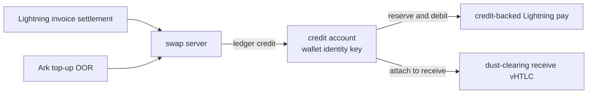
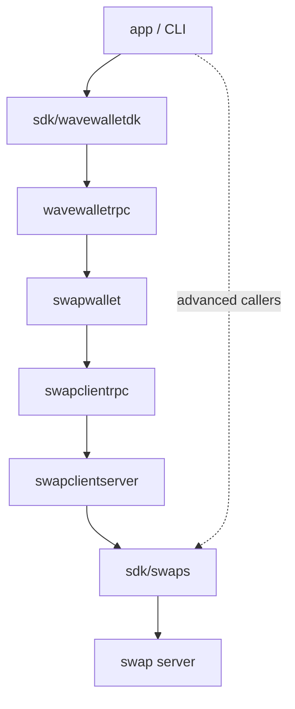
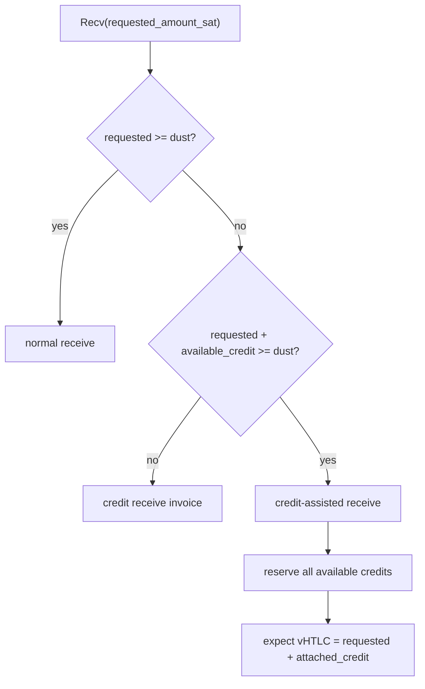
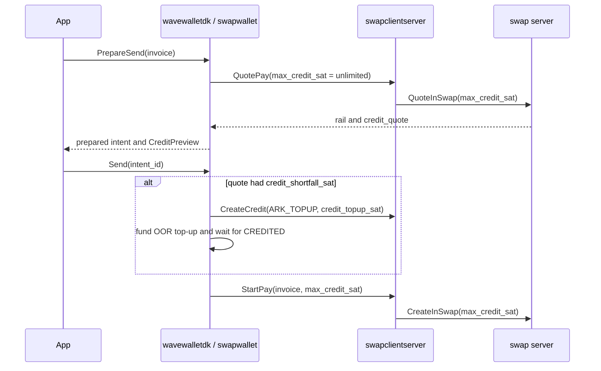
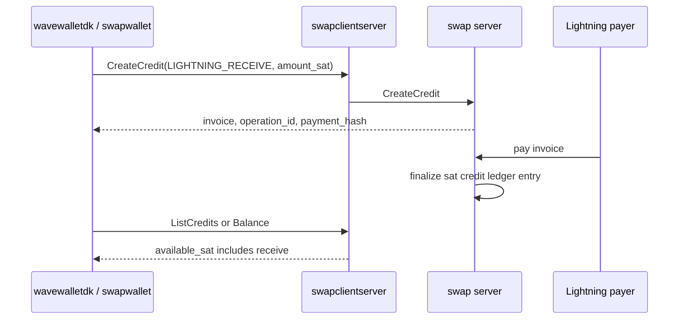
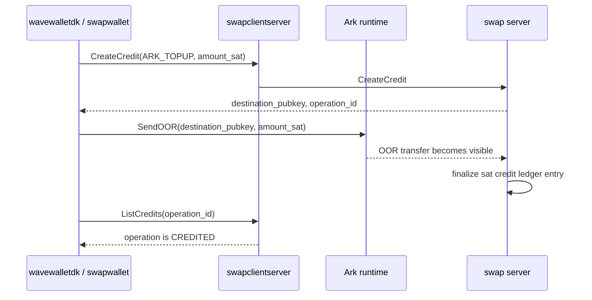
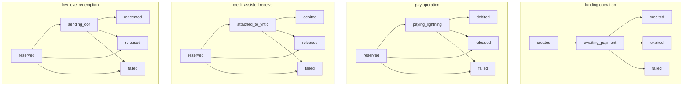

# Credit System

Credits are a server-held sat balance for one wallet identity. They let a
wallet handle Lightning amounts that cannot safely become an Ark vTXO yet,
without changing the operator dust limit.

A credit is not a vTXO. A vTXO is a sat-denominated Ark output that can be
refreshed, transferred, exited, or used to fund a virtual HTLC. It must clear
the operator dust limit. A credit is a row in the swap server ledger. The
server keys that ledger by the wallet identity public key, reserves credits
before using them, and writes ledger entries when value is credited or debited.

Lightning can carry millisatoshi amounts. The client and server keep those
msats at the invoice and HTLC validation boundary. When value enters the credit
ledger, the server rounds it up to sats and accounts for it as sats from then
on.

The server ledger is authoritative. Local client state records what the wallet
asked for and what it already started, but `ListCredits` is the source of truth
after a retry or restart.



## Account Model

| Field | Unit | Meaning |
|---|---:|---|
| `finalized_sat` | sat | Credits minus finalized debits in the server ledger. |
| `reserved_sat` | sat | Active holds for pay, receive, or redemption operations. |
| `available_sat` | sat | Balance the server can reserve now. |
| `amount_sat` | sat | Amount used by funding, pay, receive, and redemption operations. |

The server enforces the balance invariant transactionally:

```text
available_sat = finalized_sat - finalized_debits_sat - reserved_sat
```

No operation can move the account negative. Reusing the same idempotency key
with the same operation parameters returns the existing operation; reusing it
with different parameters is rejected.

## Client Layers

Wallet-facing callers use `wavewalletdk`. Credit details are folded into `Recv`,
`PrepareSend`, `Send`, and `Balance`.

Raw callers can use `sdk/swaps` and `swapclientrpc` directly:

- `CreateCredit`: create a server-owned Lightning receive invoice or Ark top-up
  intent.
- `ListCredits`: read balances, operations, and ledger entries.
- `RedeemCredit`: low-level escape hatch for materializing credits into an Ark
  output. `wavewalletdk` does not expose it directly; the daemon auto-redeems
  credits into a vTXO once the balance clears a watermark, without exposing
  that decision to the caller.



## Receives

The receive planner decides whether a requested Lightning receive can become a
normal vHTLC, must become credits, or can attach existing credits to clear the
dust limit.

| Condition | Rail | Result |
|---|---|---|
| `requested_amount_sat >= dust_limit_sat` | normal | Server funds a vHTLC for the requested amount. |
| `requested_amount_sat < dust_limit_sat` and `requested + available < dust` | credit | Server creates a credit receive invoice. No vHTLC is created. |
| `requested_amount_sat < dust_limit_sat` and `requested + available >= dust` | credit-assisted | Server reserves all available credits and funds a vHTLC for `requested + attached_credit_sat`. |

For credit-assisted receives, the server attaches all currently available
credits, not only the shortfall needed to reach dust. The quote/prepare surface
returns the full plan:

| Field | Meaning |
|---|---|
| `requested_amount_sat` | Lightning invoice amount requested by the wallet. |
| `available_credit_sat` | Server balance considered by the planner. |
| `attached_credit_sat` | Credits reserved and added to the receive vHTLC. |
| `vhtlc_amount_sat` | Amount the client must see in the funded vHTLC. |
| `dust_limit_sat` | Operator dust limit used for the decision. |
| `settlement_type` | `LIGHTNING`, `CREDIT`, or `MIXED`. |



The swap server includes `requested_amount_sat` and `attached_credit_sat` in the
HTLC event sent to the client. The raw receive FSM verifies three values before
accepting that event:

- the event payment hash matches the invoice,
- the event requested amount matches the invoice amount,
- the funded vHTLC amount equals `requested_amount_sat + attached_credit_sat`.

The onion payload still validates against the Lightning invoice amount. Attached
credits are Ark-side value added to the vHTLC, not part of the payer's
Lightning invoice.

## Sends

The public send API stays the same: callers use `PrepareSend`, display the
preview, and call `Send` with the prepared intent id. There is no public
`PayWithCredit` RPC.

`PrepareSend` asks the swap server for a pay quote. The quote chooses the rail:

| Rail | Meaning |
|---|---|
| `LIGHTNING` | Normal in-swap. The wallet funds the vHTLC. |
| `CREDIT` | Server pays the Lightning invoice from a credit reservation. No vHTLC is funded. |
| `MIXED` | Credits cover part of the invoice. The wallet funds the remaining vHTLC amount. |

`CreditPreview` and `credit_quote` use sats:

| Field | Meaning |
|---|---|
| `must_use_credit` | This payment must use credits, such as a sub-dust invoice. |
| `credit_applied_sat` | Credits the server expects to reserve. |
| `credit_shortfall_sat` | More credits needed before the payment can start. |
| `credit_topup_sat` | Ark top-up amount needed to cover the shortfall. |
| `ark_funding_sat` | vHTLC amount still funded by the wallet. |



For a sub-dust invoice, the quote sets `must_use_credit=true`. If the account
lacks enough credits, `PrepareSend` shows the required Ark top-up and `Send`
performs that top-up before starting the credit-backed pay.

For a mixed payment, credits cover only the shortfall. For example, a wallet
with a 1,000 sat vTXO and 200 sat of credits can pay a 1,200 sat invoice. The
quote reserves 200 sat of credits and asks the wallet to fund the remaining
amount through the normal pay flow, plus any swap fee.

## Funding Credits

Credits materialize only after real value reaches the server.

### Lightning Receive

A credit receive creates a server-owned Lightning invoice. When that invoice
settles, the server rounds the settled msat amount up to sats and credits the
wallet identity account.



### Ark Top-Up

When a send needs more credits than the account has, `Send` creates an Ark
top-up intent, sends an OOR transfer to the server destination, and waits until
the server marks the operation credited.



## Operation States

Credit operations are durable server state machines. The client renders them as
server state and reconciles with `ListCredits` after retries or restart.



`reserved_sat` is the sum of active reservations. It drops when an operation is
debited, redeemed, released, or failed.

## Restart Rules

Client state machines are progress trackers. The server ledger owns the money.

Each credit send, receive, and redemption runs as a durable operation owned by
the daemon, not by the calling RPC. The daemon persists the operation row before
its first server call, so a restart re-drives the operation from that row and
reconciles it against `ListCredits`. The caller does not have to retry. If the
daemon restarts after an Ark top-up but before the pay starts, it resumes the
same operation under the same idempotency key, so the top-up is never repeated
and the value is not lost.

If the daemon restarts during a credit-assisted receive, the receive session
reloads the planned `attached_credit_sat` and `vhtlc_amount_sat`. When the HTLC
event arrives, the FSM validates the funded vHTLC against that plan before it
claims the vTXO.
