# Durable Actor Architecture

This document explains the key concepts and patterns in the durable actor
system. It covers the CDC (Change Data Capture) pattern, message delivery
semantics, recovery mechanisms, and type-erased actor discovery.

## Table of Contents

1. [Overview](#overview)
2. [OutboxPublisher CDC Pattern](#outboxpublisher-cdc-pattern)
3. [DurableMailbox Message Lifecycle](#durablemailbox-message-lifecycle)
4. [Actor System Architecture](#actor-system-architecture)
5. [Lease-Based Delivery Semantics](#lease-based-delivery-semantics)
6. [Recovery and Restart Flow](#recovery-and-restart-flow)
7. [TypeAssertingRef and MapRef Pattern](#typeassertingref-and-mapref-pattern)
8. [DurableAsk: Crash-Safe Request-Response](#durableask-crash-safe-request-response)

---

## Overview

The durable actor system provides crash-resilient message processing for actors.
It combines several patterns to ensure no message loss and exactly-once
processing semantics.

The core insight is that crashes can happen at any point: after receiving a
message but before processing, after processing but before sending a response,
or after sending but before acknowledging. Each pattern addresses a specific
failure mode:

- **Inbox Durability**: Messages are persisted before delivery. If the actor
  crashes before processing, the message survives and will be redelivered.

- **Transactional Outbox (CDC)**: Outgoing messages are written atomically with
  FSM state changes. This prevents the "state updated but message lost" problem
  when a crash occurs between state update and message send.

- **Lease-Based Delivery**: Prevents stale acknowledgments and enables automatic
  redelivery. A crashed consumer's lease expires, making the message available
  to another consumer (or the same consumer after restart).

- **Deduplication**: Tracks processed message IDs with TTL. When a message is
  redelivered, the actor checks if it was already processed and skips re-execution.
  This turns at-least-once delivery into exactly-once processing.

- **Checkpointing**: Persists FSM state after each message. On restart, the actor
  loads its checkpoint and continues from where it left off rather than starting
  from scratch.

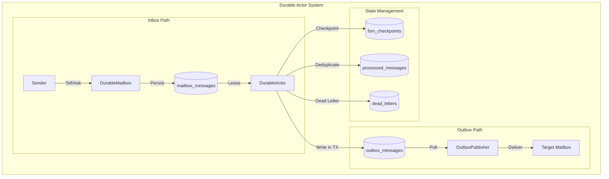

---

## OutboxPublisher CDC Pattern

The OutboxPublisher implements the Change Data Capture (CDC) pattern for
reliable inter-actor messaging. When an actor needs to send a message to another
actor, it writes to the outbox table within the same transaction as its FSM
state changes. This ensures atomicity: either both the state change and the
outbox message persist, or neither does.

### CDC Sequence Diagram

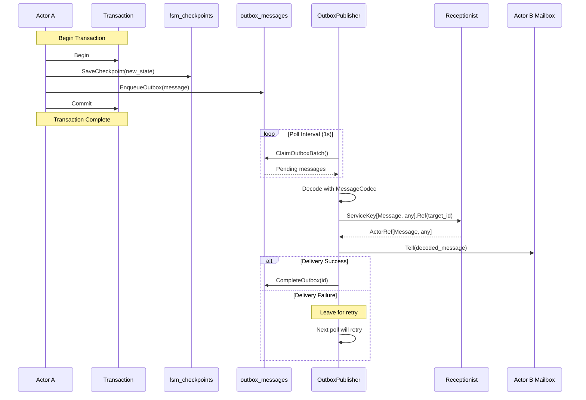

### Why CDC?

Without CDC, there's a window where an actor could:
1. Update its FSM state
2. Crash before sending the outgoing message
3. Restart and have inconsistent state (state updated but message never sent)

With CDC, the outbox write is part of the same transaction as the state update.
If the transaction commits, the message is guaranteed to be delivered
(eventually). If it rolls back, neither happens.

### OutboxPublisher Configuration

```go
type OutboxPublisherConfig struct {
    Store               DeliveryStore // Persistence layer
    Codec               *MessageCodec // Message serialization
    System              SystemContext // Actor discovery via ServiceKey
    PollInterval        time.Duration // Default: 1s (fallback; commits wake immediately)
    BatchSize           int           // Default: 100
    MaxDeliveryAttempts int           // Default: 10
    ClaimDuration       time.Duration // Default: 30s
}
```

### Message Flow

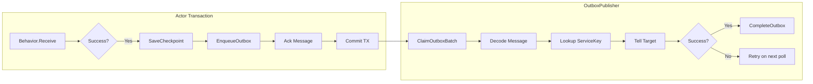

---

## DurableMailbox Message Lifecycle

Messages in the DurableMailbox follow a specific lifecycle from enqueue to
acknowledgment. The lifecycle ensures at-least-once delivery with exactly-once
processing.

### Message State Machine

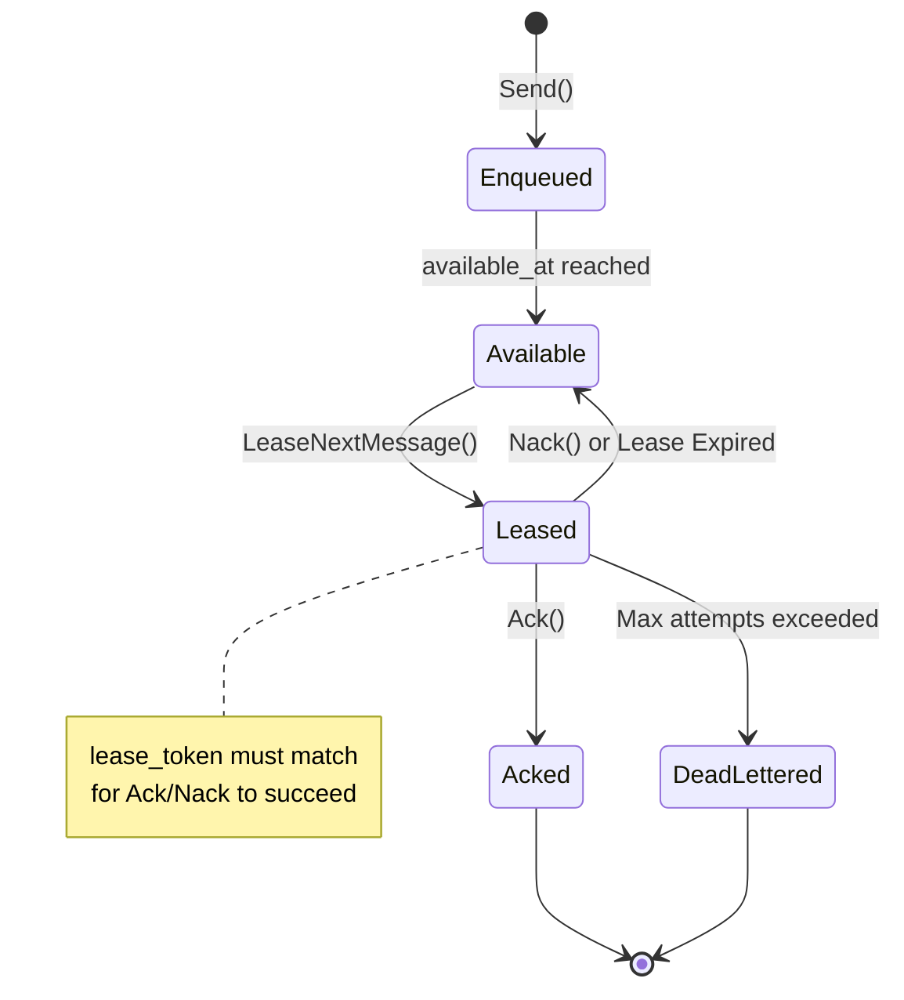

### Detailed Lifecycle Flow

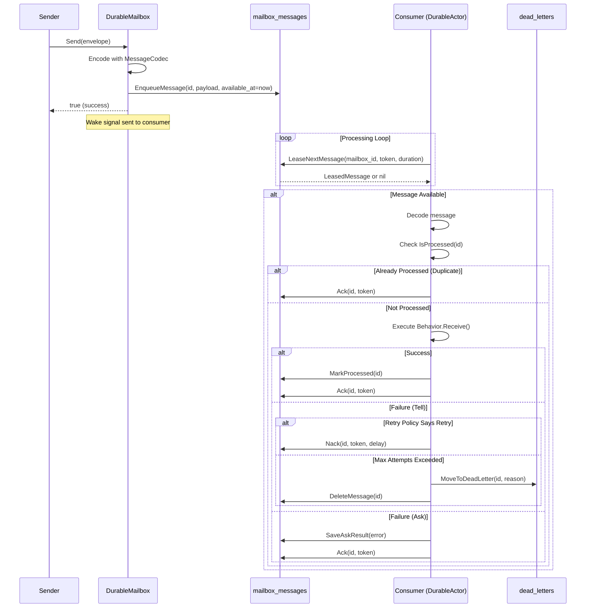

### Key Lifecycle Points

Each message passes through these states. Understanding the transitions helps
debug delivery issues and design retry strategies.

1. **Enqueue**: Message serialized via `MessageCodec` and persisted with an
   `available_at` timestamp. For immediate delivery, this is set to now. For
   delayed/scheduled messages, it's set to a future time.

2. **Available**: Message becomes eligible for delivery when `available_at <= now`.
   The `LeaseNextMessage` query filters by this timestamp.

3. **Leased**: Consumer atomically claims the message by setting `lease_token`
   (a unique ID) and `lease_until` (expiry time). The token proves ownership.

4. **Processing**: Consumer executes `Behavior.Receive()`. For long operations,
   the runtime automatically extends the lease via heartbeat (every `LeaseDuration/3`).

5. **Ack**: On success, the message is deleted and its ID recorded in
   `processed_messages` for deduplication. The lease token must match.

6. **Nack**: On transient failure, the message is released by clearing
   `lease_token` and setting `available_at` to `now + retryDelay`. The message
   will be redelivered after the delay.

7. **Dead Letter**: After `max_attempts` failures, the message is moved to
   `dead_letters` with the failure reason. Dead letters require manual inspection
   and can be replayed or deleted.

---

## Actor System Architecture

The durable actor system consists of several interconnected components organized
in layers. Each layer has a specific responsibility and depends only on layers
below it.

**Actor Layer**: Your code lives here. `DurableActor` manages the lifecycle and
delegates message handling to your `ActorBehavior` implementation.

**Mailbox Layer**: `DurableMailbox` provides the message queue abstraction. It
handles serialization via `MessageCodec` and yields `Delivery` objects that wrap
messages with lease operations.

**Persistence Layer**: `DeliveryStore` is the interface; `actordelivery.Store`
is the SQLite implementation. For transactional FSM updates, use
`TxAwareActorDeliveryStore` which wraps message processing in a database
transaction.

**CDC Layer**: `OutboxPublisher` runs as a background service, polling the outbox
table and delivering messages to target actors via the Discovery Layer.

**Discovery Layer**: Actors register with the `Receptionist` using `ServiceKey`.
The `OutboxPublisher` uses `TypeAssertingRef` to bridge between type-erased
lookups and concrete actor types.

### Component Diagram

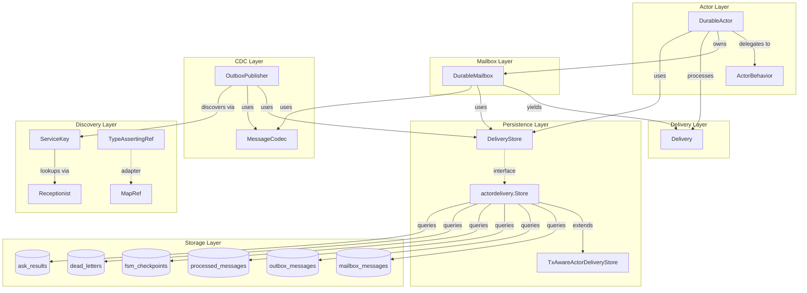

### Component Responsibilities

| Component | Responsibility |
|-----------|----------------|
| `DurableActor` | Lifecycle management, message processing loop, deduplication, automatic ack/nack |
| `DurableMailbox` | Message queue interface, lease-based iteration, priority ordering |
| `Delivery` | Message wrapper with lease operations (Ack/Nack/Extend) |
| `DeliveryStore` | Persistence interface for all mailbox operations |
| `actordelivery.Store` | SQLite implementation of DeliveryStore |
| `TxAwareActorDeliveryStore` | Adds transaction support for atomic FSM updates |
| `OutboxPublisher` | Background service draining outbox, delivering to targets |
| `MessageCodec` | TLV serialization/deserialization with type dispatch |
| `ServiceKey` | Type-safe actor discovery via Receptionist pattern |
| `TypeAssertingRef` | Adapter for type-erased actor lookups |

### DeliveryStore vs TxAwareDeliveryStore

The persistence layer offers two variants:

**DeliveryStore** (interface): Basic persistence operations. Each method runs in
its own transaction. Use this when you don't need atomic FSM updates.

**TxAwareDeliveryStore** (interface): Extends `DeliveryStore` with `ExecTx()`,
which wraps multiple operations in a single database transaction. Use this when
you need atomicity between:
- Updating FSM checkpoint
- Writing outbox messages
- Marking messages as processed
- Acknowledging the input message

When you pass a `TxAwareActorDeliveryStore` to `DurableActor`, the runtime
automatically wraps message processing in a transaction. Your `Receive()` method
can access the transaction-scoped store via context if needed.

```go
// Without TxAware: Each operation is separate transaction (no atomicity)
store.SaveCheckpoint(...)   // TX 1
store.EnqueueOutbox(...)    // TX 2 - if crash here, checkpoint saved but message lost

// With TxAware: All operations in same transaction
store.ExecTx(ctx, false, func(txCtx context.Context, txStore DeliveryStore) error {
    txStore.SaveCheckpoint(...)   // Same TX
    txStore.EnqueueOutbox(...)    // Same TX
    return nil                     // Commit or rollback together
})
```

---

## Lease-Based Delivery Semantics

Lease-based delivery prevents message loss and duplicate processing in the face
of consumer crashes. The key insight is that a consumer must prove it still
holds the lease when acknowledging a message.

### The Stale-Ack Problem

Without lease tokens, this race condition can occur:

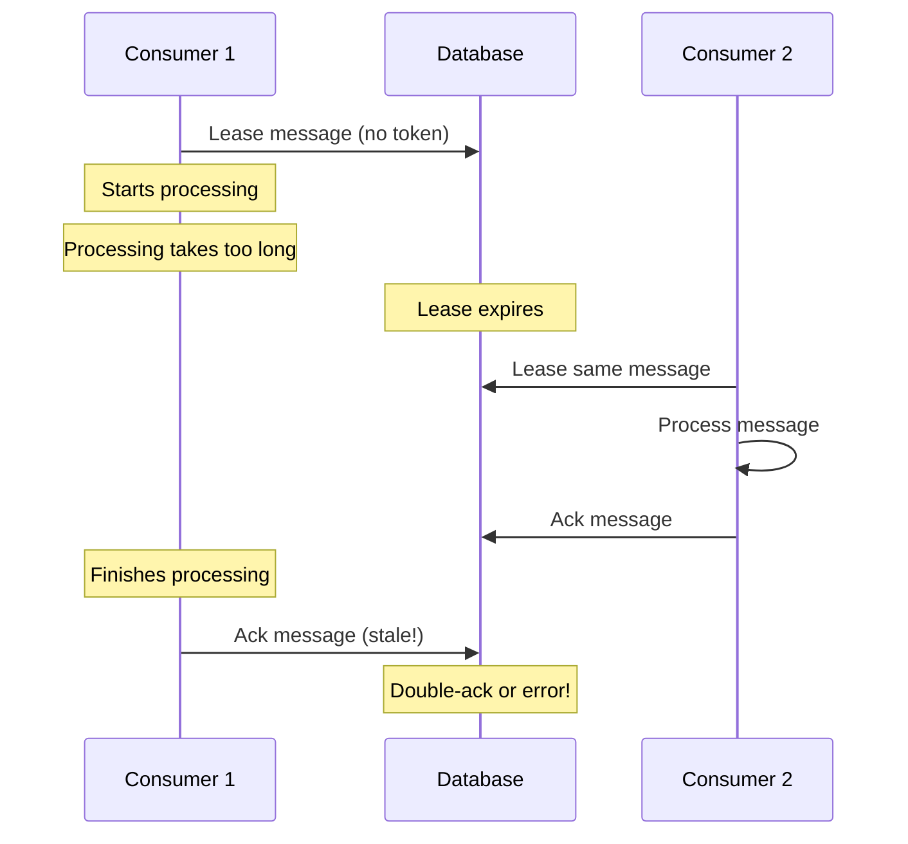

### Lease Token Solution

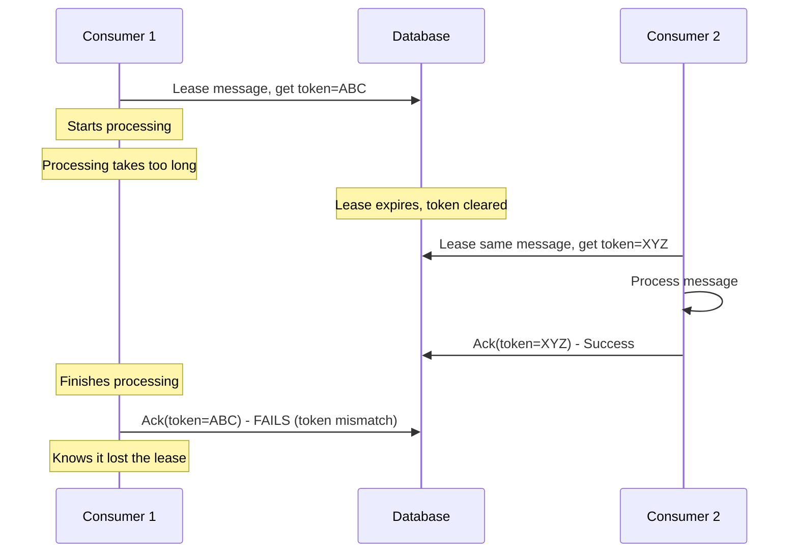

### Lease Operations

The `Delivery` type wraps a leased message with operations to signal completion.
All operations validate the lease token before executing.

```go
type Delivery[M TLVMessage, R any] struct {
    ID         string
    Message    M
    LeaseToken string
    LeaseUntil time.Time
    Attempts   int
    // ...
}

// Ack deletes message if lease token matches
func (d *Delivery) Ack(ctx context.Context, result fn.Result[R]) error

// Nack releases message for redelivery after delay
func (d *Delivery) Nack(ctx context.Context, err error, retryAfter time.Duration) error

// Extend prolongs the lease for long-running operations
func (d *Delivery) Extend(ctx context.Context, extension time.Duration) error
```

**Automatic Heartbeat**: The `DurableActor` runtime automatically extends leases
during message processing. A background goroutine calls `Extend()` every
`LeaseDuration/3` (default: 10s when lease is 30s). This means you don't need to
manually extend leases for long operations - the runtime handles it.

If the heartbeat fails (e.g., database unavailable), processing continues but
the actor logs a warning. The message may be redelivered if the lease expires
before `Ack()` is called.

### Lease Timeline

```mermaid
gantt
    title Message Lease Timeline
    dateFormat X
    axisFormat %s

    section Consumer
    Lease Acquired    :done, 0, 1
    Processing        :active, 1, 5
    Extend Lease      :milestone, 3, 3
    Ack Message       :done, 5, 6

    section Lease Window
    Initial Lease (30s)     :0, 3
    Extended Lease (30s)    :3, 6
```

---

## Recovery and Restart Flow

When an actor restarts after a crash, it must restore its state and resume
processing. The durable actor system supports this through checkpointing and
RestartMessage priority.

### Recovery Sequence

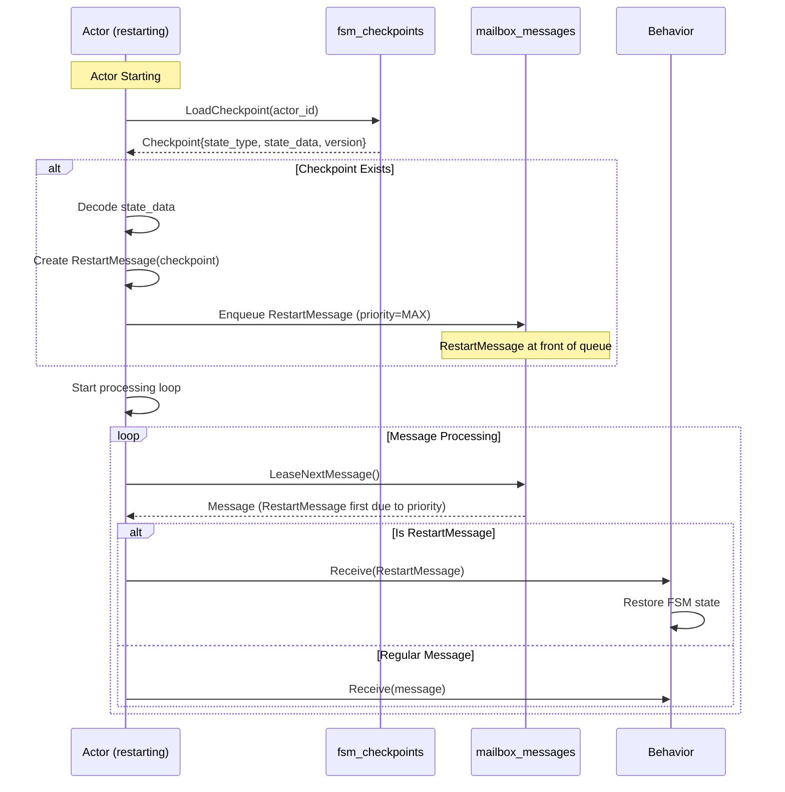

### RestartMessage Priority

RestartMessages have `priority=math.MaxInt32` (2147483647) to ensure they're
processed before any regular messages (which default to priority=0). This is
critical because:

1. Regular messages may depend on the restored FSM state
2. Processing regular messages before state restoration could cause errors
3. The actor needs to "catch up" to its pre-crash state first

The high priority value means RestartMessage always sorts to the front of the
queue, regardless of when other messages were enqueued.

### Recovery Flow Diagram

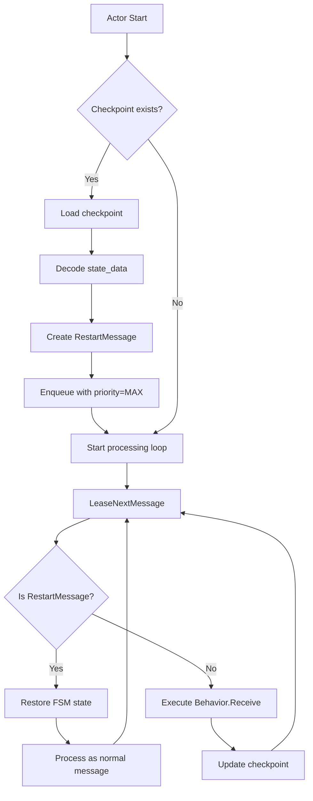

### Unprocessed Messages on Restart

Messages that were leased but not acknowledged before crash are automatically
redelivered. The timing depends on when the lease expires:

1. **Lease Expiry**: `LeaseNextMessage()` treats a row as eligible once
   `lease_until < now`, so an expired lease is reclaimed atomically by the
   same query that claims the next message - no separate clearing step is
   required for redelivery to proceed. `ExpireLeases()` is available as a
   standalone maintenance operation (used in tests/tooling) that explicitly
   clears `lease_token`/`lease_until` for stale rows.

2. **Redelivery**: The restarted actor's `LeaseNextMessage()` poll picks up the
   message once its `lease_until` has passed. The `attempts` counter is
   preserved, so the message won't be retried forever if it keeps failing.

3. **Deduplication**: Before executing `Receive()`, the actor checks
   `IsProcessed(message_id)`. If the message was processed before crash (but ack
   was lost), it's skipped and immediately acked.

**Default Lease Duration**: 30 seconds. If an actor crashes, its leased messages
become available for redelivery after at most 30 seconds.

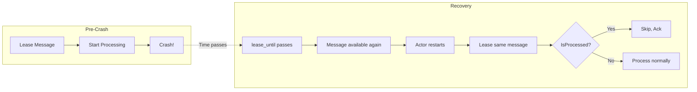

---

## TypeAssertingRef and MapRef Pattern

This pattern solves a specific problem: the `OutboxPublisher` needs to deliver
messages to actors it discovers at runtime, but Go's type system doesn't allow
direct conversion between generic types.

**When is this used?** Only by the `OutboxPublisher` during CDC message delivery.
Normal actor-to-actor communication (via `Tell`/`Ask` with a known `ActorRef`)
doesn't need this pattern.

**The Problem**: Actors register with concrete types like
`ServiceKey[CounterMessage, int64]`, but the OutboxPublisher uses
`ServiceKey[Message, any]` for type-erased lookups (since it doesn't know the
concrete message type at compile time).

### The Type Mismatch Problem

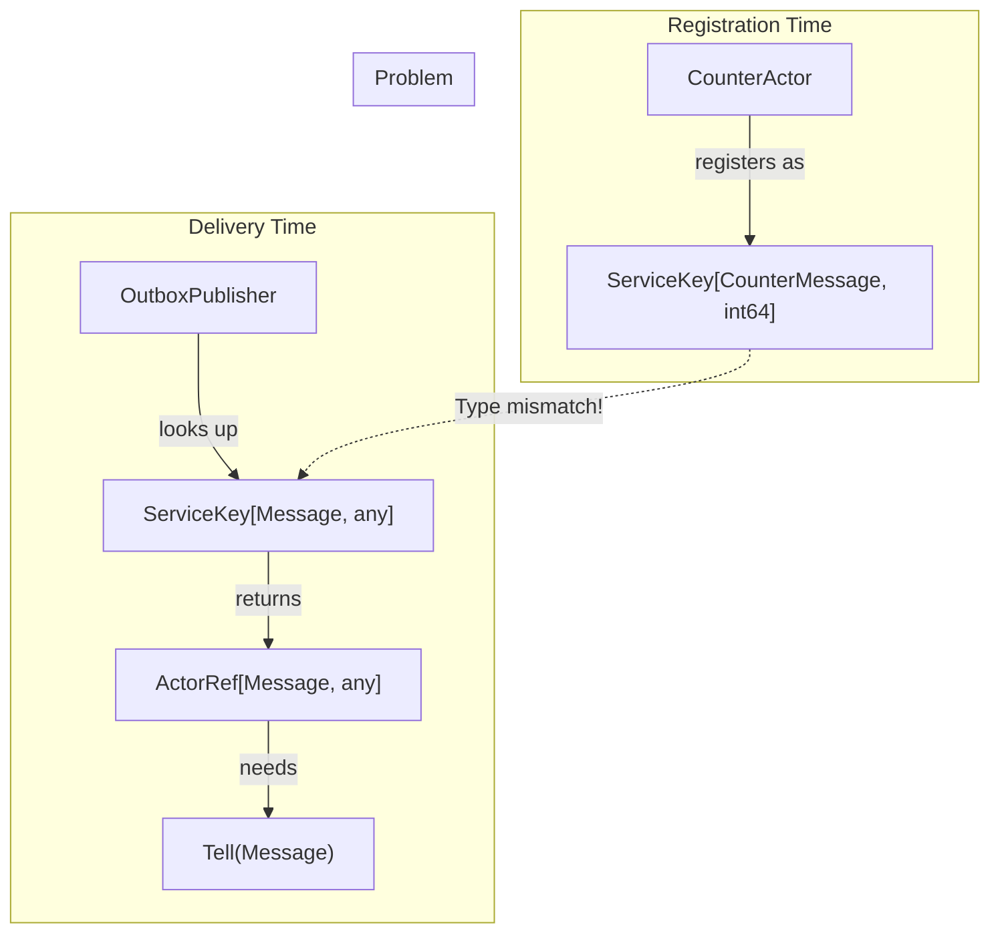

### Solution: MapRef and TypeAssertingRef

`MapRef` is a message-transforming wrapper that implements `ActorRef[In, OutR]`
by forwarding to an `ActorRef[Out, InR]` with transformation functions.

`TypeAssertingRef` is a convenience constructor that uses type assertion for
the transformation.

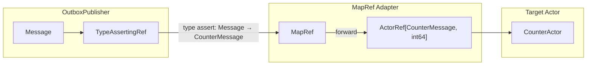

### How It Works

```go
// TypeAssertingRef creates a MapRef that uses type assertion
func TypeAssertingRef[In Message, Out Message, R any](
    targetRef ActorRef[Out, R],
) *MapRef[In, Out, R, any] {

    return NewMapRef(
        targetRef,
        // mapInput: type assert from In to Out
        func(in In) (Out, error) {
            out, ok := any(in).(Out)
            if !ok {
                var zero Out
                return zero, fmt.Errorf("type assertion failed")
            }
            return out, nil
        },
        // mapOutput: erase result type
        func(r R) any { return r },
    )
}
```

### Registration and Lookup Flow

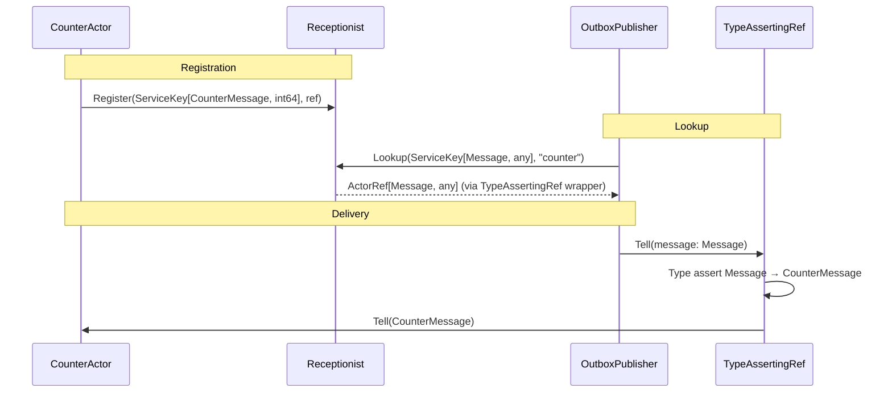

### MapRef Interface Implementation

```go
type MapRef[In, Out Message, InR, OutR any] struct {
    targetRef ActorRef[Out, InR]
    mapInput  func(In) (Out, error)
    mapOutput func(InR) OutR
}

func (m *MapRef) Tell(ctx context.Context, msg In) error {
    transformed, err := m.mapInput(msg)
    if err != nil {
        return fmt.Errorf("map input: %w", err)
    }
    return m.targetRef.Tell(ctx, transformed)
}

func (m *MapRef) Ask(ctx context.Context, msg In) Future[OutR] {
    // Transform input, call inner Ask, transform output
    // ...
}

func (m *MapRef) ID() string {
    return m.targetRef.ID()
}
```

---

## DurableAsk: Crash-Safe Request-Response

Standard Ask uses an in-memory Promise that's lost on crash. DurableAsk solves
this by routing responses through the durable outbox/mailbox infrastructure.

**Two key parameters** enable the async response flow:

- **CallbackActorID**: The caller's actor ID. The target writes the response to
  its outbox with this as the destination. The OutboxPublisher routes it to the
  caller's mailbox.

- **CorrelationID**: A unique ID generated by the caller to match responses to
  requests. Since DurableAsk is async (response arrives later as a separate
  message), the caller may have multiple outstanding requests. The CorrelationID
  lets it know which request each response corresponds to.

See the [Developer Guide](durable_actor_quickstart.md#durableask-crash-safe-request-response)
for implementation details.

### Ask vs DurableAsk

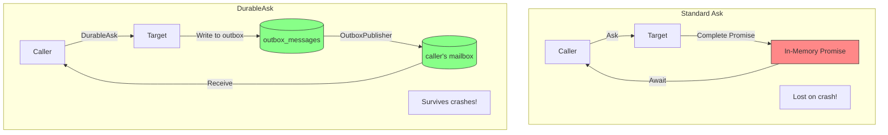

### DurableAsk Sequence

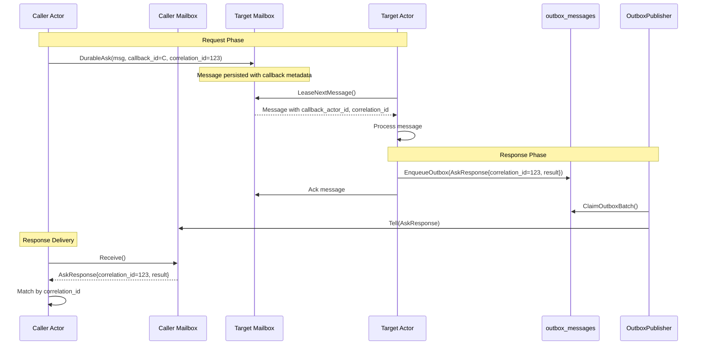

### AskResponse Structure

```go
type AskResponse struct {
    CorrelationID string    // Links to original request
    ResultBlob    tlv.Blob  // Encoded result (nil if error)
    ErrorText     string    // Error message (empty if success)
}

// Helper to decode the result
func (m AskResponse) DecodeResult(codec *MessageCodec) (TLVMessage, error)
```

### Crash Recovery with DurableAsk

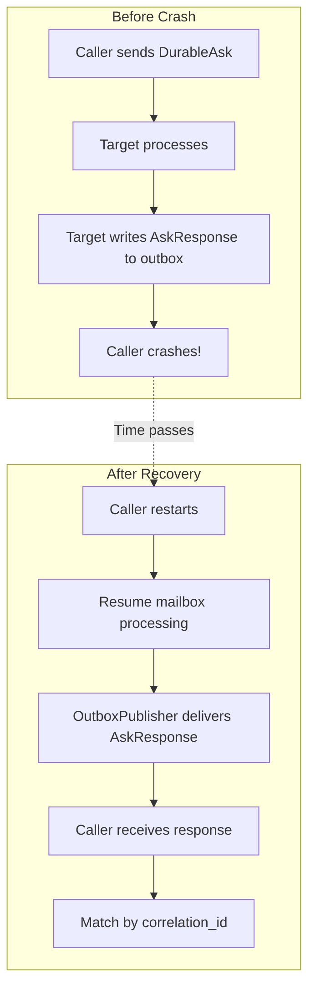

### When to Use DurableAsk

| Scenario | Use |
|----------|-----|
| Quick operations, caller won't crash | Standard Ask |
| Long-running operations | DurableAsk |
| Caller may crash before response | DurableAsk |
| Response must survive restarts | DurableAsk |
| Fire-and-forget | Tell |

---

## Summary

The durable actor architecture provides crash-resilient message processing
through:

1. **Inbox Durability**: Messages persisted before processing
2. **Transactional Outbox**: CDC pattern for atomic state + message writes
3. **Lease-Based Delivery**: Prevents stale acks, enables automatic redelivery
4. **Deduplication**: Exactly-once processing semantics
5. **Checkpointing**: FSM state recovery on restart
6. **TypeAssertingRef**: Type-safe actor discovery at runtime
7. **DurableAsk**: Crash-safe request-response pattern

These patterns combine to provide strong delivery guarantees while maintaining
the simplicity of the actor programming model.
