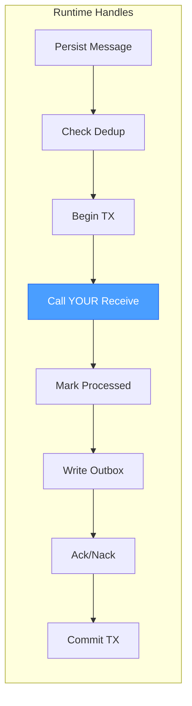
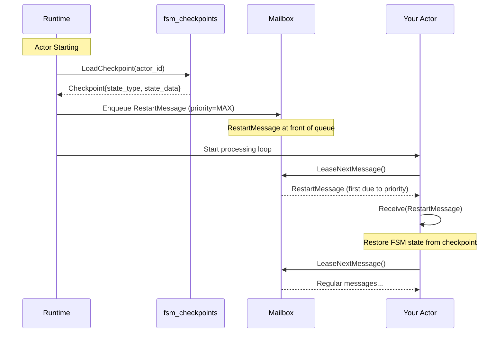
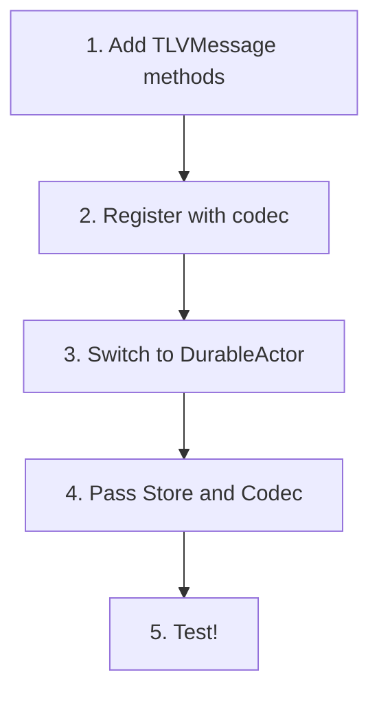
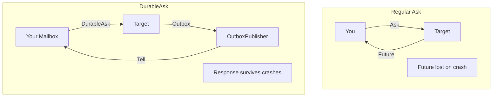
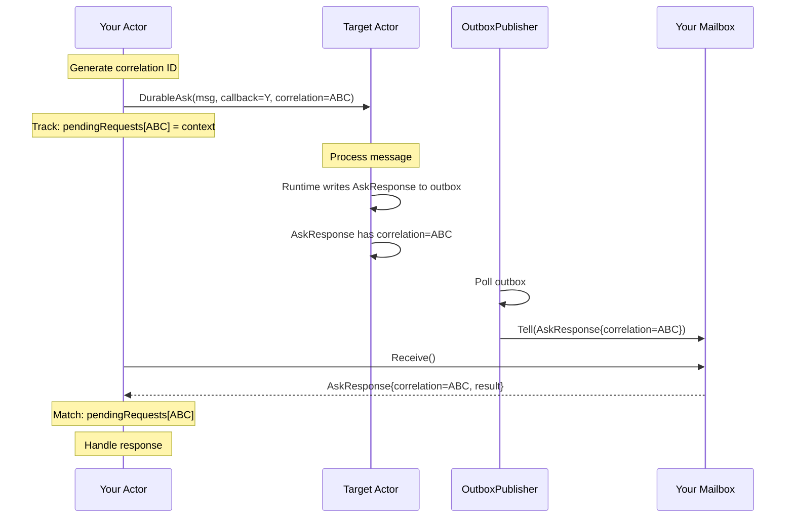

# Durable Actor Developer Guide

A practical guide for developers implementing durable actors. This document
focuses on what you need to know and do, not implementation details.

For detailed architecture, see [Durable Actor Architecture](durable_actor_architecture.md).

---

## What the Runtime Handles Automatically

When you use `DurableActor`, you get these behaviors for free:

| Feature | What Happens | You Don't Need To... |
|---------|--------------|----------------------|
| **Message Persistence** | Messages persisted before delivery | Worry about message loss on crash |
| **Deduplication** | Redelivered messages skipped if already processed | Make your handler idempotent (but you still should) |
| **Automatic Ack/Nack** | Ack on success, Nack with retry on failure | Call Ack/Nack manually |
| **Transaction Wrapping** | All state changes atomic (with TxAwareDeliveryStore) | Manage transactions |
| **Lease Heartbeating** | Leases extended for long operations | Extend leases manually |
| **Panic Recovery** | Panics caught, message Nacked for retry | Use defer/recover |
| **Dead Lettering** | Failed messages saved after max attempts | Track failed messages |
| **DurableAsk Response** | AskResponse written to outbox automatically | Write response messages |



**Legend**: The highlighted node is what YOU implement.

---

## What You Must Implement

### 1. TLVMessage Interface for Your Messages

**What**: Every message type that flows through a durable actor must implement the
`TLVMessage` interface, which adds serialization methods to the base `Message`
interface.

**Why**: Durable actors persist messages to SQLite before processing. To store a
message in the database and later reconstruct it, the system needs a way to
serialize the message to bytes and deserialize it back. TLV (Type-Length-Value)
encoding provides a compact, backward-compatible binary format that handles
versioning gracefully.

**How**: Implement four methods on your message struct:
- `MessageType()` - Human-readable name for logging and debugging
- `TLVType()` - Unique numeric ID used in the wire format to identify this message type
- `Encode()` - Serialize your struct's fields to a TLV stream
- `Decode()` - Deserialize a TLV stream back into your struct's fields

The `TLVType()` ID is critical: it must be unique across all message types in
your system and stable across code versions. When the codec reads bytes from the
database, it uses this ID to know which message constructor to call.

```go
type MyMessage struct {
    actor.BaseMessage
    RequestID string
    Amount    int64
    Data      []byte
}

// Human-readable name for logging.
func (m MyMessage) MessageType() string { return "my.Message" }

// Unique numeric ID for wire format. Pick a stable number.
func (m MyMessage) TLVType() tlv.Type { return 2001 }

// Serialize to TLV stream.
func (m MyMessage) Encode(w io.Writer) error {
    requestID := []byte(m.RequestID)
    amount := m.Amount
    data := m.Data

    records := []tlv.Record{
        tlv.MakePrimitiveRecord(1, &requestID),
        tlv.MakePrimitiveRecord(2, &amount),
        tlv.MakePrimitiveRecord(3, &data),
    }

    stream, err := tlv.NewStream(records...)
    if err != nil {
        return err
    }
    return stream.Encode(w)
}

// Deserialize from TLV stream.
func (m *MyMessage) Decode(r io.Reader) error {
    var (
        requestID []byte
        amount    int64
        data      []byte
    )

    records := []tlv.Record{
        tlv.MakePrimitiveRecord(1, &requestID),
        tlv.MakePrimitiveRecord(2, &amount),
        tlv.MakePrimitiveRecord(3, &data),
    }

    stream, err := tlv.NewStream(records...)
    if err != nil {
        return err
    }

    if _, err := stream.DecodeWithParsedTypes(r); err != nil {
        return err
    }

    m.RequestID = string(requestID)
    m.Amount = amount
    m.Data = data

    return nil
}
```

### 2. ActorBehavior.Receive

**What**: Your behavior struct must implement the `ActorBehavior[M, R]` interface,
which has a single method: `Receive(ctx context.Context, msg M) fn.Result[R]`.

**Why**: This is the core of your actor logic. The durable actor runtime handles
all the infrastructure (persistence, deduplication, transactions, ack/nack), but
YOUR code decides what to do when a message arrives. The runtime calls your
`Receive` method for each message, and your return value tells it whether
processing succeeded or failed.

**How**: Implement `Receive` to:
1. Process the incoming message according to your business logic
2. Return `fn.Ok(result)` on success - the runtime will Ack the message
3. Return `fn.Err[R](err)` on failure - for Tell messages, the runtime will Nack
   and retry; for Ask messages, the error is returned to the caller

The `fn.Result[R]` type is a discriminated union (like Rust's Result) that forces
you to explicitly handle both success and error cases. The runtime uses this to
decide whether to acknowledge the message or schedule a retry.

```go
type MyBehavior struct {
    // Your state
}

func (b *MyBehavior) Receive(
    ctx context.Context, msg MyMessage,
) fn.Result[MyResult] {

    // Process the message
    result, err := b.process(ctx, msg)
    if err != nil {
        return fn.Err[MyResult](err)
    }
    return fn.Ok(result)
}
```

### 3. Register Message Types with Codec

**What**: Create a `MessageCodec` and register every message type your actor will
receive. Registration maps a `TLVType()` ID to a constructor function that creates
an empty instance of that message type.

**Why**: When the runtime reads serialized bytes from the database, it needs to
know how to deserialize them. The codec looks up the type ID in the bytes, finds
the registered constructor, creates an empty message instance, and calls `Decode`
on it. Without registration, the codec returns "unknown message type" errors.

**How**: For each message type your actor can receive:
1. Call `codec.MustRegister(typeID, constructor)` where `typeID` matches the
   message's `TLVType()` return value
2. The constructor is a function that returns a new, empty instance:
   `func() actor.TLVMessage { return &MyMessage{} }`

**Critical: Registering AskResponse for DurableAsk callers**

If your actor sends `DurableAsk` requests to other actors, you MUST also register
the `AskResponse` type. Here's why:

When you call `DurableAsk`, the target actor processes your request and writes an
`AskResponse` message to its outbox. The OutboxPublisher then delivers this
response to YOUR actor's durable mailbox. When your actor processes the response,
it needs to deserialize the `AskResponse` - which requires it to be registered
with your codec.

Without this registration, your actor will fail to deserialize incoming responses
with an "unknown message type: 65535" error (65535 is `AskResponseMsgType`).

```go
codec := actor.NewMessageCodec()

// Register your own message types
codec.MustRegister(2001, func() actor.TLVMessage { return &MyMessage{} })
codec.MustRegister(2002, func() actor.TLVMessage { return &MyResult{} })

// REQUIRED if your actor sends DurableAsk requests!
// The responses arrive as AskResponse messages in your mailbox.
codec.MustRegister(actor.AskResponseMsgType, func() actor.TLVMessage {
    return &actor.AskResponse{}
})
```

### 4. Create and Start the Actor

**What**: Build a `DurableActorConfig` with your actor's ID, behavior, store,
and codec via `DefaultDurableActorConfig`, then instantiate and start the
actor.

**Why**: The config wires together all the pieces: YOUR behavior logic, the
persistence layer (store), and the serialization layer (codec). The actor ID
is used as the mailbox identifier in the database, so it must be unique and
stable across restarts.

**How**:
1. Call `DefaultDurableActorConfig(id, behavior, store, codec)` with:
   - `id`: Unique identifier for this actor (used as `mailbox_id` in the database)
   - `behavior`: Your `ActorBehavior` implementation
   - `store`: A `DeliveryStore` instance (e.g. from the `db/actordelivery` package)
   - `codec`: Your `MessageCodec` with all message types registered
2. Call `NewDurableActor(cfg)` to create the actor - it returns a
   `fn.Result[*DurableActor[M, R]]`, so unwrap it with `.Unpack()`
3. Call `Start()` to begin processing messages

The actor ID is particularly important: it's how the system knows where to
deliver messages and where to find your checkpoints after a restart. Use a
descriptive, stable ID like `"round-actor"` or `"wallet-actor-{wallet_id}"`.

```go
cfg := actor.DefaultDurableActorConfig(
    "my-actor-1", &MyBehavior{}, store, codec,
)

myActor, err := actor.NewDurableActor(cfg).Unpack()
if err != nil {
    return err
}
myActor.Start()
```

---

## The MessageCodec System

**What**: The `MessageCodec` is a per-actor registry that maps TLV type IDs to
message constructors. It handles both encoding messages to bytes and decoding
bytes back to messages.

**Why**: Each actor can handle different message types. Rather than a global
registry (which would create coupling between actors), each actor maintains its
own codec with exactly the types it needs. This provides:
- Type isolation: actors only know about their own messages
- No global state: easier testing and no initialization order issues
- Clear documentation: the codec registration shows all message types an actor handles

**How the encoding works**:
1. `codec.Encode(msg)` writes: `[type_id][payload_length][tlv_stream]`
2. `codec.Decode(bytes)` reads the type_id, looks up the constructor, creates an
   empty instance, and calls its `Decode` method with the payload

### Wire Format

```
[type_id: BigSize][payload_length: BigSize][tlv_stream: bytes...]
```

- **type_id**: The message's `TLVType()` value, encoded as a variable-length integer
- **payload_length**: Byte count of the TLV stream that follows
- **tlv_stream**: The message's serialized fields (from `Encode`)

### Registration

Each actor needs its own codec with all message types it receives:

```go
codec := actor.NewMessageCodec()

// Register all types this actor will receive
codec.MustRegister(1001, func() actor.TLVMessage { return &TypeA{} })
codec.MustRegister(1002, func() actor.TLVMessage { return &TypeB{} })
codec.MustRegister(1003, func() actor.TLVMessage { return &TypeC{} })

// If you receive DurableAsk responses, register AskResponse
codec.MustRegister(actor.AskResponseMsgType, func() actor.TLVMessage {
    return &actor.AskResponse{}
})
```

### Type ID Guidelines

- **Pick stable numbers**: Type IDs are stored in the database. Changing them breaks
  deserialization of existing messages.
- **Use unique numbers**: No two message types can share the same ID within a codec.
- **Document your IDs**: Maintain a registry of type IDs to avoid collisions.
- **Reserve ranges**: Consider assigning ranges per actor (e.g., 1000-1999 for wallet,
  2000-2999 for round).
- **System types**: `actor.AskResponseMsgType` = 65535 is reserved for the system.

---

## RestartMessage: Crash Recovery

**What**: When a durable actor starts up, the runtime checks for a persisted FSM
checkpoint. If one exists, it sends a `RestartMessage` containing the checkpoint
to your actor as the very first message. This allows your actor to restore its
state before processing any other messages.

**Why**: After a crash, your actor needs to "catch up" to where it was. The
checkpoint contains your FSM's serialized state at the time of the last
successful message processing. By delivering this as a high-priority message,
the runtime ensures your actor restores state before handling any pending
messages that were enqueued before the crash.

**How it works**:



**What you need to handle**:

If your actor uses checkpointing (FSM state persistence), your `Receive` method
should handle `RestartMessage`:

```go
func (b *MyBehavior) Receive(
    ctx context.Context, msg MyMessage,
) fn.Result[MyResult] {

    // Check for RestartMessage first
    if restart, ok := any(msg).(*actor.RestartMessage); ok {
        return b.handleRestart(ctx, restart)
    }

    // Handle other messages...
}

func (b *MyBehavior) handleRestart(
    ctx context.Context, msg *actor.RestartMessage,
) fn.Result[MyResult] {

    if !msg.HasCheckpoint() {
        // Fresh start - no prior state to restore
        log.Info("Actor starting fresh, no checkpoint")
        return fn.Ok(MyResult{})
    }

    // Restore FSM state from checkpoint
    checkpoint := msg.Checkpoint.UnsafeFromSome()
    log.Info("Restoring from checkpoint",
        "state_type", checkpoint.StateType,
        "version", checkpoint.Version)

    // Decode your FSM state from checkpoint.StateData
    // This depends on how you serialized your state
    if err := b.restoreState(checkpoint.StateData); err != nil {
        return fn.Err[MyResult](err)
    }

    return fn.Ok(MyResult{})
}
```

**Key points**:
- `RestartMessage` has priority `math.MaxInt32` - it's always processed first
- `Checkpoint.StateData` contains your serialized FSM state (you define the format)
- `Checkpoint.StateType` is the FSM state name at checkpoint time
- If `HasCheckpoint()` is false, this is a fresh start with no prior state
- You must register `RestartMessage` with your codec if you handle it

```go
// Register RestartMessage if your actor handles checkpoints
codec.MustRegister(actor.RestartTLVType, func() actor.TLVMessage {
    return &actor.RestartMessage{}
})
```

---

## Migration Checklist: Non-Durable to Durable



1. **Add TLVMessage methods** to your message type:
   - `TLVType() tlv.Type` - unique numeric ID
   - `Encode(w io.Writer) error`
   - `Decode(r io.Reader) error`

2. **Create and register codec**:
   ```go
   codec := actor.NewMessageCodec()
   codec.MustRegister(yourTypeID, func() actor.TLVMessage {
       return &YourMessage{}
   })
   ```

3. **Switch from `NewActor` to `NewDurableActor`**

4. **Wire up Store and Codec** in config:
   ```go
   cfg := actor.DefaultDurableActorConfig(
       "actor-id", behavior, store, codec, // store is a DeliveryStore
   )
   ```

5. **Test** crash recovery and redelivery scenarios

---

## DurableAsk: Crash-Safe Request-Response

Regular `Ask` returns an in-memory `Future` that's lost if either actor crashes.
`DurableAsk` persists the entire request-response flow through the outbox,
ensuring responses survive crashes on either side.



### Understanding the Parameters

When calling `DurableAsk`, you provide two identifiers:

```go
err := targetRef.DurableAsk(ctx, msg, actor.DurableAskParams{
    CallbackActorID: "my-actor-id",  // YOUR actor ID
    CorrelationID:   "req-12345",    // YOUR request tracking ID
})
```

**CallbackActorID** tells the system where to deliver the response. This is YOUR
actor's ID - the one sending the request. When the target actor processes your
message, the runtime writes an `AskResponse` to the outbox addressed to this ID.
The OutboxPublisher then delivers it to your mailbox.

**CorrelationID** lets you match responses to requests. Since DurableAsk is
asynchronous (you might have many outstanding requests), you need a way to know
which request each response belongs to. You generate a unique ID (typically a
UUID) when sending, track it locally, and match it when the response arrives.

### The Complete Flow



### Implementation Checklist

To use DurableAsk, you need to handle four things:

**1. Register AskResponse with your codec**

Responses arrive as `AskResponse` messages in your mailbox. Your codec must know
how to deserialize them:

```go
codec := actor.NewMessageCodec()
// ... your message types ...

// REQUIRED if you use DurableAsk
codec.MustRegister(actor.AskResponseMsgType, func() actor.TLVMessage {
    return &actor.AskResponse{}
})
```

**2. Track pending requests**

Maintain a map from correlation ID to request context so you can handle the
response appropriately when it arrives:

```go
type PendingRequest struct {
    SentAt  time.Time
    Context RequestContext  // Whatever you need to handle the response
}

pendingRequests := make(map[string]PendingRequest)
```

**3. Handle AskResponse in your Receive**

When an `AskResponse` arrives, match it to the pending request and process:

```go
func (b *MyBehavior) Receive(ctx context.Context, msg MyMessage) fn.Result[R] {
    // Check if this is an AskResponse
    if resp, ok := any(msg).(*actor.AskResponse); ok {
        return b.handleAskResponse(ctx, resp)
    }
    // Handle other messages...
}

func (b *MyBehavior) handleAskResponse(
    ctx context.Context, resp *actor.AskResponse,
) fn.Result[R] {

    pending, ok := b.pendingRequests[resp.CorrelationID]
    if !ok {
        // Unknown correlation ID - already handled or timed out
        return fn.Ok(...)
    }
    delete(b.pendingRequests, resp.CorrelationID)

    if resp.IsError() {
        return b.handleError(resp.ErrorText, pending.Context)
    }

    // Decode the result using the target's message codec
    result, err := resp.DecodeResult(b.codec)
    if err != nil {
        return fn.Err[R](err)
    }

    return b.handleResult(result.(*TargetResult), pending.Context)
}
```

**4. Handle timeouts**

Requests might never receive responses (target permanently down, message lost
before persistence). Implement periodic cleanup:

```go
for corrID, pending := range b.pendingRequests {
    if time.Since(pending.SentAt) > timeout {
        delete(b.pendingRequests, corrID)
        // Handle timeout - maybe retry or report failure
    }
}
```

### AskResponse Structure

The `AskResponse` type carries the result back to you:

```go
type AskResponse struct {
    CorrelationID string   // Matches your DurableAskParams.CorrelationID
    ResultBlob    []byte   // TLV-encoded result (empty if error)
    ErrorText     string   // Error message (empty if success)
}

resp.IsError() bool                         // Check for error
resp.DecodeResult(codec) (TLVMessage, error) // Decode the result
```

### Complete Example

```go
type MyActor struct {
    id              string
    pendingRequests map[string]PendingRequest
    codec           *actor.MessageCodec
    targetRef       actor.DurableActorRef[TargetMessage, TargetResult]
}

// Sending a DurableAsk request
func (a *MyActor) sendRequest(ctx context.Context, data SomeData) error {
    correlationID := uuid.New().String()

    // Track the pending request
    a.pendingRequests[correlationID] = PendingRequest{
        SentAt:  time.Now(),
        Context: data,
    }

    // Send the request
    return a.targetRef.DurableAsk(ctx, TargetMessage{Data: data},
        actor.DurableAskParams{
            CallbackActorID: a.id,
            CorrelationID:   correlationID,
        },
    )
}

// Handling responses in Receive
func (a *MyActor) Receive(
    ctx context.Context, msg MyMessage,
) fn.Result[MyResult] {

    switch m := any(msg).(type) {
    case *actor.AskResponse:
        return a.handleAskResponse(ctx, m)
    default:
        // Handle other messages
    }
}

func (a *MyActor) handleAskResponse(
    ctx context.Context, resp *actor.AskResponse,
) fn.Result[MyResult] {

    pending, ok := a.pendingRequests[resp.CorrelationID]
    if !ok {
        return fn.Ok(MyResult{})
    }
    delete(a.pendingRequests, resp.CorrelationID)

    if resp.IsError() {
        log.Warn("DurableAsk failed", "error", resp.ErrorText)
        return a.handleFailure(pending.Context, resp.ErrorText)
    }

    result, err := resp.DecodeResult(a.codec)
    if err != nil {
        return fn.Err[MyResult](err)
    }

    return a.handleSuccess(pending.Context, result.(*TargetResult))
}
```

---

## Common Gotchas

1. **Forgot to register message type** - Codec returns "unknown message type"
   ```go
   codec.MustRegister(yourTypeID, func() actor.TLVMessage { return &YourType{} })
   ```

2. **Forgot to register AskResponse** - Can't receive DurableAsk responses
   ```go
   codec.MustRegister(actor.AskResponseMsgType, func() actor.TLVMessage {
       return &actor.AskResponse{}
   })
   ```

3. **Type ID collision** - Two message types with same TLVType()
   - Document your type IDs
   - Use namespaced ranges (e.g., 1000-1999 for actor A, 2000-2999 for actor B)

4. **Not handling CorrelationID** - Response arrives but you can't match it
   - Always track pending requests with correlation ID
   - Handle unknown correlation IDs gracefully (may be replayed)

5. **No timeout handling** - Pending requests accumulate forever
   - Implement periodic cleanup of old pending requests

---

## Quick Reference

### Creating a Durable Actor

```go
codec := actor.NewMessageCodec()
codec.MustRegister(typeID, func() actor.TLVMessage { return &MyMsg{} })

cfg := actor.DefaultDurableActorConfig(
    "actor-id", &MyBehavior{}, store, codec,
)

myActor, err := actor.NewDurableActor(cfg).Unpack()
if err != nil {
    return err
}
myActor.Start()
```

### Sending Messages

```go
ref := myActor.Ref()

// Tell (fire-and-forget)
err := ref.Tell(ctx, msg)

// Ask (in-memory Future - lost on crash)
future := ref.Ask(ctx, msg)
result := future.Await(ctx)

// DurableAsk (crash-safe - response via mailbox)
durableRef := ref.(actor.DurableActorRef[M, R])
err := durableRef.DurableAsk(ctx, msg, actor.DurableAskParams{
    CallbackActorID: myActorID,
    CorrelationID:   uuid.New().String(),
})
```

### TLVMessage Interface

```go
type TLVMessage interface {
    MessageType() string       // Human-readable name
    TLVType() tlv.Type        // Unique numeric ID
    Encode(w io.Writer) error // Serialize
    Decode(r io.Reader) error // Deserialize
}
```

---

## See Also

- [Durable Actor Architecture](durable_actor_architecture.md) - Detailed concepts
- [Actor Delivery Store Schema](../db/actor_delivery_store.md) - Database tables
- `baselib/actor/` - Source code
- `baselib/actor/*_test.go` - Test examples
