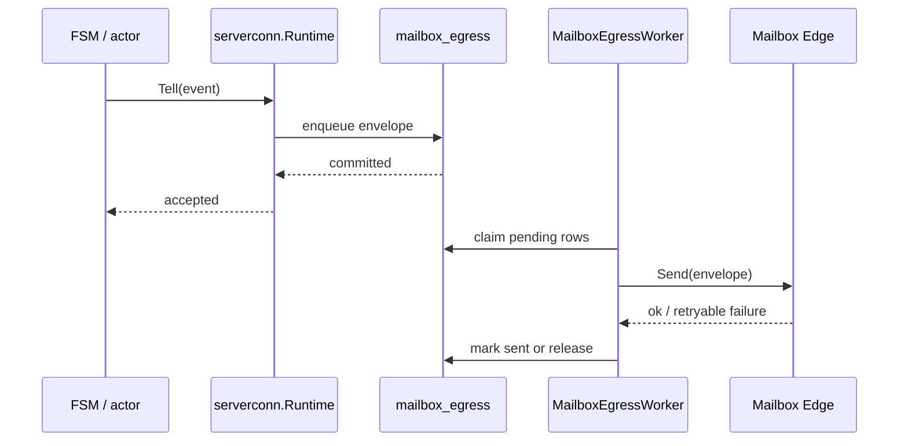
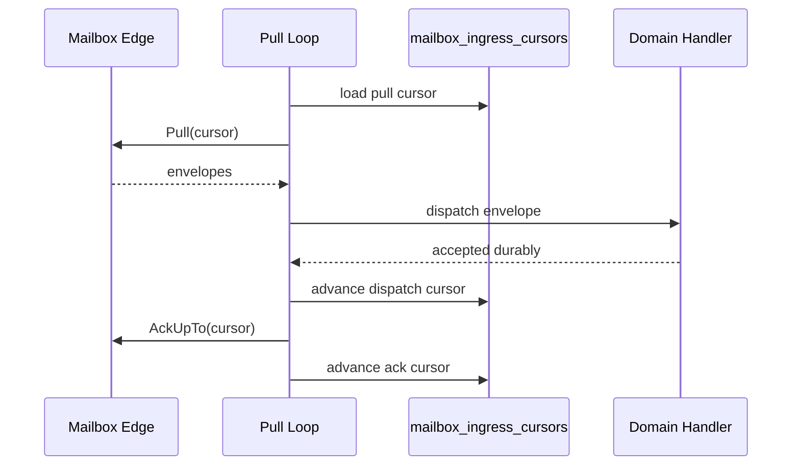

# Mailbox Architecture

This document describes the current RPC-over-mailbox transport. The transport is
restart-safe through explicit SQL state and remote mailbox cursors, not through
the removed durable actor mailbox framework.

For the wire-level contract, see
[`RPC_MAILBOX_CONTRACT.md`](RPC_MAILBOX_CONTRACT.md). For the client-side runtime
entry point, see [`../serverconn/README.md`](../serverconn/README.md).

## Model

The mailbox protocol is a store-and-forward envelope transport. Messages are
persisted by the remote mailbox edge, pulled by the receiver, dispatched into the
local subsystem, and acknowledged only after the local handler has accepted the
message durably.

The local actor abstraction is still useful for concurrency and reasoning:
actors serialize in-memory behavior behind channels and give the FSMs a simple
command surface. Actor messages are not a persistence boundary. Crash recovery is
owned by subsystem SQL tables and transport cursor rows.

## Layers

| Layer | Packages | Responsibility |
| --- | --- | --- |
| Edge protocol | `mailbox/pb` | `Envelope`, `RpcMeta`, `Send`, `Pull`, and `AckUpTo` protobuf API. |
| Runtime primitives | `mailbox/rpc`, `mailbox/conn` | RPC interfaces, router, ack watermark, response registry, deterministic envelope IDs. |
| Client runtime | `serverconn` | Client-to-server transport runtime, SQL egress worker, ingress pull loop, unary facade, event router. |

`mailbox/conn` and `mailbox/rpc` are process-local helpers. They do not own
restart safety by themselves.

## Envelope Identity

Every envelope carries two identities:

- `msg_id`: unique for an envelope send attempt.
- `idempotency_key`: stable for the semantic operation, so retries and replayed
  envelopes can be deduplicated by the receiver.

For restart-safe event egress, `serverconn` stores the exact envelope in
`mailbox_egress`. Replayed sends therefore keep the same semantic identity and
are safe for at-least-once delivery.

## Client-Side `serverconn`

The client uses `serverconn.Runtime` to communicate with one server mailbox.

Main components:

| Component | Role |
| --- | --- |
| `ServerConnectionActor` | In-memory actor facade for event sends and ingress dispatch coordination. |
| `MailboxEgressWorker` | Claims pending `mailbox_egress` rows and sends them through `Edge.Send`. |
| `UnaryFacade` | Sends unary requests directly and waits in an in-memory `ResponseRegistry`. |
| `EventRouter` | Maps inbound `(service, method)` envelopes to typed actor or SQL handlers. |
| `TransportStore` | Persists egress envelopes and ingress cursors. |

Fire-and-forget events are durable because they first enter `mailbox_egress`.
Unary RPCs are intentionally request-lifetime operations: callers retry the whole
RPC if the process dies before the response arrives.

## Egress Flow

The important ordering is `enqueue before send`. If the process crashes after
the row commits but before `Edge.Send`, the worker claims the row on restart and
sends it. If it crashes after `Edge.Send` but before marking the row sent, the
worker sends it again; the receiver handles this through envelope idempotency.

## Ingress Flow

The remote mailbox remains the source of redelivery until `AckUpTo` succeeds.
If the process crashes after dispatch but before the ack, the same envelope is
pulled again after restart. Domain handlers therefore must be idempotent and must
store named facts such as round nonces, OOR session state, ledger entries, or
unroll job progress before acknowledging the envelope.

Ingress dispatchers run inside `TransportStore.RunInIngressTx`, so cursor
movement and domain state share one SQL transaction when the handler's stores
join `actor.TxFromContext`. Where a handler owns its own store transaction, the
handler is responsible for accepting replay by natural keys.

## Unary RPCs

Unary requests use the same envelope wire format, but their local waiter is
in-memory:

1. `UnaryFacade` registers a response waiter by correlation ID.
2. It sends a `KIND_REQUEST` envelope through `Edge.Send`.
3. The ingress loop routes a matching `KIND_RESPONSE` envelope to the waiter.

This is not a durable request-response queue. If the process restarts while a
unary RPC is waiting, the caller retries at the operation level.

## Restart Recovery

On restart, the runtime:

1. Starts the egress worker, which resumes pending `mailbox_egress` rows.
2. Loads ingress cursors from `mailbox_ingress_cursors`.
3. Pulls from the remote mailbox at the stored cursor.
4. Replays unacknowledged envelopes into idempotent domain handlers.

Restart recovery uses only mailbox cursors, egress rows, and idempotent domain
tables in the current architecture.

## Extension Checklist

When adding a new mailbox event:

1. Define the protobuf request/event and generated mailbox stub route.
2. Choose a stable idempotency key based on the semantic operation.
3. Persist all restart-critical domain facts in subsystem-owned SQL before the
   envelope is acknowledged.
4. Make the handler safe to run more than once for the same idempotency key.
5. Add a restart/replay test that crashes between dispatch and ack, or between
   egress enqueue and send, depending on the direction.
