# Mailbox Architecture

This document explains the architecture of the RPC-over-mailbox transport, the
system that enables durable, crash-safe communication between the client and the
remote server. The mailbox replaces direct gRPC streaming with an at-least-once
envelope transport that survives process restarts, tolerates intermittent
connectivity, and unifies unary RPCs and fire-and-forget events under a single
protocol.

For the protocol-level contract (ordering, idempotency, ack semantics), see
[`RPC_MAILBOX_CONTRACT.md`](RPC_MAILBOX_CONTRACT.md). For the underlying actor
durability model, see
[`durable_actor_architecture.md`](durable_actor_architecture.md).

## Table of Contents

1. [Overview](#overview)
2. [System Layers](#system-layers)
3. [Envelope and RPC Metadata](#envelope-and-rpc-metadata)
4. [Layer 1: Mailbox Edge API](#layer-1-mailbox-edge-api)
5. [Layer 2: RPC Interfaces and Primitives](#layer-2-rpc-interfaces-and-primitives)
   - [RPCClient and Router Contracts](#rpcclient-and-router-contracts)
   - [ServeMux: In-Process Routing](#servemux-in-process-routing)
   - [gRPC Status Encoding](#grpc-status-encoding)
   - [AckState Watermark Machine](#ackstate-watermark-machine)
   - [ResponseRegistry: Correlation Waiters](#responseregistry-correlation-waiters)
   - [EnvelopeIdentity: Deterministic IDs](#envelopeidentity-deterministic-ids)
   - [WrappedProto: TLV-Proto Bridge](#wrappedproto-tlv-proto-bridge)
6. [Layer 3: Server Connection Runtime](#layer-3-server-connection-runtime)
   - [ServerConnectionActor: Dual-Role Connector](#serverconnectionactor-dual-role-connector)
   - [Egress: Durable Events vs Fast Unary](#egress-durable-events-vs-fast-unary)
   - [Ingress: Pull-Dispatch-Ack Loop](#ingress-pull-dispatch-ack-loop)
   - [EventRouter: Typed Dispatch Closures](#eventrouter-typed-dispatch-closures)
   - [UnaryFacade: Two-Phase Send+Await](#unaryfacade-two-phase-sendawait)
   - [Runtime: Composition and Lifecycle](#runtime-composition-and-lifecycle)
7. [Key Data Flows](#key-data-flows)
   - [Unary RPC Round-Trip](#unary-rpc-round-trip)
   - [Durable Event Egress](#durable-event-egress)
   - [Server-Push Event Ingress](#server-push-event-ingress)
8. [Ack Watermark Invariants](#ack-watermark-invariants)
9. [Crash Recovery and Restart](#crash-recovery-and-restart)
10. [Generated Stubs and Code Generation](#generated-stubs-and-code-generation)
11. [Extension Points](#extension-points)

---

## Overview

Traditional gRPC streaming ties message delivery to TCP connection liveness. If
the process crashes between receiving a message and processing it, the message is
lost. If the connection drops, in-flight RPCs fail without retry.

The mailbox transport replaces this with a store-and-forward model. Messages are
persisted as envelopes in a remote mailbox before the receiver pulls them. The
receiver acknowledges envelopes only after durable local processing, so crashes
between pull and ack result in redelivery rather than loss.

This design provides three properties that raw gRPC lacks:

- **Durability**: Envelopes survive sender and receiver restarts.
- **At-least-once delivery**: Unacked envelopes are redelivered on reconnect.
- **Unified transport**: Unary RPCs (request-response) and fire-and-forget
  events (one-way) share the same envelope format and edge API.

The system is organized in three layers. Each layer depends only on the layers
below it, and each can be tested independently.

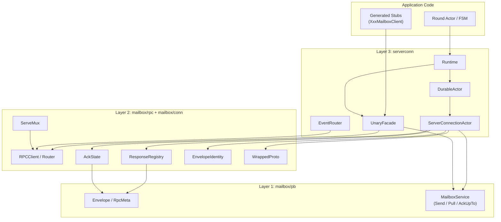

---

## System Layers

| Layer | Go Packages | Responsibility |
|-------|-------------|----------------|
| 1 | `mailbox/pb` | Protobuf definitions: Envelope, RpcMeta, Status, MailboxService edge API. Generated code only. |
| 2 | `mailbox/rpc`, `mailbox/conn` | Runtime interfaces (`RPCClient`, `Router`, `ServeMux`), connector primitives (ack watermark, response registry, deterministic IDs, TLV-proto bridge). |
| 3 | `serverconn` | Server connection runtime: `ServerConnectionActor` (egress + ingress), `UnaryFacade`, `EventRouter`, `Runtime` composition. |

Layer 1 is pure proto-generated code. Layer 2 provides the building blocks
shared by both client-side and server-side connectors. Layer 3 wires everything
into the client's actor system.

---

## Envelope and RPC Metadata

Every message flowing through the mailbox is wrapped in an `Envelope`. The
envelope carries metadata for routing, deduplication, and ordering alongside
a typed protobuf payload.

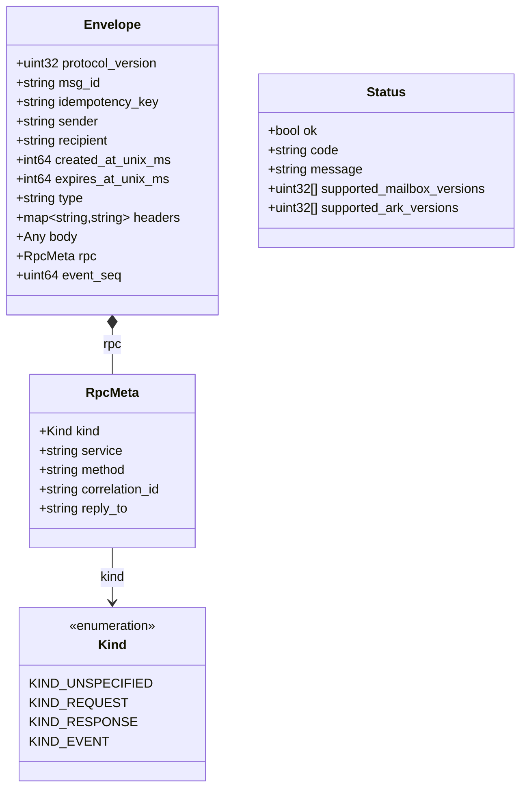

Key fields:

- **`msg_id`**: Unique per send attempt. Different on each retry.
- **`idempotency_key`**: Stable per semantic operation. The same across retries
  of the same logical request, enabling server-side deduplication.
- **`body`**: A `google.protobuf.Any` carrying the typed protobuf payload.
  Receivers unmarshal the inner `Value` bytes into the expected message type.
- **`rpc`**: Optional overlay metadata. When present, the envelope participates
  in the RPC protocol. The three `Kind` variants are:
  - `KIND_REQUEST`: A unary RPC request from client to server.
  - `KIND_RESPONSE`: A unary RPC response from server to client.
  - `KIND_EVENT`: A fire-and-forget message (either direction).
- **`event_seq`**: Assigned by the mailbox edge. Defines per-mailbox ordering
  and serves as the cursor for `Pull` and `AckUpTo` operations.
- **`headers`**: Extensible key-value metadata. Used for gRPC status transport
  (see [gRPC Status Encoding](#grpc-status-encoding)).

Source: `mailbox/pb/mailbox.proto`

---

## Layer 1: Mailbox Edge API

The edge API is a standard gRPC service with three RPCs:

```protobuf
service MailboxService {
    rpc Send (SendRequest) returns (SendResponse);
    rpc Pull (PullRequest) returns (PullResponse);
    rpc AckUpTo (AckUpToRequest) returns (AckUpToResponse);
}
```

- **Send**: Appends an envelope to the recipient's mailbox. Returns a `Status`
  indicating success or failure (including protocol version mismatch).
- **Pull**: Fetches envelopes from the caller's mailbox starting at a cursor.
  Supports long-polling via `wait_timeout_ms` to avoid tight loops. Returns the
  batch and a `next_cursor` (highest `event_seq` + 1).
- **AckUpTo**: Advances the ack watermark. The server may garbage-collect
  envelopes with `event_seq < cursor`. Monotonic and idempotent.

The edge API is transport-agnostic from the application's perspective. The
client connects to it over standard gRPC with TLS. All application-level
semantics (request-response correlation, idempotency, dispatch routing) are
handled by the layers above.

Source: `mailbox/pb/mailbox.proto`

---

## Layer 2: RPC Interfaces and Primitives

### RPCClient and Router Contracts

The `mailboxrpc` package defines two interfaces that generated stubs depend on:

```go
type RPCClient interface {
    SendRPC(ctx context.Context, method ServiceMethod,
        req proto.Message, opts RPCOptions) (SendResult, error)

    AwaitRPC(ctx context.Context, correlationID string,
        resp proto.Message) error
}
```

`RPCClient` is the client-side contract. `SendRPC` constructs and sends a
`KIND_REQUEST` envelope, returning a `SendResult` with the correlation and
idempotency identifiers. `AwaitRPC` blocks until the ingress loop delivers a
`KIND_RESPONSE` with the matching correlation ID.

The two-phase design (send, then await) exists so response waiters can be
pre-registered before the send, preventing a race where a fast server responds
before the client registers a listener.

```go
type Router interface {
    Handle(service string, method string,
        newReq func() proto.Message, fn HandlerFunc)
}
```

`Router` is the server-side contract. `Handle` registers a typed handler for a
`(service, method)` pair. The generated `RegisterXxxMailboxServer` function
calls `Handle` once per method.

Supporting types:

- **`ServiceMethod`**: A `(Service, Method)` pair used as a routing key.
  `Service` is the fully-qualified protobuf service name
  (e.g., `"arkrpc.v1.RoundService"`). `Method` is the method name
  (e.g., `"JoinRound"`).
- **`HandlerFunc`**: `func(context.Context, proto.Message) (proto.Message, error)`.
  Handlers must be idempotent under the envelope's idempotency key.
- **`RPCOptions`**: Per-request overrides for idempotency key, correlation ID,
  and custom headers.
- **`SendResult`**: Contains `CorrelationID` and `IdempotencyKey` from a
  successful send.

Source: `mailbox/rpc/interface.go`, `mailbox/rpc/options.go`

### ServeMux: In-Process Routing

`ServeMux` is a concrete implementation of `Router`. It maps `(service, method)`
pairs to typed handler entries, each containing a request constructor and a
`HandlerFunc`. `ServeRPC` looks up the handler, creates a fresh request
message via `newReq()`, unmarshals the raw bytes with `DiscardUnknown: true`
for forward compatibility, and invokes the handler.

Thread-safe via `sync.RWMutex`. Intended as a small, dependency-free building
block — it does not handle transport concerns like authentication, retries, or
persistence.

Source: `mailbox/rpc/mux.go`

### gRPC Status Encoding

Application errors on the server side are transported through envelope headers
rather than the body. This keeps the response body reserved for successful
payloads while providing a separate channel for structured errors.

The header key is `mailboxrpc.grpc_status_b64`. The value is a base64-encoded
`google.rpc.Status` protobuf.

- **`EncodeErrorHeaders(err)`**: Converts any Go error to a gRPC status proto,
  preserving existing gRPC status codes. Falls back to `codes.Internal` if
  marshaling fails. Returns `nil` when `err` is `nil`.
- **`DecodeErrorHeaders(headers)`**: Extracts and reconstructs the gRPC error.
  Returns `nil` when no error header is present.

On the client side, `AwaitRPC` checks error headers before inspecting the body.
If an error header exists, it is returned immediately as a gRPC status error.

Source: `mailbox/rpc/grpc_status.go`

### AckState Watermark Machine

The ack watermark tracks four monotonic cursor variables that govern safe ack
progression:

```go
type AckState struct {
    PullCursor          uint64  // Cursor for the next Pull call.
    DispatchCommittedTo uint64  // Max cursor durably dispatched locally.
    AckTarget           uint64  // Max cursor that should be acked remotely.
    AckCommittedTo      uint64  // Last cursor successfully acked remotely.
}
```

The critical invariant is:

```
AckCommittedTo <= DispatchCommittedTo
```

The system never acks past non-durable local work. If the process crashes after
dispatch but before ack, envelopes will be redelivered on restart. If the
process crashes after ack but before local processing, the crash-recovery
section explains how this is handled.

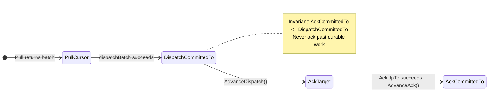

Three methods drive state transitions:

- **`AdvanceDispatch(nextCursor)`**: Sets `DispatchCommittedTo` to
  `max(DispatchCommittedTo, nextCursor)` and bumps `AckTarget` to match. Called
  after `dispatchBatch` successfully persists envelopes to local actor
  mailboxes.
- **`AdvanceAck()`**: Sets `AckCommittedTo = AckTarget` and defensively bumps
  `PullCursor` as a crash-recovery safety net. Called after `AckUpTo` succeeds.
- **`NeedsAck()`**: Returns `true` when `AckTarget > AckCommittedTo`.

The state is serialized via LND's TLV codec (four `uint64` records) and persisted
to the checkpoint store after each state change. On restart, `loadCheckpoint`
restores the state and the ingress loop resumes from `PullCursor`.

Source: `mailbox/conn/ack_state.go`

### ResponseRegistry: Correlation Waiters

The `ResponseRegistry` maps correlation IDs to response waiters and buffers
early responses that arrive before a waiter is registered.

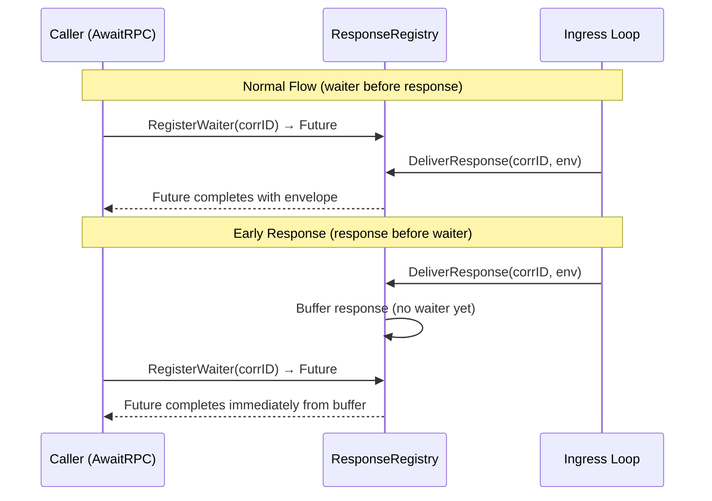

Key behaviors:

- **`RegisterWaiter(id)`**: Returns an `actor.Future[*Envelope]`. Idempotent —
  re-registration returns the same future. If a buffered response exists, the
  promise is completed immediately.
- **`DeliverResponse(id, env)`**: Completes the waiter's promise if registered.
  Otherwise, clones and buffers the envelope for a later `RegisterWaiter`.
- **`RemoveWaiter(id)`**: Completes the promise with `ErrWaiterCancelled`.
  Called by `AwaitRPC` on context cancellation or after successful receipt.
- **Stale cleanup**: Waiters and buffered responses older than `waiterTTL`
  (default 10 minutes) are pruned on each `RegisterWaiter`/`DeliverResponse`
  call. Stale waiters receive `ErrWaiterExpired`.

The registry is in-memory only. If the process crashes, callers' contexts are
cancelled and they retry the RPC. Durability is not needed because the mailbox
edge retains unacked envelopes for redelivery.

Source: `mailbox/conn/response_registry.go`

### EnvelopeIdentity: Deterministic IDs

For durable egress events (FSM outbox messages), the system derives stable
identifiers from the payload content:

- **`StableEventMsgID(payload)`**: Returns `"evt-" + SHA256(payload)[:16]` (hex).
- **`StableEventIdempotencyKey(payload)`**: Returns
  `"idem-" + SHA256(payload)[:16]` (hex).

When a `SendClientEventRequest` is persisted and later replayed from the
durable actor mailbox, the same IDs are reproduced from the stored payload.
This ensures retries carry the same idempotency key, enabling server-side
deduplication without additional state.

The 16-byte (32 hex character) truncation is sufficient for internal
deduplication. Collision probability is negligible for the expected message
volumes.

Source: `mailbox/conn/envelope_identity.go`

### WrappedProto: TLV-Proto Bridge

The durable actor runtime requires all messages to implement the `TLVMessage`
interface (`TLVType`, `Encode`, `Decode`). Protobuf messages are not TLV
natively. `WrappedProto[T]` bridges the gap:

```go
type WrappedProto[T proto.Message] struct {
    Val T
}
```

- **Encode**: Deterministic `proto.Marshal` → write bytes.
- **Decode**: Read bytes → `proto.Unmarshal` into `Val`.
- **`Record()`**: Returns a `tlv.Record` using dynamic size/encoder/decoder
  functions. The placeholder type 0 is overridden when wrapped in
  `tlv.NewRecordT`.

The caller must pre-set `Val` to a typed zero value before decode so the
correct concrete type is available for unmarshaling.

Source: `mailbox/conn/proto_record.go`

---

## Layer 3: Server Connection Runtime

### ServerConnectionActor: Dual-Role Connector

The `ServerConnectionActor` is the unified boundary for all mailbox traffic. It
serves two roles:

1. **Egress actor**: Processes outbound messages from the round actor (FSM
   events via `SendClientEventRequest`) and the unary facade (RPC requests via
   `SendRPCRequest`). Backed by a `DurableActor` for crash-safe persistence.

2. **Ingress loop**: A background goroutine that continuously pulls envelopes,
   dispatches them to local actors or response waiters, and manages the ack
   watermark.

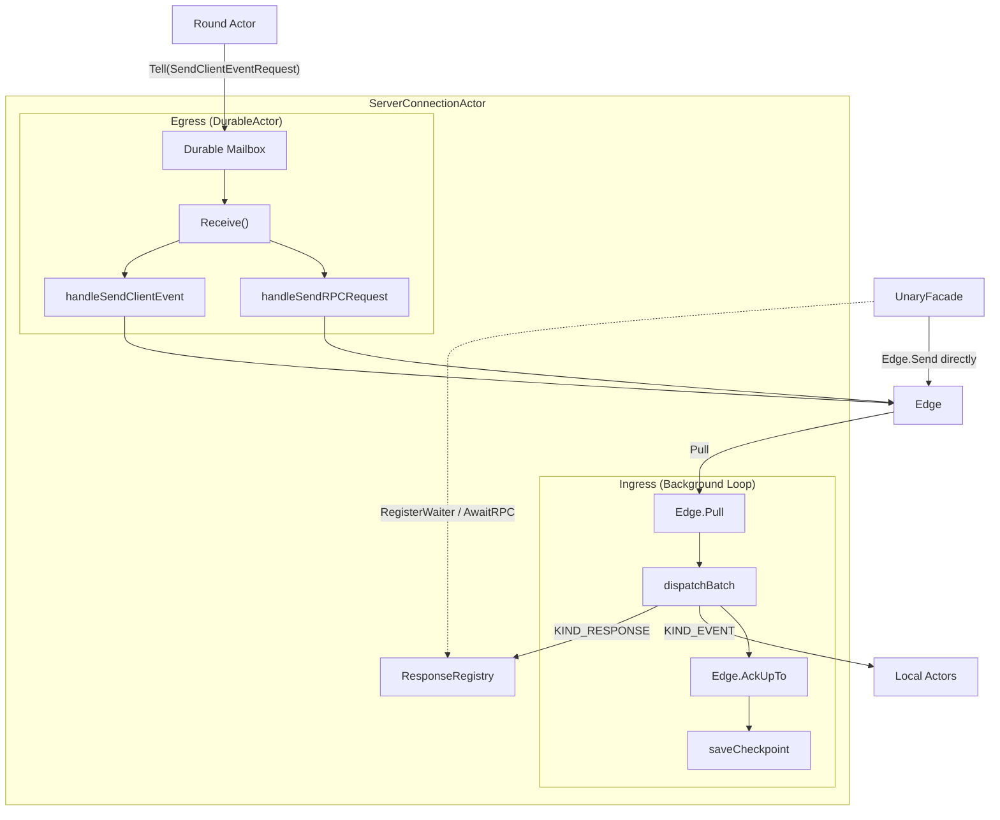

The actor implements `TxBehavior[ServerConnMsg, ServerConnResp, egressTx]`,
the Read/Commit path described in
[`mailbox_durable_actor_layer.md`](mailbox_durable_actor_layer.md). The
`Receive` method dispatches by message type:

- `SendClientEventRequest` → `handleSendClientEvent` (converts to proto,
  builds envelope, calls `Edge.Send`).
- `SendRPCRequest` → `handleSendRPCRequest` (sends pre-built envelope via
  `Edge.Send`).
- `SendUnaryRequest` / `DurableUnaryQuery` → `handleSendUnaryRequest` (durable,
  correlated unary requests such as proof-gated indexer queries).

Source: `serverconn/actor.go`

### Egress: Durable Events vs Fast Unary

The system provides two egress paths optimized for different requirements:

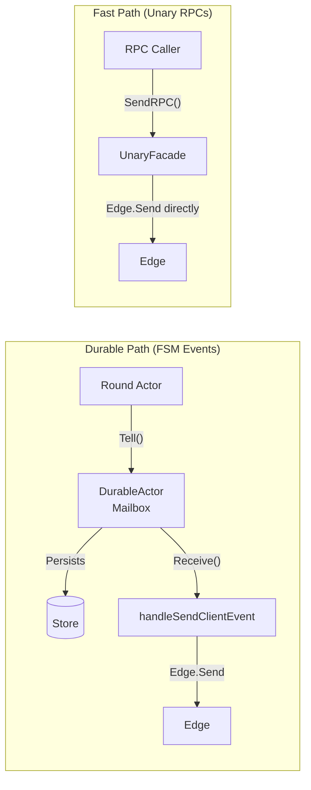

**Durable event egress** (crash-safe):

1. Round actor calls `DurableActor.Tell(SendClientEventRequest)`.
2. The request is TLV-encoded and persisted to the durable mailbox.
3. The durable actor runtime calls `Receive`, which converts the FSM message to
   proto, derives stable `msg_id` and `idempotency_key` from the payload hash,
   builds a `KIND_EVENT` envelope, and calls `Edge.Send`.
4. On crash, the durable mailbox replays the persisted request. The same IDs
   are derived again, ensuring the server deduplicates the retry.

**Fast unary egress** (low-latency):

1. Caller invokes `UnaryFacade.SendRPC`.
2. The facade generates random `msg_id` and `idempotency_key` (or uses
   caller-provided overrides), pre-registers a response waiter, builds a
   `KIND_REQUEST` envelope, and calls `Edge.Send` directly.
3. No durable persistence. If the send fails, the caller retries.

The durable path uses the DurableActor's inbox queue, which adds latency but
survives crashes. The fast path bypasses the inbox for lower latency at the cost
of no crash durability — appropriate for unary RPCs where the caller can retry.

Source: `serverconn/actor.go`, `serverconn/unary_facade.go`

### Ingress: Pull-Dispatch-Ack Loop

The ingress loop runs as a background goroutine, started by
`ServerConnectionActor.StartIngress`. It implements the pull-dispatch-ack cycle:

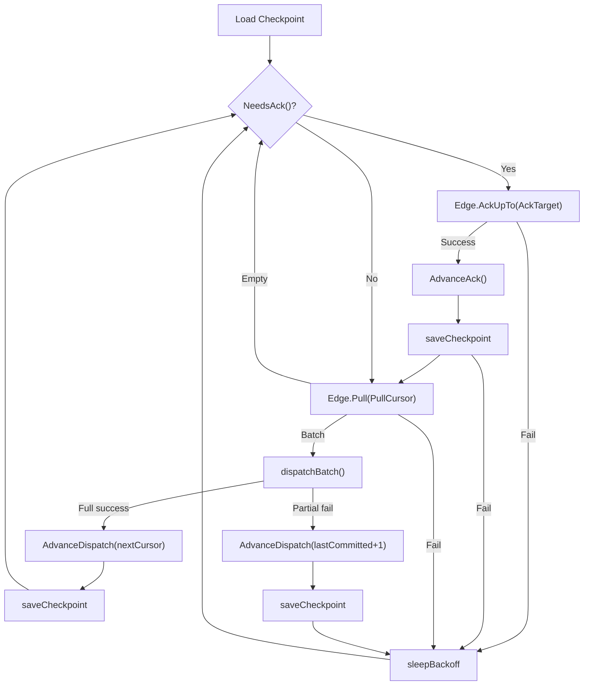

Each cycle:

1. **Ack phase**: If `NeedsAck()`, call `Edge.AckUpTo(AckTarget)`. On success,
   `AdvanceAck()` and checkpoint. This frees remote storage for previously
   dispatched envelopes.

2. **Pull phase**: Call `Edge.Pull(PullCursor, maxEnvelopes, waitTimeout)`.
   Long-poll returns empty on timeout (no delay needed), or a batch of
   envelopes with `next_cursor`.

3. **Dispatch phase**: Iterate envelopes. Route each by `RpcMeta.Kind`:
   - `KIND_RESPONSE`: Deliver to `ResponseRegistry` when a live unary waiter is
     registered for the correlation ID — consumed immediately, no durability
     needed. When no waiter is registered (e.g. the caller's context expired),
     fall back to the `EnvelopeDispatcher` dispatch table like an ordinary
     event, so actor-driven unary flows still observe the response durably.
   - `KIND_REQUEST` / `KIND_EVENT`: Look up the `EnvelopeDispatcher` by
     `(Service, Method)` in the dispatch table. The dispatcher unmarshals the
     body, adapts it to an actor message, and calls `Tell` on the target
     durable actor. A `nil` error means the message is durably persisted.

4. **Advance and checkpoint**: `AdvanceDispatch(nextCursor)` updates the
   watermark. `saveCheckpoint` persists the state. The loop restarts.

When the delivery store implements `TxAwareDeliveryStore`, `runFoldedDispatch`
folds the dispatch phase and the checkpoint save into one database
transaction, and a pending ack advance rides along with the next dispatch
checkpoint (or an idle-loop flush) rather than committing on its own. This is
the path a production store takes; a non-transactional store falls back to
the phase-by-phase sequence above.

**Partial failure**: If dispatch fails mid-batch (e.g., the target actor's store
is down), the loop advances state only past the last successfully dispatched
envelope. The failed envelope will be re-pulled on the next iteration.

**Backoff**: Exponential with jitter on transient failures. Formula:
`min(base * 2^attempt, max) * uniform(0.5, 1.0)`. Defaults: base 200ms,
max 30s. Reset to zero on success.

Source: `serverconn/ingress.go`

### EventRouter: Typed Dispatch Closures

The `EventRouter` maps `(service, method)` pairs to `EnvelopeDispatcher`
closures that route inbound envelopes to durable actor mailboxes.

Two registration APIs:

**Generic `AddRoute[M, R]`** (full control):

```go
AddRoute(router, EventRouteConfig[M, R]{
    Service:  "hellotest.v1.HelloService",
    Method:   "HelloStarted",
    NewEvent: func() proto.Message { return &hellotestpb.HelloStartedEvent{} },
    Key:      roundActorKey,
    Adapt:    func(p proto.Message) (RoundMsg, error) { ... },
})
```

The Adapt function converts the deserialized proto to the target actor's message
type. The closure captures the `ServiceKey` and calls
`Key.Ref(system).Tell(ctx, msg)`, which persists the message to the actor's
durable mailbox before returning.

**Convenience `NewEventRoute[M, R]`** (for `InboundActorMessage` types):

```go
NewEventRoute(router, InboundEventRouteConfig[M, R]{
    Service:  "hellotest.v1.HelloService",
    Method:   "HelloStarted",
    NewEvent: func() proto.Message { return &hellotestpb.HelloStartedEvent{} },
    Key:      roundActorKey,
    NewMsg:   func() RoundMsg { return &HelloStartedMsg{} },
})
```

Auto-generates the `Adapt` closure by calling `M.FromProto(event)`. The type
constraint `InboundActorMessage` combines `actor.Message` with
`InboundServerMessage` (which provides `FromProto`).

At wiring time, callers register all routes, then pass
`router.AsDispatcherMap()` to `ConnectorConfig.Dispatchers`. The map is a
shallow copy — safe for concurrent reads.

`AddRoute` is a package-level generic function rather than a method because Go
does not allow methods with type parameters on non-generic types.

Source: `serverconn/event_router.go`

### UnaryFacade: Two-Phase Send+Await

The `UnaryFacade` implements `mailboxrpc.RPCClient`. Generated client stubs
call `SendRPC` followed by `AwaitRPC` to perform a complete unary RPC
round-trip.

**`SendRPC` flow**:

1. Generate random `msg_id` (16 bytes, hex).
2. Use provided `IdempotencyKey` or generate a random one.
3. Use provided `CorrelationID` or default to the idempotency key.
4. Pre-register a response waiter in the `ResponseRegistry` (before sending,
   to catch fast responses).
5. Wrap the request proto in `anypb.Any`.
6. Build a `KIND_REQUEST` envelope with all metadata.
7. Call `Edge.Send` directly (no actor mailbox, low-latency).
8. On failure, remove the waiter and return the error.
9. Return `SendResult{CorrelationID, IdempotencyKey}`.

**`AwaitRPC` flow**:

1. Re-register the waiter (idempotent — returns the same future).
2. Block on `Future.Await(ctx)`.
3. When the ingress loop delivers a `KIND_RESPONSE` via
   `ResponseRegistry.DeliverResponse`, the future completes.
4. Check error headers first via `DecodeErrorHeaders`. If present, return the
   gRPC error.
5. Unmarshal `env.Body.Value` directly into the caller's response proto with
   `DiscardUnknown: true`. TypeUrl validation is intentionally skipped — the
   generated stubs always pass the correct concrete type.
6. Remove the waiter and return.

Source: `serverconn/unary_facade.go`

### Runtime: Composition and Lifecycle

`Runtime` embeds `DurableActor[ServerConnMsg, ServerConnResp]` so it can be
registered directly with the actor system. `Ref` and `TellRef` are promoted
without wrapper methods.

```go
type Runtime struct {
    *actor.DurableActor[ServerConnMsg, ServerConnResp]
    connector *ServerConnectionActor
    unary     *UnaryFacade
}
```

**`NewRuntime(cfg)`**: Validates required fields (Edge, Store, mailbox IDs).
Creates `ServerConnectionActor`, wraps it in a `DurableActor` using
`DefaultDurableTxActorConfig` (the Read/Commit path), and creates
`UnaryFacade`. The durable actor ID is `"serverconn-" + localMailboxID`.

**`Start(ctx)`**: Starts the `DurableActor` (begins processing egress). Starts
ingress via `connector.StartIngress(ctx)` (loads ack checkpoint, launches
pull loop). Rolls back the `DurableActor` on ingress failure.

**`Stop()`**: Stops ingress (cancels loop, waits for goroutine exit). Stops the
`DurableActor`.

**`Unary()`**: Returns the `UnaryFacade` for generated RPC stubs.

**`Connector()`**: Returns the underlying `ServerConnectionActor`.

Source: `serverconn/runtime.go`

---

## Key Data Flows

### Unary RPC Round-Trip

A complete unary RPC from caller through the mailbox and back:

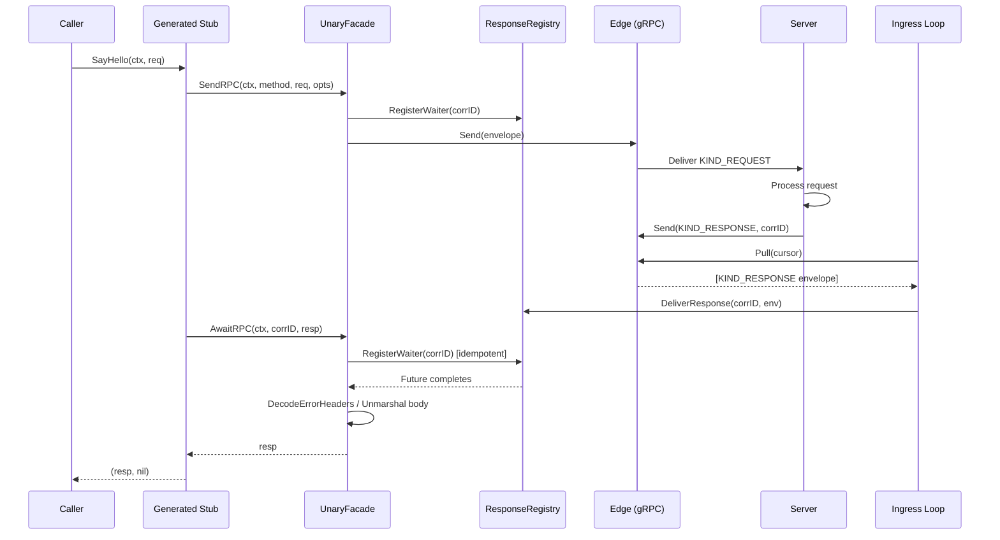

### Durable Event Egress

An FSM event from the round actor through durable persistence to the server:

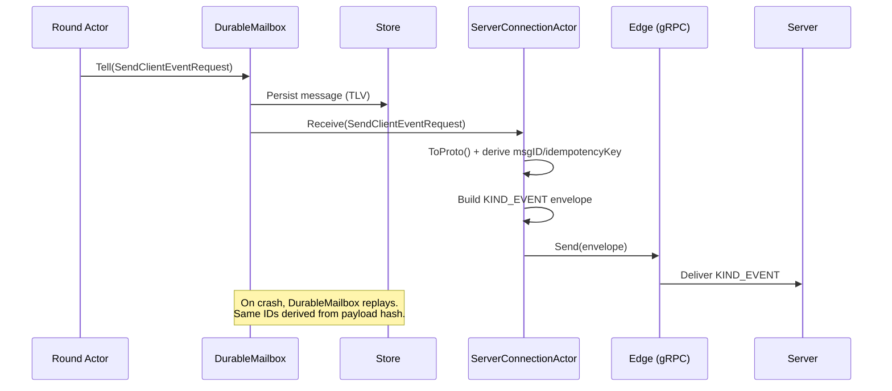

### Server-Push Event Ingress

A server-pushed event arriving at the client and being routed to a local actor:

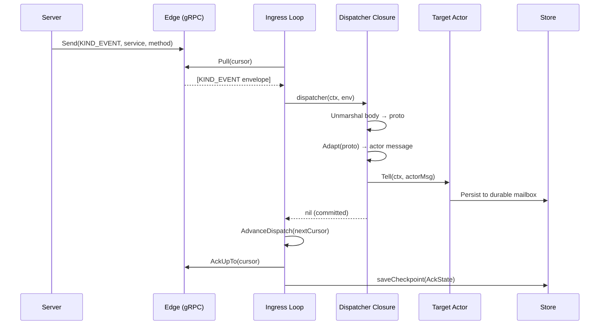

---

## Ack Watermark Invariants

The ack watermark is the critical safety mechanism that prevents message loss.
The invariant is simple but the consequences of violating it are severe:

> **AckCommittedTo must never exceed DispatchCommittedTo.**

If the system acks an envelope before durably dispatching it, a crash between
ack and dispatch loses the envelope permanently — the server has already
garbage-collected it, and the client has no record of it.

Here is a worked crash scenario:

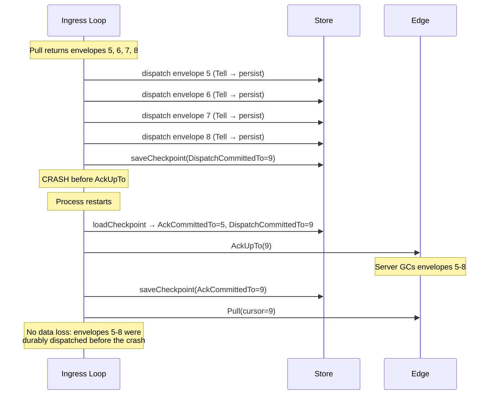

If the crash had occurred between dispatch of envelope 6 and envelope 7 (before
the checkpoint), the checkpoint would still reflect the previous state. On
restart, the loop would re-pull from the old `PullCursor`, re-dispatch
envelopes 7 and 8 (idempotent via the durable actor's deduplication), and then
ack up to the new position.

---

## Crash Recovery and Restart

Two recovery paths operate independently on startup:

**Egress recovery** (DurableActor):

The `DurableActor` replays all unacknowledged messages from its persistent
inbox. For `SendClientEventRequest` messages, the same `msg_id` and
`idempotency_key` are reproduced from the persisted TLV payload (the IDs are
derived from the payload hash and stored alongside it). The server deduplicates
retries using the idempotency key.

**Ingress recovery** (AckState checkpoint):

1. `loadCheckpoint` restores the four-cursor `AckState` from the store.
2. The ingress loop resumes pulling from `PullCursor`.
3. If `AckTarget > AckCommittedTo` (ack was pending at crash time), the loop
   acks first.
4. Envelopes between `AckCommittedTo` and `PullCursor` may be re-pulled by the
   server (depending on server-side GC timing). Local dispatchers handle
   redelivery gracefully via the durable actor's message deduplication.

**Unary RPC recovery**:

Response waiters are in-memory only. On crash, all waiting goroutines' contexts
are cancelled. Callers retry the RPC, generating new correlation IDs. The
server processes the retry as a new request (or deduplicates if the caller
reuses the same idempotency key via `RPCOptions`).

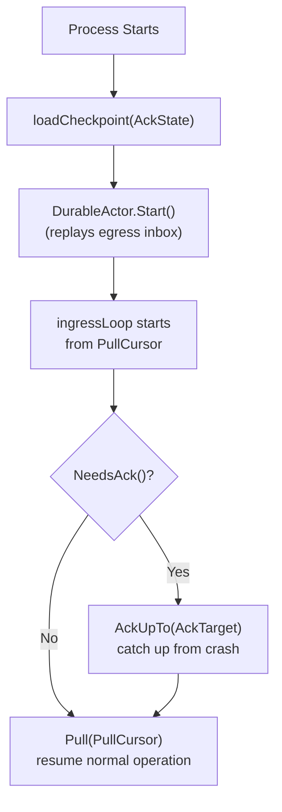

---

## Generated Stubs and Code Generation

The `protoc-gen-mailboxrpc` plugin generates typed client and server wrappers
for each protobuf service. The generated code depends only on `mailbox/rpc`
interfaces, not on `serverconn` or any transport implementation.

**Generated client** (`XxxMailboxClient`):

```go
type HelloServiceMailboxClient struct {
    C rpc.RPCClient
}

func (c *HelloServiceMailboxClient) SayHello(
    ctx context.Context, req *HelloRequest,
    opts ...rpc.RPCOptions,
) (*HelloResponse, error) {

    result, err := c.C.SendRPC(ctx, rpc.ServiceMethod{
        Service: "hellotest.v1.HelloService",
        Method:  "SayHello",
    }, req, mergeOpts(opts))
    if err != nil {
        return nil, err
    }

    resp := new(HelloResponse)
    if err := c.C.AwaitRPC(
        ctx, result.CorrelationID, resp,
    ); err != nil {
        return nil, err
    }

    return resp, nil
}
```

**Generated server** (`XxxMailboxServer` + registration):

```go
type HelloServiceMailboxServer interface {
    SayHello(context.Context, *HelloRequest) (*HelloResponse, error)
}

func RegisterHelloServiceMailboxServer(
    r rpc.Router, impl HelloServiceMailboxServer,
) {
    r.Handle("hellotest.v1.HelloService", "SayHello",
        func() proto.Message { return new(HelloRequest) },
        func(ctx context.Context, req proto.Message) (
            proto.Message, error,
        ) {
            return impl.SayHello(ctx, req.(*HelloRequest))
        },
    )
}
```

**Adding a new service**:

1. Define the service in a `.proto` file.
2. Run `make rpc` to generate Go stubs (including `*_mailboxrpc.pb.go`).
3. On the client side, create a client with
   `NewXxxMailboxClient(runtime.Unary())`.
4. On the server side, implement `XxxMailboxServer` and call
   `RegisterXxxMailboxServer(mux, impl)`.

---

## Extension Points

**Adding new RPC services**: The system is designed for service proliferation.
Each new proto service generates independent stubs. No core code changes are
needed — only registration at wiring time.

**Server-side connector**: The `mailbox/conn` primitives (`AckState`,
`ResponseRegistry`, `EnvelopeIdentity`, `WrappedProto`) are intentionally
separated from `serverconn` so a mirror server-side connector can reuse the
same ack watermark logic, response correlation, and TLV codec without importing
client-specific code.

**Custom dispatchers**: `EnvelopeDispatcher` is a plain
`func(context.Context, *Envelope) error` closure. It is not tied to the actor
system. Callers can implement custom dispatch logic (e.g., logging, metrics,
routing to non-actor handlers) as long as the contract is upheld: `nil` return
means the envelope is durably committed.
