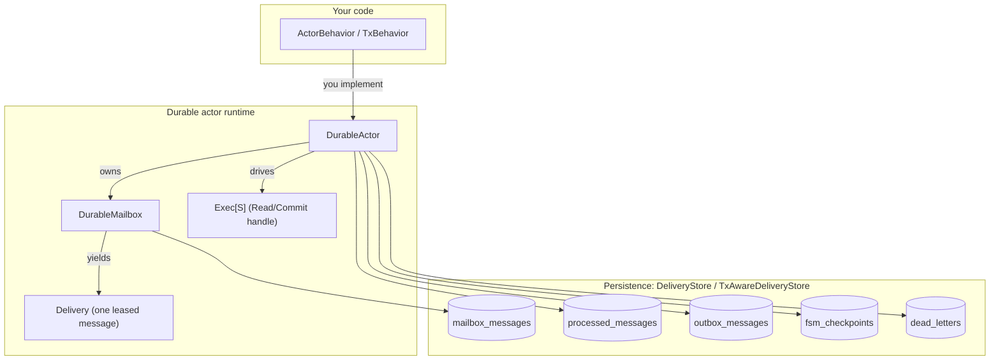
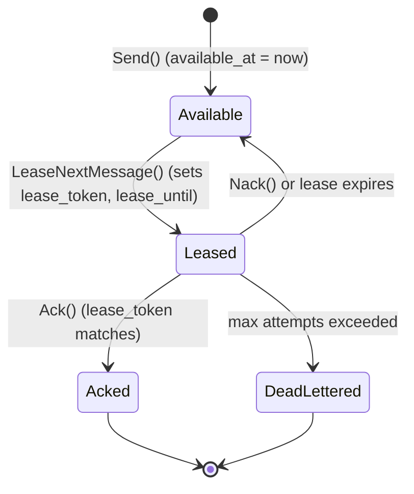
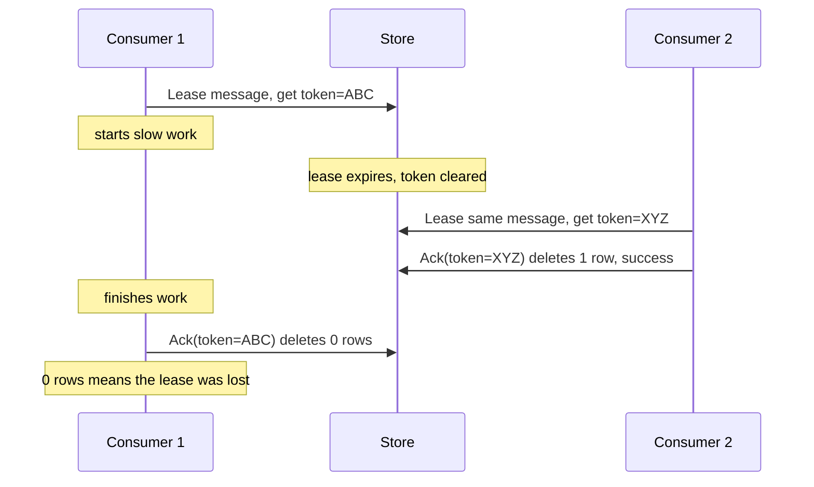
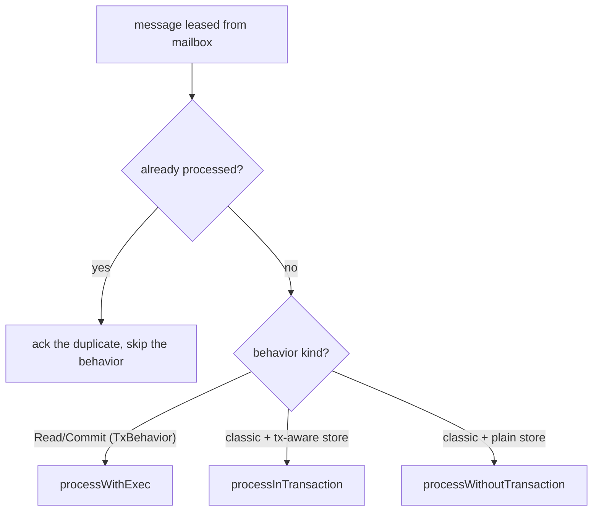
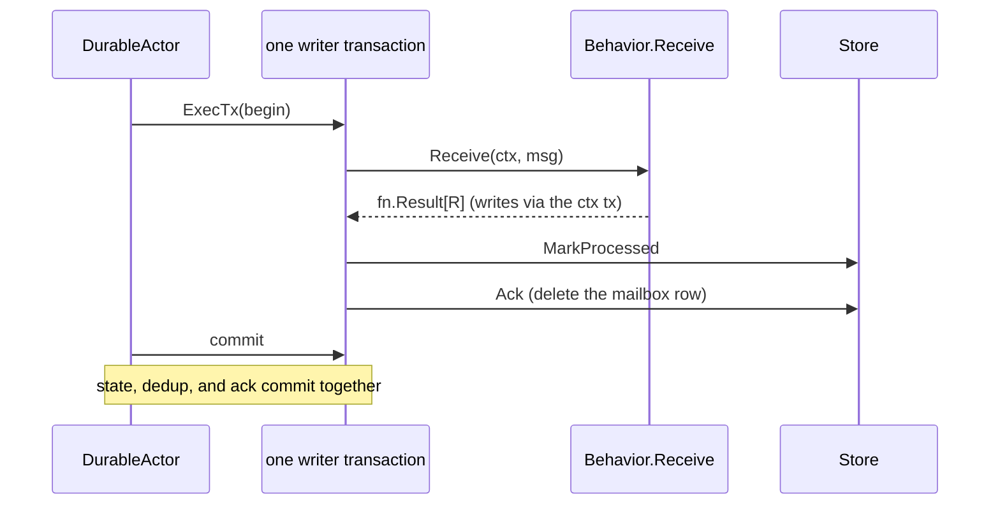
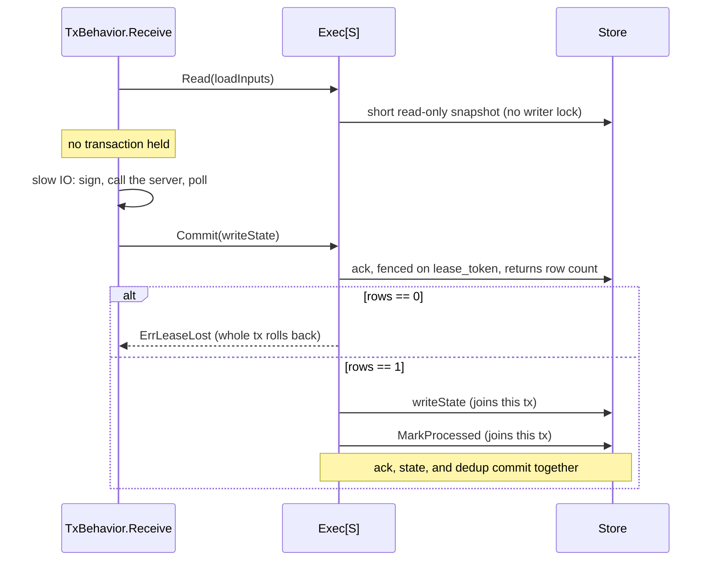
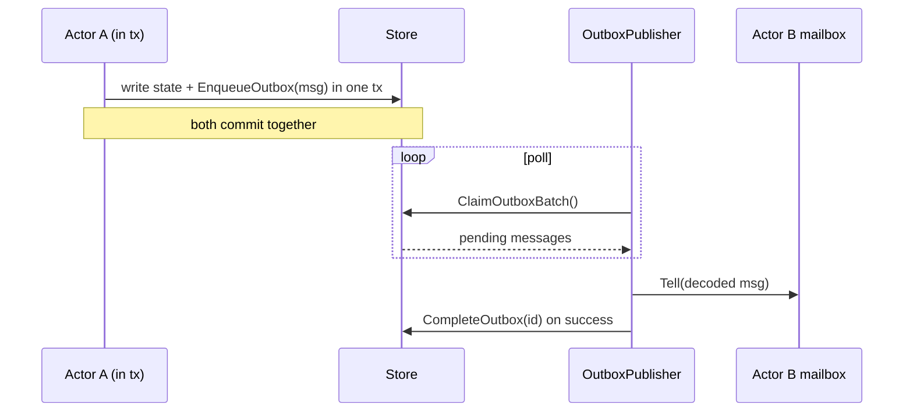
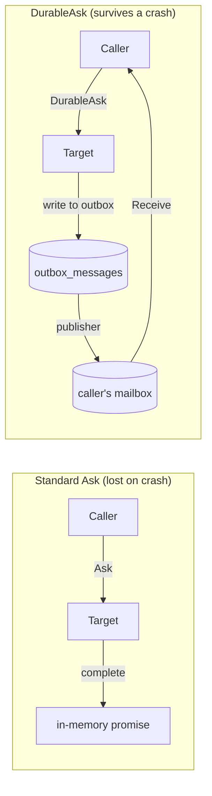
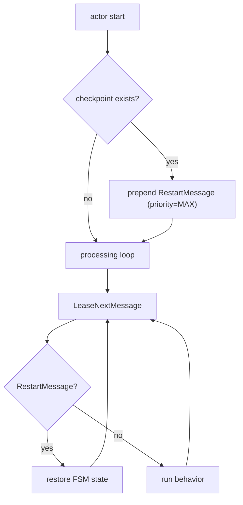

# The Mailbox and Durable Actor Layer

An actor reads a message, does some work, writes new state, and reports that it
is done. A crash can land between any two of those steps. If the actor drops the
message the moment it reads it and then crashes, the message is gone. If it
writes the new state but crashes before recording that the message was handled,
a restart runs the message again and writes the state twice.

This layer closes those gaps. It persists a message to the database before
anyone processes it, and it records that the message was handled in the same
transaction that commits the work, so either both land or neither does. The
transport underneath may deliver a message more than once, which is called
at-least-once delivery. On top of it, this layer gives the application
exactly-once processing: the effect of a message lands once, however many times
the message arrives.

The code lives in `baselib/actor`. The connection runtime that carries traffic
to and from the remote Ark server is built on top of this layer; for how a
server connection becomes a durable actor and how inbound events reach durable
mailboxes, see
[`mailbox_transport_serverconn_clientconn.md`](mailbox_transport_serverconn_clientconn.md).

## Contents

1. [The three mechanisms](#the-three-mechanisms)
2. [The pieces](#the-pieces)
3. [The durable mailbox](#the-durable-mailbox)
4. [Leases](#leases)
5. [The durable actor and its execution paths](#the-durable-actor-and-its-execution-paths)
6. [The classic path](#the-classic-path)
7. [The Read/Commit path](#the-readcommit-path)
8. [Deduplication](#deduplication)
9. [The transactional outbox and DurableAsk](#the-transactional-outbox-and-durableask)
10. [Crash recovery and restart](#crash-recovery-and-restart)
11. [Choosing a path](#choosing-a-path)

---

## The three mechanisms

Three mechanisms do most of the work.

Durability persists a message to the database before it is delivered, so a crash
before processing redelivers the message instead of losing it.

A lease gives one consumer time-boxed ownership of a message. When that consumer
crashes, its lease expires and the message becomes available to another consumer
or to the same consumer after it restarts.

Deduplication records each handled message identifier with a time-to-live (TTL).
When a message is redelivered but was already handled, the actor recognizes the
identifier and skips it. This is what turns at-least-once delivery into
exactly-once processing.

---

## The pieces



| Piece | What it is |
|-------|------------|
| `DurableActor[M, R]` | The runtime. It drains the mailbox, runs your behavior, and books the resulting ack, dedup mark, and retry. |
| `ActorBehavior[M, R]` | The classic behavior you implement: `Receive(ctx, msg) fn.Result[R]`. |
| `TxBehavior[M, R, S]` | The Read/Commit behavior: `Receive(ctx, msg, Exec[S]) fn.Result[R]`. |
| `DurableMailbox[M, R]` | The per-actor message queue backed by the `mailbox_messages` table. |
| `Delivery[M, R]` | One leased message together with its lease operations (`Ack`, `Nack`, `Extend`). |
| `Exec[S]` | The per-message handle the Read/Commit path hands to a `TxBehavior`. |
| `DeliveryStore` | The persistence interface: enqueue, lease, ack, nack, dead-letter, dedup, checkpoint, outbox. |
| `TxAwareDeliveryStore` | `DeliveryStore` plus `ExecTx`, which runs several operations in one database transaction. |
| `MessageCodec` | The type-length-value (TLV) codec that serializes a message for storage. |

The message type `M` must implement `TLVMessage`, so it can encode and decode
itself as a TLV stream and the mailbox can persist it. The response type `R` is
whatever an `Ask` caller expects back.

---

## The durable mailbox

A `DurableMailbox` is a persistent queue scoped to one actor. Sending a message
writes a row to `mailbox_messages`; the actor's processing loop reads those rows
back out. Because the queue lives in the database, it survives a restart of the
process on either end.

A message moves through a small state machine.



The store behind the mailbox is `DeliveryStore`. Its core methods:

```go
type DeliveryStore interface {
    // Mailbox queue.
    EnqueueMessage(ctx context.Context, params EnqueueParams) error
    LeaseNextMessage(ctx context.Context, mailboxID, leaseToken string,
        leaseDuration time.Duration) (*LeasedMessage, error)
    AckMessage(ctx context.Context, id, leaseToken string) (int64, error)
    NackMessage(ctx context.Context, id, leaseToken string,
        retryAfter time.Duration) (int64, error)
    MoveToDeadLetter(ctx context.Context, id, reason string) error
    DeleteMessage(ctx context.Context, id string) error
    ExpireLeases(ctx context.Context) error

    // Deduplication.
    IsProcessed(ctx context.Context, id string) (bool, error)
    MarkProcessed(ctx context.Context, id, actorID string,
        ttl time.Duration) error

    // Transactional outbox.
    EnqueueOutbox(ctx context.Context, params OutboxParams) error
    ClaimOutboxBatch(ctx context.Context, ...) (...)

    // FSM checkpoints.
    SaveCheckpoint(ctx context.Context, params CheckpointParams) error
    LoadCheckpoint(ctx context.Context, actorID string) (*Checkpoint, error)
}
```

`AckMessage` returns the number of rows it deleted. That row count carries the
crash-safety guarantee, as the [Leases](#leases) and
[Read/Commit](#the-readcommit-path) sections both rely on it.

### Same-transaction enqueue

`DurableMailbox.Send` keeps the sender's database transaction in the context.
When the sender and the target actor share a database, the send joins the
sender's transaction, so enqueuing the message commits atomically with whatever
the sender was already writing. An actor that updates its own state and notifies
another actor in one step therefore never leaves a gap where the state changed
but the notification was lost.

### Per-correlation-key FIFO

By default the mailbox claims messages in global `available_at` order. A message
type can override `CorrelationKey() string` to opt into per-key first-in,
first-out (FIFO) ordering. Two messages in the same mailbox that share a
non-empty correlation key are then handled in emission order regardless of retry
backoff.

This order matters because of an overtaking bug it prevents. Suppose message 1
fails transiently and is nacked with a backoff that pushes its `available_at`
into the future. Message 2, enqueued later in the same logical stream with an
earlier `available_at`, would otherwise be claimed first and overtake message 1.
The claim path blocks this with an anti-join on the message identifier, a
UUIDv7 that sorts by creation time at millisecond granularity: the head of each
correlation key must drain before any later same-key row becomes claim-eligible.
Unkeyed messages keep the global order and do not interfere, and head-of-line
blocking stays bounded to the correlation key rather than the whole mailbox.

The override lives on the concrete message struct, such as the round and
out-of-round message types, not in the framework. The framework only carries the
value from `msg.CorrelationKey()` through `EnqueueParams.CorrelationKey` into the
`mailbox_messages.correlation_key` column.

---

## Leases

A lease answers one question: which consumer is allowed to finish this message?
When a consumer claims a message, the store stamps it with a unique `lease_token`
and a `lease_until` expiry. To acknowledge the message, the consumer must present
the same token.

Without a token, a slow consumer could acknowledge a message that a second
consumer already reprocessed after the first consumer's lease expired. That stale
ack would double-count the work or corrupt state.



`AckMessage` deletes the row only where the token matches, so a return of zero
rows says something precise: this consumer no longer owns the message. The
Read/Commit path turns that signal into a transaction rollback (see
[the lease fence](#the-lease-fence)).

### Heartbeating

A long operation would outlive its lease if nothing extended it. The
`DurableActor` runtime runs a background heartbeat that calls `Delivery.Extend`
every `HeartbeatInterval`, which defaults to a third of the lease duration, so a
30-second lease is extended every 10 seconds. You do not extend leases by hand;
the runtime keeps the lease alive for as long as your behavior runs.

---

## The durable actor and its execution paths

`DurableActor` owns the mailbox and runs your behavior. You construct one from a
`DurableActorConfig` and a behavior:

```go
res := actor.NewDurableActor(
    actor.DefaultDurableActorConfig(id, behavior, store, codec),
)
da, err := res.Unpack()
```

`NewDurableActor` returns an `fn.Result` rather than a bare pointer because it
validates the configuration and fails at construction instead of panicking on
the first message. A missing behavior returns `ErrNoBehavior`. (The behavior
field is an `fn.Either` whose zero value is a `Left` holding a nil classic
behavior, so a forgotten field lands here too.) A Read/Commit behavior paired
with a store that cannot run transactions returns `ErrTxBehaviorNeedsTxStore`.

When a message arrives, the actor first checks deduplication, then picks one of
three paths from the configured behavior and store.



The behavior is stored as an `fn.Either[ActorBehavior, BoundTxBehavior]`. The
`Left` case is the classic behavior, and the `Right` case is the Read/Commit
behavior. The constructors `DefaultDurableActorConfig` (classic) and
`DefaultDurableTxActorConfig` (Read/Commit) wrap the either for you.

The next two sections cover the transactional paths. The third path,
`processWithoutTransaction`, serves stores that cannot run transactions: it runs
the behavior and then books the ack and dedup mark as separate operations. Use a
transaction-aware store whenever atomicity matters.

---

## The classic path

The classic path is the default and the right choice for any behavior that does
no slow IO. The runtime opens one database transaction, runs your whole `Receive`
inside it, and books the result in that same transaction: the state writes, any
outbox writes, the dedup mark, and the ack.



Your behavior implements one method:

```go
type ActorBehavior[M TLVMessage, R any] interface {
    Receive(ctx context.Context, msg M) fn.Result[R]
}
```

Any domain store your behavior writes through joins the framework transaction by
reading the `*sql.Tx` off the context with `actor.TxFromContext`. The result then
decides the bookkeeping. A successful `Tell` marks the message processed and acks
it. A failed `Tell` consults the `TellRetryPolicy`: if the policy retries, the
runtime nacks with a delay and does not mark the message processed, so the
redelivery is not skipped; if the policy gives up, the runtime dead-letters the
message. An `Ask` always acks, because the error is part of the persisted result,
and its in-memory promise completes only after the transaction commits, so a
caller never sees success for work that did not durably land.

This path holds the single write-ahead-log (WAL) writer for the whole `Receive`.
A behavior that does a network round-trip in the middle, such as signing,
calling the server, or polling, holds the writer across that round-trip, and
every other actor that needs the writer waits behind it. The Read/Commit path
removes that cost.

---

## The Read/Commit path

A behavior that must do slow side-effect IO opts into the Read/Commit path. It
splits one `Receive` into three phases: a short read, the IO with no transaction
held, and one short fenced commit. The writer lock is held only for the reads and
the final write, never across the network.

The behavior implements `TxBehavior` and works through an `Exec[S]` handle:

```go
type TxBehavior[M TLVMessage, R any, S any] interface {
    Receive(ctx context.Context, msg M, ax Exec[S]) fn.Result[R]
}

type Exec[S any] interface {
    // Read runs fn inside a short read-only snapshot. No writer lock.
    Read(ctx context.Context, fn func(ctx context.Context, store S) error) error

    // Stage runs fn inside one short, lease-fenced writer transaction with
    // no dedup mark and no ack. Use it to durably advance state BEFORE the
    // IO when a persist-before-effect invariant matters; a Stage write is
    // its own atomic unit, not atomic with the eventual Commit.
    Stage(ctx context.Context, fn func(ctx context.Context, store S) error) error

    // Commit runs fn inside one short writer transaction, then folds in
    // the lease-fenced ack and the dedup mark.
    Commit(ctx context.Context, fn func(ctx context.Context, store S) error) error
}
```

A handler reads its inputs, drops the transaction, does the IO, and then commits
the result. A behavior that must durably record state before the IO can insert
a lease-fenced `Stage` write in between; see `credit/op_actor.go` for a worked
example.



### The lease fence

The exactly-once guarantee survives the IO window because of the order of
operations inside `Commit`. The runtime acks first:

```go
// Inside Commit, before running the behavior's write closure:
rows, err := s.AckMessage(txCtx, msgID, leaseToken)
if err != nil {
    return err
}
if rows == 0 {
    return ErrLeaseLost
}
// The behavior's writes and the dedup mark run next, in this same tx.
```

If the behavior stalled past its lease during the IO, another consumer may have
already reclaimed and reprocessed the message. The token then no longer matches,
`AckMessage` deletes zero rows, `Commit` returns `ErrLeaseLost`, and the whole
transaction rolls back, applying nothing. Acking first keeps the stale-lease case
a true no-op rather than relying on rollback to undo work that already ran. Any
duplicate effect the stale consumer emitted is absorbed downstream by the
receiver's `ON CONFLICT (id) DO NOTHING`.

On the happy path, the behavior's writes, the dedup mark, and the ack commit in
one transaction, so the state advance and the message's consumption are a single
exactly-once unit. A lease heartbeat runs for the whole `processWithExec`
duration, so a long IO middle cannot let the lease expire underneath an
in-progress commit. The heartbeat stops the moment the behavior returns, because
a committed message is already deleted and a late heartbeat tick would log a
spurious failure trying to extend a gone lease.

### The store factory and the atomicity contract

A `StoreFactory` you supply builds the behavior's typed, transaction-scoped store
`S` once per message:

```go
type StoreFactory[S any] func(ctx context.Context, ds DeliveryStore) S
```

The factory runs inside each `Read` and `Commit` transaction and returns the
store handed to your closure. One rule governs it: the returned store must write
against the per-call transaction. Domain stores satisfy the rule by reading the
`*sql.Tx` from the closure's context (via `actor.TxFromContext`) at call time.

Two mistakes break the rule silently. Both commit out-of-band with no error while
the framework's ack still fences, so the state is not atomic with consumption.

```go
// WRONG: captures an outer (non-tx) context, so writes skip the Commit tx.
factory := func(context.Context, actor.DeliveryStore) myStore {
    return myStore{ctx: outerCtx, db: db}
}

// WRONG: binds to the raw DB handle, bypassing the tx entirely.
factory := func(context.Context, actor.DeliveryStore) myStore {
    return myStore{db: rawDB}
}

// RIGHT: the store reads the tx from the closure's ctx at call time.
factory := func(context.Context, actor.DeliveryStore) myStore {
    return myStore{domain: domainStore}
}
```

Never capture a context in the factory. Let the store pick up the transaction
from the context passed into the `Read` or `Commit` closure.

### A worked example: the client ledger

The client-side ledger actor is the first adopter. It wires onto the Read/Commit
path with `DefaultDurableTxActorConfig` and injects a typed `ledgerTx` store:

```go
durableCfg := actor.DefaultDurableTxActorConfig[LedgerMsg, LedgerResp, ledgerTx](
    a.actorID, a, a.bindStores, a.cfg.DeliveryStore, codec,
)
durable, err := actor.NewDurableActor(durableCfg).Unpack()
```

Its handler for a unilateral-exit cost books two ledger legs, a send leg and a
fee leg, through two `InsertLedgerEntry` calls inside one `Commit`:

```go
return a.commit(ctx, ax, "Failed to handle exit cost",
    func(ctx context.Context, q ledgerTx) error {
        if err := q.ledger.InsertLedgerEntry(ctx, sendLeg); err != nil {
            return err
        }
        return q.ledger.InsertLedgerEntry(ctx, feeLeg)
    },
)
```

Both legs join the same fenced transaction, so a crash or error between them
rolls back both writes and the mailbox ack together. There is no window where
only the send leg landed. A returned `ErrLeaseLost` means the message was
reclaimed and reprocessed elsewhere, not that the handler failed, so the ledger
does not log it as a handler error and the framework's retry path takes over.

### What this path does not support yet

`DurableAsk` (see [the next section](#the-transactional-outbox-and-durableask))
does not work on this path yet. On the Read/Commit path, the behavior acks the
message inside its own `Commit`, so the framework cannot fold the crash-safe
callback response into the consuming transaction; it does not have the behavior's
result at commit time. A `DurableAsk` delivered to a Read/Commit actor is
rejected with `ErrDurableAskUnsupported`: the runtime writes an error response to
the caller under the same lease fence rather than leaving the caller to hang.
Full support is planned alongside the effect actors in the out-of-round
subsystem, the next part of the codebase to adopt this path.

---

## Deduplication

Before it runs your behavior, the actor calls `IsProcessed(id)`. If the message
was already handled, for example because it ran before a crash but the ack was
lost, the actor skips the behavior and acks the redelivered copy. After a
successful run, `MarkProcessed(id, actorID, ttl)` records the identifier so a
later redelivery is recognized.

On both transactional paths the dedup mark is written inside the same transaction
as the work and the ack, so the record that a message was handled can never drift
out of sync with the effect of handling it. The TTL should comfortably exceed the
longest possible redelivery window; it defaults to 24 hours.

Marking is skipped on purpose when the actor intends to retry. A failed `Tell`
that the retry policy will redeliver must not be marked processed, or the
redelivery would be wrongly skipped as a duplicate.

---

## The transactional outbox and DurableAsk

An actor often needs to send a message to another actor while handling its own.
Sending that message in a separate step after the state change reopens the crash
gap: state updated, message never sent. The transactional outbox closes it.

### Change data capture through the outbox

To emit a message, a behavior writes it to the `outbox_messages` table inside its
own transaction, via `EnqueueOutbox`. The outgoing message and the state change
then commit together or not at all. A background `OutboxPublisher` polls the
outbox, decodes each message, looks up the target actor through the
`Receptionist` service registry, and delivers it. This is the change data capture
(CDC) pattern: the durable outbox row is the captured intent, and the publisher
turns it into a real delivery.



When delivery fails, the publisher leaves the row for the next poll to retry.

### DurableAsk: request-response that survives a crash

A normal `Ask` returns an in-memory promise, which a crash destroys. `DurableAsk`
routes the response through the durable outbox instead, so it survives a restart
on either side. The caller supplies two parameters. `CallbackActorID` is the
caller's own actor identifier: the target writes its response to the outbox
addressed to this actor, and the publisher delivers it to the caller's mailbox.
`CorrelationID` is a unique identifier the caller generates so it can match a
response to the request it answers, since responses arrive later as separate
messages.



---

## Crash recovery and restart

When an actor restarts, it must restore its state before it processes anything
that depends on that state. Checkpoints and the `RestartMessage` make this work.

On each message, a behavior can checkpoint its finite-state-machine (FSM) state
to `fsm_checkpoints`. On startup, the actor loads the latest checkpoint and
prepends a `RestartMessage` to its own mailbox. That message carries
`RestartPriority`, the maximum 32-bit integer, so it always sorts to the front of
the queue and runs before any regular message. The behavior restores its state
from the `RestartMessage`, and only then does normal processing resume.



A message that was leased but never acked before a crash is redelivered once its
lease expires. `ExpireLeases` clears stale leases by setting `lease_token` and
`lease_until` back to null, the message becomes available again, the restarted
actor leases it, and deduplication decides whether the behavior runs or the
message is acked as an already-handled duplicate.

---

## Choosing a path

| Situation | Path |
|-----------|------|
| Behavior does only fast in-memory work and database writes | Classic (`ActorBehavior` with a tx-aware store) |
| Behavior must do slow IO (signing, calling the server, polling) before it can commit | Read/Commit (`TxBehavior` with `Exec[S]`) |
| Several writes must land atomically with consumption | Either transactional path; both fold the dedup mark and ack into one transaction |
| Fire-and-forget, no response needed | `Tell` |
| Request-response, caller stays alive | `Ask` |
| Request-response that must survive a caller crash | `DurableAsk` (classic path only, for now) |
| Notify another actor while handling a message | Transactional outbox (`EnqueueOutbox` inside the tx) |

The classic path is the default. Reach for Read/Commit when holding the writer
across IO would stall other actors.

---

## Related documents

- [`mailbox_transport_serverconn_clientconn.md`](mailbox_transport_serverconn_clientconn.md)
  builds on this layer: it shows how the connection runtime to the remote Ark
  server is itself a durable actor, and how the wire transport relates this
  client's `serverconn` to the operator's `clientconn`.
- [`fee_ledger.md`](fee_ledger.md) covers the client ledger, the first adopter of
  the Read/Commit path, with its full chart of accounts and per-flow
  walkthroughs.
