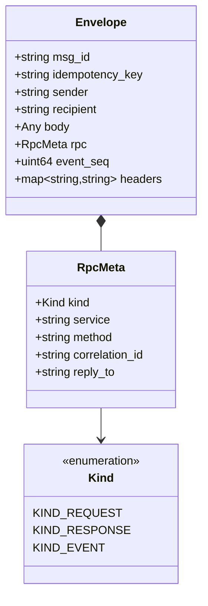
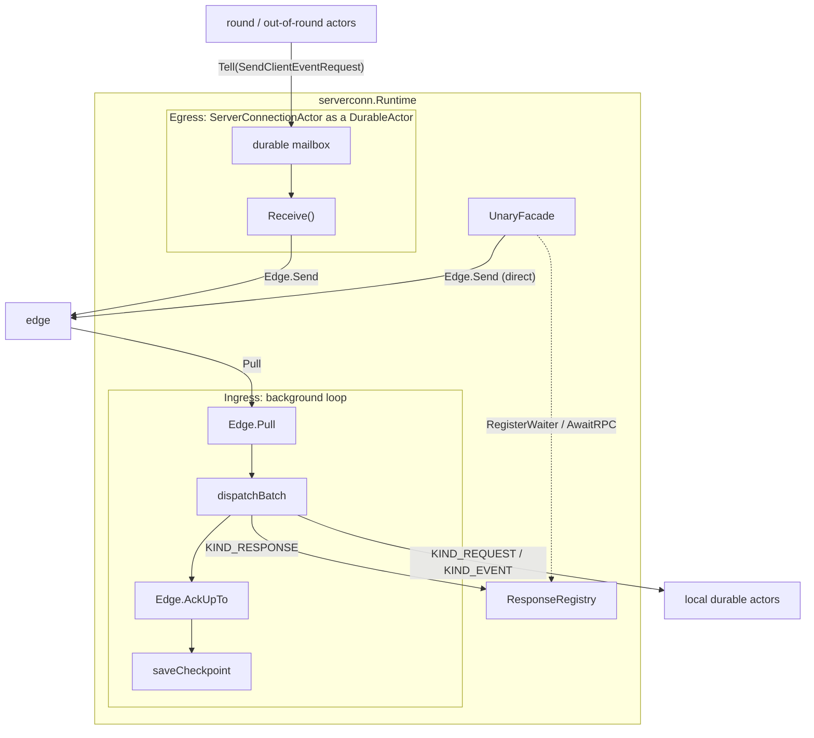
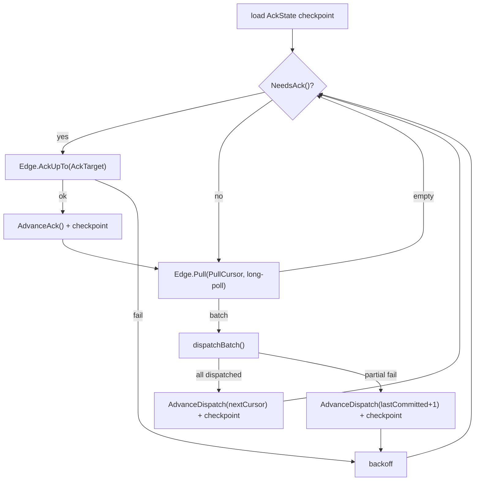
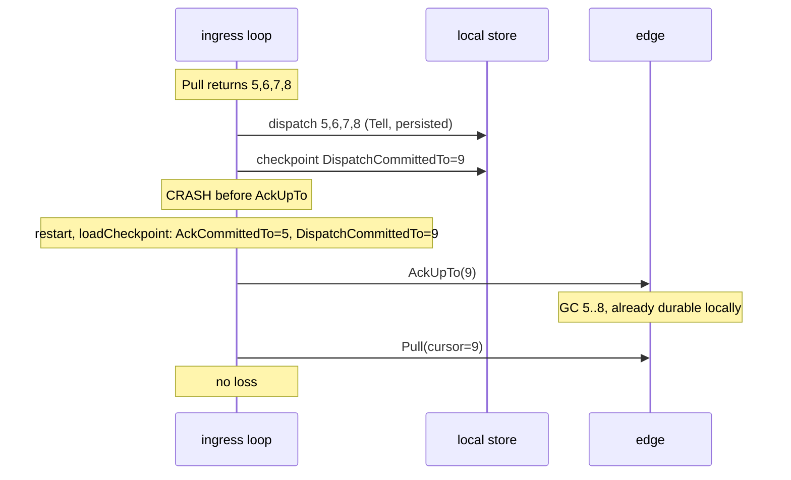
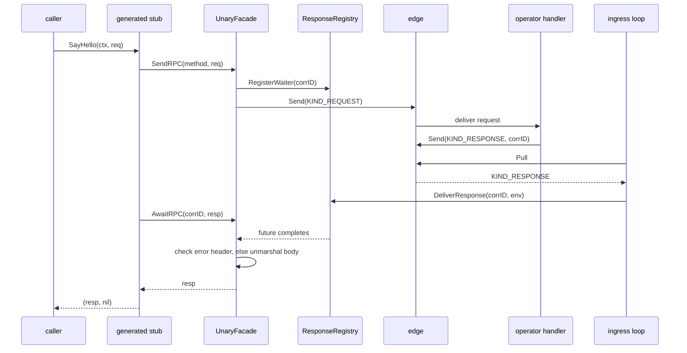
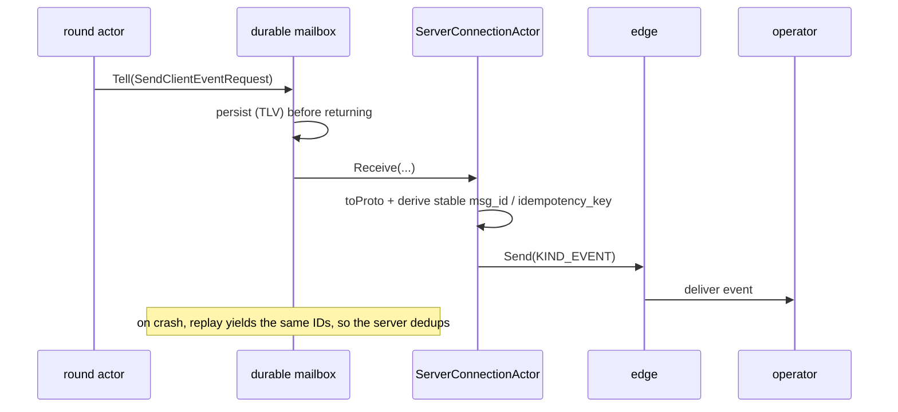
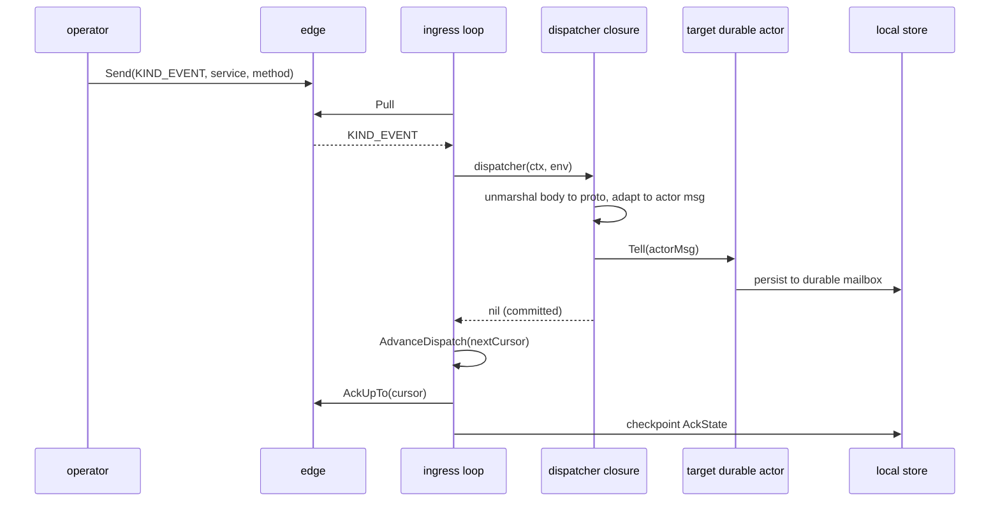

# The Mailbox Transport: serverconn and clientconn

The client and the remote Ark server never share a process or a TCP connection.
They talk by appending messages to each other's mailboxes and pulling them back
out. The client's end of that arrangement is the `serverconn` package in this
repository. The server operator's end is its `clientconn` ingress loop, which
lives in the server repository.

This document stands on its own, but it builds on the durable actor layer. The
client's outbound side is itself a durable actor, and inbound events land in
durable actor mailboxes. For how durable actors, leases, the transactional
outbox, and exactly-once processing work, see
[`mailbox_durable_actor_layer.md`](mailbox_durable_actor_layer.md).

## Contents

1. [Why a mailbox instead of a gRPC stream](#why-a-mailbox-instead-of-a-grpc-stream)
2. [The two ends and the edge between them](#the-two-ends-and-the-edge-between-them)
3. [The envelope](#the-envelope)
4. [The edge API: Send, Pull, AckUpTo](#the-edge-api-send-pull-ackupto)
5. [The shared connection primitives](#the-shared-connection-primitives)
6. [serverconn: the client end](#serverconn-the-client-end)
7. [clientconn: the operator end](#clientconn-the-operator-end)
8. [The ack watermark](#the-ack-watermark)
9. [Identity, authentication, and liveness](#identity-authentication-and-liveness)
10. [Worked flows](#worked-flows)
11. [Crash recovery on each end](#crash-recovery-on-each-end)
12. [The wire contract](#the-wire-contract)

---

## Why a mailbox instead of a gRPC stream

A plain gRPC stream ties message delivery to the life of a TCP connection. If
the connection drops mid-request, the request fails with no retry. If the process
crashes after receiving a message but before acting on it, the message is gone.

The mailbox transport replaces the stream with store-and-forward. The sender
appends a message to the recipient's mailbox, where the message is persisted
before the recipient ever sees it. The recipient pulls the message, processes it
durably, and only then acknowledges it. A crash between pull and acknowledgment
causes redelivery, not loss. This buys three properties a raw stream lacks.

A message is durable: it survives a restart of either process. Delivery is
at-least-once: an unacknowledged message is redelivered on reconnect. And the
transport is unified: request-response remote procedure calls (RPCs) and
fire-and-forget events share one envelope format and one edge API.

The price is that a message may arrive more than once, so both ends must be
idempotent. The durable actor layer on the client and the deduplication logic on
the server are what make at-least-once delivery safe.

---

## The two ends and the edge between them

Three parts are in play: the client, the server, and the edge between them. The
edge is a gRPC service, hosted at the server, that owns the mailbox storage.

```mermaid
flowchart LR
    subgraph Client["Client process (this repo)"]
        APP["round / out-of-round actors, RPC callers"]
        SC["serverconn.Runtime<br/>(egress DurableActor + ingress loop)"]
    end

    subgraph Edge["Mailbox edge (gRPC at the server)"]
        CMB[("client's mailbox")]
        OMB[("operator's mailbox")]
    end

    subgraph Operator["Operator process (server repo)"]
        CC["clientconn ingress loop"]
        SRV["Ark services + handlers"]
    end

    APP <--> SC
    SC -->|"Send to operator's mailbox"| OMB
    SC -->|"Pull/AckUpTo from client's mailbox"| CMB
    CC -->|"Send to client's mailbox"| CMB
    CC -->|"Pull/AckUpTo from operator's mailbox"| OMB
    CC <--> SRV
```



Each side sends by appending to the other side's mailbox and receives by pulling
from its own. The arrows are symmetric, because `serverconn` and `clientconn` are
mirror images: they run the same connection primitives over the same envelope
format. That symmetry is by design. The reusable primitives in `mailbox/conn`
were factored out of `serverconn` so the operator's `clientconn` could mirror
this client's ack-watermark logic, response correlation, and codec without
importing any client-specific code.

The client-side code is layered.

| Layer | Packages | Responsibility |
|-------|----------|----------------|
| 1 | `mailbox/pb` | Generated protobuf: the `Envelope`, `RpcMeta`, `Status`, and the `MailboxService` edge API. |
| 2 | `mailbox/rpc`, `mailbox/conn` | The runtime contracts generated stubs depend on, plus the shared connection primitives (ack watermark, response registry, deterministic identifiers, and a bridge between protobuf and the type-length-value (TLV) records the durable mailbox stores). |
| 3 | `serverconn` | The client's connection runtime: an egress durable actor, an ingress loop, an event router, a unary facade, and the `Runtime` that composes them. |

Layer 1 is pure generated code. Layer 2 is shared by both ends of the wire. Layer
3 wires the client into its actor system.

---

## The envelope

Every message, whether request, response, or event, travels inside an `Envelope`.



A few fields carry the contract. `msg_id` identifies a single message; do not
assume it is unique per send attempt. The durable egress derives it from the
payload (`StableEventMsgID`), so a replayed event keeps the same `msg_id` on
every retry rather than getting a fresh one. `idempotency_key` is likewise stable
per semantic operation and stays the same across retries of the same logical
request, and it is the key the receiver deduplicates on, never `msg_id`. `body`
is a `google.protobuf.Any` holding the typed payload, which receivers unmarshal
in forward-compatible mode, discarding unknown fields.

The `rpc` field is the optional RPC overlay. Its `Kind` says what the envelope
is: a `KIND_REQUEST` is a unary request from client to server, a `KIND_RESPONSE`
is a unary response from server to client, and a `KIND_EVENT` is a
fire-and-forget message in either direction. `service` and `method` name the
destination, and `correlation_id` pairs a response with its request.

`event_seq` is assigned by the edge. It defines per-mailbox ordering and serves
as the cursor for `Pull` and `AckUpTo`. `headers` carries extensible metadata,
including application errors (see
[error transport](#error-transport-through-headers)).

The routing keys come straight from the protobuf service definition: `service` is
the fully-qualified service name, such as `"arkrpc.v1.RoundService"`, and
`method` is the method name, such as `"JoinRound"`.

---

## The edge API: Send, Pull, AckUpTo

The edge is an ordinary gRPC service with three RPCs. Everything above it, namely
request correlation, idempotency, and dispatch routing, is an application-level
protocol built on these three primitives.

```protobuf
service MailboxService {
    rpc Send    (SendRequest)    returns (SendResponse);
    rpc Pull    (PullRequest)    returns (PullResponse);
    rpc AckUpTo (AckUpToRequest) returns (AckUpToResponse);
}
```

`Send` appends an envelope to the recipient's mailbox and returns a `Status`,
which can report a protocol-version mismatch among other things. `Pull` fetches
envelopes from the caller's own mailbox starting at a cursor; it long-polls,
blocking up to a bounded timeout and returning promptly when new envelopes
arrive, with a `next_cursor` set to the highest `event_seq` seen plus one.
`AckUpTo` advances the caller's ack watermark, after which the server may
garbage-collect envelopes older than the watermark. The call is monotonic, never
moving the watermark backward, and safe to retry.

---

## The shared connection primitives

`mailbox/rpc` and `mailbox/conn` hold the building blocks both ends use. They
carry no transport implementation and no actor dependency, so a generated stub or
an operator-side connector can import them freely.

`RPCClient` and `Router` in `mailbox/rpc` are the two contracts generated stubs
depend on. `RPCClient` is the client side:

```go
type RPCClient interface {
    SendRPC(ctx context.Context, method ServiceMethod,
        req proto.Message, opts RPCOptions) (SendResult, error)
    AwaitRPC(ctx context.Context, correlationID string,
        resp proto.Message) error
}
```

Splitting the call into `SendRPC` then `AwaitRPC` lets a caller register a
response waiter before the send, which closes the race where a fast server
replies before the caller is listening. `Router` is the server side:
`Handle(service, method, newReq, fn)` registers a typed handler, and the
generated `RegisterXxxMailboxServer` calls it once per method. `ServeMux` is the
concrete `Router`, a small thread-safe map from a `(service, method)` pair to a
typed handler.

### Error transport through headers

Application errors travel in an envelope header, not in the body, so the body
stays reserved for successful payloads. The header is
`mailboxrpc.grpc_status_b64`, a base64-encoded `google.rpc.Status`.
`EncodeErrorHeaders` turns a Go error into that header, and `DecodeErrorHeaders`
reconstructs it. On receipt, the client checks the error header before it reads
the body.

### The other primitives

`AckState` in `mailbox/conn` is the four-cursor watermark machine described in
[its own section](#the-ack-watermark).

`ResponseRegistry` maps a correlation identifier to an in-memory waiter and
buffers a response that arrives before its waiter is registered. It is in-memory
only: on a crash, callers' contexts are cancelled and they retry, because the
edge still holds the unacked envelopes.

`EnvelopeIdentity` derives stable identifiers from payload content.
`StableEventMsgID(payload)` and `StableEventIdempotencyKey(payload)` each return
a prefix plus the first 16 bytes of the payload's SHA-256 digest. When a durable
event is replayed from the actor mailbox after a crash, the same identifiers
reappear from the same stored bytes, so a retry carries the same idempotency key
and the server deduplicates it with no extra state.

`WrappedProto[T]` bridges a protobuf message into the `TLVMessage` interface the
durable actor mailbox requires, by marshaling to and from bytes. This is how a
proto payload becomes storable in a durable actor mailbox.

---

## serverconn: the client end

`serverconn` is the single boundary for all mailbox traffic between this client
and the remote server. It plays two roles at once, an outbound durable actor and
an inbound polling loop, composed by a `Runtime`.



### Egress: two paths for two needs

Outbound traffic takes one of two paths, chosen by whether the message must
survive a crash.

The durable path carries finite-state-machine (FSM) events, the messages a round
or out-of-round actor must not lose. The producer calls
`Tell(SendClientEventRequest)` on the
connection runtime, which is a durable actor, so the event is TLV-encoded and
persisted to the durable mailbox before the call returns. The actor's `Receive`
later converts the event to a proto, derives a stable `msg_id` and
`idempotency_key` from the payload hash, builds a `KIND_EVENT` envelope, and
calls `Edge.Send`. On a crash, the durable mailbox replays the persisted event,
the same identifiers are derived again, and the server deduplicates the retry.
The `SendClientEventRequest` forwards its inner message's `CorrelationKey()`, so
the durable mailbox enqueues the event into the correct per-key first-in,
first-out (FIFO) lane, such as `round/<id>` or `oor/<session>`, and a cached key
populated during TLV decode preserves that lane even after the message is decoded
again on crash-replay.

The fast path carries unary RPCs, where the caller can retry. The
`UnaryFacade` builds a `KIND_REQUEST` envelope and calls `Edge.Send` directly,
with no durable mailbox in the way. It trades crash durability for lower latency,
which suits a request the caller will reissue if it fails.

### Ingress: the pull-dispatch-ack loop

A background goroutine runs one cycle continuously.



Dispatch routes each envelope by its `Kind`. A `KIND_RESPONSE` goes to the
`ResponseRegistry`, completing the in-memory waiter for a unary RPC; this is not
durable, since the response is consumed immediately, and if no waiter exists
because the caller crashed and is gone, the ingress can fall back to durable
route dispatch. A `KIND_REQUEST` or `KIND_EVENT` is looked up in a dispatch table
keyed by `(service, method)`; the matched dispatcher unmarshals the body, adapts
it to a local actor's message type, and calls `Tell` on that durable actor, which
persists the message before returning. A nil return means the envelope is
durably committed locally.

When dispatch fails partway through a batch, for instance because a target
actor's store is briefly down, the loop advances its watermark only past the last
successfully-committed envelope, and the failed one is re-pulled next cycle.
Transient failures back off exponentially with jitter.

### The event router and the unary facade

The `EventRouter` is where inbound routes are declared at wiring time. Each route
binds a `(service, method)` pair to a target actor's `ServiceKey` and an adapter
that turns the decoded proto into the actor's message type. A new server-pushed
event needs only a new route registration, with no change to the loop.

The `UnaryFacade` implements `RPCClient` for the generated stubs. `SendRPC`
registers a response waiter, builds the request envelope, and sends it directly.
`AwaitRPC` blocks on that waiter until the ingress loop delivers the matching
`KIND_RESPONSE`, then checks the error header before unmarshaling the body.

### The runtime

`Runtime` embeds the egress `DurableActor`, so it registers directly with the
actor system and promotes `Ref` and `TellRef` without wrappers. `Start` starts
the durable actor (egress) and then the ingress loop, which loads the ack
checkpoint and begins pulling; `Stop` reverses the order. Higher layers reach
egress through `TellRef` and typed RPCs through `Unary()`.

---

## clientconn: the operator end

On the operator's side, the mirror of `serverconn` is its `clientconn` ingress
loop, in the server repository. It is the operator's view of one connected
client. The name is from the operator's perspective: `clientconn` is the
connection to a client, just as this repo's `serverconn` is the connection to the
server.

Because the connection primitives are shared, `clientconn` runs the same
machinery in mirror image.

| Concern | serverconn (this client) | clientconn (the operator) |
|---------|--------------------------|---------------------------|
| Sends to | the operator's mailbox | the client's mailbox |
| Pulls from | the client's own mailbox | the operator's mailbox |
| Ack watermark | `AckState`, four cursors, checkpointed | the same `AckState` logic, mirrored |
| Inbound dispatch | route to a local durable actor via `Tell` | route to the operator's request handlers |
| Idempotency | derives stable keys, retries safely | deduplicates on the request's idempotency key |

This repository does not contain `clientconn`, but it pins down the parts of the
contract the operator must honor, because the client sends envelopes the operator
interprets:

- The client sends a heartbeat to the well-known service
  `clientconn.v1.HeartbeatService`, method `Heartbeat`, and the operator
  recognizes that service and refreshes the client's liveness status (see
  [liveness](#identity-authentication-and-liveness)).
- The client sets a stable idempotency key on any request it may retry, and the
  operator deduplicates on that key without assuming it sees the key only once.
- The operator echoes the request's `correlation_id` on its response. A client
  with several requests in flight demultiplexes pulled responses by correlation
  id before it advances any ack watermark, because a client that acked too far
  would drop responses for its concurrent requests.
- Ordering holds only within a single mailbox stream, so neither side assumes an
  order between different mailboxes or a request-to-response order beyond
  correlation. The client tolerates out-of-order delivery: a seal-time fee quote
  that arrives before the round event that keys the FSM waits in a buffer until
  that event lands.

---

## The ack watermark

The ack watermark turns at-least-once delivery into no-loss delivery. Each end
tracks four monotonic cursors.

```go
type AckState struct {
    PullCursor          uint64 // cursor for the next Pull
    DispatchCommittedTo uint64 // max cursor durably dispatched locally
    AckTarget           uint64 // max cursor that should be acked remotely
    AckCommittedTo      uint64 // last cursor successfully acked remotely
}
```

One invariant governs them:

> `AckCommittedTo` must never exceed `DispatchCommittedTo`.

Never acknowledge past work that is not yet durable locally. If the loop acked an
envelope before durably dispatching it, a crash in that gap would lose the
envelope for good: the server, seeing the ack, garbage-collects it, while the
client has no record of it.

The cursors advance in order. `AdvanceDispatch(nextCursor)` bumps
`DispatchCommittedTo` and `AckTarget` after `dispatchBatch` durably persists a
batch. `AdvanceAck()` sets `AckCommittedTo` to `AckTarget` after `AckUpTo`
succeeds. `NeedsAck()` reports whether `AckTarget > AckCommittedTo`. The state is
serialized with LND's TLV codec as four `uint64` records and checkpointed after
every change, so a restart resumes from `PullCursor`.



Had the crash struck between dispatching envelope 6 and envelope 7, before the
checkpoint, the checkpoint would still show the old position; the loop would
re-pull and re-dispatch 7 and 8, and the durable actor's deduplication would
absorb the repeats.

---

## Identity, authentication, and liveness

A mailbox is named by the public key of its owner. `PubKeyMailboxID` derives the
canonical mailbox identifier from a compressed public key in hex, so the client's
and operator's mailbox names are deterministic and need no separate registration.

Two layers protect the connection. At the transport layer, mutual TLS (mTLS)
binds the session to the mailbox identity: `GenerateClientTLSCert` mints an
ephemeral P-256 client certificate whose subject common name is the client's
secp256k1 identity public key in hex. At the application layer, every outbound
envelope carries a BIP-340 Schnorr signature in the `x-mailbox-auth-sig` header
(`AuthHeaderKey`). The signed digest is a tagged hash, `MailboxAuthDigest`, built
with the `MailboxAuthTagStr` domain separator. The connection's configured
`AuthSignature` is merged into every envelope, and the auth header always wins
over any caller-provided header. `SignMailboxAuth`, `VerifyMailboxAuth`, and
`ParseMailboxPubKey` are the sign-and-verify helpers the two ends share.

The heartbeat keeps liveness current. The client sends a heartbeat every
`DefaultHeartbeatInterval` (30 seconds), but skips it when real traffic went out
within the interval, since the operator's ingress already sees that activity. The
operator's default staleness threshold is twice the interval, so one missed
heartbeat is grace rather than a disconnect. If heartbeats stop, the operator
marks the client offline after the threshold.

---

## Worked flows

### A unary RPC round-trip



### A durable event, egressed



### A server-pushed event, ingressed



---

## Crash recovery on each end

Three recovery paths run independently when the client restarts.

Egress is the durable actor replaying its inbox. Each persisted
`SendClientEventRequest` reproduces the same stable identifiers from its stored
payload, so the operator deduplicates the retries.

Ingress restores the four-cursor `AckState` from its checkpoint and resumes
pulling from `PullCursor`. If an ack was pending at crash time, it acks first. Any
envelopes re-pulled in the gap are handled idempotently by the durable actors
they dispatch into.

Unary RPCs keep their waiters in memory only, so a crash cancels every waiting
caller's context. Callers retry with a fresh correlation id, or reuse a stable
idempotency key so the operator deduplicates.

The operator's `clientconn` recovers symmetrically: it persists its own ack
watermark and resumes pulling from the client's mailbox, redelivering anything
the client had not yet acked.

---

## The wire contract

Both ends must uphold these properties, independent of either implementation:

- Delivery is at-least-once, so a send may be retried and a pull may return
  duplicates. Both ends are idempotent.
- The sender sets a stable idempotency key on any retriable request, and the
  receiver deduplicates on it without assuming uniqueness.
- A response echoes the request's correlation id, and a caller with concurrent
  requests demultiplexes by correlation id before it advances any ack watermark.
- Ordering is stable only within a single mailbox stream. Neither side assumes a
  cross-mailbox order or a request-to-response order beyond correlation.
- The ack watermark is monotonic and safe to retry. A side acks only after it
  persists whatever it needs to keep in-flight work, never past work that is not
  yet durable locally.
- A pull blocks up to a bounded timeout, returns promptly on new data, and
  returns before the timeout elapses.
- Payloads are protobuf-encoded, and receivers unmarshal forward-compatibly,
  discarding unknown fields. The generated stubs are a convenience over the
  transport, not a constraint on it.
- Application errors ride in an envelope header as an encoded gRPC status,
  separate from the transport's own failure domain.

For the normative, implementation-ready version of this contract, see
[`RPC_MAILBOX_CONTRACT.md`](RPC_MAILBOX_CONTRACT.md).

---

## Related documents

- [`mailbox_durable_actor_layer.md`](mailbox_durable_actor_layer.md) covers the
  durable actor layer this transport stands on: leases, deduplication, the
  transactional outbox, and the classic and Read/Commit execution paths.
- [`RPC_MAILBOX_CONTRACT.md`](RPC_MAILBOX_CONTRACT.md) records the non-normative
  protocol contract notes on ordering, idempotency, and ack semantics.
