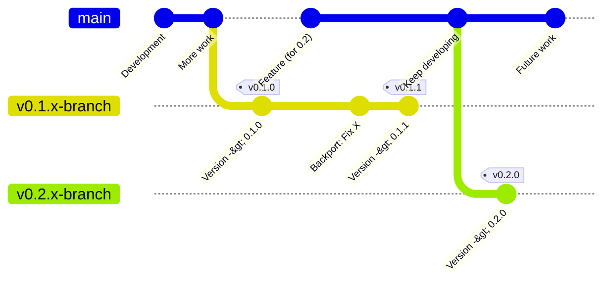

# Release Branch Management

## Overview

This document describes the branch management workflow for darepo-client
releases. The `main` branch remains open for merges at all times. Release
stabilization happens on dedicated release branches, with CI automation handling
backports of labeled changes. This approach keeps development velocity high while
still shipping stable releases.

## Branch Model Principles

The release process rests on four principles:

**Main is always open.** Developers merge approved pull requests at any time,
with no coordination around release windows and no merge freezes.

**Each major release gets a dedicated branch.** When cutting a new major
version, we branch from `main`. That branch carries every release candidate and
patch release for the version series.

**CI automation handles backports.** Pull requests merged to `main` and tagged
with a `backport-v*` label are automatically backported to the matching release
branch. The automation opens a backport PR whenever the cherry-pick conflicts.

**Changes flow one direction only.** Changes move from `main` to release
branches, never in reverse. `main` always represents the latest development
state.

## Main Branch

The `main` branch holds ongoing development for future releases. It never freezes
for a release.

### Main Version Convention

`main` uses a `.99` patch version to mark unreleased development work. After
cutting `v0.1.x-branch`, `build/version.go` on `main` reads `0.1.99`. That
clearly signals post-0.1 but pre-0.2 code. When we cut `v0.2.x-branch` later,
`main` moves to `0.2.99`. The pattern sorts correctly and is immediately
recognizable as a development build.

### Merging to Main

Developers merge to `main` through the normal review process. If a change should
land in an active or upcoming release, add the matching `backport-v*` label
(for example `backport-v0.1.x-branch`); the automation backports it after merge.
No special coordination is required — merge whenever the PR is approved,
regardless of ongoing release activity.

## Major Release Process

A major release introduces new features and represents a new minor version
(for example, 0.1.0, 0.2.0).

### Creating the Release Branch

When ready to begin a major release:

1. Create a release branch from `main`: `git checkout -b v0.1.x-branch main`
2. Push the branch: `git push origin v0.1.x-branch`
3. Update `build/version.go` on the release branch to the release version
   (`0.1.0`) via a pull request against the release branch.
4. Update `main`'s version to `0.1.99` via a separate pull request against
   `main`.
5. Configure branch protection for `v0.1.x-branch` on GitHub.
6. Create the `backport-v0.1.x-branch` label so the backport automation can
   route fixes to the branch.

### Tagging the Release

After the version-bump PR merges onto the release branch, tag the merge commit
with the release tagging helper:

```bash
./scripts/tag-release.sh v0.1.0 --branch v0.1.x-branch
git push <upstream-remote> v0.1.0
```

The helper verifies that HEAD is in sync with the upstream release branch and
that `build/version.go` matches the requested tag before creating the signed
tag, then prints the exact push command to run as the final maintainer step.

### Release Candidate Cycle (optional)

For a release that needs a stabilization period, use release-candidate tags. Set
`build/version.go` to a candidate version (for example `0.1.0-rc1` by setting
`AppPreRelease = "rc1"`), merge the bump onto the release branch, then tag it:

```bash
./scripts/tag-release.sh v0.1.0-rc1 --branch v0.1.x-branch
git push <upstream-remote> v0.1.0-rc1
```

As testing uncovers issues, develop fixes on `main`, label them
`backport-v0.1.x-branch`, and let CI backport them. Repeat the bump-and-tag cycle
(rc2, rc3, …) until stable, then drop the suffix for the final `v0.1.0` tag.

## Minor Release Process

Minor (patch) releases fix bugs or security issues in released versions. They
reuse the existing release branch for that version series.

When a critical fix is needed for `0.1.0`:

1. Develop and merge the fix to `main`.
2. Add the `backport-v0.1.x-branch` label so CI backports it.
3. Update `build/version.go` on the release branch to `0.1.1` via a pull request
   against the release branch.
4. After the PR merges, tag the merge commit:
   `./scripts/tag-release.sh v0.1.1 --branch v0.1.x-branch`
5. Push the tag: `git push <upstream-remote> v0.1.1`

Multiple patch releases (0.1.1, 0.1.2, …) live on the same `v0.1.x-branch`
throughout the version's lifetime.

## Manual Cherry-Picking

Occasionally a fix is needed on a release branch that does not apply to `main`
(a release-specific issue, or an older branch where `main` has diverged
significantly).

```bash
# Switch to the release branch.
git checkout v0.1.x-branch

# Cherry-pick the commit from main.
git cherry-pick <commit-hash>

# If conflicts occur, resolve them and continue.
git cherry-pick --continue
```

Manual cherry-picks still follow the normal PR flow: open a PR into the target
release branch for review and CI. When bypassing the normal backport flow,
document why, and make sure any corresponding change also lands on `main` so the
bug does not reappear in a future release.

## Backport Automation

CI automation monitors merged PRs and backports labeled changes to the matching
release branch. When a PR carrying a `backport-v0.1.x-branch` label merges to
`main`:

1. CI extracts the target branch from the label and confirms it exists.
2. CI cherry-picks the PR's commits onto a fresh branch off the release branch.
3. CI opens a backport PR against the release branch.
4. If the cherry-pick conflicts, CI opens a draft PR with conflict markers for
   manual resolution.

See [backport-workflow.md](backport-workflow.md) for the full workflow, label
format, and conflict-resolution steps.

## Version Bump Timing

Version numbers in `build/version.go` update at specific points:

- **On release branches:** update immediately before tagging. The commit that
  updates the version is the commit that gets tagged, so built binaries report
  the correct version.
- **On main:** update when creating a new release branch. `main` moves from
  `0.0.x` to `0.1.99` when `v0.1.x-branch` is created, then to `0.2.99` when
  `v0.2.x-branch` is created.

## Branch Model Visualization



After `v0.1.x-branch` is created, both branches evolve independently. `main`
continues with features for future releases while the release branch focuses on
stabilization and bug fixes.
