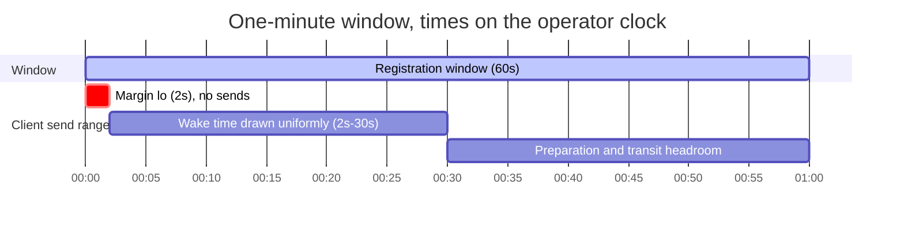
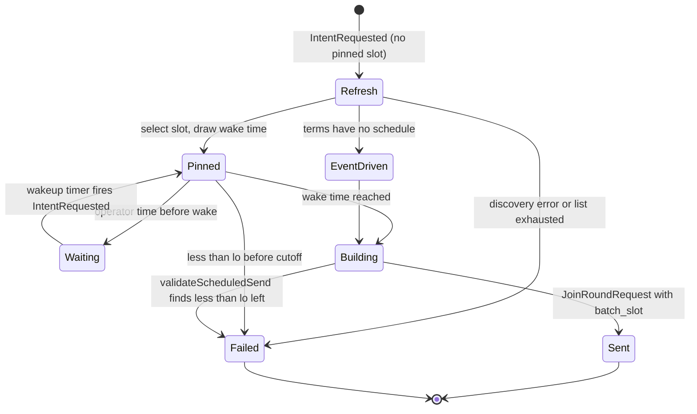
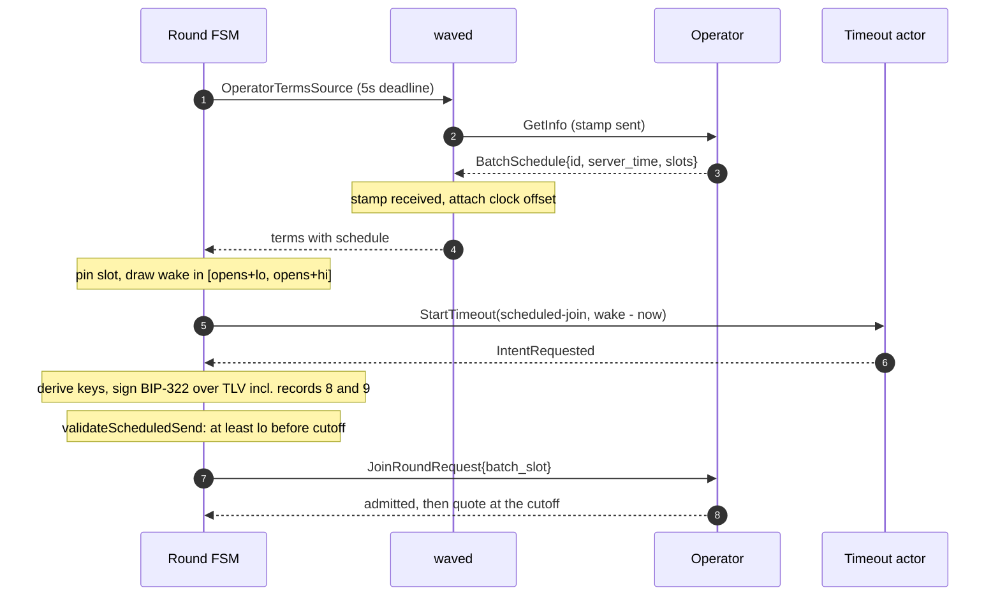

# Scheduled Batches

An operator can run batches on a fixed UTC timetable instead of opening a round
whenever a client asks. Each scheduled batch has a **cutoff**: the second at
which the operator stops admitting joins and starts quoting and signing. A short
**registration window** precedes each cutoff, and a join is accepted only inside
it. The cutoff says nothing about when the batch transaction is broadcast or
confirmed; it only marks the end of admission.

This document describes the client side: how Wavelength discovers the
timetable, picks a slot, times its join against the operator's clock, and binds
the slot into its join authorization. The code lives in `lib/batchschedule`,
`arkrpc/batch_schedule.go`, `rpc/roundpb/batch_slot.go`, the join-auth codec in
`lib/types/codec.go`, `round/scheduled_registration.go`, and
`waved/operator_negotiation.go`.

An operator that does not publish a schedule keeps event-driven registration,
and none of the behavior below applies.

## Terms

| Term | Meaning |
|---|---|
| Slot | One registration opportunity: a window `[opens, cutoff)` in whole UTC seconds. |
| Cutoff | The first second at which joins for the slot are rejected and quoting begins. |
| Window | `cutoff - opens`, at most five minutes. |
| Schedule ID | An opaque 32-byte identity for the operator's timing policy. It stays the same while the policy is unchanged. |
| Selection | A schedule ID plus a cutoff. It names exactly one slot and is signed into the join. |

## Discovery

The operator publishes its schedule in the `batch_schedule` field of
`GetInfoResponse`:

```protobuf
message BatchSchedule {
    uint32 version = 1;
    bytes schedule_id = 2;
    int64 server_time_unix = 3;
    repeated BatchSlot slots = 4;
}

message BatchSlot {
    int64 registration_opens_unix = 1;
    int64 cutoff_unix = 2;
}
```

The operator lists concrete slots rather than a formula such as "every hour on
the hour". A client never reconstructs the timetable; it selects from the list
it received. An operator is therefore free to publish irregular slots, and a
client that reaches the end of the list fetches discovery again instead of
guessing at the next slot.

`arkrpc.ParseBatchSchedule` validates the message on its own terms before the
client uses it:

- `version` must be 1.
- `schedule_id` must be exactly 32 bytes and non-zero.
- `slots` must hold between 1 and 32 entries.
- Every slot must be whole seconds, open strictly before its cutoff, and last at
  most five minutes.
- Slots must be in order, and each must open no earlier than the previous
  cutoff.

A schedule that fails any check is an error, not a reason to fall back to
event-driven registration. A scheduled operator rejects every join that carries
no slot, so a silent fallback would only turn a parse error into a stream of
rejected joins. The error surfaces from the operator negotiation and stops the
client from creating its mailbox runtime until discovery is valid again.

`server_time_unix` is kept on the parsed schedule. The next section explains
why.

## Aiming for the operator's window

The operator decides whether a join is on time using its own clock, and it
applies the window with no grace period: a join that arrives one millisecond
before `opens` is rejected as "not opened". If every client sent its join at
`opens` by its local clock, any client whose clock ran ahead of the operator's
by more than its preparation time plus network latency would be rejected on
every attempt. Those clients would also all arrive in the same second.

The client addresses both problems before it sends anything.

**It estimates the clock offset.** Before each new scheduled attempt,
`waved.roundOperatorTerms` fetches discovery again and records the local time
just before the request (`sent`) and just after the response (`received`). The
operator stamped `server_time_unix` somewhere between those instants and
truncated it to a whole second, so `batchschedule.EstimateClockOffset` compares
`server_time + 0.5s` with the midpoint of the round trip:

```
offset = (server_time + 0.5s) - (sent + (received - sent) / 2)
```

A positive offset means the operator's clock is ahead. The error in the estimate
is at most half a second from the truncation plus any asymmetry between the two
legs of the round trip. The client applies the offset however large it is,
because the operator's clock is the one that decides admission; an offset above
one hour is logged to help diagnose a badly skewed host.

**It draws a wake time inside the window.** `batchschedule.WakeBounds` returns
two offsets from `opens`:

- `lo = min(2s, window / 4)`, a margin that absorbs the residual error in the
  clock offset estimate.
- `hi = max(lo, window / 2)`, which leaves the second half of the window for
  wallet preparation, signing, and transit.

The attempt picks a wake time uniformly at random in `[opens + lo, opens + hi]`
on the operator's clock. Clients for the same slot therefore spread their joins
across the first half of the window.



For a one-minute window the join is sent between 2 and 30 seconds after the
window opens on the operator's clock, whatever the local clock reads.

## Registration flow

A registration attempt starts in `PendingRoundAssembly` when the FSM receives
`IntentRequested`. `waitForScheduledSlot` runs before the join is built:

1. On the first call of an attempt, it calls
   `OperatorTermsSource.FreshOperatorTerms` with a five-second deadline. That returns fresh terms with the clock offset
   attached.
2. If the terms carry no schedule, the attempt continues with event-driven
   registration.
3. It selects `Published.Next(localNow + offset + MaxWakeMargin)`, the first
   listed slot with at least the maximum send margin left before its cutoff
   on the operator's clock, and draws the wake time. An attempt triggered in
   the last seconds of a window therefore waits for the next slot instead of
   pinning one it cannot reach. The selection, slot, offset, wake time, and
   margin are pinned in a `scheduledAttempt` for the rest of the attempt.
4. If the operator time is before the wake time, it arms a
   `TimeoutPhaseScheduledRegistration` timer for the difference and returns. The
   timer re-sends `IntentRequested`, which re-enters step 4 with the pinned
   attempt.
5. If less than `lo` remains before the cutoff, the attempt fails locally with
   "window closed". The selection never moves to a later slot, because it is
   bound into the signed join.
6. Otherwise the attempt builds and signs the join.

After wallet key derivation and BIP-322 signing, `validateScheduledSend` checks
the remaining time again. Those calls can take long enough to cross the cutoff,
and sending a join that is already known to be late would only produce a
rejection.



A failure in any of these steps is recoverable. It releases any reserved
forfeit inputs through the normal pre-signing rollback, and a later attempt
starts again from discovery.

## Binding the slot into the join

The selected slot travels in `JoinRoundRequest.batch_slot` as a
`BatchSlotSelection { schedule_id, cutoff_unix }`. It is also signed. The
join-authorization message (`types.JoinRoundAuthMessage`) is a TLV stream, and
a scheduled join appends two records:

| Type | Field | Encoding |
|---|---|---|
| 8 | schedule ID | 32 bytes |
| 9 | cutoff | `uint64` Unix seconds |

The operator rebuilds the canonical message from the request it received and
checks the signature against it. Changing or removing `batch_slot` in transit
therefore invalidates the signature, and a join signed for one slot cannot be
admitted into another. The decoder rejects a message that carries only one of
the two records.

A legacy join carries neither record, so its encoded bytes are identical to the
format that predates scheduled batches.



## Limits of this version

- A pinned attempt lives in memory. If the client restarts while it waits, the
  attempt is gone and a new one starts from discovery. Registering a
  long-lived intention that survives restarts is separate work.
- Waiting for the window happens before the join is sent, so it does not
  consume the admission budget that starts when the operator acknowledges the
  join.
- The discovery refresh runs inside the round actor's handling of
  `IntentRequested`, bounded by the five-second deadline. While it runs, the
  actor does not process messages for other rounds.
- Only the client adjusts for clock offset. The operator enforces the published
  window exactly, so the published window is always the real one.
