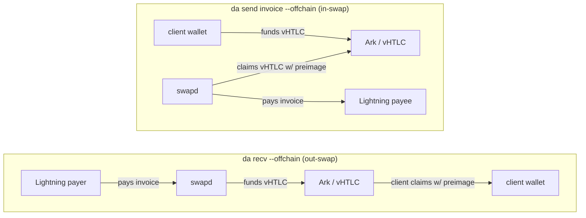
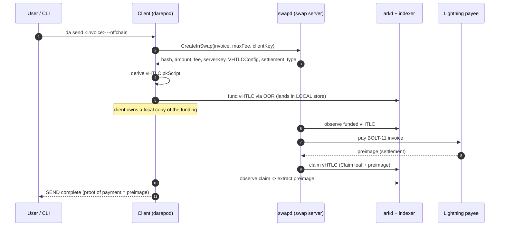
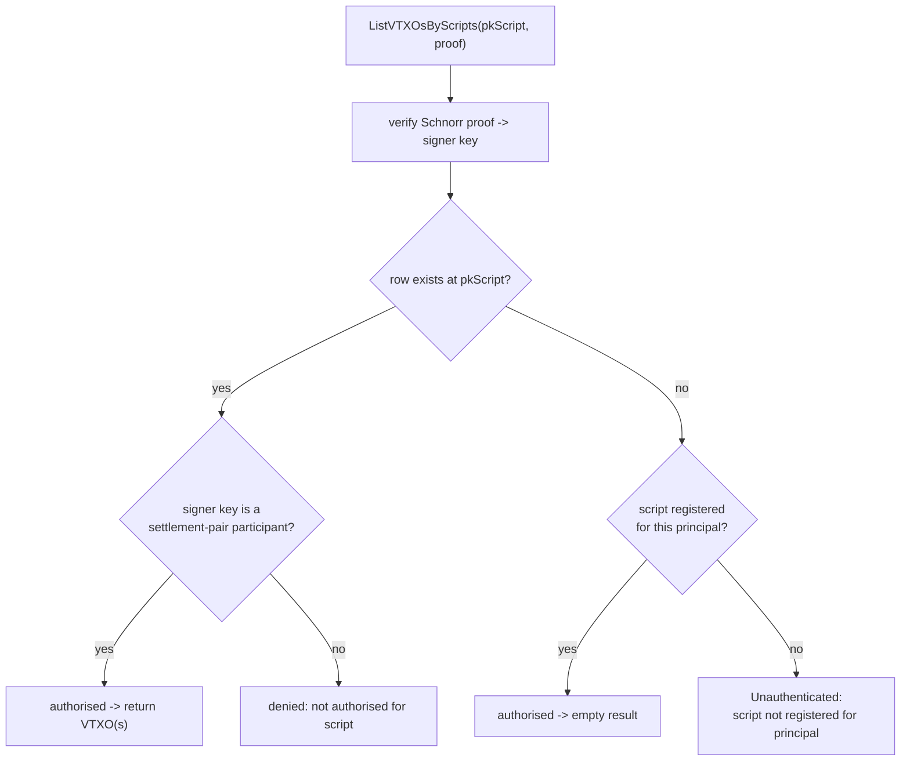
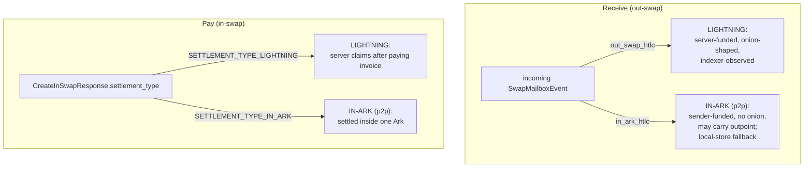

# The Swap System: Lightning, Ark, and the vHTLC

This document explains how `darepo-client` moves value between the Lightning
Network and an Ark instance, and how the same machinery settles a payment
between two clients of the *same* Ark without ever touching Lightning. It is
written for someone who already knows what a payment hash and a taproot output
are, but who has never read the swap code. By the end you should be able to
trace any swap from the command line down to the wire, name every server call,
and explain how the client and the operator's indexer cooperate to observe an
Ark output that no single party owns.

The code lives mostly in [`sdk/swaps`](../sdk/swaps), with the daemon-side glue
in [`darepod`](../darepod) and the cryptography in
[`lib/arkscript`](../lib/arkscript). The wire contract with the swap server is
[`swaprpc/swap.proto`](../swaprpc/swap.proto).

---

## 1. The cast of characters

A swap is a four-party affair, even though the user only ever sees two of them.

| Actor | What it is | Where it lives |
|-------|-----------|----------------|
| **The client** (`darepod`) | The user's daemon. Holds the wallet, derives keys, drives the swap FSM. | This repo. |
| **The swap server** (`swapd`) | The bridge between Lightning and Ark. Intercepts Lightning HTLCs, funds vHTLCs, pays invoices. | Operator infrastructure (separate repo). |
| **The Ark operator** (`arkd`) | The Ark service provider. Runs rounds, and — crucially for us — runs **the indexer**, the authoritative record of which virtual outputs exist. | Operator infrastructure (separate repo). |
| **The counterparty** | A Lightning node paying the invoice, *or* another client of the same Ark. | Anywhere. |

The single most important idea in this document is that the swap server and the
Ark operator are different roles, and the *indexer* — owned by the operator — is
the only witness to the on-Ark outputs a swap creates. A great deal of the
system's behaviour follows from that one fact.

### The vHTLC

Both directions of a swap pivot on a **virtual HTLC**, or vHTLC: an Ark output
whose taproot tree encodes the same hashlock-and-timelock logic as a Lightning
HTLC, but settled inside Ark rather than on the Bitcoin base layer. It is built
by [`arkscript.NewVHTLCPolicy`](../lib/arkscript/vhtlc.go) from a fixed tuple of
parameters:

- `Sender`, `Receiver`, `Server` — three public keys (the meaning of "sender"
  and "receiver" flips with the swap's direction; `Server` is the **Ark
  operator** key);
- `PreimageHash` — the invoice payment hash;
- four timelocks — one absolute refund locktime (CLTV) and three relative
  unilateral-exit delays (CSV).

From those, `NewVHTLCPolicy` compiles a six-leaf taproot tree:

```
1. Claim        (collab): HashLock(preimage) + Checksig(receiver) + Checksig(server)
2. Refund       (collab): Checksig(sender) + Checksig(receiver) + Checksig(server)
3. RefundWithoutReceiver (collab): CLTV(locktime) + Checksig(sender) + Checksig(server)
4. UnilateralClaim  (exit): CSV(delay) + HashLock(preimage) + Checksig(receiver)
5. UnilateralRefund (exit): CSV(delay) + Multisig([sender, receiver])
6. UnilateralRefundWithoutReceiver (exit): CSV(delay) + CLTV(locktime) + Checksig(sender)
```

Two properties of this tree drive everything downstream. First, the output is
**deterministic**: any party who knows the tuple can compute the exact pkScript,
because the script *is* a pure function of the tuple (and of the `lib/arkscript`
version that compiles it — all parties must share that library). Second, it is
**NUMS-keyed**: there is no usable key-path spend, so the output belongs to no
single party. You can recognise a vHTLC, and you can spend it down one of its
leaves, but you cannot claim key-path ownership of it the way you can an ordinary
wallet output. Both properties return below.

### OOR — out-of-round transfers

Funding and claiming a vHTLC happen through **OOR** (out-of-round) transfers:
Ark's mechanism for moving a virtual output between owners without waiting for
the next round. When *we* fund a vHTLC we send an OOR transfer to its pkScript;
when we claim one we send an OOR transfer that spends its Claim leaf with the
preimage. The daemon's `SendOORWithPolicy` and `SendOORWithCustomInputs` do this
work.

---

## 2. The two directions, at a glance

There are exactly two user-facing verbs, and they map cleanly onto the two
directions of a swap.



The defining asymmetry is right there: **on receive, the swap server funds the
vHTLC; on pay, the client funds it.** That single difference shapes how each
side observes the output, as §3 and §4 make concrete.

Note also what does *not* go through this machinery. `da recv --onchain`
allocates a plain wallet receive address through `NewReceiveScript` and never
creates a vHTLC at all; `da send <address> --onchain` is a cooperative leave.
Neither is a swap. When this document says "receive" or "pay" without
qualification, it means the `--offchain` swap path.

---

## 3. Receiving over Lightning (the out-swap)

This is the flow the user invokes with `da recv --offchain --amt N`. The client
wants to be paid over Lightning and end up with the value as an Ark output.

### 3.1 What the client sets up

The receive session begins in
[`prepareInvoice`](../sdk/swaps/out_swap.go) (out_swap.go:591). It does four
things that matter:

1. Fetches the client's own identity key (`IdentityPubKey`) and the operator's
   key (`OperatorPubKey`). These become the vHTLC's `Receiver` and `Server`.
2. Generates a fresh preimage and its hash. The hash is the invoice's payment
   hash and the vHTLC's hashlock.
3. Allocates the **claim destination** — an ordinary OOR receive script
   (`AllocateReceiveScript`, out_swap.go:620) — and registers it with the
   indexer. This is where the value lands after the vHTLC is claimed.
4. Calls the swap server's **`RequestChannelId`** RPC (out_swap.go:641),
   handing over `(client_vhtlc_pubkey, payment_hash, amount_msat)`. The server
   allocates a virtual short-channel-id derived from the client key and payment
   hash, and returns a **route hint**. The client embeds that hint in the
   BOLT-11 invoice it hands back to the user.

The route hint is the hook. It tells the eventual Lightning payer to route the
final hop through `swapd`, which is how `swapd` gets the chance to intercept the
incoming HTLC instead of forwarding it.

### 3.2 What the swap server does

When a Lightning payer pays the invoice, the HTLC arrives at `swapd` (the hinted
hop). Rather than forward it, `swapd`:

1. **Holds** the incoming Lightning HTLC (it has the hash, not the preimage).
2. **Funds a vHTLC** on Ark for the same hash and amount, with itself as
   `Sender`, the client as `Receiver`, and the operator as `Server`.
3. **Notifies the client** by pushing an `OutSwapHtlcEvent` into the client's
   swap mailbox. The event carries the amount, the `VHTLCConfig` (timelocks and
   the server's pubkey), and — because the HTLC is raw from the Lightning side —
   an **onion blob** the client must decrypt to prove it is the intended final
   hop.

The client now has everything it needs to *reconstruct* the vHTLC pkScript, but
notice what it does **not** have: the output itself. The server funded it; it
sits at a NUMS-keyed address that belongs to no wallet.

### 3.3 What the client does with the event

[`acceptOutSwapHtlcEvent`](../sdk/swaps/out_swap.go) (out_swap.go:907) validates
the event (payment hash matches, amount matches, onion decrypts), then builds
the policy and derives the script:

```go
policy, _ := arkscript.NewVHTLCPolicy(arkscript.VHTLCOpts{
    Sender:       serverKey,        // the swap server
    Receiver:     s.clientPubKey,   // us
    Server:       s.operatorPubKey, // the Ark operator
    PreimageHash: s.PaymentHash,
    RefundLocktime:                       event.VHTLCConfig.RefundLocktime,
    UnilateralClaimDelay:                 event.VHTLCConfig.UnilateralClaimDelay,
    UnilateralRefundDelay:                event.VHTLCConfig.UnilateralRefundDelay,
    UnilateralRefundWithoutReceiverDelay: event.VHTLCConfig.UnilateralRefundWithoutReceiverDelay,
})
pkScript, _ := policy.PkScript()    // out_swap.go:963
// ... persisted into s.vhtlcPkScript, FSM -> ReceiveStateHTLCEventAccepted
```

`ReceiveStateHTLCEventAccepted` is a durable checkpoint. Once the client reaches
it, the mailbox event has been consumed and acknowledged; on restart the session
resumes from this state rather than re-reading the mailbox. Funding detection
therefore picks up exactly where it left off across a daemon restart.

### 3.4 Waiting for funding — and the indexer

Having derived the pkScript, the client must observe that the server actually
funded it. It cannot look in its own wallet, because the output is not there
(§3.2). Its only authoritative witness is the operator's **indexer**.

[`waitForVHTLC`](../sdk/swaps/out_swap.go) (out_swap.go:1659) polls in a loop:

```
waitForVHTLC
  └─ daemon.FindLiveVTXOByPkScript(pkScript)
       └─ RPCServer.GetIndexedVTXOByPkScript     (darepod/rpc_swap_lookup.go:18)
            └─ indexer.ListVTXOsByScriptsTaproot (proof-gated query)
```

Once the server has funded the vHTLC and the operator has indexed it as a live
VTXO, the poll returns the outpoint and amount. The client then claims the vHTLC
by spending its Claim leaf with the preimage (an OOR transfer to the claim
destination it set up in §3.1), which simultaneously *reveals the preimage* to
the swap server, who uses it to settle the held Lightning HTLC. Everyone is paid.

How the proof-gated query authorises the client is the subject of §6; it is
worth reading before reasoning about any receive that takes longer than expected.

### 3.5 The full receive sequence


---

## 4. Paying over Lightning (the in-swap)

This is `da send <invoice> --offchain`. The client holds Ark value and wants a
Lightning invoice paid.

### 4.1 The negotiation

The client calls the swap server's **`CreateInSwap`** RPC (swap.proto:33) with
the invoice, a fee ceiling, and its vHTLC pubkey. The server replies with a
`CreateInSwapResponse`: the payment hash, the amount and fee, the server's
pubkey, the `VHTLCConfig`, a deadline, and — decisively — a `settlement_type`
(see §7).

### 4.2 The client funds the vHTLC

Here is the mirror image of the receive flow. In
[`fundOrAdoptVHTLC`](../sdk/swaps/in_swap.go) (in_swap.go:659), **the client
funds the vHTLC itself**, via `SendOORWithPolicy`, with itself as `Sender`, the
swap server as `Receiver`, and the operator as `Server`. Because the client's
own daemon performs the OOR transfer, the funded output **lands in the client's
local VTXO store**. The client can see its own funding without asking anyone.

The swap server, watching the vHTLC appear, pays the Lightning invoice, learns
the preimage from the Lightning settlement, and claims the vHTLC's Claim leaf —
revealing the preimage to the client, which is the client's proof of payment.

### 4.3 The consequence for queries

Because the client funds and holds a local copy of the in-swap vHTLC, the pay
side does not *depend* on the indexer to know its own funding. `fundOrAdoptVHTLC`
queries the indexer opportunistically and treats a failure as non-fatal, then
proceeds to fund. The pay flow's authoritative source of truth is local; the
receive flow's is remote. That difference is the practical reason the two
directions behave differently under indexer latency.

### 4.4 The pay sequence



If the Lightning payment fails terminally, the client recovers its funds
cooperatively through **`AuthorizeInSwapRefund`** (swap.proto:37): the server
signs the vHTLC's collaborative refund leaf so the client can reclaim its money
without waiting for the on-chain refund locktime.

---

## 5. The same-Ark shortcut (p2p settlement)

Not every swap needs Lightning. When the sender and receiver are both clients of
the *same* Ark, the server can bridge them with a single vHTLC settled entirely
inside Ark — no Lightning hop, no held HTLC. This is the **in-Ark** settlement
path.

The receive side discovers it not through a flag but through the **type of
mailbox event** it receives. The swap mailbox carries a `SwapMailboxEvent` whose
`oneof` is either:

- `OutSwapHtlcEvent` — a Lightning-backed out-swap; server-funded; onion-shaped
  (the client must decrypt the onion); **or**
- `InArkHtlcEvent` — a same-Ark payment; carries the sender's pubkey directly
  (no onion), and *may already include the funded `vhtlc_outpoint` and amount*.

[`acceptIncomingVHTLCNotification`](../sdk/swaps/out_swap.go) (out_swap.go:873)
branches on this: `acceptInArkHtlcEvent` for the same-Ark case, the onion path
for Lightning. Because the in-Ark sender funds the vHTLC with an OOR transfer
that the receiver's own daemon may materialise locally, the receive flow keeps a
fallback — `localLiveVTXOByPkScript` (out_swap.go:1761) — that consults the local
live VTXO set in addition to the remote indexer.

---

## 6. How the indexer authorises a query

Every indexer query is **proof-gated**: a client may only enumerate outputs at a
script it can prove a relationship to. This section describes the contract end to
end, because it is the part of the system most easily misread.

### 6.1 What the client sends

The client signs each query scope with a BIP-340 Schnorr proof. The signing key
is the client's **default principal** — the wallet identity key, which for a
receive is also the vHTLC's `Receiver` key (see
[`indexer/client.go`](../indexer/client.go), `newTaprootScope` at :517 and
`proofSignerPubKey` at :463). Importantly, the signature commits to the
*signer's own pubkey*, not to the taproot output key — which matters because the
vHTLC output key is NUMS and nobody holds it. So the proof says, in effect, "I am
this participant key, and here is my signature over this query," and leaves the
authorisation decision to the server.

### 6.2 What the server checks

The operator's indexer authorises a script-scope query in two steps
(`authorizeScriptScopeQuery`): it verifies each scope proof, then authorises the
script against persisted state. The second step has two paths, consulted in
order:

1. **Policy auth (by row).** If a VTXO row already exists at the queried
   pkScript, the server reads that row's stored policy template and asks whether
   the proof's signer key is a *queryable participant* of it. A key qualifies
   when it has at least one **settlement pair** with the operator — both a
   participant-only auth leaf and an operator-backed sibling leaf that normalise
   to the same node. For a vHTLC, the receiver satisfies this: its
   `UnilateralClaim` leaf (participant-only) and its `Claim` leaf (participant +
   operator) normalise to the same `HashLock + Checksig(receiver)` node. The
   sender qualifies symmetrically via the refund leaves; the operator itself
   does **not** qualify (operator keys are filtered out). The upshot: **once the
   vHTLC is funded and indexed, both swap participants can query it with no prior
   registration.**

2. **Registration auth (fallback).** Only for scripts that have *no* row yet
   does the server fall back to per-principal registration: the caller must have
   previously registered the script. If neither a row nor a registration exists,
   the server returns `Unauthenticated` with the message *"script not registered
   for principal."* The phrasing names the fallback that failed; the underlying
   state is simply "there is no indexed output at this script, and you have not
   pre-registered it."



### 6.3 Why the receive flow does not pre-register the vHTLC

The receive flow registers its **claim destination** (§3.1) but not the vHTLC
script, and it does not need to: by the time the client claims, the vHTLC is
funded and indexed, so policy auth (path 1) authorises the receiver
automatically. Pre-registration would only change the wording the server returns
during the window before the row exists; it would not, by itself, make an output
appear. This is why the only registration in the receive path is for the claim
address, and the vHTLC is observed purely through policy-authorised queries.

---

## 7. How the client tells p2p from external

Putting §3–§5 together, the client distinguishes a same-Ark (p2p) swap from a
Lightning-bridged (external) swap differently in each direction:



- **Receive** keys off the **mailbox event type**: `out_swap_htlc` versus
  `in_ark_htlc` (swap.proto:94-130). The Lightning event is onion-shaped and
  server-funded; the in-Ark event carries the sender's pubkey directly and may
  already include the funded outpoint.
- **Pay** keys off **`settlement_type`** in the `CreateInSwapResponse`
  (swap.proto:206-208), where `SETTLEMENT_TYPE_UNSPECIFIED` is treated as
  Lightning for backward compatibility.

---

## 8. The server-side API surface, summarised

Everything the client asks of the swap server lives in `swaprpc.SwapService`:

| RPC | Direction | Purpose |
|-----|-----------|---------|
| `RequestChannelId` | Receive | Allocate a virtual SCID from `(clientKey, hash)` and return the route hint the client embeds in its invoice, so `swapd` becomes the final hop. |
| `CreateInSwap` | Pay | Negotiate a vHTLC for a given invoice; returns the config, fee, deadline, and `settlement_type`. |
| `AuthorizeInSwapRefund` | Pay | Sign the cooperative refund leaf of a funded in-swap whose Lightning payment failed, so the client can reclaim funds before the on-chain locktime. |

Everything the client asks of the **operator's indexer** (via the daemon) is a
proof-gated query — chiefly `ListVTXOsByScripts`, reached through
`FindLiveVTXOByPkScript` → `GetIndexedVTXOByPkScript`
(darepod/rpc_swap_lookup.go) → `indexer.ListVTXOsByScriptsTaproot`. The indexer
is not part of `swapd`; it belongs to `arkd`. That separation — the swap server
funds, but the operator's indexer witnesses — is the defining structure of the
receive path.

---

## 9. Further reading

- [`docs/arkscript_spec.md`](arkscript_spec.md) — the tapscript policy system
  that compiles the vHTLC tree.
- [`docs/mailbox_architecture.md`](mailbox_architecture.md) — how swap events
  are delivered and acknowledged.
- [`docs/RPC_MAILBOX_CONTRACT.md`](RPC_MAILBOX_CONTRACT.md) — envelope and ack
  semantics behind the proof-gated indexer calls.
- [`sdk/swaps/CLAUDE.md`](../sdk/swaps/CLAUDE.md) — the FSM states, key types,
  and invariants of the swap SDK.
- [`indexer/CLAUDE.md`](../indexer/CLAUDE.md) — the proof-of-control query
  client.
