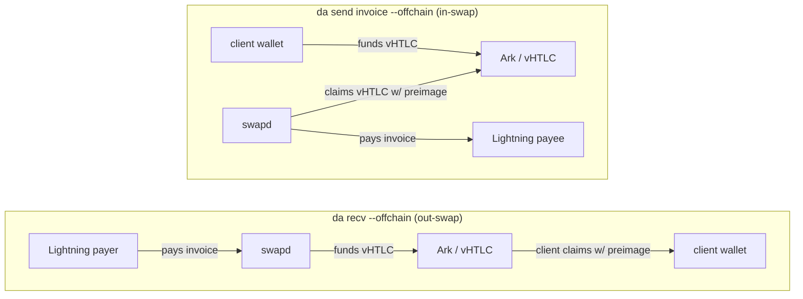
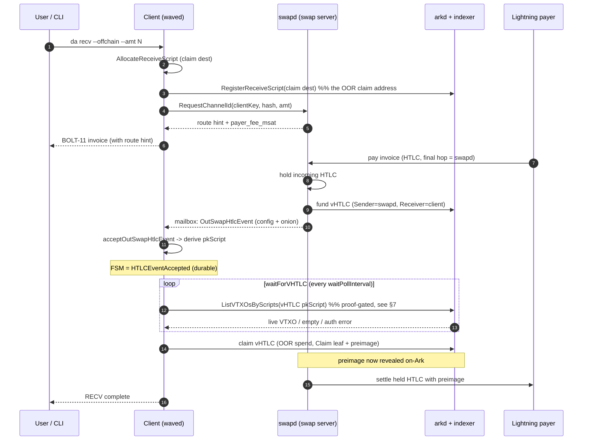
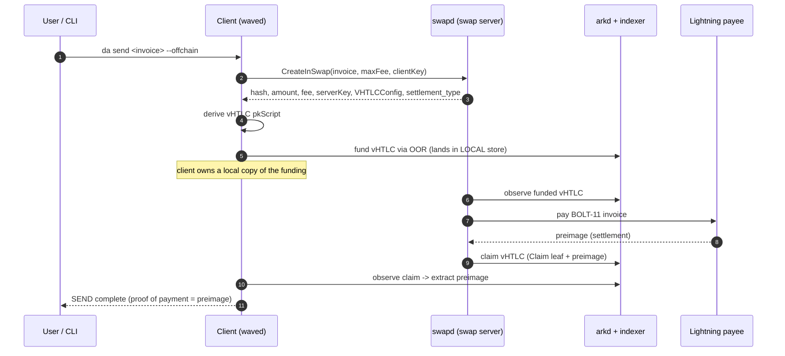
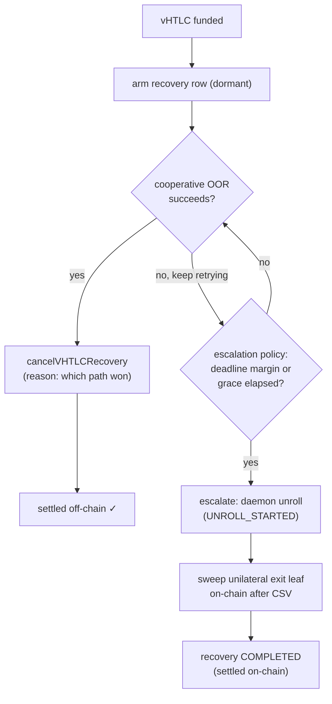
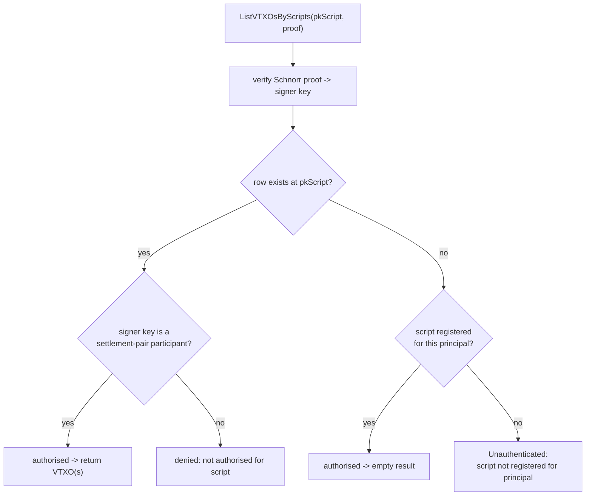
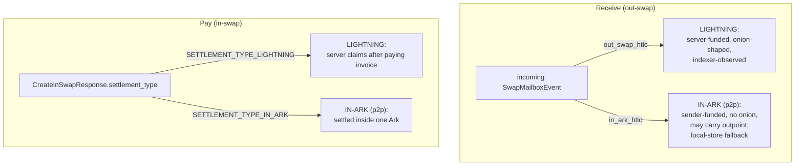

# The Swap System: Lightning, Ark, and the vHTLC

This document explains how `wavelength` moves value between the Lightning
Network and an Ark instance, and how the same machinery settles a payment
between two clients of the *same* Ark without ever touching Lightning. It is
written for someone who already knows what a payment hash and a taproot output
are, but who has never read the swap code. By the end you should be able to
trace any swap from the command line down to the wire, name every server call,
and explain how the client and the operator's indexer cooperate to observe an
Ark output that no single party owns.

The code lives mostly in [`sdk/swaps`](../sdk/swaps), with the daemon-side glue
in [`waved`](../waved) and the cryptography in
[`lib/arkscript`](../lib/arkscript). The wire contract with the swap server is
[`swaprpc/swap.proto`](../swaprpc/swap.proto).

---

## 1. The cast of characters

A swap is a four-party affair, even though the user only ever sees two of them.

| Actor | What it is | Where it lives |
|-------|-----------|----------------|
| **The client** (`waved`) | The user's daemon. Holds the wallet, derives keys, drives the swap FSM. | This repo. |
| **The swap server** (`swapd`) | The bridge between Lightning and Ark. Intercepts Lightning HTLCs, funds vHTLCs, pays invoices. | Operator infrastructure (separate repo). |
| **The Ark operator** (`arkd`) | The Ark service provider. Runs rounds, and — crucially for us — runs **the indexer**, the authoritative record of which virtual outputs exist. | Operator infrastructure (separate repo). |
| **The counterparty** | A Lightning node paying the invoice, *or* another client of the same Ark. | Anywhere. |

The single most important idea in this document is that the swap server and the
Ark operator are different roles, and the *indexer* — owned by the operator — is
the only witness to the on-Ark outputs a swap creates. A great deal of the
system's behaviour follows from that one fact.

### The vHTLC

Both directions of a swap pivot on a **virtual HTLC**, or vHTLC: an Ark output
whose taproot tree encodes the same hashlock-and-timelock logic as a Lightning
HTLC, but settled inside Ark rather than on the Bitcoin base layer. It is built
by [`arkscript.NewVHTLCPolicy`](../lib/arkscript/vhtlc.go) from a fixed tuple of
parameters:

- `Sender`, `Receiver`, `Server` — three public keys (the meaning of "sender"
  and "receiver" flips with the swap's direction; `Server` is the **Ark
  operator** key);
- `PreimageHash` — the invoice payment hash;
- four timelocks — one absolute refund locktime (CLTV) and three relative
  unilateral-exit delays (CSV).

From those, `NewVHTLCPolicy` compiles a six-leaf taproot tree
([`lib/arkscript/vhtlc.go`](../lib/arkscript/vhtlc.go), `NewVHTLCPolicy`):

```
collaborative (operator co-signs; settled off-chain via OOR)
  1. Claim                 : HashLock(preimage) + Multisig([receiver, server])
  2. Refund                : Multisig([sender, receiver, server])
  3. RefundWithoutReceiver : CLTV(locktime) + Multisig([sender, server])

unilateral exit (no operator key; CSV-gated; spent on-chain)
  4. UnilateralClaim                 : CSV(delay) + HashLock(preimage) + Multisig([receiver])
  5. UnilateralRefund                : CSV(delay) + Multisig([sender, receiver])
  6. UnilateralRefundWithoutReceiver : CSV(delay) + CLTV(locktime) + Multisig([sender])
```

**The collaborative/exit split is the spine of the whole cancellation story, so
read it carefully.** The six leaves are three pairs — claim, refund, and
refund-without-receiver — and each pair has one *collaborative* and one
*unilateral exit* member:

- A **collaborative leaf** (1–3) always contains the **operator key** in its
  multisig. Because the operator co-signs, the spend can be done as an **OOR
  transfer entirely inside Ark** — no Bitcoin transaction, no confirmation wait.
  This is the fast, cheap, *off-chain* settlement path, and it is the one the
  client always tries first.
- A **unilateral exit leaf** (4–6) contains **no operator key** and is gated by
  a relative **CSV** delay. It is the fallback you take when the operator (or
  the counterparty) stops cooperating: you broadcast the vHTLC on-chain and,
  after the CSV matures, sweep it yourself. It costs a real transaction and a
  timelock wait, so it is strictly a recovery path of last resort.

These are not ad-hoc conventions — `lib/arkscript` *enforces* them
(`ValidatePolicy`): every collaborative leaf must carry the operator key, every
exit leaf must omit it and be CSV-gated, and **no leaf may let the operator
spend unilaterally** (`Multisig{operator, operator}` is rejected). So the
operator can always *help* settle but can never *seize* a vHTLC on its own. Hold
onto the three-pairs picture; §5 walks the off-chain-first, on-chain-fallback
ladder built directly on top of it.

Two further properties drive everything downstream. First, the output is
**deterministic**: any party who knows the tuple can compute the exact pkScript,
because the script *is* a pure function of the tuple (and of the `lib/arkscript`
version that compiles it — all parties must share that library). Second, it is
**NUMS-keyed**: there is no usable key-path spend, so the output belongs to no
single party. You can recognise a vHTLC, and you can spend it down one of its
leaves, but you cannot claim key-path ownership of it the way you can an ordinary
wallet output. Both properties return below.

### OOR — out-of-round transfers

Funding and claiming a vHTLC happen through **OOR** (out-of-round) transfers:
Ark's mechanism for moving a virtual output between owners without waiting for
the next round. When *we* fund a vHTLC we send an OOR transfer to its pkScript;
when we claim one we send an OOR transfer that spends its Claim leaf with the
preimage. The daemon's `SendOORWithPolicyDetails` and `SendOORWithCustomInputs`
do this work.

---

## 2. The two directions, at a glance

There are exactly two user-facing verbs, and they map cleanly onto the two
directions of a swap.



The defining asymmetry is right there: **on receive, the swap server funds the
vHTLC; on pay, the client funds it.** That single difference shapes how each
side observes the output, as §3 and §4 make concrete.

Note also what does *not* go through this machinery. `da recv --onchain`
allocates a plain wallet receive address through `NewReceiveScript` and never
creates a vHTLC at all; `da send <address> --onchain` is a cooperative leave.
Neither is a swap. When this document says "receive" or "pay" without
qualification, it means the `--offchain` swap path.

---

## 3. Receiving over Lightning (the out-swap)

This is the flow the user invokes with `da recv --offchain --amt N`. The client
wants to be paid over Lightning and end up with the value as an Ark output.

### 3.1 What the client sets up

The receive session begins in
[`prepareInvoice`](../sdk/swaps/out_swap.go) (out_swap.go:623). It does four
things that matter:

1. Fetches the client's own identity key (`IdentityPubKey`) and the operator's
   key (`OperatorPubKey`). These become the vHTLC's `Receiver` and `Server`.
2. Generates a fresh preimage and its hash. The hash is the invoice's payment
   hash and the vHTLC's hashlock.
3. Allocates the **claim destination** — an ordinary OOR receive script
   (`AllocateReceiveScript`, out_swap.go:650) — and registers it with the
   indexer. This is where the value lands after the vHTLC is claimed.
4. Calls the swap server's **`RequestChannelId`** RPC (out_swap.go:671),
   handing over `(client_vhtlc_pubkey, payment_hash, amount_msat)`. The server
   allocates a virtual short-channel-id derived from the client key and payment
   hash, and returns a **route hint**. The client embeds that hint in the
   BOLT-11 invoice it hands back to the user.

The route hint is the hook. It tells the eventual Lightning payer to route the
final hop through `swapd`, which is how `swapd` gets the chance to intercept the
incoming HTLC instead of forwarding it.

### 3.2 What the swap server does

When a Lightning payer pays the invoice, the HTLC arrives at `swapd` (the hinted
hop). Rather than forward it, `swapd`:

1. **Holds** the incoming Lightning HTLC (it has the hash, not the preimage).
2. **Funds a vHTLC** on Ark for the same hash and amount, with itself as
   `Sender`, the client as `Receiver`, and the operator as `Server`.
3. **Notifies the client** by pushing an `OutSwapHtlcEvent` into the client's
   swap mailbox. The event carries the amount, the `VHTLCConfig` (timelocks and
   the server's pubkey), and — because the HTLC is raw from the Lightning side —
   an **onion blob** the client must decrypt to prove it is the intended final
   hop.

The client now has everything it needs to *reconstruct* the vHTLC pkScript, but
notice what it does **not** have: the output itself. The server funded it; it
sits at a NUMS-keyed address that belongs to no wallet.

### 3.3 What the client does with the event

[`acceptOutSwapHtlcEvent`](../sdk/swaps/out_swap.go) (out_swap.go:996) validates
the event (payment hash matches, amount matches, onion decrypts), then builds
the policy and derives the script:

```go
policy, _ := arkscript.NewVHTLCPolicy(arkscript.VHTLCOpts{
    Sender:       serverKey,        // the swap server
    Receiver:     s.clientPubKey,   // us
    Server:       s.operatorPubKey, // the Ark operator
    PreimageHash: s.PaymentHash,
    RefundLocktime:                       event.VHTLCConfig.RefundLocktime,
    UnilateralClaimDelay:                 event.VHTLCConfig.UnilateralClaimDelay,
    UnilateralRefundDelay:                event.VHTLCConfig.UnilateralRefundDelay,
    UnilateralRefundWithoutReceiverDelay: event.VHTLCConfig.UnilateralRefundWithoutReceiverDelay,
})
pkScript, _ := policy.PkScript()    // out_swap.go:1078
// ... persisted into s.vhtlcPkScript, FSM -> ReceiveStateHTLCEventAccepted
```

`ReceiveStateHTLCEventAccepted` is a durable checkpoint. Once the client reaches
it, the mailbox event has been consumed and acknowledged; on restart the session
resumes from this state rather than re-reading the mailbox. Funding detection
therefore picks up exactly where it left off across a daemon restart.

### 3.4 Waiting for funding — and the indexer

Having derived the pkScript, the client must observe that the server actually
funded it. It cannot look in its own wallet, because the output is not there
(§3.2). Its only authoritative witness is the operator's **indexer**.

[`waitForVHTLC`](../sdk/swaps/out_swap.go) (out_swap.go:1915) polls in a loop:

```
waitForVHTLC
  └─ daemon.FindLiveVTXOByPkScript(pkScript)
       └─ RPCServer.GetIndexedVTXOByPkScript     (waved/rpc_swap_lookup.go:18)
            └─ indexer.ListVTXOsByScriptsTaproot (proof-gated query)
```

Once the server has funded the vHTLC and the operator has indexed it as a live
VTXO, the poll returns the outpoint and amount. The client then claims the vHTLC
by spending its Claim leaf with the preimage (an OOR transfer to the claim
destination it set up in §3.1), which simultaneously *reveals the preimage* to
the swap server, who uses it to settle the held Lightning HTLC. Everyone is paid.

How the proof-gated query authorises the client is the subject of §7; it is
worth reading before reasoning about any receive that takes longer than expected.

### 3.5 The full receive sequence



---

## 4. Paying over Lightning (the in-swap)

This is `da send <invoice> --offchain`. The client holds Ark value and wants a
Lightning invoice paid.

### 4.1 The negotiation

The client calls the swap server's **`CreateInSwap`** RPC (swap.proto:74) with
the invoice, a fee ceiling, and its vHTLC pubkey. The server replies with a
`CreateInSwapResponse`: the payment hash, the amount and fee, the server's
pubkey, the `VHTLCConfig`, a deadline, and — decisively — a `settlement_type`
(see §8).

### 4.2 The client funds the vHTLC

Here is the mirror image of the receive flow. In
[`fundOrAdoptVHTLC`](../sdk/swaps/in_swap.go) (in_swap.go:718), **the client
funds the vHTLC itself**, via `SendOORWithPolicyDetails`, with itself as
`Sender`, the swap server as `Receiver`, and the operator as `Server`. Because
the client's own daemon performs the OOR transfer, the funded output **lands in
the client's local VTXO store**. The client can see its own funding without
asking anyone.

The swap server, watching the vHTLC appear, pays the Lightning invoice, learns
the preimage from the Lightning settlement, and claims the vHTLC's Claim leaf —
revealing the preimage to the client, which is the client's proof of payment.

### 4.3 The consequence for queries

Because the client funds and holds a local copy of the in-swap vHTLC, the pay
side does not *depend* on the indexer to know its own funding. `fundOrAdoptVHTLC`
queries the indexer opportunistically and treats a failure as non-fatal, then
proceeds to fund. The pay flow's authoritative source of truth is local; the
receive flow's is remote. That difference is the practical reason the two
directions behave differently under indexer latency.

### 4.4 The pay sequence



If the Lightning payment fails, the client does not have to go on-chain to get
its money back. It walks a **refund ladder** whose first rungs all settle
*off-chain* via OOR: an immediate operator-co-signed cooperative refund (the
**Refund** leaf, leaf 2) if the server authorises one through
**`AuthorizeInSwapRefund`** (swap.proto:95); failing that, a CLTV-gated
cooperative refund the client can take with the operator *without the swap
server's cooperation* once the refund locktime elapses (the
**RefundWithoutReceiver** leaf, leaf 3); and only if cooperation breaks down
entirely does it fall through to a unilateral on-chain exit (leaf 6). Note that
the CLTV refund locktime gates an *off-chain* OOR spend of leaf 3 — it is **not**
itself an on-chain event. §5 walks this ladder, and its receive-side mirror, in
full.

---

## 5. Cancellation, timeouts, and the recovery ladder

Every swap so far has succeeded. Now suppose one does not: a Lightning payment
dies, a counterparty goes dark, an operator stops answering. The money is locked
in a vHTLC that belongs to nobody — so how does anyone get it back? The answer is
a single rule applied in both directions: **try to settle off-chain by
cooperating; fall back to an on-chain unilateral exit only when cooperation is no
longer possible.** That rule is the three-pairs structure from §1 put in motion,
and this section traces it from the funded vHTLC to the recovered coin.

### 5.1 Each leaf, and the moment it is spent

The six leaves are not six equal options a party picks from. Each one has a
specific owner and a specific moment. Read this table as "who can take the money,
how, and when":

| Leaf | Chain | Who signs | Spent by | At what moment |
|------|-------|-----------|----------|----------------|
| 1 Claim | off-chain OOR | receiver + operator | the **payee** of the hash | the preimage is known — the happy path for both directions |
| 2 Refund | off-chain OOR | sender + receiver + operator | the **payer** | both sides agree to cancel *before* the timeout |
| 3 RefundWithoutReceiver | off-chain OOR | sender + operator | the **payer** | the timeout (CLTV) has passed and the receiver is unresponsive |
| 4 UnilateralClaim | on-chain, CSV | receiver alone | the **payee** | the payee knows the preimage but cannot get a cooperative claim through |
| 5 UnilateralRefund | on-chain, CSV | sender + receiver | sender & receiver together | both want to unwind but the operator will not co-sign |
| 6 UnilateralRefundWithoutReceiver | on-chain, CSV + CLTV | sender alone | the **payer** | the payer must reclaim and neither receiver nor operator will help |

The top three rows settle inside Ark in seconds; the bottom three demand a
broadcast and a CSV wait. The client always reaches for a top row and touches a
bottom row only when it must. The next four subsections show exactly how it
decides.

### 5.2 Arm the lifeboat before you sail

The client does not wait until a swap is in trouble to think about recovery. The
instant a vHTLC is funded — *before* it commits to the risky half of the flow —
it stores a dormant **recovery row** in the daemon that already knows how to
unilaterally exit this exact output. A receive session arms a *claim* recovery
([`ensureReceiveClaimRecoveryArmed`](../sdk/swaps/recovery.go), recovery.go:394);
a pay session arms a *refund-without-receiver* recovery
([`ensurePayRefundRecoveryArmed`](../sdk/swaps/recovery.go), recovery.go:283).
Each row captures everything the daemon would need to sweep the output alone: the
outpoint and amount, all three participant keys, the CLTV refund locktime and the
three CSV delays, the destination script, and a fee-rate cap
(`DefaultRecoveryMaxFeeRateSatPerKW`, ~100 sat/vByte). The request carries a
deterministic idempotency key (`recoveryRequestID`), so a crash-and-retry returns
the same row instead of arming a second one.

An armed row is **dormant**, not active. Its existence changes nothing on its
own; it simply means that if cooperation later fails, the escalation is a flag
flip on durable state rather than a scramble to reconstruct vHTLC context after
the daemon has already restarted. Arm the lifeboat while the sea is calm.

### 5.3 The receive side: claim before the clock runs out

On a receive, the swap server funded the vHTLC and the client must claim it with
the preimage (§3.4). The cooperative claim is an OOR spend of leaf 1, and it is
the only outcome the client wants. But the client is racing a clock it does not
own: once the **refund locktime** passes, the swap server may take leaf 3 and
reclaim its own funding, leaving the client with nothing. So the receive flow
treats the locktime as a hard deadline. Before it starts or continues waiting it
checks that the locktime is not imminent
([`ensureReceiveFundingStillPossible`](../sdk/swaps/out_swap.go),
out_swap.go:1387), keeping a one-block buffer (`defaultRefundLocktimeBuffer`);
if the deadline has arrived it gives up with `errSwapExpired` rather than chase
a vHTLC the server is about to pull back.

If the cooperative claim keeps failing while the deadline approaches, the client
escalates ([`maybeEscalateReceiveClaimRecovery`](../sdk/swaps/recovery.go),
recovery.go:669): the daemon takes over the armed row and spends leaf 4
(UnilateralClaim) on-chain, sweeping the output with the preimage after its CSV
matures. Because a real deadline looms here, the policy lets **deadline pressure
override the ordinary grace period** — there is no point waiting out a one-hour
courtesy window if the sender can reclaim in twelve blocks.

### 5.4 The pay side: the refund ladder

On a pay, the client funded the vHTLC and wants either a preimage (proof it paid)
or its money back. §4.4 named the ladder; here is each rung:

1. **Immediate cooperative refund (leaf 2).**
   [`tryCooperativeRefund`](../sdk/swaps/in_swap.go) (in_swap.go:1250) asks the
   swap server to co-sign the three-party Refund leaf through
   `AuthorizeInSwapRefund`. The server signs only after it has *safely* failed
   the Lightning payment and holds no preimage, so an "unavailable" answer is not
   an error — it just means "keep waiting, the payment might still settle." When
   the server does sign, the client sweeps its funds off-chain at once, long
   before any locktime.
2. **Timeout cooperative refund (leaf 3).** If the server never authorises the
   immediate refund, the client waits for the CLTV refund locktime to mature
   (in_swap.go:1141) and then spends RefundWithoutReceiver as an OOR transfer
   (in_swap.go:1171) — *still off-chain*, and now without needing the swap server
   to cooperate at all, only the operator. This is the rung most often misread:
   the locktime gates an off-chain spend, it does not force a broadcast.
3. **Unilateral exit (leaf 6).** Only if even that OOR cannot get through does
   the client escalate the armed row
   ([`maybeEscalatePayRefundRecovery`](../sdk/swaps/recovery.go),
   recovery.go:583) and let the daemon sweep leaf 6 on-chain after its CSV. A pay
   refund has no absolute deadline the way a receive claim does, so here the
   grace period is the only automatic trigger.

### 5.5 When does it actually go on-chain?

Escalation from the off-chain rungs to the on-chain one is deliberately
reluctant, because an on-chain exit costs a transaction and a timelock. The
[`RecoveryPolicy`](../sdk/swaps/recovery.go) (recovery.go:120) decides, and its
production default is conservative:

- **`AutoEscalate` is off by default.** Out of the box the SDK never unilaterally
  exits on its own; an operator triggers it deliberately through the
  `swapd recovery` CLI (`EscalateVHTLCRecovery`). The armed row waits patiently
  until told.
- With auto-escalation enabled, [`decideRecoveryEscalation`](../sdk/swaps/recovery.go)
  (recovery.go:202) escalates only when waiting longer is unsafe or pointless:
  when the height plus a safety margin (`MinRecoveryMarginBlocks`, 12) reaches a
  refund-locktime deadline (`deadline_margin`), or when a grace period
  (`CooperativeFailureGracePeriod`, one hour) has elapsed since cooperation first
  failed (`grace_elapsed`). Until then it keeps retrying the cooperative path
  (`within_grace_period`).
- The fee-rate cap is frozen into the row **at arm time**, so a restart or a
  manual escalation months later cannot quietly spend at a looser rate than the
  client originally consented to.

### 5.6 The recovery row's life, and how cooperation cancels it

A recovery row moves through a small state machine: it starts **ARMED**
(dormant), advances to **UNROLL_STARTED** when the daemon begins the on-chain
exit, and ends **COMPLETED**, **FAILED**, or **CANCELLED**. The pivotal predicate
is [`recoveryIsActive`](../sdk/swaps/recovery.go) (recovery.go:743): the moment a
row leaves ARMED for unroll, the SDK stops attempting cooperative OOR spends for
that vHTLC and simply reconciles against the daemon's progress — once the daemon
owns the exit, two parties racing to spend the same output would only collide.

The far more common ending is the happy one, where cooperation wins and the
lifeboat is never launched. When the off-chain path succeeds, the session calls
[`cancelVHTLCRecovery`](../sdk/swaps/recovery.go) (recovery.go:497) with a reason
naming what won — *server claim observed*, *cooperative refund accepted*,
*cooperative claim indexed*, and so on — and the armed row retires unused.



### 5.7 The server runs the same playbook in mirror

None of this would be safe if only the client armed a lifeboat. The swap server
arms its own recovery rows symmetrically (swapdk-server #43): on an out-swap it
arms a refund-without-receiver row so it can reclaim the funding it advanced if
the client never claims, and on an in-swap it arms a claim row *before it pays
the Lightning invoice* so it can always collect the vHTLC it is about to earn.
The same off-chain-first discipline governs the server: it co-signs the client's
immediate cooperative refund only when it has terminally failed the payment and
holds no preimage, and it checks that the outpoint, amount, policy template, and
spend path all match the Refund leaf exactly before it signs (swapdk-server #55)
— it will never sign a refund once a preimage exists, because then the right
outcome is a claim, not a refund. Payments it cannot make atomically, such as AMP
invoices, it fails fast into that same refund path (swapdk-server #67) rather
than spinning, and an out-swap with no liquidity to fund the vHTLC fails the held
Lightning HTLC immediately (swapdk-server #59) instead of stranding the payer
until the invoice expires.

### 5.8 Where a recovered swap ends up

All of this machinery resolves to one of a handful of terminal states on the
session FSM — the only thing a caller actually observes
([`sdk/swaps/CLAUDE.md`](../sdk/swaps/CLAUDE.md) lists the full state sets). The
reconciliation loops in [`recovery.go`](../sdk/swaps/recovery.go) translate a
recovery row's outcome into that terminal state:

- **Pay, money returned.** Whether the client refunded off-chain (leaf 2 or 3) or
  the daemon completed an on-chain exit (leaf 6), the session lands in
  **`Refunded`**. `reconcilePayRefundRecovery` (recovery.go:783) drives
  `payEventRefunded` when the recovery row reports COMPLETED.
- **Receive, money collected.** A cooperative claim *or* a completed unilateral
  claim recovery both end in **`Completed`**
  (`reconcileReceiveClaimRecovery` → `receiveEventCompleted`, recovery.go:832):
  from the user's seat, an on-chain sweep that lands the funds is still a
  successful receive.
- **Recovery hit a wall.** A recovery row that reports FAILED parks a pay session
  in **`NeedsIntervention`** and fails a receive session terminally
  (**`Failed`**), each carrying the daemon's last error.
- **The vHTLC was funded with the wrong amount.** This short-circuits the
  cooperative path entirely: a pay session goes straight to `RefundInitiated`
  ([in_swap.go:1688](../sdk/swaps/in_swap.go)), a receive session to `Failed` —
  never `NeedsIntervention`, because a wrong amount is unambiguous, not anomalous.
- **`NeedsIntervention` is the "stop and call a human" state**, reserved for
  genuinely anomalous server behaviour — most notably a vHTLC spent *without* a
  matching preimage. The SDK refuses to guess and parks the swap.

One detail worth its own line, because it is the pay side's whole point: the
client's proof that it paid is the **preimage**, which it lifts out of the swap
server's claim transaction. The server's claim can take slightly different shapes
across indexer versions, so `extractPreimageFromCheckpoint`
([preimage.go](../sdk/swaps/preimage.go)) scans the finalized checkpoint PSBT
with several strategies — final witness, condition witness, taproot spend
signature — and accepts a candidate only when its `SHA256` equals the payment
hash. A preimage that does not hash to the expected value is not proof of
anything and is discarded.

### 5.9 Who turns the crank — and why a healthy swap can sit still

Sections 5.3–5.8 describe the rungs and the states, but not the motor. The motor
is the **client's own running reconciliation loops** — and nothing in the ladder
turns while they are stopped. The swap server never pushes a "your payment
failed" event: `SwapService` (§9) has no status or subscription RPC, only the
three request-response calls. The client *discovers* that the server has safely
failed a pay by polling `AuthorizeInSwapRefund`
([`tryCooperativeRefund`](../sdk/swaps/in_swap.go), in_swap.go:1250) — a returned
co-signature **is** the notification, and the "unavailable" answer from §5.4
simply means "not yet, keep polling." A receive likewise advances only because
the client keeps re-querying the indexer and re-attempting the OOR claim. Stop
the client process and every rung freezes where it stood: the durable recovery
rows (§5.2) survive, but nobody is reading them.

This is why a funded swap whose off-chain settlement has not completed sits with
its vHTLC plainly **`live`** on the ledger and reads, to anyone watching
balances, as "pending" — for minutes, hours, or longer. That resting state is
almost always **a sleeping client, not a stuck server**. By the time the vHTLC is
funded the server has already done everything it will do unprompted: it failed
the Lightning payment, armed its own mirror row (§5.7), and stands ready to
co-sign leaf 2 the instant the client asks. The move that unblocks it is bringing
the client online so its loops run, not restarting the server.

The on-chain backstop is no more automatic. With `AutoEscalate` off by default
(§5.5) the armed row never unilaterally exits on its own; it waits for an
operator's `swapd recovery` escalation. So both fast and slow recovery wait on
**someone acting** — the client for the immediate off-chain refund, the operator
for the on-chain exit — and "nothing is happening yet" is the system's normal
idle, not a fault.

Reading a swap that looks stuck, then, comes down to three questions. *Are the
funds safe?* Yes — they sit in the `live` vHTLC, reclaimable by their owner along
the ladder. *What is the real deadline?* The CLTV refund locktime, and after it
the CSV on whichever on-chain leaf applies; on a slow chain those waits run to
hours or days, so "still pending" is often expected rather than alarming. *What
is the fast resolution?* Drive the cooperative refund (leaf 2) — off-chain and
immediate — by getting the client polling again, rather than waiting out any
timelock. The one shape that is *not* benign is `NeedsIntervention` (§5.8): that
state is reserved for genuinely anomalous server behaviour and is the only one
that means "stop and call a human."

---

## 6. The same-Ark shortcut (p2p settlement)

Not every swap needs Lightning. When the sender and receiver are both clients of
the *same* Ark, the server can bridge them with a single vHTLC settled entirely
inside Ark — no Lightning hop, no held HTLC. This is the **in-Ark** settlement
path.

The receive side discovers it not through a flag but through the **type of
mailbox event** it receives. The swap mailbox carries a `SwapMailboxEvent` whose
`oneof` is either:

- `OutSwapHtlcEvent` — a Lightning-backed out-swap; server-funded; onion-shaped
  (the client must decrypt the onion); **or**
- `InArkHtlcEvent` — a same-Ark payment; carries the sender's pubkey directly
  (no onion), and *may already include the funded `vhtlc_outpoint` and amount*.

[`acceptIncomingVHTLCNotification`](../sdk/swaps/out_swap.go) (out_swap.go:962)
branches on this: `acceptInArkHtlcEvent` for the same-Ark case, the onion path
for Lightning. Because the in-Ark sender funds the vHTLC with an OOR transfer
that the receiver's own daemon may materialise locally, the receive flow keeps a
fallback — `localLiveVTXOByPkScript` (out_swap.go:2017) — that consults the local
live VTXO set in addition to the remote indexer.

Cancellation needs no special case here. An in-Ark swap rides the same six-leaf
vHTLC as a Lightning-bridged one, so the receiver still arms a claim recovery and
the sender still has the cooperative-refund and unilateral-exit leaves: the
ladder of §5 applies unchanged, only without a Lightning HTLC behind it.

---

## 7. How the indexer authorises a query

Every indexer query is **proof-gated**: a client may only enumerate outputs at a
script it can prove a relationship to. This section describes the contract end to
end, because it is the part of the system most easily misread.

### 7.1 What the client sends

The client signs each query scope with a BIP-340 Schnorr proof. The signing key
is the client's **default principal** — the wallet identity key, which for a
receive is also the vHTLC's `Receiver` key (see
[`indexer/client.go`](../indexer/client.go), `newTaprootScope` at :517 and
`proofSignerPubKey` at :463). Importantly, the signature commits to the
*signer's own pubkey*, not to the taproot output key — which matters because the
vHTLC output key is NUMS and nobody holds it. So the proof says, in effect, "I am
this participant key, and here is my signature over this query," and leaves the
authorisation decision to the server.

### 7.2 What the server checks

The operator's indexer authorises a script-scope query in two steps
(`authorizeScriptScopeQuery`): it verifies each scope proof, then authorises the
script against persisted state. The second step has two paths, consulted in
order:

1. **Policy auth (by row).** If a VTXO row already exists at the queried
   pkScript, the server reads that row's stored policy template and asks whether
   the proof's signer key is a *queryable participant* of it. A key qualifies
   when it has at least one **settlement pair** with the operator — both a
   participant-only auth leaf and an operator-backed sibling leaf that normalise
   to the same node. For a vHTLC, the receiver satisfies this: its
   `UnilateralClaim` leaf (participant-only) and its `Claim` leaf (participant +
   operator) normalise to the same `HashLock + Multisig([receiver])` node. The
   sender qualifies symmetrically via the refund leaves; the operator itself
   does **not** qualify (operator keys are filtered out). The upshot: **once the
   vHTLC is funded and indexed, both swap participants can query it with no prior
   registration.**

2. **Registration auth (fallback).** Only for scripts that have *no* row yet
   does the server fall back to per-principal registration: the caller must have
   previously registered the script. If neither a row nor a registration exists,
   the server returns `Unauthenticated` with the message *"script not registered
   for principal."* The phrasing names the fallback that failed; the underlying
   state is simply "there is no indexed output at this script, and you have not
   pre-registered it."



### 7.3 Why the receive flow does not pre-register the vHTLC

The receive flow registers its **claim destination** (§3.1) but not the vHTLC
script, and it does not need to: by the time the client claims, the vHTLC is
funded and indexed, so policy auth (path 1) authorises the receiver
automatically. Pre-registration would only change the wording the server returns
during the window before the row exists; it would not, by itself, make an output
appear. This is why the only registration in the receive path is for the claim
address, and the vHTLC is observed purely through policy-authorised queries.

---

## 8. How the client tells p2p from external

Putting §3–§6 together, the client distinguishes a same-Ark (p2p) swap from a
Lightning-bridged (external) swap differently in each direction:



- **Receive** keys off the **mailbox event type**: `out_swap_htlc` versus
  `in_ark_htlc` (swap.proto:244-259). The Lightning event is onion-shaped and
  server-funded; the in-Ark event carries the sender's pubkey directly and may
  already include the funded outpoint.
- **Pay** keys off **`settlement_type`** in the `CreateInSwapResponse`
  (swap.proto:380), where `SETTLEMENT_TYPE_UNSPECIFIED` is treated as
  Lightning for backward compatibility.

---

## 9. The server-side API surface, summarised

Everything the client asks of the swap server lives in `swaprpc.SwapService`:

| RPC | Direction | Purpose |
|-----|-----------|---------|
| `RequestChannelId` | Receive | Allocate a virtual SCID from `(clientKey, hash)` and return the route hint the client embeds in its invoice, so `swapd` becomes the final hop. |
| `CreateInSwap` | Pay | Negotiate a vHTLC for a given invoice; returns the config, fee, deadline, and `settlement_type`. |
| `AuthorizeInSwapRefund` | Pay | Co-sign the immediate cooperative **Refund** leaf (leaf 2) of a funded in-swap after the server has safely failed its Lightning payment, letting the client reclaim its funds off-chain at once rather than wait out the CLTV locktime. See §5.4. |

Everything the client asks of the **operator's indexer** (via the daemon) is a
proof-gated query — chiefly `ListVTXOsByScripts`, reached through
`FindLiveVTXOByPkScript` → `GetIndexedVTXOByPkScript`
(waved/rpc_swap_lookup.go) → `indexer.ListVTXOsByScriptsTaproot`. The indexer
is not part of `swapd`; it belongs to `arkd`. That separation — the swap server
funds, but the operator's indexer witnesses — is the defining structure of the
receive path.

The recovery ladder of §5 rides on a third surface: the local daemon's
`waverpc` recovery calls — `ArmVHTLCRecovery`, `EscalateVHTLCRecovery`,
`CancelVHTLCRecovery`, and `GetVHTLCRecoveryStatus`. These are daemon-owned, not
swap-server RPCs: the SDK arms and reconciles the rows
([`sdk/swaps/recovery.go`](../sdk/swaps/recovery.go)), while the daemon owns the
on-chain unroll once a row escalates.

---

## 10. Further reading

- [`docs/arkscript_spec.md`](arkscript_spec.md) — the tapscript policy system
  that compiles the vHTLC tree, and the `ValidatePolicy` invariants behind the
  collaborative/exit split of §1 and §5.
- [`docs/mailbox_architecture.md`](mailbox_architecture.md) — how swap events
  are delivered and acknowledged.
- [`docs/RPC_MAILBOX_CONTRACT.md`](RPC_MAILBOX_CONTRACT.md) — envelope and ack
  semantics behind the proof-gated indexer calls.
- [`sdk/swaps/CLAUDE.md`](../sdk/swaps/CLAUDE.md) — the FSM states, key types,
  and invariants of the swap SDK.
- [`indexer/CLAUDE.md`](../indexer/CLAUDE.md) — the proof-of-control query
  client.
