# Taproot Assets in SwapDK: Architecture Options

Status: draft for team discussion

Date: 2026-05-29

## Purpose

This document compares implementation options for adding Taproot Assets support
to SwapDK. It is intentionally a design discussion document, not an
implementation checklist.

The main question is where the Taproot Assets wallet, proof, verification, and
transaction-building responsibilities should live so that:

- client applications remain lightweight,
- users do not manage Lightning channels or liquidity,
- user funds remain self-custodial,
- operator-side infrastructure can provide Lightning interoperability,
- the implementation remains reviewable by the SwapDK team.

The current conclusion from the taproot-assets and tap-sdk analysis is:

- taproot-assets has the required protocol primitives,
- tap-sdk should add the reusable custom-anchor asset builder,
- SwapDK still needs the product integration architecture.

## Scope

In scope:

- asset-aware client architecture,
- operator-side asset infrastructure,
- proof storage and verification responsibilities,
- liquidity and capital requirements,
- API surfaces needed in SwapDK,
- tradeoffs between integration models.

Out of scope for first implementation:

- full Lightning asset invoice pay and receive flows,
- RFQ and price oracle design,
- asset channel management APIs,
- support for arbitrary NFT or collectible workflows.

Lightning asset invoices are still the intended product direction. The first
slice should make asset balances, proofs, and asset-bearing Ark transactions
work before adding Lightning invoice flows on top.

## Design Principles

1. **Client remains light.** A wallet using WalletDK should not need to run
   lnd, tapd, or manage Lightning channel liquidity.
2. **Operator runs heavy infrastructure.** The operator can run lnd, tapd,
   proof services, liquidity managers, and monitoring.
3. **Client verifies.** The operator may propose transactions and serve proofs,
   but the client verifies assets and commitments before signing.
4. **Taproot Assets details are isolated.** SwapDK should not spread
   taproot-assets imports across the codebase. Asset protocol plumbing belongs
   behind a narrow package boundary.
5. **AssetRef is the user-facing asset handle.** SwapDK should not make normal
   callers care about group keys, asset IDs, or tranches.
6. **Fungible assets first.** Grouped fungible assets are the primary target.
   Ungrouped fungibles can work through the same model. NFTs are not a first
   release target.
7. **Build toward Lightning, but do not block on it.** The lower asset layer
   should support future asset invoice flows without implementing them first.

## Existing Components

### Client Side

| Component | Status | Role |
|-----------|--------|------|
| Wallet app | Existing | Embeds or talks to WalletDK |
| `walletdk` | Existing | Wallet-shaped API over embedded `darepod` |
| `darepod` | Existing | Long-lived Ark client runtime |
| `sdk/ark` | Existing | Go facade over `daemonrpc` |
| `sdk/swaps` | Existing | BTC Lightning <-> Ark swap FSMs |
| VTXO/OOR/round actors | Existing | Ark state and transaction flow |
| SQLite/Postgres stores | Existing | VTXOs, OORs, rounds, swaps, ledger |
| tap-sdk | New dependency | Asset builder, proofs, tapd transport |
| Asset runtime | New | Local asset proof/key/verification boundary |

### Operator Side

| Component | Status | Role |
|-----------|--------|------|
| Ark operator | Existing | Rounds, VTXO tree coordination |
| swapdk-server | Existing | Lightning swap coordination |
| lnd | Existing for swaps | BTC Lightning node and wallet |
| tapd | New for assets | Asset wallet, proofs, asset Lightning later |
| Asset liquidity manager | New | Supported assets, balances, channels, quotes |
| Proof/universe service | New or tapd-backed | Proof storage and distribution |
| Asset policy service | New | Supported assets, fees, limits, risk checks |

## Target Topology

The preferred product shape is a lightweight client with a local asset
verification/runtime module, while the operator runs full tapd and lnd.

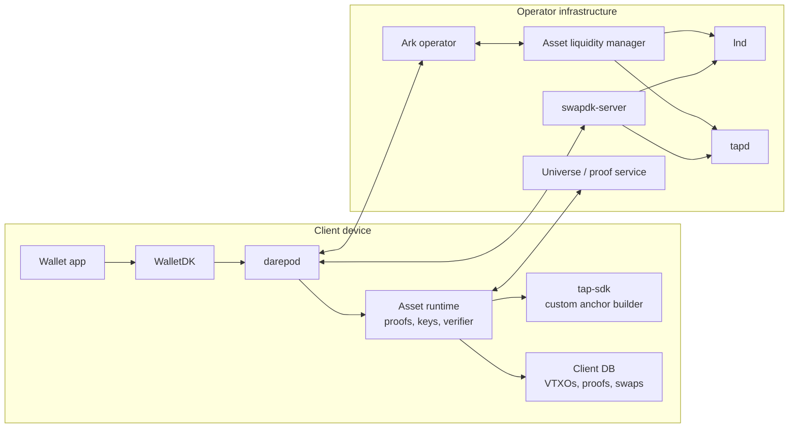

The important point is that full tapd is not in the client box. The client has
the minimum asset logic needed to hold keys, store proofs, verify proofs, and
verify operator-proposed asset commitments.

## Architecture Options

### Option 0: Full Local tapd On The Client

The client runs `darepod`, WalletDK, and a normal tapd instance.

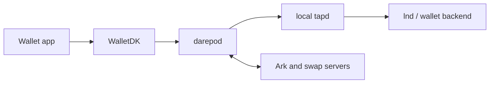

Pros:

- Uses the existing tapd wallet and proof store directly.
- Shortest path for local developer prototypes.
- Low design risk in Taproot Assets internals.

Cons:

- Violates the lightweight-client goal.
- Harder for mobile apps and embedded WalletDK deployments.
- Adds another daemon lifecycle, database, macaroon, TLS, and backup surface.
- Pushes proof store and asset wallet complexity onto every user.
- Makes product UX closer to "run infrastructure" than a light wallet SDK.

Recommendation: useful for tests and prototypes, not the target product
architecture.

### Option 1: Inline Asset Implementation In SwapDK

SwapDK imports the taproot-assets packages it needs and implements the asset
wallet/proof/transaction logic directly inside `darepo-client`.

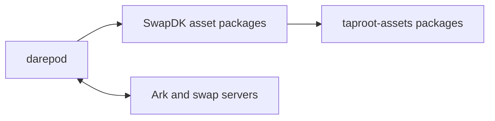

Pros:

- No extra process.
- Full control over the exact product behavior.
- Can be optimized for Ark-shaped asset transactions from day one.
- Client remains a single binary.

Cons:

- Duplicates too much of what tap-sdk is supposed to expose.
- Risks spreading taproot-assets internals across SwapDK.
- Harder for tap-sdk and other products to reuse the work.
- Larger review burden for the SwapDK team.
- Higher chance of diverging from tapd behavior.

Recommendation: avoid as the main path. If used, isolate it behind one
internal asset package and treat it as temporary until tap-sdk exposes the
needed builder and proof APIs.

### Option 2: In-Process Asset Runtime In `darepod`

`darepod` starts an asset runtime as an internal subsystem. The runtime uses
tap-sdk for the custom builder and proof APIs, plus a small local proof/key
store. It does not run full tapd.

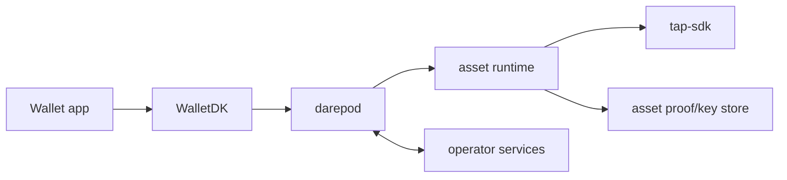

Pros:

- Preserves the one-binary WalletDK experience.
- Lets `darepod` supervise asset state like swaps and VTXOs.
- Keeps asset code behind a narrow package boundary.
- Works for embedded and daemon deployments.
- Can share the existing durable actor and DB patterns.

Cons:

- Adds dependency and runtime complexity to `darepod`.
- Requires a carefully designed asset runtime interface.
- Needs tap-sdk to expose more library functionality than it does today.
- Less process isolation than a sidecar.

Recommendation: preferred client-side product architecture.

### Option 3: Same Binary, Separate OS Process

The shipped binary can launch itself in an asset-service mode. The wallet still
ships one executable, but asset work runs in a separate process over local RPC.

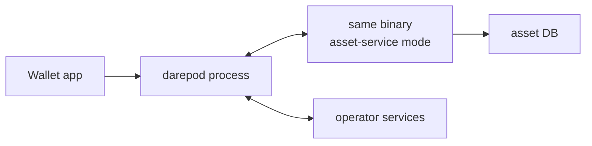

Pros:

- One distribution artifact.
- Better crash and memory isolation than an in-process runtime.
- Can restart asset logic independently.
- Allows stricter local RPC boundaries.

Cons:

- More lifecycle complexity.
- Local RPC auth and process management are needed.
- Mobile environments may not allow this cleanly.
- Debugging two processes is harder than one.
- Still needs a lightweight asset runtime implementation.

Recommendation: reasonable for desktop/server deployments, but not the first
mobile-friendly target.

### Option 4: Separate Asset Sidecar Binary

The client runs `darepod` and a separate asset sidecar binary. The sidecar owns
asset proofs, keys, and builder calls.

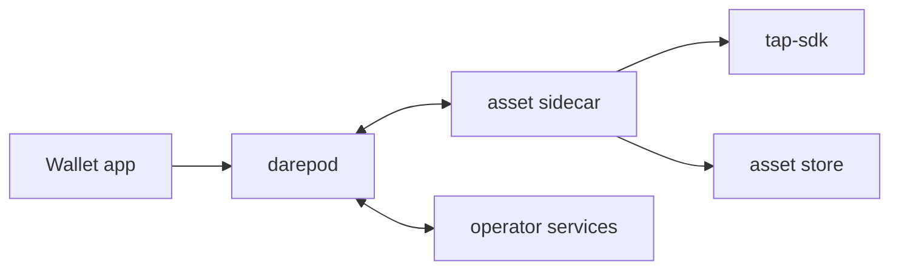

Pros:

- Strong package and process isolation.
- Easier to replace or upgrade independently.
- Good for advanced desktop and service deployments.
- Avoids pulling all asset dependencies into default `darepod` builds.

Cons:

- Not ideal for WalletDK's lightweight embedded story.
- Adds packaging, lifecycle, RPC, auth, and recovery surfaces.
- Users still need to operate another local component.
- Can feel like a plugin architecture before the core API is stable.

Recommendation: useful as an optional advanced deployment mode, not the
default client architecture.

### Option 5: Remote Operator Asset Service Only

The client delegates almost all asset work to an operator-hosted service. The
operator runs tapd and stores proofs; the client stores minimal state.

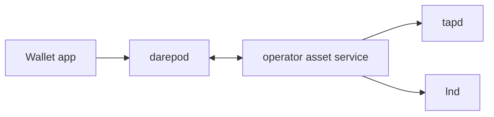

Pros:

- Lightest possible client.
- Operator can centralize tapd, proof storage, liquidity, and monitoring.
- Fastest product path if trust assumptions are acceptable.

Cons:

- Weakens self-custody unless the client still verifies and stores exit data.
- Operator becomes a proof availability dependency.
- Harder to support unilateral exit if the client does not retain proofs.
- Competitive positioning suffers if users rely on the operator for asset
  recovery data.

Recommendation: acceptable only if paired with local client verification and
local or recoverable proof storage. Remote-only custody of proofs should not be
the self-custody design.

## Option Comparison

| Option | Client weight | Review risk | Mobile fit | Self-custody clarity | Recommendation |
|--------|---------------|-------------|------------|----------------------|----------------|
| Full local tapd | High | Low | Poor | Strong if backups work | Prototype only |
| Inline in SwapDK | Medium | High | Good | Strong | Avoid broad import |
| In-process runtime | Low/medium | Medium | Good | Strong | Preferred |
| Same binary subprocess | Medium | Medium | Mixed | Strong | Optional later |
| Separate sidecar | Medium/high | Medium | Poor/mixed | Strong | Advanced mode |
| Remote-only service | Low | Medium | Good | Weak unless verified | Not enough alone |

## Recommended Architecture

Use a hybrid model:

1. Client runs a `darepod` asset runtime in-process.
2. The asset runtime stores keys, proofs, proof locators, and asset VTXO
   metadata locally.
3. The asset runtime uses tap-sdk's custom-anchor builder and proof APIs.
4. The client verifies proofs and commitments before signing.
5. The operator runs full tapd, lnd, liquidity services, proof services, and
   monitoring.
6. Full local tapd remains a test/developer option, not a user requirement.

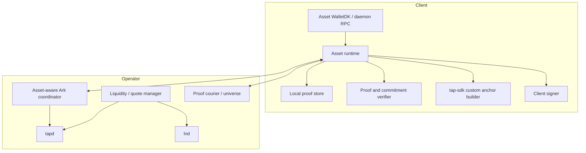

## What "Lightweight tapd" Should Mean

The client should not run a second full daemon that happens to be smaller than
tapd. That would recreate tapd's lifecycle, database, RPC, macaroon, and backup
surface inside SwapDK.

Instead, "lightweight tapd" should mean a local asset runtime with the minimum
pieces required for self-custody:

- asset key derivation or signer integration,
- latest proof storage for user-owned outputs,
- proof import/export and backup,
- proof verification,
- output commitment verification,
- custom-anchor transaction construction through tap-sdk,
- local asset balance projection,
- recovery metadata for exit paths.

It should not include:

- asset issuance,
- full universe indexing,
- asset channel management,
- Lightning route finding,
- operator inventory management,
- a public tapd-compatible RPC server.

This makes the local component closer to a wallet verification library than a
daemon. A full tapd remains useful in tests, desktop power-user modes, and the
operator stack.

## Client Responsibilities

The client should own:

- asset keys or signer access,
- live asset VTXO metadata,
- proof files or proof fragments for spendable assets,
- proof verification,
- commitment verification before signing,
- asset balance projection,
- durable asset transfer state,
- recovery/export data.

The client should not own:

- Lightning channels,
- asset channel liquidity,
- operator inventory,
- route finding for asset Lightning invoices,
- full tapd service lifecycle.

## Operator Responsibilities

The operator should own:

- full tapd instance for operator inventory and asset channels,
- lnd instance for Lightning settlement,
- asset channel/liquidity management,
- supported asset policy,
- proof courier or universe infrastructure,
- quote and fee policy,
- monitoring and risk controls,
- construction of proposed asset-aware Ark trees.

The operator may propose asset commitments, but the client must verify them.

## New Client Components

### Asset Runtime

Suggested package boundary:

```text
assetruntime/
```

The asset runtime is a `darepod` subsystem, similar in spirit to the optional
swap runtime. It should be optional behind a build tag until the dependency
and API surface are stable.

Possible build tag:

```text
assetruntime
```

The runtime should expose a narrow interface internally:

```go
type AssetRuntime interface {
	ListAssets(context.Context) (*AssetBalanceSnapshot, error)
	ImportProof(context.Context, ProofImport) (*AssetRecord, error)
	ExportProof(context.Context, ProofExport) (*ProofBundle, error)
	VerifyPlan(context.Context, AssetTxPlan) (*VerificationReport, error)
	BuildTransfer(context.Context, AssetTransferIntent) (*AssetTxPlan, error)
	CommitTransfer(context.Context, AssetTxPlan) (*CommittedAssetTx, error)
	RecordFinalTransfer(context.Context, FinalAssetTransfer) error
}
```

Exact types should be SwapDK-owned and should not expose taproot-assets
implementation structs.

### Asset Store

The client needs durable tables for:

- asset refs,
- asset VTXOs,
- proof locators,
- latest proof file or proof fragment,
- transfer state,
- proof import/export status,
- operator-delivered proof events,
- asset swap linkage once Lightning flows are added.

The store should support lookups by:

- `AssetRef`,
- script key,
- anchor outpoint,
- Ark VTXO ID,
- OOR session ID,
- payment hash for future swap flows.

### Asset Verification

Verification should be a first-class runtime step, not an incidental builder
side effect.

The client must verify:

- input proof chains,
- selected asset amounts,
- asset identity through `AssetRef`,
- output asset amounts,
- no unintended burns,
- output commitment inclusion,
- anchor output scripts and values,
- proof suffix availability after commit.

### Asset RPC Surface

Prefer a separate service over extending the existing BTC wallet RPC
immediately.

Possible proto package:

```text
rpc/assetwalletrpc/asset_wallet.proto
```

Initial methods:

```protobuf
service AssetWalletService {
    rpc Status(AssetStatusRequest) returns (AssetStatusResponse);
    rpc ListAssets(ListAssetsRequest) returns (ListAssetsResponse);
    rpc Balance(AssetBalanceRequest) returns (AssetBalanceResponse);
    rpc ListTransfers(ListAssetTransfersRequest)
        returns (ListAssetTransfersResponse);
    rpc ImportProof(ImportAssetProofRequest)
        returns (ImportAssetProofResponse);
    rpc ExportProof(ExportAssetProofRequest)
        returns (ExportAssetProofResponse);
    rpc VerifyProof(VerifyAssetProofRequest)
        returns (VerifyAssetProofResponse);
    rpc Receive(AssetReceiveRequest) returns (AssetReceiveResponse);
    rpc Send(AssetSendRequest) returns (AssetSendResponse);
    rpc Exit(AssetExitRequest) returns (AssetExitResponse);
}
```

`AssetRef` should be represented as a string in RPCs. Normal callers should
not pass separate asset ID or group key fields.

### WalletDK Surface

WalletDK should wrap the daemon asset service with Go types:

```go
type AssetClient interface {
	AssetStatus(context.Context) (*AssetStatus, error)
	ListAssets(context.Context) ([]AssetBalance, error)
	AssetBalance(context.Context, AssetRef) (*AssetBalance, error)
	AssetReceive(context.Context, AssetReceiveRequest) (*AssetReceive, error)
	AssetSend(context.Context, AssetSendRequest) (*AssetTransfer, error)
	AssetExit(context.Context, AssetExitRequest) (*AssetTransfer, error)
	ImportAssetProof(context.Context, []byte) (*AssetRecord, error)
	ExportAssetProof(context.Context, AssetRef) (*ProofBundle, error)
}
```

This can either live on the existing WalletDK client or be returned as a
separate `Assets()` facade. A separate facade keeps the BTC wallet verbs small.

## Operator Components

### Asset-Aware Ark Coordinator

The operator must understand which Ark outputs carry assets and must build
asset-aware transaction proposals.

Responsibilities:

- support asset VTXO registration,
- construct asset-aware round/OOR plans,
- propose output commitments and proof delivery paths,
- reject unsupported assets,
- enforce fees and dust policies,
- coordinate proof delivery after finalization.

### tapd and lnd

The operator can run full tapd alongside lnd. This is the right place for
heavy wallet, proof, universe, and channel infrastructure.

tapd responsibilities:

- operator-owned asset inventory,
- asset proofs for operator funds,
- asset channel support when Lightning asset flows are enabled,
- proof courier/universe integration,
- transaction logging for operator-side transfers.

lnd responsibilities:

- BTC Lightning liquidity,
- tapd wallet backend,
- asset channel backend when supported,
- chain wallet and fee management.

### Asset Liquidity Manager

This is a new operator component. It should answer:

- which assets are supported,
- what balances are available,
- what Lightning channel liquidity exists per asset,
- what fees and limits apply,
- whether a quote is needed,
- whether a swap can be executed now.

For lower-level asset support, this can start as a policy/inventory service.
For Lightning asset invoices, it becomes critical path.

## Asset Transaction Flow

### Asset Deposit Into Ark

This flow boards an asset into the Ark instance.

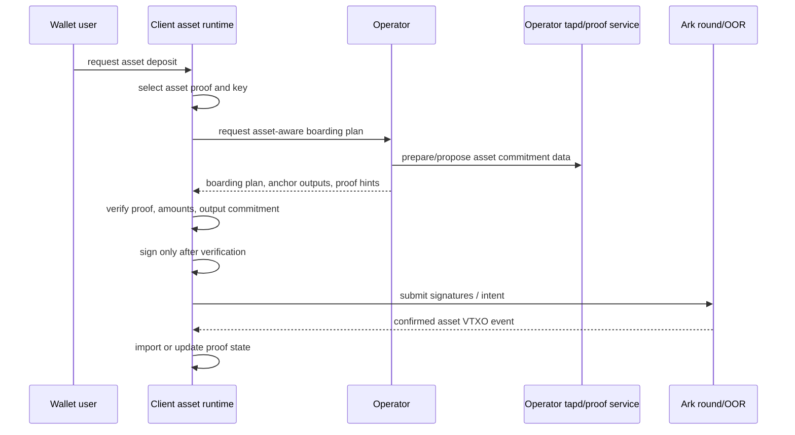

### Asset Transfer Inside Ark

This flow sends or refreshes asset-bearing VTXOs without Lightning.

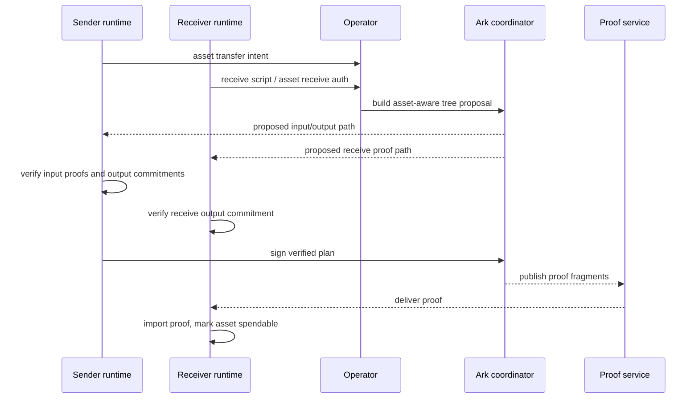

### Asset Exit

This flow exits an asset-bearing Ark VTXO back to a normal Taproot Assets
output. It is required for recovery and for users who want to move assets out
of the Ark instance.

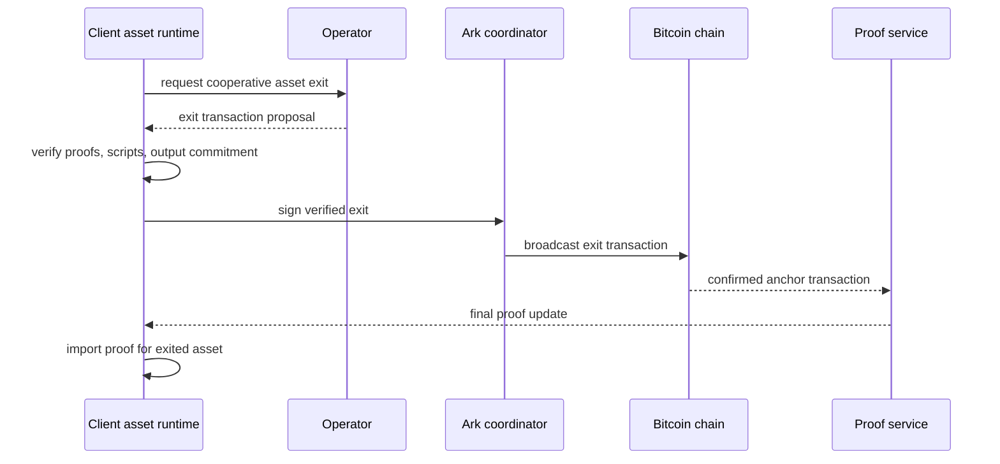

### Future Asset Lightning Pay

This is out of scope for the first implementation, but it drives liquidity
requirements.

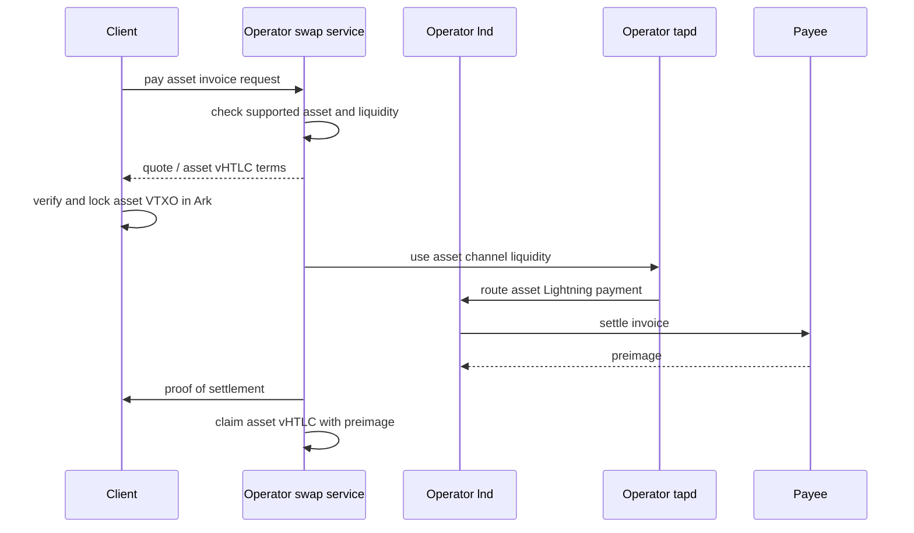

## Liquidity Model

### Who Owns Assets?

There are two asset pools:

1. **User assets.** These are represented as asset-bearing Ark VTXOs. The
   client owns the relevant keys and proofs. The operator coordinates updates
   but should not be able to spend user assets without the user's protocol
   participation.
2. **Operator assets.** These are operator inventory and asset channel balances
   used to provide Lightning interoperability, instant service, and liquidity.

For in-Ark asset transfers, the operator does not need to own the user's
asset. It needs to coordinate the transaction and provide service liquidity for
fees and operational constraints.

For Lightning asset payments, the operator needs asset liquidity. The user can
lock or transfer an asset VTXO as the economic input, but the operator still
needs sufficient outbound asset channel liquidity to pay the invoice.

### Who Fronts Capital?

The operator fronts operational capital for Lightning interoperability.

Pay direction:

- user locks asset value in an Ark vHTLC or equivalent asset condition,
- operator pays the Lightning asset invoice with its channel liquidity,
- operator claims the user's locked asset using the preimage.

Receive direction:

- operator receives assets over Lightning using its channel/liquidity setup,
- operator creates an asset-bearing Ark output for the user,
- client imports and verifies the proof before treating funds as spendable.

The operator is therefore a liquidity provider. Atomicity can reduce credit
risk, but it does not remove the need for asset-specific channel liquidity or
inventory.

### Can All Assets Be Supported?

No. Support is constrained by:

- asset type: fungible assets first,
- proof availability and universe support,
- operator allowlist or risk policy,
- asset channel support and route availability,
- operator inventory and channel liquidity,
- issuer/tranche behavior,
- fee and dust constraints,
- regulatory or business policy.

The initial API should expose `SupportedAssets` or equivalent metadata from
the operator so clients know which `AssetRef` values are usable.

### Asset-To-BTC Versus Asset-Lightning

There are two product modes:

| Mode | Description | Liquidity requirement |
|------|-------------|----------------------|
| Asset-to-BTC | Assets bridge to BTC Lightning | BTC liquidity plus asset inventory |
| Asset-Lightning | Taproot Asset invoices | Asset channel liquidity per supported asset |

The earlier tap-sdk roadmap intentionally leaves Lightning asset invoices out
of scope. SwapDK should still model the liquidity boundary now so the lower
asset layer does not block either mode.

## Proof Storage And Verification

### Client Load

The client must retain enough data to prove and recover spendable assets:

- latest proof per live asset VTXO,
- proof locator metadata,
- asset receive scripts and keys,
- Ark tree path or recovery metadata,
- unconfirmed proof updates for pending transfers,
- backup/export records.

This is heavier than BTC-only VTXOs, but it should still be compatible with a
light client if the runtime stores only the user's relevant proofs and path
fragments.

Client mitigations:

- store latest proof per live asset output,
- archive or prune spent proofs after safe backup,
- use encrypted remote backup for proof files,
- verify asynchronously after durable receipt,
- avoid copying full proof chains through every intermediate tree node,
- request proof fragments by path where possible.

### Operator Load

The operator has the heavier burden:

- full tapd database,
- proofs for operator inventory,
- proof courier/universe infrastructure,
- asset channel state,
- per-asset liquidity tracking,
- proof generation for rounds and OORs,
- monitoring for proof delivery failures.

The operator should expect asset support to be more storage and CPU intensive
than BTC-only Ark. Batching helps transaction cost, but proof generation and
distribution become part of the operator's service reliability.

### Verification Boundary

The operator can serve proof data, but client acceptance must depend on local
verification.

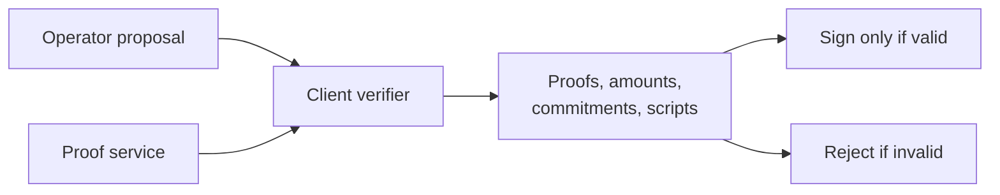

## API Surfaces Needed

### Client Daemon RPC

New asset service, separate from the BTC wallet service:

- `AssetStatus`
- `ListSupportedAssets`
- `ListAssets`
- `AssetBalance`
- `ListAssetTransfers`
- `ImportAssetProof`
- `ExportAssetProof`
- `VerifyAssetProof`
- `AssetReceive`
- `AssetSend`
- `AssetExit`

### Operator RPC

The client needs operator calls for:

- supported asset list,
- asset receive script registration,
- asset tree proposal,
- asset OOR proposal,
- proof delivery lookup,
- fee and policy quote,
- future Lightning asset swap quote,
- transfer submission and status.

These should probably live in new asset-specific RPC services rather than
overloading existing BTC-only swap RPCs.

### Internal Interfaces

Suggested boundaries:

```text
assetruntime      client-side asset state and verification
assetoperator     typed client for operator asset services
assetdb           proof and asset VTXO persistence
assetwallet       daemon RPC implementation
```

Core Ark packages should not import tap-sdk directly. The runtime/adapters
should translate between asset-aware domain data and existing VTXO/OOR flows.
