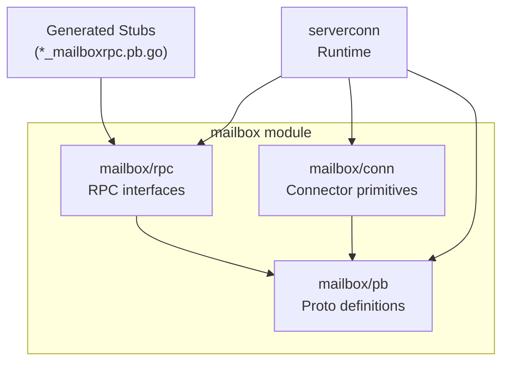
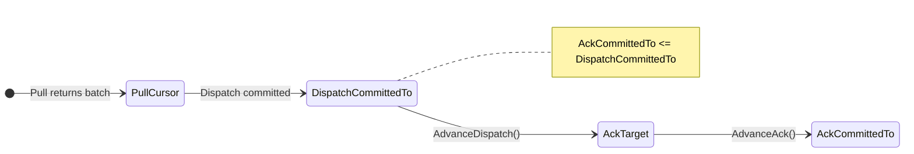

# Mailbox Module

The mailbox module provides the protocol definitions and reusable building
blocks for RPC-over-mailbox communication. It defines the wire format
(envelopes), the runtime interfaces that generated stubs depend on, and the
connector primitives shared by both client-side and server-side runtimes.

For the full architecture covering all three layers, see
[`docs/mailbox_architecture.md`](../docs/mailbox_architecture.md). For the
protocol-level contract (ordering, idempotency, ack semantics), see
[`docs/RPC_MAILBOX_CONTRACT.md`](../docs/RPC_MAILBOX_CONTRACT.md).

## Package Structure



| Package | Import Path | Responsibility | Key Types |
|---------|-------------|----------------|-----------|
| `pb` | `mailbox/pb` | Protobuf definitions and generated gRPC stubs. | `Envelope`, `RpcMeta`, `Status`, `MailboxServiceClient` |
| `rpc` | `mailbox/rpc` | Runtime interfaces for generated code. In-process routing mux. gRPC error transport. | `RPCClient`, `Router`, `ServeMux`, `HandlerFunc`, `ServiceMethod` |
| `conn` | `mailbox/conn` | Reusable connector primitives for ack watermarks, response correlation, deterministic IDs, and TLV-proto bridging. | `AckState`, `ResponseRegistry`, `WrappedProto`, `CorrelationID` |

---

## mailbox/pb: Protocol Definitions

Generated from `mailbox.proto`. Contains the wire-format types and the edge
service definition. Never edit generated code manually — regenerate with
`make rpc`.

### Envelope

The `Envelope` is the durable unit flowing through the mailbox. Key fields:

| Field | Type | Role |
|-------|------|------|
| `msg_id` | `string` | Unique per send attempt. Different on each retry. |
| `idempotency_key` | `string` | Stable per semantic operation. Same across retries for dedup. |
| `sender` / `recipient` | `string` | Mailbox identifiers for routing. |
| `body` | `google.protobuf.Any` | Typed protobuf payload. |
| `rpc` | `RpcMeta` | Optional RPC overlay (kind, service, method, correlation). |
| `event_seq` | `uint64` | Server-assigned ordering key. Cursor for Pull/AckUpTo. |
| `headers` | `map<string,string>` | Extensible metadata (e.g., gRPC error status). |

### RpcMeta

Carries RPC overlay metadata. The `Kind` enum distinguishes:

- `KIND_REQUEST` — Unary RPC request (client → server).
- `KIND_RESPONSE` — Unary RPC response (server → client).
- `KIND_EVENT` — Fire-and-forget message (either direction).

### MailboxService

The edge API consumed by connectors:

- **`Send`** — Append an envelope to a recipient's mailbox.
- **`Pull`** — Long-poll for envelopes starting at a cursor.
- **`AckUpTo`** — Advance the ack watermark (monotonic, idempotent).

---

## mailbox/rpc: RPC Interfaces and Mux

This package intentionally contains no transport implementation. It provides
only the narrow contracts needed by generated code so both clients and servers
can depend on it without pulling in actor or transport dependencies.

### RPCClient

The client-side interface that generated stubs depend on:

```go
type RPCClient interface {
    SendRPC(ctx context.Context, method ServiceMethod,
        req proto.Message, opts RPCOptions) (SendResult, error)

    AwaitRPC(ctx context.Context, correlationID string,
        resp proto.Message) error
}
```

`SendRPC` constructs and sends a `KIND_REQUEST` envelope. `AwaitRPC` blocks
until the matching `KIND_RESPONSE` arrives. The two-phase design allows
pre-registering response waiters before sending, preventing races with fast
servers.

### Router and HandlerFunc

The server-side interface:

```go
type Router interface {
    Handle(service string, method string,
        newReq func() proto.Message, fn HandlerFunc)
}

type HandlerFunc func(context.Context, proto.Message) (proto.Message, error)
```

Handlers must be idempotent — the mailbox provides at-least-once delivery.

### ServeMux

Concrete `Router` implementation. Maps `(service, method)` pairs to typed
handlers. Thread-safe via `sync.RWMutex`. Unmarshals with
`DiscardUnknown: true` for forward compatibility.

```go
mux := mailboxrpc.NewServeMux()
mux.Handle("arkrpc.v1.RoundService", "JoinRound",
    func() proto.Message { return new(JoinRoundRequest) },
    func(ctx context.Context, req proto.Message) (proto.Message, error) {
        return handleJoinRound(ctx, req.(*JoinRoundRequest))
    },
)
```

### gRPC Status Encoding

Server-side errors are transported via envelope headers, keeping the body
reserved for successful payloads:

- **`EncodeErrorHeaders(err)`** — Converts any error to a gRPC status, encodes
  as base64 `google.rpc.Status` in the `mailboxrpc.grpc_status_b64` header.
- **`DecodeErrorHeaders(headers)`** — Reconstructs the gRPC error on the client
  side. Returns `nil` if no error header is present.

### ServiceMethod and RPCOptions

- **`ServiceMethod{Service, Method}`** — Routing key. Service is the
  fully-qualified protobuf service name. Method is the method name.
- **`RPCOptions`** — Per-request overrides for idempotency key, correlation ID,
  and custom headers.
- **`SendResult`** — Contains `CorrelationID` and `IdempotencyKey` from a
  successful send.

---

## mailbox/conn: Connector Primitives

Protocol-adjacent building blocks shared by client-side and server-side
connector runtimes. Higher-level runtime wiring (actor lifecycle, dispatcher
tables, transport loops) lives in connector-specific packages like `serverconn`.

### AckState

Tracks four monotonic cursors governing safe ack progression:



| Cursor | Meaning |
|--------|---------|
| `PullCursor` | Next cursor for the `Pull` call. |
| `DispatchCommittedTo` | Max cursor durably committed to local processing. |
| `AckTarget` | Max cursor that should be acked remotely. |
| `AckCommittedTo` | Last cursor successfully acked to the remote edge. |

Key methods:

- **`AdvanceDispatch(nextCursor)`** — Updates `DispatchCommittedTo` and
  `AckTarget`. Called after successful dispatch.
- **`AdvanceAck()`** — Sets `AckCommittedTo = AckTarget`. Called after
  `AckUpTo` succeeds.
- **`NeedsAck()`** — `true` when `AckTarget > AckCommittedTo`.
- **`Encode`/`Decode`** — TLV serialization for checkpoint persistence.

### ResponseRegistry

In-memory correlation-based response waiters with early-response buffering:

- **`RegisterWaiter(id)`** — Returns `actor.Future[*Envelope]`. Idempotent.
  Completes immediately from buffer if a response arrived early.
- **`DeliverResponse(id, env)`** — Completes an existing waiter or buffers the
  response for late registration.
- **`RemoveWaiter(id)`** — Cancels a waiter with `ErrWaiterCancelled`.
- **Stale cleanup** — Waiters and buffered responses older than `waiterTTL`
  (default 10 min) are pruned automatically.

### EnvelopeIdentity

Deterministic ID derivation from payload bytes:

- **`StableEventMsgID(payload)`** — `"evt-" + SHA256(payload)[:16]` (hex).
- **`StableEventIdempotencyKey(payload)`** — `"idem-" + SHA256(payload)[:16]`
  (hex).

Ensures that retries of persisted durable actor messages produce the same IDs,
enabling server-side deduplication.

### WrappedProto

Adapts `proto.Message` for use in TLV record fields:

```go
type WrappedProto[T proto.Message] struct {
    Val T
}
```

Encode: deterministic `proto.Marshal` → write bytes.
Decode: read bytes → `proto.Unmarshal` into `Val`.

The caller must pre-set `Val` to a typed zero value before decode.

### Typed Identifiers

- **`CorrelationID`** — `string` type linking a request to its response.
- **`IdempotencyKey`** — `string` type for semantic operation deduplication.

---

## See Also

- [`docs/mailbox_architecture.md`](../docs/mailbox_architecture.md) —
  Comprehensive architecture covering all three layers with diagrams.
- [`docs/RPC_MAILBOX_CONTRACT.md`](../docs/RPC_MAILBOX_CONTRACT.md) —
  Protocol-level contract (ordering, idempotency, ack watermark behavior).
- [`serverconn/README.md`](../serverconn/README.md) — Server connection runtime
  (egress, ingress, event routing, crash recovery).
- [`docs/durable_actor_architecture.md`](../docs/durable_actor_architecture.md)
  — Underlying actor durability model (CDC, leasing, deduplication).
