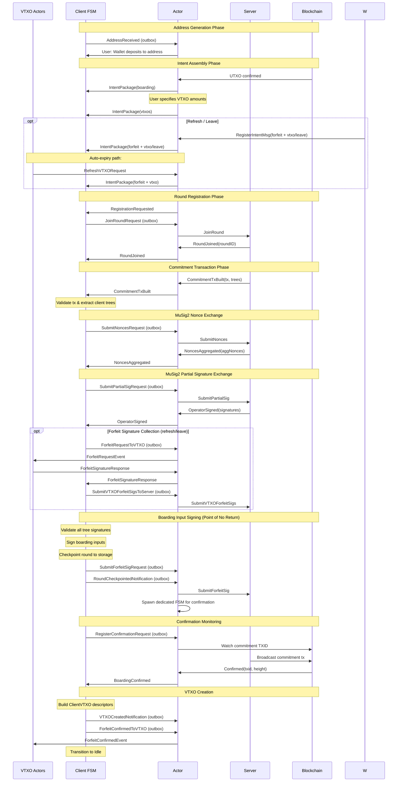
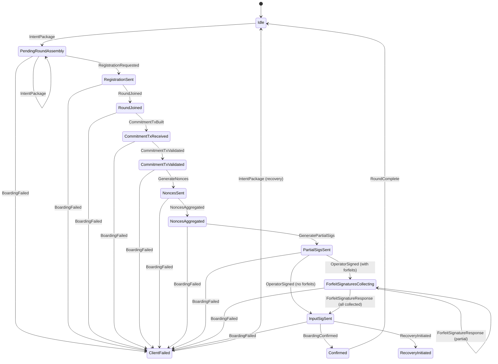

# Ark Round State Machine

The round package implements the client-side protocol for participating in Ark
rounds. Rounds coordinate multiple clients to batch operations into a single
commitment transaction containing a VTXO tree. The package supports three
operations:

- **Boarding**: Converting on-chain Bitcoin into off-chain VTXOs by spending
  boarding UTXOs into the commitment transaction.
- **Refresh**: Rolling existing VTXOs into a new tree with extended expirations,
  preventing timeout-based expiry. Old VTXOs are atomically forfeited via
  connector outputs.
- **Leave**: Exiting the Ark by converting a VTXO back to an on-chain output
  included in the commitment transaction.

The architecture strictly separates business logic from side effects. The finite
state machine (FSM) owns all protocol logic, validation, and state transitions.
A thin actor layer translates between the FSM's event model and external
systems (operator server, blockchain, wallet). This separation ensures the
protocol remains testable and deterministic regardless of IO timing.

## Protocol Overview

Boarding begins when a user requests a boarding address, a time-locked 2-of-2
multisig between client and operator. The user deposits Bitcoin to this address,
creating a boarding UTXO. Once confirmed, the client registers this intent with
the operator's coordination server, which batches multiple clients' boarding
UTXOs into a single round.

The operator constructs a commitment transaction spending all boarding inputs
and creating a single taproot output containing the complete VTXO tree. Each
tree leaf represents a VTXO owned by a participant, with tapscript branches
enabling either cooperative spending (client + operator) or unilateral exit
after timeout.

Creating this transaction requires a MuSig2 signing ceremony. Participants
generate nonces, exchange them, produce partial signatures over their tree
portions, and validate the operator's completion. Only after the entire tree is
provably signed do clients release signatures for their boarding inputs.

This ordering (tree signatures before boarding input signatures) is critical for
security. If clients signed boarding inputs first, a malicious operator could
broadcast the commitment transaction with an invalid tree, locking funds without
providing expected VTXOs. Validating complete tree signatures first ensures
funds will be accessible before relinquishing control of boarding inputs.

## State Machine Architecture

The FSM progresses through states representing protocol phases. Each state
processes events, performs validation or cryptographic operations, then
transitions to the next state and emits outbound messages. States are immutable;
transitions create new instances rather than mutating.

### Idle State

The FSM begins in Idle, representing readiness for new boarding requests. When
the user requests a boarding address, the FSM derives a key pair, constructs a
2-of-2 boarding script with the operator's key and CSV timelock, and emits an
`AddressReceived` notification.

The FSM returns to Idle after completing a boarding round, allowing the same
instance to process additional addresses across different rounds.

### PendingRoundAssembly State

After receiving an address, the user funds it by broadcasting a Bitcoin
transaction. Once confirmed, the actor builds a `BoardingIntent` and delivers
it to the FSM via `IntentPackage`. The FSM transitions from Idle to
PendingRoundAssembly, registering the boarding intent containing the address
and on-chain UTXO information.

All pool additions flow through a single `IntentPackage` event, which carries
four independent pools:

- **Boarding** — on-chain inputs to spend (from confirmed boarding UTXOs)
- **VTXOs** — requested output amounts for new virtual UTXOs
- **Forfeits** — VTXOs to be rolled into a new tree
- **Leaves** — VTXOs to be exited on-chain

The actor translates external messages — wallet-composed intent packages,
boarding confirmations, VTXO requests, and the auto-expiry
`RefreshVTXORequest` path from VTXO actors — into an `IntentPackage`
before sending it to the FSM. This keeps round registration in the actor
layer, while the FSM focuses purely on pool accumulation and state
management.

This separation supports fan-in (multiple inputs funding one output) and
fan-out (one input creating multiple outputs) scenarios, as well as mixed
rounds containing any combination of boarding, refresh, and leave operations.
Refresh-only rounds (no boarding inputs) are also supported.

When `RegistrationRequested` is received, the FSM validates that total outputs
do not exceed inputs, then transitions to RegistrationSentState, emitting a
`JoinRoundRequest` that aggregates all intents into a single server request.
The join request carries boarding inputs, VTXO outputs, explicit forfeit
outpoints, and leave outputs.

### RegistrationSent and RoundJoined States

The `JoinRoundRequest` carries serialized boarding requests, VTXO templates,
forfeit outpoints, and leave outputs to the operator. The server aggregates
requests from multiple clients and, once sufficient participation is reached,
initiates a round by assigning a round ID.

The FSM transitions to RoundJoined upon receiving the `RoundJoined` response,
which includes the round ID used to track this batch through completion.

### CommitmentTxReceived and CommitmentTxValidated States

The operator constructs a commitment transaction and sends it via
`CommitmentTxBuilt`. The FSM performs extensive validation, verifying every
boarding UTXO appears as input, the taproot output commits to a Merkle tree with
all expected VTXOs, and extracts client-specific sub-trees indexed by signing
key.

Client trees are essential for constructing MuSig2 sessions and must be
persisted alongside final VTXOs, as spending a VTXO off-chain requires proving
its position via complete Merkle path to root.

The FSM also maps each boarding input to its position in the commitment
transaction's input array, required later for signing (Bitcoin signatures commit
to input indices via SIGHASH).

### Nonce Exchange: NoncesSent and NoncesAggregated States

MuSig2 signing begins with nonce exchange. Each participant generates nonce
pairs for each signing session (one per client tree). The FSM generates these
cryptographically, ensuring no reuse across sessions (nonce reuse leaks private
keys).

The NoncesSent state emits `SubmitNoncesRequest` messages. The operator collects
and aggregates all nonces, returning them in `NoncesAggregated`. The FSM stores
aggregated nonces with MuSig2 sessions for producing partial signatures.

### Partial Signature Exchange: PartialSigsSent State

With nonces exchanged, participants create partial signatures over their tree
portions. The FSM iterates each client tree and associated session, producing
partial signatures via `SubmitPartialSigRequest`.

The operator aggregates all partial signatures to produce complete Schnorr
signatures over every tree branch, making each VTXO spendable through the
cooperative path.

### ForfeitSignaturesCollecting State

When a round includes refresh or leave requests, the FSM enters
ForfeitSignaturesCollecting after the operator returns signed tree
branches. Old VTXOs must be forfeited before boarding inputs are
released, ensuring atomic replacement.

For each refresh or leave VTXO, the FSM sends a `ForfeitRequestToVTXO`
outbox message to the corresponding VTXO actor. The VTXO actor builds
a forfeit transaction spending the old VTXO through a connector output
tied to the new commitment transaction, signs it, and returns a
`ForfeitSignatureResponse`.

The FSM tracks expected vs collected forfeits. Once all expected forfeit
signatures arrive, they are submitted to the server via
`SubmitVTXOForfeitSigsToServer` and the FSM transitions to
InputSigSent. If the round has no refresh or leave requests, this state
is skipped entirely and PartialSigsSent transitions directly to
InputSigSent.

### InputSigSent State: The Point of No Return

When the operator completes aggregation, it returns `OperatorSigned` containing
final signatures for all tree branches. The FSM verifies every signature,
reconstructing expected signing messages, validating each against the correct
aggregated public key, and confirming signatures enable cooperative tapscript
spending.

This validation is the security checkpoint: valid signatures mean funds will be
accessible as VTXOs after commitment transaction confirms. Invalid or missing
signatures trigger failure state transition without releasing boarding input
signatures.

Upon successful validation, the FSM signs each boarding input using Taproot key
path spending. Combined with operator signatures, these complete the commitment
transaction. The FSM immediately checkpoints the entire round state (commitment
transaction, VTXO tree, boarding intents, client trees) to persistent storage.

This checkpoint is the "point of no return." After sending boarding input
signatures, the operator may broadcast at any time. If the client crashes before
checkpoint completes, the operator might broadcast while the client has no
record, potentially causing fund loss. The checkpoint ensures recovery even if
the client crashes immediately after sending signatures.

The FSM emits `SubmitForfeitSigRequest` messages containing boarding input
signatures, registers a confirmation watch for the commitment TXID, and emits
`RoundCheckpointedNotification` triggering actor-level FSM migration to a
dedicated round-specific FSM for confirmation monitoring.

### Confirmed State and VTXO Creation

When the commitment transaction confirms with sufficient depth, the chain
monitoring subsystem delivers `BoardingConfirmed`. The FSM constructs
`ClientVTXO` descriptors from intents and client trees, including the VTXO's
outpoint, amount, taproot script, key descriptors, CSV expiry, and complete tree
path proving inclusion in the commitment transaction output.

Descriptors are persisted to the VTXO store and emitted via
`VTXOCreatedNotification`, making them available to the wallet for spending.

### Failure Handling

At any point, the FSM may receive `BoardingFailed` indicating round abort or
unrecoverable error. The FSM transitions to `ClientFailedState`, capturing
failure reason and recoverability.

Recoverable failures (operator canceling due to insufficient participation)
leave boarding UTXOs unspent on-chain, allowing retry. Unrecoverable failures
indicate protocol violations requiring user intervention.

## Actor Architecture: Primary and Dedicated FSMs

The actor manages FSM lifecycles and message routing. Rather than creating a new
FSM per boarding address, the system maintains a single primary FSM handling
initial protocol phases (address generation, intent registration, round joining,
signature exchange) through InputSigSent.

When a round reaches InputSigSent, the primary FSM emits
`RoundCheckpointedNotification`. The actor spawns a dedicated FSM instance for
that round, initialized from checkpointed state. This dedicated FSM monitors for
commitment transaction confirmation, a potentially long operation that shouldn't
block the primary FSM from processing new addresses.

Migration occurs precisely where the protocol shifts from interactive (requires
operator responses) to passive (waiting for blockchain events). Before
InputSigSent, the FSM actively exchanges messages with the operator. After, it
only waits for confirmation.

If the client crashes, the actor recreates dedicated FSMs for all checkpointed
rounds by scanning persistent storage on startup.

## Event and Message Flow

The FSM communicates exclusively through events, structured messages
representing external occurrences (operator responses, blockchain confirmations)
or internal triggers (validation complete, signatures generated). The actor
translates between external message formats and the FSM's uniform event model.

### Outbox Pattern

State transitions produce outbound events via the outbox, preventing the FSM
from depending on external interfaces. The FSM emits side effects as data
(outbound events) rather than invoking methods directly. The actor examines
outbox contents and dispatches to appropriate subsystems:

- **Server messages**: `JoinRoundRequest`, `SubmitNoncesRequest`,
  `SubmitPartialSigRequest`, `SubmitForfeitSigRequest`,
  `SubmitVTXOForfeitSigsToServer`
- **VTXO actor messages**: `ForfeitRequestToVTXO`,
  `ForfeitConfirmedToVTXO`
- **Chain monitoring**: `RegisterConfirmationRequest`
- **Wallet notifications**: `VTXOCreatedNotification`, `AddressReceived`

This design enables trivial testing (FSM runs in-memory with mock stores) and
ensures all side effects are visible and serializable.

Internal events support multi-step transitions within a single external event
delivery. The CommitmentTxReceived state performs initial parsing, then emits an
internal event triggering CommitmentTxValidated's detailed validation. This
keeps states focused and testable while maintaining atomicity from the actor's
perspective.

## Client-Server Message Sequence

The following sequence shows the complete protocol message flow between client
and server during a successful boarding round:

Key observations:

- All server-bound messages flow through the outbox, never directly from FSM
- The actor routes outbox messages to appropriate destinations based on type
- Boarding intents and VTXO requests are collected separately during the
  assembly phase, enabling flexible input-output relationships
- Internal validation (tree extraction, signature verification, descriptor
  building) happens within state transitions, invisible to external systems
- The checkpoint before sending boarding input signatures is critical for
  recovery
- FSM migration occurs after `RoundCheckpointedNotification`, separating
  interactive and monitoring phases

## Persistence and Recovery

The FSM interacts with storage through `ClientEnvironment`, providing interfaces
for boarding intent storage, round checkpointing, VTXO storage, and wallet
operations. This indirection enables testing with in-memory stores while
production uses SQLite.

Boarding intents persist from registration until round completion or failure.
Round checkpointing occurs at the InputSigSent transition, including complete
commitment transaction, full VTXO tree, client sub-trees, boarding input
signatures, and every intent with updated status.

FSM state checkpointing complements round checkpointing by persisting the FSM's
current state structure. The actor inspects checkpoints on startup to spawn
dedicated FSMs for all checkpointed rounds, ensuring no confirmation monitoring
is lost across restarts.

The storage layer implements checkpoints atomically where possible, preventing
partial writes. Transaction semantics ensure either the entire checkpoint
succeeds or none of it does, maintaining consistency even if the process crashes
during checkpoint.

## State Machine Diagram

The diagram omits internal events for clarity, showing only major transitions
triggered by external events. Each state may perform significant computation
(validation, cryptography, checkpoint operations) before transitioning.

## Refresh and Leave Flows

Refresh and leave operations participate in the same round lifecycle as
boarding, sharing the MuSig2 signing ceremony and commitment transaction. They
differ in how intents are assembled and how old VTXOs are handled.

### Refresh

Manual refresh now starts in the wallet: the wallet loads the target VTXOs,
builds a forfeit plus replacement-VTXO `IntentPackage`, and sends it to the
round actor via `RegisterIntentMsg`. The round actor registers that package
with the FSM and marks the participating VTXOs as `PendingForfeit`.

For the auto-expiry path, a VTXO actor may still emit
`RefreshVTXORequest`. The round actor converts that request into the same
forfeit-plus-VTXO `IntentPackage`, which the FSM accumulates in
`PendingRoundAssembly.Forfeits` and `PendingRoundAssembly.VTXOs` alongside
any boarding intents.

After the operator signs the VTXO tree, the FSM enters
ForfeitSignaturesCollecting and sends `ForfeitRequestToVTXO` to each VTXO
actor. The VTXO actor builds a forfeit transaction spending the old VTXO
through a connector output tied to the new commitment transaction, signs it,
and returns a `ForfeitSignatureResponse`. This ensures atomic replacement: the
old VTXO becomes unspendable only when the new commitment transaction
confirms.

On the VTXO actor side, the flow progresses through `PendingForfeitState` →
`ForfeitingState` → `ForfeitedState` as the forfeit is requested, signed, and
confirmed.

### Leave

Leave follows the same mechanics as refresh, but the output is an on-chain
destination rather than a new VTXO. The wallet builds a forfeit-plus-leave
`IntentPackage` and sends it to the round actor via `RegisterIntentMsg`.
During commitment transaction validation, the FSM verifies all leave outputs
appear in the transaction via `validateLeaveOutputs()`.

### Mixed Rounds

A single round can contain any combination of boarding, refresh, and leave
operations. Refresh-only rounds (no boarding inputs) are supported, allowing
VTXO rollovers without requiring new on-chain deposits.

## Future Extensions

Future extensions may add VTXO transfers between participants, requiring their
own round coordination that potentially reuses portions of the MuSig2 ceremony
with different validation and output construction. Unilateral exit paths
(timeout-based) coordinate with the operator but follow distinct state
progressions without multi-party coordination.

The actor's primary/dedicated FSM pattern extends naturally to these flows.
Each protocol type can maintain a primary FSM for interactive phases and spawn
dedicated FSMs for monitoring, ensuring responsiveness regardless of
simultaneous operation count.
