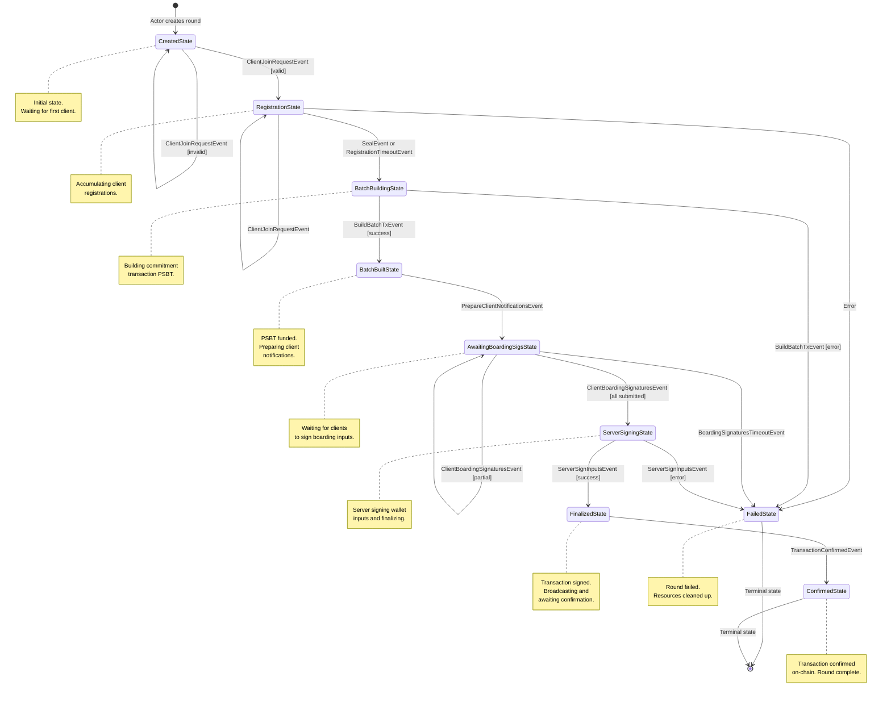

# Rounds Package

This package implements the server-side round state machine (FSM) for managing
client registrations, batch building, signature collection, and transaction
finalization.

## FSM Overview

The round FSM manages the complete lifecycle of a round, from creation through
client registration, batch building, signature collection, transaction
finalization, broadcasting, and on-chain confirmation.

### State Diagram



### States

| State                       | Description                                                                                        |
|-----------------------------|----------------------------------------------------------------------------------------------------|
| `CreatedState`              | Initial state. No clients have joined yet. Transitions to `RegistrationState` on first valid join. |
| `RegistrationState`         | Accepting client join requests. Accumulates registrations until sealed.                            |
| `BatchBuildingState`        | Building the commitment transaction PSBT with boarding inputs and leave outputs.                   |
| `BatchBuiltState`           | PSBT has been funded. Prepares client notifications with batch info.                               |
| `AwaitingBoardingSigsState` | Waiting for all clients with boarding inputs to submit their signatures.                           |
| `ServerSigningState`        | Server signs its wallet inputs and applies client boarding signatures to finalize the PSBT.        |
| `FinalizedState`            | Transaction is fully signed and broadcast. Waiting for on-chain confirmation.                      |
| `ConfirmedState` (terminal) | Transaction confirmed on-chain with required confirmations. Round complete.                        |
| `FailedState` (terminal)    | Round has failed. Clients notified, boarding inputs unlocked, resources cleaned up.                |

### Events

| Event                             | Source        | Description                                                       |
|-----------------------------------|---------------|-------------------------------------------------------------------|
| `ClientJoinRequestEvent`          | Actor         | Client wants to join the round with boarding/leave/VTXO requests. |
| `RegistrationTimeoutEvent`        | Actor (timer) | Registration phase timeout expired.                               |
| `SealEvent`                       | Internal      | Seals the round, preventing new registrations.                    |
| `BuildBatchTxEvent`               | Internal      | Triggers commitment transaction PSBT construction.                |
| `PrepareClientNotificationsEvent` | Internal      | Triggers sending batch info to clients.                           |
| `BoardingSignaturesTimeoutEvent`  | Actor (timer) | Boarding signature collection timeout expired.                    |
| `ClientBoardingSignaturesEvent`   | Actor         | Client submits signatures for their boarding inputs.              |
| `ServerSignInputsEvent`           | Internal      | Triggers server to sign wallet inputs and finalize PSBT.          |
| `TransactionConfirmedEvent`       | Actor         | Commitment transaction confirmed on-chain.                        |

### Outbox Messages

Messages emitted by the FSM for the actor to process:

| Message                          | Description                                                           |
|----------------------------------|-----------------------------------------------------------------------|
| `ClientSuccessResp`              | Send success response to client with round ID.                        |
| `ClientErrorResp`                | Send error response to client with error message.                     |
| `ClientBatchInfo`                | Send batch PSBT and VTXO tree paths to client.                        |
| `ClientAwaitingBoardingSigsResp` | Notify client that server is ready for boarding signatures.           |
| `ClientRoundFailedResp`          | Notify client that their round has failed.                            |
| `StartTimeoutReq`                | Request actor to start a phase timeout.                               |
| `CancelTimeoutReq`               | Request actor to cancel a pending phase timeout.                      |
| `RoundSealedReq`                 | Notify actor that round is sealed (create new round for new clients). |
| `RoundFailedReq`                 | Notify actor that round has failed (clean up resources).              |
| `UnlockBoardingInputsReq`        | Request actor to unlock boarding inputs after round failure.          |
| `BroadcastRoundReq`              | Request actor to broadcast transaction and subscribe to confirmations.|

## Transition Details

### CreatedState

```
ClientJoinRequestEvent:
    [invalid] --> CreatedState + ClientErrorResp
    [valid]   --> RegistrationState + ClientSuccessResp
                                    + StartTimeoutReq(Registration)
```

### RegistrationState

```
ClientJoinRequestEvent:
    [already registered] --> RegistrationState + ClientErrorResp
    [invalid]            --> RegistrationState + ClientErrorResp
    [valid]              --> RegistrationState + ClientSuccessResp

RegistrationTimeoutEvent:
    --> BatchBuildingState + RoundSealedReq
                           + CancelTimeoutReq(Registration)
                           + internal(SealEvent, BuildBatchTxEvent)

SealEvent:
    --> BatchBuildingState + internal(BuildBatchTxEvent)
```

### BatchBuildingState

```
BuildBatchTxEvent:
    [success] --> BatchBuiltState + internal(PrepareClientNotificationsEvent)
    [error]   --> FailedState + RoundFailedReq
                               + UnlockBoardingInputsReq
                               + ClientRoundFailedResp (all clients)
```

### BatchBuiltState

```
PrepareClientNotificationsEvent:
    --> AwaitingBoardingSigsState + ClientBatchInfo (all clients)
                                   + StartTimeoutReq(BoardingSigs)
```

### AwaitingBoardingSigsState

```
ClientBoardingSignaturesEvent:
    [invalid]        --> AwaitingBoardingSigsState + ClientErrorResp
    [duplicate]      --> AwaitingBoardingSigsState + ClientErrorResp
    [partial]        --> AwaitingBoardingSigsState
    [all submitted]  --> ServerSigningState + CancelTimeoutReq(BoardingSigs)
                                             + internal(ServerSignInputsEvent)

BoardingSignaturesTimeoutEvent:
    --> FailedState + RoundFailedReq
                    + UnlockBoardingInputsReq
                    + ClientRoundFailedResp (all clients)
```

### ServerSigningState

```
ServerSignInputsEvent:
    [success] --> FinalizedState + BroadcastRoundReq
    [error]   --> FailedState + RoundFailedReq
                               + UnlockBoardingInputsReq
                               + ClientRoundFailedResp (all clients)
```

### FinalizedState

```
TransactionConfirmedEvent:
    --> ConfirmedState

Notes:
- Transaction is broadcast immediately upon entering FinalizedState via BroadcastRoundReq
- Actor subscribes to confirmations and sends TransactionConfirmedEvent when confirmed
- All other events are ignored in this state
```

### FailedState

```
Terminal state - ignores all events
```

### ConfirmedState

```
Terminal state - ignores all events
```

## Actor Integration

The FSM is driven by the `Actor` which:

1. Creates a new round FSM in `CreatedState` on startup and when rounds are sealed
2. Loads persisted rounds from storage (in `FinalizedState`) on startup
3. Routes client messages as `ClientJoinRequestEvent` or `ClientBoardingSignaturesEvent`
4. Processes outbox messages (send responses, manage timeouts, broadcast transactions)
5. Sends timeout events when timers expire
6. Creates new rounds when current round is sealed
7. Handles round failures (unlock inputs, remove from tracking)
8. Subscribes to transaction confirmations and forwards them to the FSM

### Actor Messages

Messages that can be sent to the rounds actor:

| Message            | Source           | Description                                              |
|--------------------|------------------|----------------------------------------------------------|
| `JoinRoundRequest` | RPC layer        | Client wants to join the current round.                  |
| `TimeoutMsg`       | Timeout actor    | A scheduled timeout has expired (contains composite ID). |
| `RoundMsg`         | Internal or RPC  | Wrapper to route an FSM event to a specific round by ID. |
| `ConfirmationMsg`  | Chain source     | Transaction confirmed on-chain.                          |

### Timeout Management

Timeouts use composite IDs in the format `roundID:phase` to identify both the
round and the phase that scheduled the timeout. When a timeout expires, the
actor parses this ID to route the appropriate phase-specific event (e.g.,
`RegistrationTimeoutEvent`) to the correct round's FSM.

| Phase           | Timeout Event                    | Description                            |
|-----------------|----------------------------------|----------------------------------------|
| `registration`  | `RegistrationTimeoutEvent`       | Registration phase timer expired.      |
| `boarding_sigs` | `BoardingSignaturesTimeoutEvent` | Boarding signature collection expired. |

### Transaction Broadcasting and Confirmation

When a round transitions to `FinalizedState`, the FSM emits a `BroadcastRoundReq`
outbox message. The actor handles this by:

1. Broadcasting the signed transaction via `ChainSourceActor`
2. Subscribing to confirmation notifications using actor mode
3. Transforming chain source `ConfirmationEvent` into `ConfirmationMsg` via a
   mapped actor reference
4. Forwarding `ConfirmationMsg` as `TransactionConfirmedEvent` to the round's FSM

For rounds loaded from storage on restart, the actor re-subscribes to
confirmations without re-broadcasting (since the transaction is already in the
mempool or confirmed).

### Round Persistence

Rounds are persisted to storage when they transition to `FinalizedState`. This
allows the server to recover rounds after a restart and continue waiting for
confirmations. The actor loads all persisted rounds on startup and re-subscribes
to their confirmation notifications.

## Error Handling

The FSM handles errors at various stages:

- **Validation errors**: Client messages with invalid data result in
  `ClientErrorResp` without state changes
- **Batch building errors**: Failures during PSBT construction (e.g., insufficient
  wallet funds) transition to `FailedState`
- **Signature errors**: Invalid client signatures result in `ClientErrorResp`
  without state changes
- **Server signing errors**: Failures during server signing transition to
  `FailedState`
- **Timeout errors**: Expired timeouts for critical phases (e.g., boarding
  signature collection) transition to `FailedState`

When entering `FailedState`, the FSM emits:
- `RoundFailedReq` to notify the actor
- `UnlockBoardingInputsReq` to release locked inputs
- `ClientRoundFailedResp` to notify all registered clients

The actor removes failed rounds from tracking and creates a new current round
if needed.
