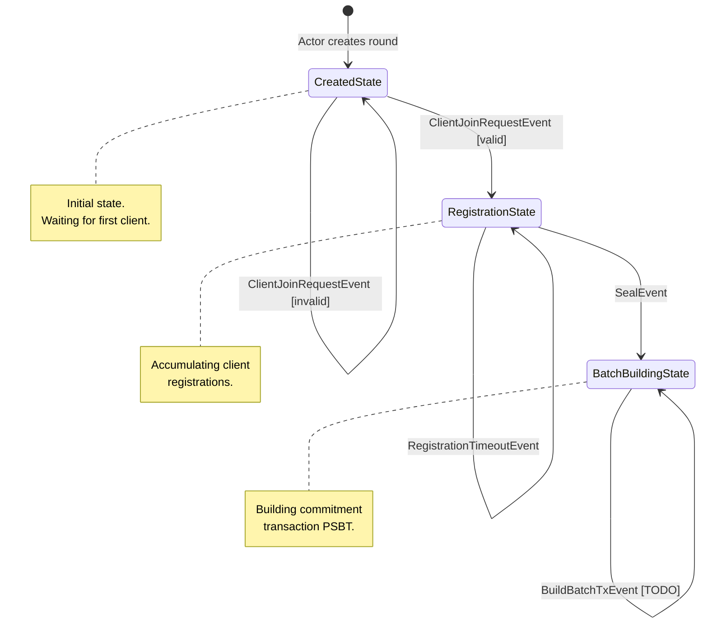

# Rounds Package

This package implements the server-side round state machine (FSM) for managing
client registrations and batch building.

## FSM Overview

The round FSM manages the lifecycle of a single round, from creation through
client registration to batch building and signing.

### State Diagram



### States

| State                | Description                                                                                        |
|----------------------|----------------------------------------------------------------------------------------------------|
| `CreatedState`       | Initial state. No clients have joined yet. Transitions to `RegistrationState` on first valid join. |
| `RegistrationState`  | Accepting client join requests. Accumulates registrations until sealed.                            |
| `BatchBuildingState` | Building the commitment transaction PSBT. (Placeholder - TODO)                                     |

### Events

| Event                      | Source        | Description                                                       |
|----------------------------|---------------|-------------------------------------------------------------------|
| `ClientJoinRequestEvent`   | Actor         | Client wants to join the round with boarding/leave/VTXO requests. |
| `RegistrationTimeoutEvent` | Actor (timer) | Registration phase timeout expired.                               |
| `SealEvent`                | Internal      | Seals the round, preventing new registrations.                    |
| `BuildBatchTxEvent`        | Internal      | Triggers commitment transaction construction.                     |

### Outbox Messages

Messages emitted by the FSM for the actor to process:

| Message                 | Description                                                           |
|-------------------------|-----------------------------------------------------------------------|
| `ClientSuccessResp`     | Send success response to client with round ID.                        |
| `ClientErrorResp`       | Send error response to client with error message.                     |
| `LockBoardingInputsReq` | Request actor to lock boarding inputs for this round.                 |
| `StartTimeoutReq`       | Request actor to start a phase timeout.                               |
| `RoundSealedReq`        | Notify actor that round is sealed (create new round for new clients). |

## Transition Details

### CreatedState

```
ClientJoinRequestEvent:
    [invalid] --> CreatedState + ClientErrorResp
    [valid]   --> RegistrationState + ClientSuccessResp
                                    + LockBoardingInputsReq
                                    + StartTimeoutReq(Registration)
```

### RegistrationState

```
ClientJoinRequestEvent:
    [already registered] --> RegistrationState + ClientErrorResp
    [invalid]            --> RegistrationState + ClientErrorResp
    [valid]              --> RegistrationState + ClientSuccessResp
                                               + LockBoardingInputsReq

RegistrationTimeoutEvent:
    --> RegistrationState + RoundSealedReq
                          + internal(SealEvent)

SealEvent:
    --> BatchBuildingState + internal(BuildBatchTxEvent)
```

### BatchBuildingState

```
BuildBatchTxEvent:
    --> BatchBuildingState (TODO: implement batch building)
```

## Actor Integration

The FSM is driven by the `RoundActor` which:

1. Creates a new round FSM in `CreatedState`
2. Routes client messages as `ClientJoinRequestEvent`
3. Processes outbox messages (send responses, lock inputs, manage timeouts)
4. Sends timeout events when timers expire
5. Creates new rounds when current round is sealed
