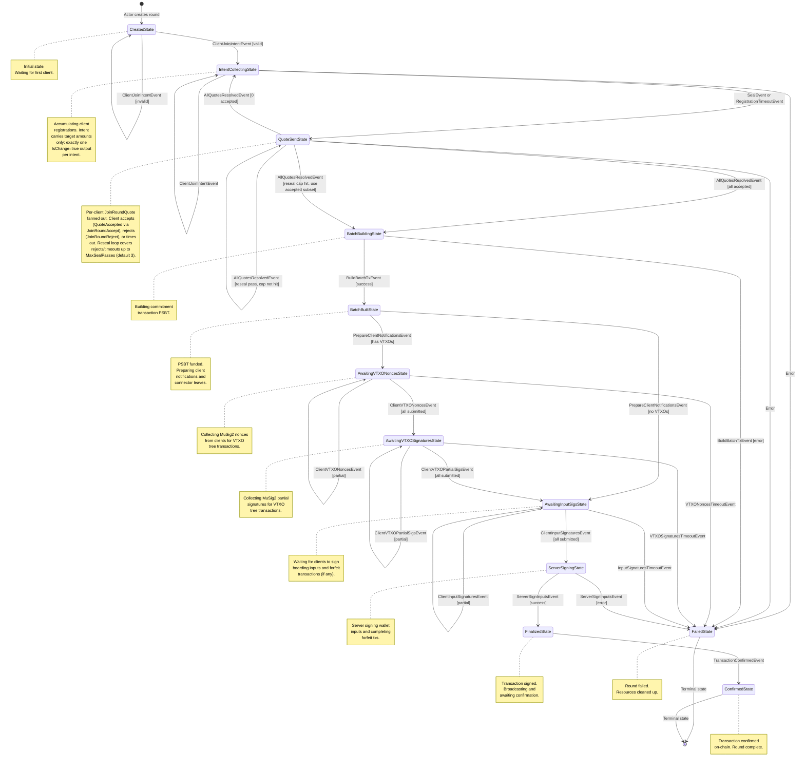

# Rounds Package

This package implements the server-side round state machine (FSM) for managing
client registrations, batch building, signature collection, and transaction
finalization.

## FSM Overview

The round FSM manages the complete lifecycle of a round, from creation through
client registration, batch building, signature collection, transaction
finalization, broadcasting, and on-chain confirmation.

### State Diagram



### States

| State                         | Description                                                                                                           |
|-------------------------------|-----------------------------------------------------------------------------------------------------------------------|
| `CreatedState`                | Initial state. No clients have joined yet. Transitions to `IntentCollectingState` on first valid join.                    |
| `IntentCollectingState`           | Accepting client join requests. Accumulates registrations until sealed.                                               |
| `BatchBuildingState`          | Building the commitment transaction PSBT with boarding inputs, leave outputs, and connector outputs for forfeits.     |
| `BatchBuiltState`             | PSBT has been funded. Prepares client notifications with batch info, VTXO tree paths, and connector leaf assignments. |
| `AwaitingVTXONoncesState`     | Collecting MuSig2 public nonces from all clients with VTXOs for VTXO tree transactions.                               |
| `AwaitingVTXOSignaturesState` | Collecting MuSig2 partial signatures from all clients with VTXOs for VTXO tree transactions.                          |
| `AwaitingInputSigsState`      | Waiting for all clients to submit boarding signatures and forfeit transactions (if any).                              |
| `ServerSigningState`          | Server signs its wallet inputs, completes forfeit txs, and applies client boarding signatures.                        |
| `FinalizedState`              | Transaction is fully signed and broadcast. Waiting for on-chain confirmation.                                         |
| `ConfirmedState` (terminal)   | Transaction confirmed on-chain with required confirmations. Round complete.                                           |
| `FailedState` (terminal)      | Round has failed. Clients notified, boarding inputs unlocked, resources cleaned up.                                   |

### Events

| Event                             | Source        | Description                                                          |
|-----------------------------------|---------------|----------------------------------------------------------------------|
| `ClientJoinIntentEvent`          | Actor         | Client wants to join the round with boarding/leave/VTXO requests.    |
| `RegistrationTimeoutEvent`        | Actor (timer) | Registration phase timeout expired.                                  |
| `SealEvent`                       | Internal      | Seals the round, preventing new registrations.                       |
| `BuildBatchTxEvent`               | Internal      | Triggers commitment transaction PSBT construction.                   |
| `PrepareClientNotificationsEvent` | Internal      | Triggers sending batch info to clients.                              |
| `VTXONoncesTimeoutEvent`          | Actor (timer) | VTXO nonce collection timeout expired.                               |
| `ClientVTXONoncesEvent`           | Actor         | Client submits MuSig2 nonces for all their VTXO signing keys.        |
| `VTXOSignaturesTimeoutEvent`      | Actor (timer) | VTXO partial signature collection timeout expired.                   |
| `ClientVTXOPartialSigsEvent`      | Actor         | Client submits MuSig2 partial signatures for all their signing keys. |
| `InputSignaturesTimeoutEvent`     | Actor (timer) | Boarding signature collection timeout expired.                       |
| `ClientInputSignaturesEvent`      | Actor         | Client submits boarding signatures and forfeit tx signatures.        |
| `ServerSignInputsEvent`           | Internal      | Triggers server to sign wallet inputs and finalize PSBT.             |
| `TransactionConfirmedEvent`       | Actor         | Commitment transaction confirmed on-chain.                           |

### Outbox Messages

Messages emitted by the FSM for the actor to process:

| Message                       | Description                                                                 |
|-------------------------------|-----------------------------------------------------------------------------|
| `ClientSuccessResp`           | Send success response to client with round ID.                              |
| `ClientErrorResp`             | Send error response to client with error message.                           |
| `ClientBatchInfo`             | Send batch PSBT, VTXO tree paths, and connector leaf info to client.        |
| `ClientVTXOAggNonces`         | Send aggregated MuSig2 nonces to client for VTXO tree transactions.         |
| `ClientVTXOAggSigs`           | Send aggregated MuSig2 signatures to client for VTXO tree transactions.     |
| `ClientAwaitingInputSigsResp` | Notify client that server is ready for input signatures (boarding/forfeit). |
| `ClientRoundFailedResp`       | Notify client that their round has failed.                                  |
| `StartTimeoutReq`             | Request actor to start a phase timeout.                                     |
| `CancelTimeoutReq`            | Request actor to cancel a pending phase timeout.                            |
| `RoundSealedReq`              | Notify actor that round is sealed (create new round for new clients).       |
| `RoundFailedReq`              | Notify actor that round has failed (clean up resources).                    |
| `BroadcastRoundReq`           | Request actor to broadcast transaction and subscribe to confirmations.      |

## Transition Details

### CreatedState

```
ClientJoinIntentEvent:
    [invalid] --> CreatedState + ClientErrorResp
    [valid]   --> IntentCollectingState + ClientSuccessResp
                                    + StartTimeoutReq(Registration)
```

### IntentCollectingState

```
ClientJoinIntentEvent:
    [already registered] --> IntentCollectingState + ClientErrorResp
    [invalid]            --> IntentCollectingState + ClientErrorResp
    [valid]              --> IntentCollectingState + ClientSuccessResp

RegistrationTimeoutEvent:
    --> BatchBuildingState + RoundSealedReq
                           + CancelTimeoutReq(Registration)
                           + internal(SealEvent, BuildBatchTxEvent)

SealEvent:
    --> BatchBuildingState + internal(BuildBatchTxEvent)
```

### BatchBuildingState

```
BuildBatchTxEvent:
    [success] --> BatchBuiltState + internal(PrepareClientNotificationsEvent)
    [error]   --> FailedState + RoundFailedReq
                               + ClientRoundFailedResp (all clients)
```

### BatchBuiltState

```
PrepareClientNotificationsEvent:
    [has VTXOs] --> AwaitingVTXONoncesState + ClientBatchInfo (all clients)
                                             + StartTimeoutReq(VTXONonces)
    [no VTXOs]  --> AwaitingInputSigsState + ClientBatchInfo (all clients)
                                               + ClientAwaitingInputSigsResp
                                                 (clients with boarding)
                                               + StartTimeoutReq(InputSigs)
```

### AwaitingVTXONoncesState

```
ClientVTXONoncesEvent:
    [unregistered client] --> AwaitingVTXONoncesState + ClientErrorResp
    [no VTXOs]            --> AwaitingVTXONoncesState + ClientErrorResp
    [already submitted]   --> AwaitingVTXONoncesState + ClientErrorResp
    [missing keys]        --> AwaitingVTXONoncesState + ClientErrorResp
    [invalid nonces]      --> AwaitingVTXONoncesState + ClientErrorResp
    [partial]             --> AwaitingVTXONoncesState
    [all submitted]       --> AwaitingVTXOSignaturesState
                              + CancelTimeoutReq(VTXONonces)
                              + ClientVTXOAggNonces (all clients with VTXOs)
                              + StartTimeoutReq(VTXOSignatures)

VTXONoncesTimeoutEvent:
    --> FailedState + RoundFailedReq
                    + ClientRoundFailedResp (all clients)
```

### AwaitingVTXOSignaturesState

```
ClientVTXOPartialSigsEvent:
    [unregistered client] --> AwaitingVTXOSignaturesState + ClientErrorResp
    [no VTXOs]            --> AwaitingVTXOSignaturesState + ClientErrorResp
    [already submitted]   --> AwaitingVTXOSignaturesState + ClientErrorResp
    [missing keys]        --> AwaitingVTXOSignaturesState + ClientErrorResp
    [invalid signatures]  --> AwaitingVTXOSignaturesState + ClientErrorResp
    [partial]             --> AwaitingVTXOSignaturesState
    [all submitted]       --> AwaitingInputSigsState
                              + CancelTimeoutReq(VTXOSignatures)
                              + ClientVTXOAggSigs (all clients with VTXOs)
                              + ClientAwaitingInputSigsResp (clients with boarding)
                              + StartTimeoutReq(InputSigs)

VTXOSignaturesTimeoutEvent:
    --> FailedState + RoundFailedReq
                    + ClientRoundFailedResp (all clients)
```

### AwaitingInputSigsState

```
ClientInputSignaturesEvent:
    [invalid]        --> AwaitingInputSigsState + ClientErrorResp
    [duplicate]      --> AwaitingInputSigsState + ClientErrorResp
    [partial]        --> AwaitingInputSigsState
    [all submitted]  --> ServerSigningState + CancelTimeoutReq(InputSigs)
                                             + internal(ServerSignInputsEvent)

Notes:
- Clients must submit all expected boarding signatures and forfeit txs in the
  same message.
- Forfeit transactions are validated here before acceptance.

InputSignaturesTimeoutEvent:
    --> FailedState + RoundFailedReq
                    + ClientRoundFailedResp (all clients)
```

### ServerSigningState

```
ServerSignInputsEvent:
    [success] --> FinalizedState + BroadcastRoundReq
    [error]   --> FailedState + RoundFailedReq
                               + ClientRoundFailedResp (all clients)
```

### FinalizedState

```
TransactionConfirmedEvent:
    --> ConfirmedState

Notes:
- Transaction is broadcast immediately upon entering FinalizedState via BroadcastRoundReq
- Actor subscribes to confirmations and sends TransactionConfirmedEvent when confirmed
- All other events are ignored in this state
```

### FailedState

```
Terminal state - ignores all events
```

### ConfirmedState

```
Terminal state - ignores all events
```

## Actor Integration

The FSM is driven by the `Actor` which:

1. Creates a new round FSM in `CreatedState` on startup and when rounds are sealed
2. Loads persisted rounds from storage (in `FinalizedState`) on startup
3. Routes client messages as `ClientJoinIntentEvent` or `ClientInputSignaturesEvent`
4. Processes outbox messages (send responses, manage timeouts, broadcast transactions)
5. Sends timeout events when timers expire
6. Creates new rounds when current round is sealed
7. Handles round failures (unlock inputs, remove from tracking)
8. Subscribes to transaction confirmations and forwards them to the FSM

### Actor Messages

Messages that can be sent to the rounds actor:

| Message            | Source           | Description                                              |
|--------------------|------------------|----------------------------------------------------------|
| `JoinRoundRequest` | RPC layer        | Client wants to join the current round.                  |
| `TimeoutMsg`       | Timeout actor    | A scheduled timeout has expired (contains composite ID). |
| `RoundMsg`         | Internal or RPC  | Wrapper to route an FSM event to a specific round by ID. |
| `ConfirmationMsg`  | Chain source     | Transaction confirmed on-chain.                          |

### Timeout Management

Timeouts use composite IDs in the format `roundID:phase` to identify both the
round and the phase that scheduled the timeout. When a timeout expires, the
actor parses this ID to route the appropriate phase-specific event (e.g.,
`RegistrationTimeoutEvent`) to the correct round's FSM.

| Phase           | Timeout Event                 | Description                              |
|-----------------|-------------------------------|------------------------------------------|
| `registration`  | `RegistrationTimeoutEvent`    | Registration phase timer expired.        |
| `vtxo_nonces`   | `VTXONoncesTimeoutEvent`      | VTXO nonce collection timer expired.     |
| `vtxo_sigs`     | `VTXOSignaturesTimeoutEvent`  | VTXO signature collection timer expired. |
| `boarding_sigs` | `InputSignaturesTimeoutEvent` | Boarding signature collection expired.   |

### Transaction Broadcasting and Confirmation

When a round transitions to `FinalizedState`, the FSM emits a `BroadcastRoundReq`
outbox message. The actor handles this by:

1. Broadcasting the signed transaction via `ChainSourceActor`
2. Subscribing to confirmation notifications using actor mode
3. Transforming chain source `ConfirmationEvent` into `ConfirmationMsg` via a
   mapped actor reference
4. Forwarding `ConfirmationMsg` as `TransactionConfirmedEvent` to the round's FSM

For rounds loaded from storage on restart, the actor re-subscribes to
confirmations without re-broadcasting (since the transaction is already in the
mempool or confirmed).

### Round Persistence

Rounds are persisted to storage when they transition to `FinalizedState`. This
allows the server to recover rounds after a restart and continue waiting for
confirmations. The actor loads all persisted rounds on startup and re-subscribes
to their confirmation notifications.

Connector tree descriptors and forfeit metadata are persisted with the round so
the server can reconstruct connector trees and broadcast forfeits later.

## Dispatch (Mailbox RPC Layer)

Round RPCs are dispatched via `clientconn.AddEnvelopeRoute` — the
fire-and-forget model. Each inbound envelope is deserialized, converted to a
domain actor message (with `ClientID` extracted from the envelope sender), and
`Tell`'d to the rounds actor. No response envelope is built; responses arrive
asynchronously via the outbox event path through the bridge.

### Request Flow

```
Client envelope → clientconn ingress → DispatcherMap[{service, method}]
  → AddEnvelopeRoute closure (unmarshal proto, Adapt(env, proto))
  → Extract ClientID from env.Sender
  → Proto→domain conversion (NoncesFromProto, etc.)
  → Build actor message
  → actorKey.Ref(system).Tell(ctx, actorMsg) — durable commit
```

### Route Methods

| Method | Proto Request | Actor Message | Description |
|--------|--------------|---------------|-------------|
| `JoinRound` | `JoinRoundRequest` | `JoinRoundRequest` (actor msg) | Client registration with boarding/VTXO/leave requests |
| `SubmitNonces` | `SubmitNoncesRequest` | `RoundMsg{ClientVTXONoncesEvent}` | MuSig2 nonces for VTXO tree signing |
| `SubmitPartialSigs` | `SubmitPartialSigRequest` | `RoundMsg{ClientVTXOPartialSigsEvent}` | MuSig2 partial sigs for VTXO tree |
| `SubmitForfeitSigs` | `SubmitForfeitSigRequest` | `RoundMsg{ClientInputSignaturesEvent}` | Boarding input + forfeit tx signatures |
| `SubmitVTXOForfeitSigs` | `SubmitVTXOForfeitSigsRequest` | `RoundMsg{ClientInputSignaturesEvent}` | VTXO forfeit tx signatures |

### Proto→Domain Conversion Helpers (`proto_convert.go`)

| Function | Purpose |
|----------|---------|
| `JoinRoundRequestFromProto` | Converts full JoinRound proto to `types.JoinRoundRequest` |
| `ParseRoundID` | Parses 16-byte UUID from proto round_id field |
| `NoncesFromProto` | Converts proto nonce map to `map[SignerKey]map[TxID]Musig2PubNonce` |
| `PartialSigsFromProto` | Converts proto sig map to `map[SignerKey]map[TxID]*PartialSignature` |
| `BoardingInputSigsFromProto` | Converts proto boarding sigs to `[]types.BoardingInputSignature` |
| `ForfeitTxSigsFromProto` | Converts proto forfeit sigs to `[]types.ForfeitTxSig` |

### Wiring

Routes are registered in `server_rounds.go:registerRoundRoutes` during
`setupRoundsSubsystem`. The EventRouter's `AsDispatcherMap()` is merged with
the indexer operator's dispatchers in
`server_indexer.go:RegisterClientWithAllDispatchers`. See
[`docs/dispatch_pipeline.md`](../docs/dispatch_pipeline.md) for the focused
dispatch pipeline reference, and
[`docs/clientconn_architecture.md`](../docs/clientconn_architecture.md) for the
underlying transport layer.

## Error Handling

The FSM handles errors at various stages:

- **Validation errors**: Client messages with invalid data result in
  `ClientErrorResp` without state changes
- **Batch building errors**: Failures during PSBT construction (e.g., insufficient
  wallet funds) transition to `FailedState`
- **Signature errors**: Invalid client signatures result in `ClientErrorResp`
  without state changes
- **Server signing errors**: Failures during server signing transition to
  `FailedState`
- **Timeout errors**: Expired timeouts for critical phases (e.g., boarding
  signature collection) transition to `FailedState`

When entering `FailedState`, the FSM emits:
- `RoundFailedReq` to notify the actor
- `ClientRoundFailedResp` to notify all registered clients

The actor removes failed rounds from tracking and creates a new current round
if needed.

## VTXO Tree Signing Flow

When clients request VTXOs (virtual UTXOs) in a round, the commitment
transaction includes VTXO tree outputs. Each VTXO tree contains multiple
transactions that require MuSig2 multi-signature signing between the client
and the operator.

### MuSig2 Protocol

The VTXO signing flow uses the MuSig2 two-round interactive signing protocol:

1. **Nonce Generation Phase** (`AwaitingVTXONoncesState`):
   - Each client generates public nonces for all VTXO tree transactions they
     are involved in
   - Clients submit nonces grouped by their signing keys (one key per VTXO)
   - The FSM aggregates nonces from all participants and broadcasts aggregated
     nonces back to clients
   - Clients must submit nonces for **all** their signing keys atomically
     (partial key submission is rejected)

2. **Signature Generation Phase** (`AwaitingVTXOSignaturesState`):
   - Clients use the aggregated nonces to generate partial signatures for each
     transaction
   - Clients submit partial signatures grouped by their signing keys
   - The FSM aggregates partial signatures into final schnorr signatures
   - Clients must submit signatures for **all** their signing keys atomically
   - Final aggregated signatures are sent back to clients for storage

### Multi-Key Handling

Clients with multiple VTXO requests have multiple signing keys (one per VTXO).
The FSM enforces atomic submission semantics:

- Nonces and signatures are grouped by `SigningKeyHex` (33-byte compressed
  public key)
- The FSM validates that clients submit data for **all** their registered keys
  in a single message
- Partial submissions (e.g., submitting nonces for only 2 out of 3 keys) are
  rejected with `ClientErrorResp`
- This ensures consistent state and prevents incomplete signing sessions

### VTXO Tree Path Extraction

When preparing client notifications in `BatchBuiltState`, the FSM extracts
client-specific VTXO tree paths using `batch.ExtractClientVTXOPaths()`. This
filters the full VTXO trees to only include transactions where the client is
a cosigner, reducing the data sent to clients and the number of signatures
required.

### Optional VTXO Signing

If a round has no VTXO requests (only boarding and leave requests),
`BatchBuiltState` skips the VTXO signing states and transitions directly to
`AwaitingInputSigsState`. This optimization avoids unnecessary MuSig2
protocol rounds when there are no VTXOs to sign.
