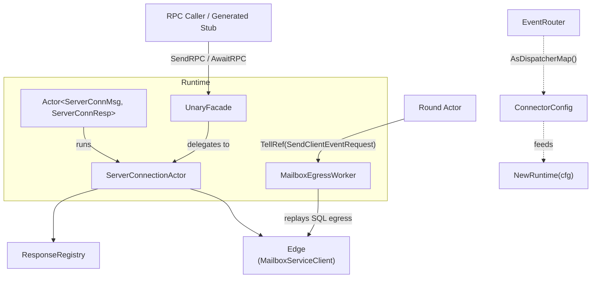
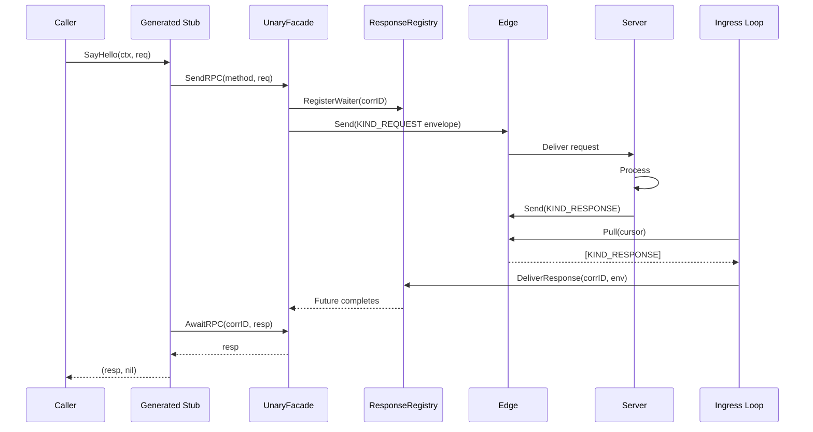
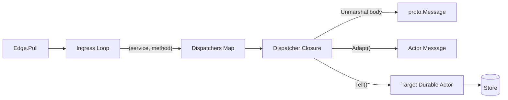
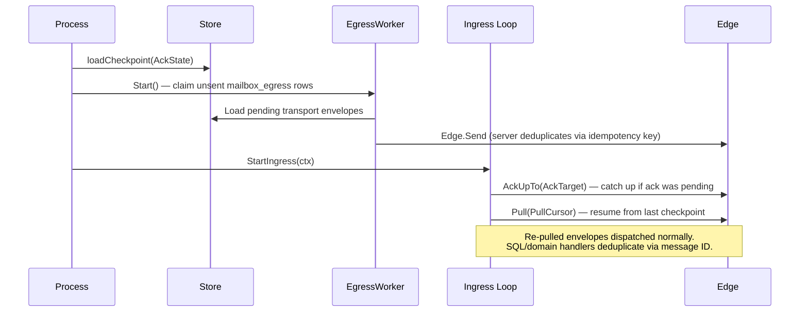

# Server Connection Runtime

The `serverconn` package provides the unified connector boundary for all mailbox
traffic between the client and the remote server. It combines durable egress
(crash-safe event delivery), low-latency unary RPCs, background ingress polling,
and typed event routing into a single `Runtime` that integrates with the actor
system.

For the full three-layer architecture, see
[`docs/mailbox_architecture.md`](../docs/mailbox_architecture.md). For the
underlying mailbox primitives, see [`mailbox/README.md`](../mailbox/README.md).

## Architecture

The runtime composes three main components:



- **`ServerConnectionActor`**: The core behavior. Handles egress messages in
  `Receive()` and runs the ingress loop as a background goroutine. Owns the
  in-memory `ResponseRegistry`.
- **`MailboxEgressWorker`**: Drains SQL-owned `mailbox_egress` rows and sends
  envelopes to the remote mailbox edge. This is the restart-safe transport
  boundary; actor messages stay in-memory.
- **`UnaryFacade`**: Implements `mailboxrpc.RPCClient`. Sends RPCs directly via
  the edge (low-latency, no durability) and awaits responses through the
  registry.

## Getting Started

### Creating a Runtime

```go
cfg := serverconn.DefaultConnectorConfig()
cfg.Edge = mailboxClient          // MailboxServiceClient (gRPC)
cfg.LocalMailboxID = "client-1"   // This client's mailbox
cfg.RemoteMailboxID = "server-1"  // Server's mailbox
cfg.Transport = transportStore    // SQL transport store for egress/ingress
cfg.Dispatchers = eventRouter.AsDispatcherMap()  // Inbound routing

runtime, err := serverconn.NewRuntime(cfg)
if err != nil {
    return err
}
```

`NewRuntime` validates required fields, creates the `ServerConnectionActor`,
starts a lightweight in-memory actor for local delivery, wires the SQL egress
worker, and creates the `UnaryFacade`.

### Starting and Stopping

```go
err := runtime.Start(ctx)
if err != nil {
    return err  // Ingress checkpoint load failed — fatal.
}
defer runtime.Stop()
```

`Start` launches in-memory egress processing, starts the SQL egress worker, and
starts the ingress loop (loads ack checkpoint, starts pulling). `Stop` cancels
the ingress loop, stops the egress worker, then stops the in-memory actor.

## Unary RPC: Using Generated Stubs

Generated mailbox RPC stubs call `SendRPC` + `AwaitRPC` under the hood:

```go
client := hellotestpb.NewHelloServiceMailboxClient(runtime.Unary())

resp, err := client.SayHello(ctx, &hellotestpb.HelloRequest{
    Name: "Alice",
})
if err != nil {
    // gRPC status errors are preserved through header transport.
    return err
}
```



The send path calls `Edge.Send` directly — no durable mailbox, no actor queue
roundtrip. This provides low latency for unary RPCs. If the send fails, the
caller retries (no crash durability needed for unary RPCs).

Error handling: Server-side gRPC errors are encoded in envelope headers as
base64 `google.rpc.Status`. `AwaitRPC` decodes them before inspecting the body,
so callers receive standard `status.Error` values.

## Durable Event Egress: Sending FSM Events

FSM outbox messages use the durable egress path for crash safety:

```go
err := runtime.TellRef().Tell(ctx, &serverconn.SendClientEventRequest{
    Message: &joinGreetingServerMsg{SessionID: "session-1"},
})
```

The `ServerMessage` interface requires a single method:

```go
type ServerMessage interface {
    ToProto() proto.Message
}
```

The durable egress path:

1. `Runtime.TellRef().Tell` records the outbound intent in SQL transport
   storage.
2. The egress worker replays the row into the in-memory actor, whose `Receive`
   method:
   - Calls `Message.ToProto()` to get the proto payload.
   - Wraps it in `anypb.Any`.
   - Derives `msg_id` and `idempotency_key` from the payload SHA256 hash
     (via `StableEventMsgID` / `StableEventIdempotencyKey`).
   - Builds a `KIND_EVENT` envelope and calls `Edge.Send`.
3. On crash, the egress worker claims the unsent SQL row and retries the same
   envelope identifiers, so the server deduplicates the retry.

## Server-Push Events: Receiving and Routing

### Implementing InboundServerMessage

Actor messages that arrive from the server implement `InboundServerMessage`:

```go
type InboundServerMessage interface {
    FromProto(proto.Message) error
}
```

Combined with `actor.Message`, this forms the `InboundActorMessage` type
constraint used by `NewEventRoute`:

```go
type helloStartedMsg struct {
    actor.BaseMessage
    SessionID string
}

func (m *helloStartedMsg) MessageType() string {
    return "HelloStartedMsg"
}

func (m *helloStartedMsg) FromProto(p proto.Message) error {
    ev, ok := p.(*hellotestpb.HelloStartedEvent)
    if !ok {
        return fmt.Errorf("unexpected proto type: %T", p)
    }
    m.SessionID = ev.SessionId
    return nil
}
```

### Registering Routes with EventRouter

Create an `EventRouter`, register routes for each `(service, method)` pair, then
pass the dispatcher map to the connector config:

```go
router := serverconn.NewEventRouter(system)

// Auto-adapt route (for InboundActorMessage types):
serverconn.NewEventRoute(router, serverconn.InboundEventRouteConfig[
    *helloStartedMsg, struct{},
]{
    Service:  "hellotest.v1.HelloService",
    Method:   "HelloStarted",
    NewEvent: func() proto.Message {
        return &hellotestpb.HelloStartedEvent{}
    },
    Key:    greetingActorKey,
    NewMsg: func() *helloStartedMsg {
        return &helloStartedMsg{}
    },
})

// Manual adapt route (full control):
serverconn.AddRoute(router, serverconn.EventRouteConfig[RoundMsg, RoundResp]{
    Service:  "arkrpc.v1.RoundService",
    Method:   "RoundStarted",
    NewEvent: func() proto.Message {
        return &arkrpc.RoundStartedEvent{}
    },
    Key: roundActorKey,
    Adapt: func(p proto.Message) (RoundMsg, error) {
        return adaptRoundStarted(p)
    },
})

// Wire into connector config:
cfg.Dispatchers = router.AsDispatcherMap()
```



Each dispatcher closure captures a `ServiceKey`, resolves the actor via the
Receptionist, and calls `Tell` to durably persist the message. A `nil` return
means the envelope is committed — the ingress loop can safely advance the ack
watermark.

## ConnectorConfig Reference

| Field | Type | Default | Description |
|-------|------|---------|-------------|
| `Edge` | `MailboxServiceClient` | *required* | gRPC client for the remote mailbox edge. |
| `LocalMailboxID` | `string` | *required* | This client's mailbox identifier. |
| `RemoteMailboxID` | `string` | *required* | Remote server's mailbox identifier. |
| `ProtocolVersion` | `uint32` | `0` | Protocol version stamped on outbound envelopes. |
| `Dispatchers` | `map[ServiceMethod]EnvelopeDispatcher` | `nil` | Inbound envelope routing table. |
| `Transport` | `TransportStore` | *required* | SQL store for connector-owned egress envelopes and ingress cursors. |
| `PullMaxEnvelopes` | `uint32` | `50` | Max envelopes per Pull call. |
| `PullWaitTimeout` | `time.Duration` | `5s` | Long-poll timeout for Pull. |
| `RetryBaseDelay` | `time.Duration` | `200ms` | Exponential backoff base for transient failures. |
| `RetryMaxDelay` | `time.Duration` | `30s` | Backoff cap. |
| `ResponseWaiterTTL` | `time.Duration` | `10m` | TTL for response waiters and buffered responses. |

Source: `serverconn/types.go`

## Crash Recovery

Two independent recovery paths operate on startup:



**Egress recovery**: The SQL egress worker claims unsent `mailbox_egress` rows
for this runtime and retries the same envelope with the same `msg_id` and
`idempotency_key`. The server deduplicates.

**Ingress recovery**: `loadCheckpoint` restores the four-cursor `AckState`.
The loop resumes from `PullCursor`. If an ack was pending at crash time
(`AckTarget > AckCommittedTo`), it acks first. Re-pulled envelopes are
dispatched normally — target SQL/domain handlers deduplicate via message ID.

**Unary RPC recovery**: Response waiters are in-memory only. On crash, callers'
contexts are cancelled and they retry the RPC with new correlation IDs.

## Message Types

`ServerConnMsg` values are in-memory actor messages. Restart safety lives in
SQL-owned transport rows and domain tables, not actor-message serialization.

## Testing

The package has comprehensive test coverage across several test files:

| File | Focus |
|------|-------|
| `e2e_test.go` | Full round-trip: unary RPC, server push events, durable egress, combined flows. |
| `connector_test.go` | ServerConnectionActor unit tests for egress handling. |
| `unary_facade_test.go` | UnaryFacade send/await with mocked edge. |
| `ingress_error_test.go` | Ingress loop error handling and backoff behavior. |
| `ingress_property_test.go` | Property-based tests for ack watermark invariants. |
| `actor_messages_test.go` | In-memory actor message metadata and transport identity behavior. |
| `restart_replay_test.go` | Crash recovery and egress replay. |
| `runtime_test.go` | Runtime lifecycle (start, stop, validation). |
| `testutil_test.go` | In-memory mailbox, checkpoint store, test helpers. |

Run tests:

```bash
# All serverconn tests:
make unit pkg=serverconn timeout=5m

# Specific test:
make unit pkg=serverconn case=TestE2E_UnaryRPC timeout=5m

# With debug logs:
make unit log="stdlog trace" pkg=serverconn case=TestE2E timeout=5m
```

## See Also

- [`docs/mailbox_architecture.md`](../docs/mailbox_architecture.md) —
  Comprehensive architecture covering all three layers with diagrams.
- [`mailbox/README.md`](../mailbox/README.md) — Mailbox module overview
  (proto definitions, RPC interfaces, connector primitives).
- [`docs/RPC_MAILBOX_CONTRACT.md`](../docs/RPC_MAILBOX_CONTRACT.md) —
  Protocol-level contract (ordering, idempotency, ack semantics).
- [`docs/mailbox_architecture.md`](../docs/mailbox_architecture.md) —
  SQL-backed mailbox transport model.
