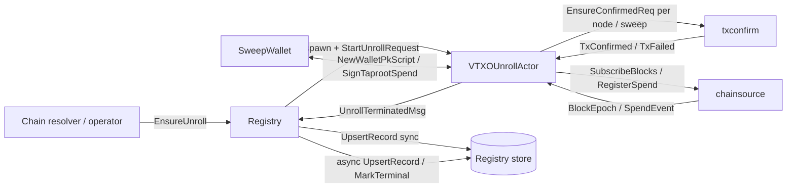
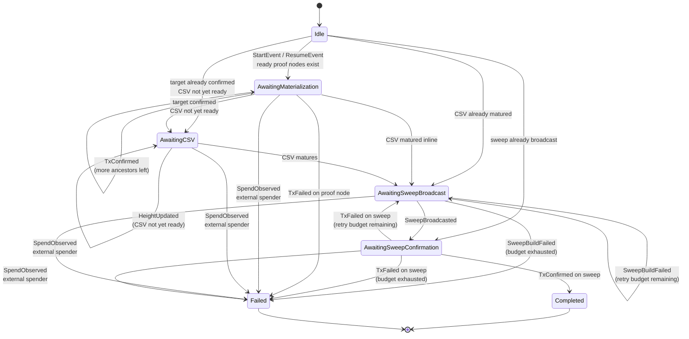
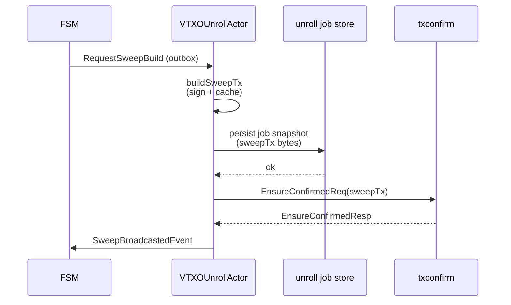
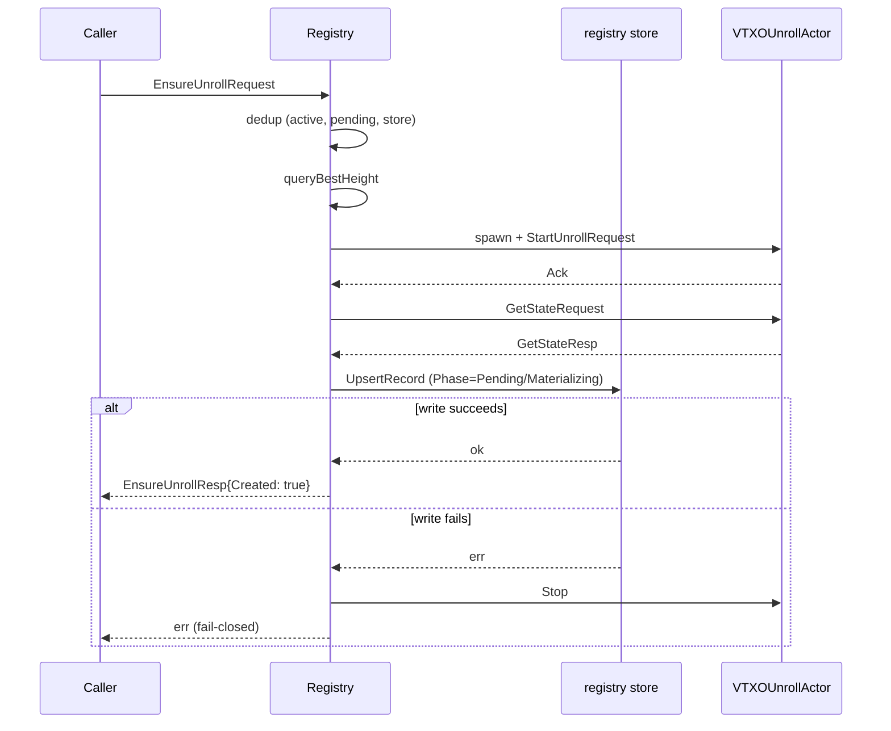
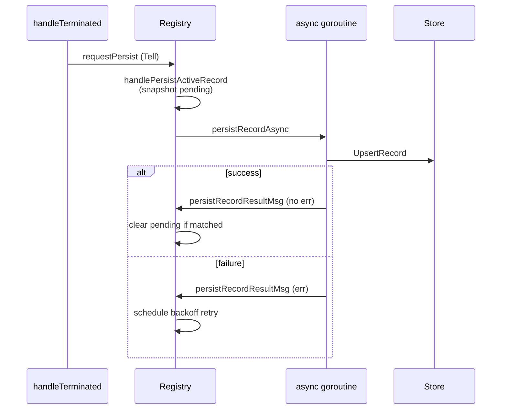

# unroll

Durable, per-target unilateral-exit subsystem. One actor per VTXO owns the
full exit lifecycle: assemble the recovery proof, broadcast and confirm
every ancestor transaction, wait out the CSV timelock, build and
broadcast the final timeout-path sweep, and watch for confirmation. A
thin registry actor coordinates the set of per-target actors, handles
admission/dedup, and persists a coarse control-plane record per target so
the daemon can pick up in-flight jobs after a restart.

## Why unrolling is hard

A VTXO on the ark side does not live on chain by itself — it sits inside a
tree of transactions rooted at a round commitment, potentially with
out-of-round (OOR) hops stacked on top. To bring funds back to the local
wallet without the operator's help, the client has to:

1. Assemble the full transaction graph that leads from a root commitment
   down to the target VTXO output.
2. Broadcast each ancestor in dependency order, waiting for each to
   confirm before its children become spendable.
3. Once the target confirms, wait out its relative-timelock (CSV).
4. Build a timeout-path spend, sign it with the client key, broadcast,
   and wait for confirmation.

Any step can fail — mempool rejection, reorg, daemon restart, operator
racing with a cooperative spend, fee-rate spikes, etc. The unroll
subsystem is engineered so every piece of in-flight work is durable, all
retries are idempotent, and no on-chain action double-fires on restart.

## Component layout

The package factors the problem into four pieces that communicate through
narrow interfaces:

| Component | File(s) | Responsibility |
| --- | --- | --- |
| `UnrollRegistryActor` | `registry.go` | Spawn / dedup / terminal bookkeeping; one instance per daemon. |
| `VTXOUnrollActor` | `actor.go` | In-memory per-target actor; owns the FSM session while SQL stores restart state. |
| FSM (pure) | `fsm_types.go`, `fsm_logic.go`, `session.go` | Side-effect-free state machine that emits outbox events. |
| Support | `proof_assembler.go`, `sweep.go`, `snapshot.go`, `db_store.go`, `messages.go` | Proof assembly, sweep building, checkpoint codec, DB adapter, actor messages. |

External dependencies:

- [`unrollplan`](../unrollplan) — the pure planner that, given a proof graph
  and current state, decides what to broadcast next.
- [`txconfirm`](../txconfirm) — the shared actor that handles broadcast,
  CPFP, and confirmation notifications. Its txid-keyed dedup is what makes
  unroll retries safe.
- [`chainsource`](../chainsource) — block-epoch, spend-watch, and
  fee-estimate subscriptions.
- [`lib/recovery`](../lib/recovery) — the immutable proof graph type.
- [`db`](../db) — control-plane row persistence
  (`unilateral_exit_jobs` table).

## High-level flow

## Per-target state machine

Each `VTXOUnrollActor` drives one protofsm session through the phases
below. Transitions are computed by `deriveStateTransition` after each
applied event; the pure [`unrollplan.Planner`](../unrollplan) decides
which branch fires.

Notes:

- `Idle → *` represents the initial `StartEvent` / `ResumeEvent` running
  the planner once against the restored state; the actual landing state
  depends on how much progress was already made before admission.
- Only `Completed` and `Failed` are terminal; the registry is notified
  at most once per actor lifetime via `UnrollTerminatedMsg`.
- `SpendObserved` failures are only fired when the spender is neither a
  known proof-graph node nor our own sweep; otherwise the event is
  absorbed and just bumps the height.

## Durability invariants

Two ordering rules are load-bearing.

### 1. Persist before broadcast

`startSweep` writes the sweep tx to the checkpoint BEFORE asking txconfirm
to broadcast it. On any retry (same actor lifetime or post-restart) the
same sweep tx is restored, so:

- txconfirm's txid-keyed dedup absorbs the re-submit.
- We never burn a new BIP32 wallet address on a retry, which would
  otherwise race the original sweep on chain.
- A crash between build and broadcast cannot cause a third sweep to
  emerge from the ashes.

### 2. Fail-closed admission

`UnrollRegistryActor.handleEnsure` calls `Store.UpsertRecord` synchronously
before returning `Created=true`. A crash in the "child spawned but not
persisted" window would otherwise orphan the job: `RestoreNonTerminal`
only walks the durable store.

## Restart flow

On daemon boot, the registry calls `RestoreNonTerminal`, which re-spawns a
`VTXOUnrollActor` for every non-terminal row in the store and sends each
one `ResumeUnrollRequest`. The actor:

1. Loads its SQL job snapshot and reconstructs immutable proof material from
   local VTXO/OOR artifact lineage.
2. Reconstructs the protofsm session in the same state it crashed in.
3. Emits `ReissueInFlightTransactions` for every in-flight proof node and,
   if a sweep was already broadcast, `ReissueSweepConfirmation`.
4. The behavior's `routeOutbox` walks those events, re-submitting each
   transaction to txconfirm. Dedup turns these into cheap re-subscribes
   rather than new broadcasts.

```mermaid
flowchart LR
    Boot[daemon start] --> Rest[Registry.RestoreNonTerminal]
    Rest --> List["Store.ListNonTerminalRecords()"]
    List --> Spawn[per-target spawn + ResumeUnrollRequest]
    Spawn --> Load[Load job snapshot<br/>from SQL store]
    Load --> Reissue[Emit Reissue* outbox events]
    Reissue --> TxConfirm[Re-submit in-flight txs<br/>to txconfirm]
    TxConfirm --> Dedup[txconfirm dedup<br/>= idempotent resub]
```

## Registry persistence model

The registry keeps three in-memory tables plus the durable store:

| Table | Purpose |
| --- | --- |
| `active` | Live children. Authoritative source of current FSM phase via Ask. |
| `pending` | Latest snapshot whose store write has not yet flushed. |
| `persisting` | Record currently being written (exactly one per outpoint). |
| Store | Control-plane row per target; source of truth across restarts. |

Updates for non-terminal state changes stay on the async writer path so
the registry goroutine is never held up by a slow store:

## External spend handling

Every actor registers a spend watch on its target outpoint through
`chainsource.RegisterSpendRequest`. Spend events are classified before
they are allowed to fail the job:

- Spender is a known proof-graph node → expected materialization
  traffic; swallow and update height.
- Spender is our own sweep → same, we are seeing our own success.
- Anything else → the target was spent externally (cooperative
  operator path, double-spend, reorg replay). Drive `FailEvent` with a
  reason identifying the spender.

This keeps the actor from terminating on benign events while still
catching real fraud and reorg scenarios promptly.

## Testing

- `messages_test.go` — actor/protofsm message conversion and routing tests.
- `db_store_test.go` — Phase ↔ DB status and Trigger ↔ DB trigger
  round-trip tests (prevents silent enum downgrades).
- `registry_test.go` — dedup, fail-closed admission, terminal retry,
  blocking-store semantics, status fallback to in-memory pending.
- `actor_test.go` — full per-target lifecycle: boot, materialize,
  CSV wait, sweep build and broadcast, confirmation, spend-watch
  classification, restart resume.

## See also

- [`CLAUDE.md`](CLAUDE.md) — stable per-package summary with
  invariants.
- [`../unrollplan/CLAUDE.md`](../unrollplan/CLAUDE.md) — pure planner
  semantics.
- [`../txconfirm/CLAUDE.md`](../txconfirm/CLAUDE.md) — broadcast + CPFP
  + confirmation actor.
- [`../lib/recovery/CLAUDE.md`](../lib/recovery/CLAUDE.md) — immutable
  proof graph.
